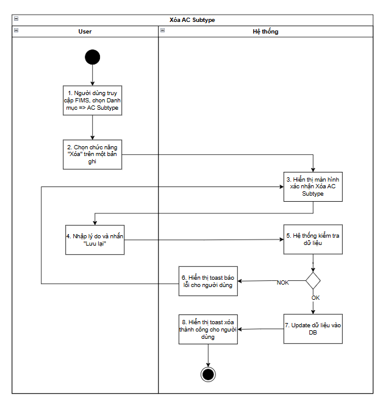
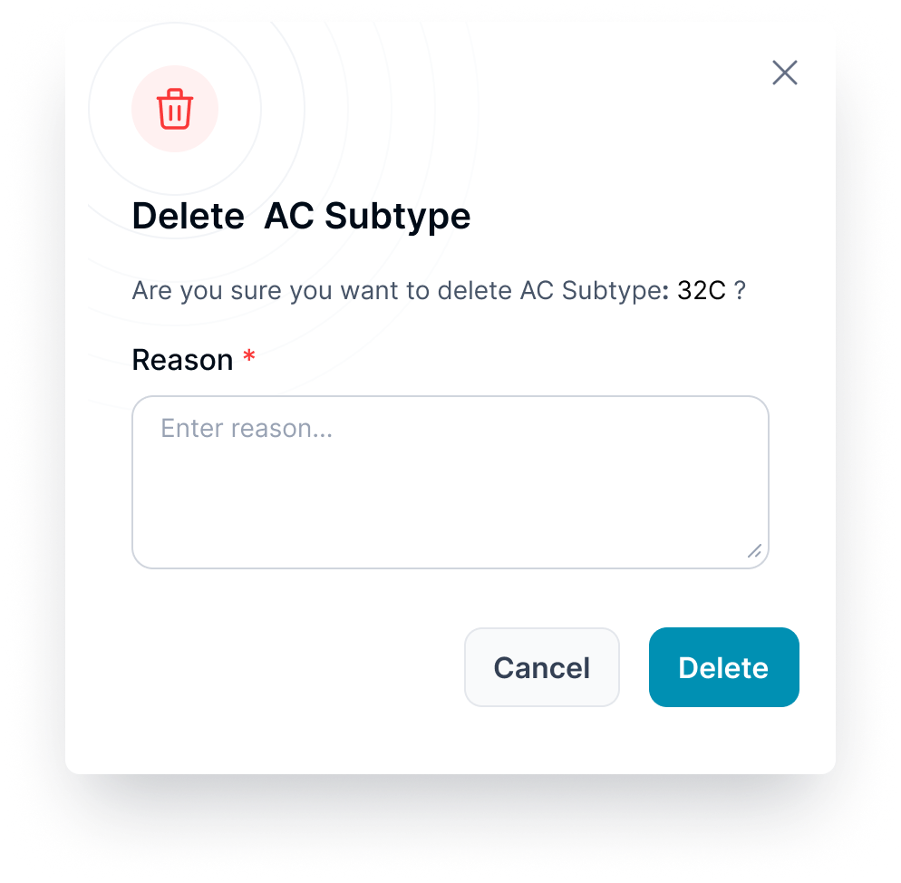
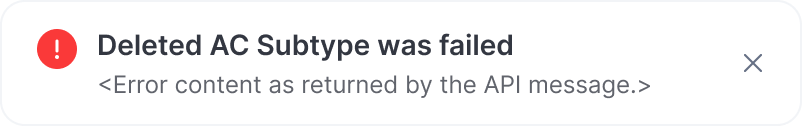

> **Ngữ cảnh chương (giữ nguyên từ nguồn):** mục `Data Maintenance (Danh mục dùng chung)`.

### Xóa AC Subtype

| **Tên chức năng**: Xóa AC Subtype | |
| --- | --- |
| **Mục đích** | Cho phép user xóa một AC Subtype khỏi hệ thống |
| **Trigger** | Người dùng truy cập vào web FIMS => Nhấn phân hệ Danh mục => AC Subtype => Nhấn icon Xóa |
| **Tiền điều kiện** | Người dùng đăng nhập thành công và được phân quyền xóa AC Subtype |
| **Hậu điều kiện** | Xóa thành công, bản ghi bị xóa khỏi DB |

#### Sơ đồ luồng hệ thống

#### Mô tả luồng xử lý

| **STT** | **Bước** | **Mô tả** |
| --- | --- | --- |
| 1 | Bước 1 | Người dùng truy cập FIMS, chọn danh mục AC Subtype |
| 2 | Bước 2 | User chọn chức năng Xóa trên 1 bản ghi |
| 3 | Bước 3 | Hiển thị màn hình xác nhận xóa AC Subtype |
| 4 | Bước 4 | Nhập lý do và nhấn Delete |
| 5 | Bước 5 | Hệ thống kiểm tra dữ liệu |
| 6 | Bước 6,7,8 | Nếu NOK => Hiển thị toast báo lỗi  Nếu OK => Update dữ liệu vào DB => Hiển thị toast xóa thành công cho người dùng, cập nhật lại danh sách trên màn hình |

#### Màn hình chức năng

#### Mô tả chi tiết màn hình

| **STT** | **Tên** | **Kiểu dữ liệu [Độ dài]** | **Mapping DB/API** | **Mô tả nghiệp vụ** |
| --- | --- | --- | --- | --- |
| 1 |  | Icon |  | * Icon confirm  * Không cho thao tác |
| 2 |  | Icon |  | * Icon đóng popup * Click: Đóng popup xác nhận, hệ thống không cần xử lý gì, quay trở lại màn hình trước đó |
| 3 | Tiêu đề popup | Text |  | * Gắn cứng: "Delete AC Subtype" |
| 4 | Reason | Text |  | * Bắt buộc nhập * Mặc định: Để trống và cho nhập thông tin * Placeholder: “Enter reason...” * Tối đa: 1000 ký tự bao gồm chữ, số và ký tự đặc biệt * Chặn nếu nhập quá 1000 ký tự * Nếu paste đoạn văn > 1000 ký tự, chỉ nhận 1000 ký tự đầu tiên * Bắt buộc nhập * Tự động TRIM Spaces đầu cuối khi out focus box * Action: Nhấn Enter/out focus/click button Lưu lại, hệ thống validate, nếu để trống ⇒ Hiển thị thông báo inline:” Please enter reason” |
| 5 | Content | Text |  | Gắn cứng: "Are you sure you want to delete AC Subtype: [AC Subtype code] ?" |
| 6 |  | Button |  | Click: Đóng popup. Không thực hiện xóa ⇒ quay trở về màn hình trước đó |
| 7 |  | Button |  | - Click: Hệ thống kiểm tra ràng buộc  - Có ràng buộc: Hiển thị toast message [TB022](https://docs.google.com/document/d/1L5y0t4FCWe_vnNI65xNMRC-LM3lvLwYsQRAm_Nokv9A/edit?tab=t.0#bookmark=kix.ditg2fh3llv7):    - Không có ràng buộc: Xóa thành công, hiển thị toast message [TB019](https://docs.google.com/document/d/1L5y0t4FCWe_vnNI65xNMRC-LM3lvLwYsQRAm_Nokv9A/edit?tab=t.0#bookmark=kix.spmzvpry3i7f)   |

---

*Nguồn: tách trung thực từ `sec-32-quan-ly-danh-muc-ac-subtype.md`, mục "Xóa AC Subtype" (bản trích text của `VNA.TOSS_SRS_Data Maintenance_v0.1.docx`, chương Data Maintenance (Danh mục dùng chung)) — tương ứng dòng **#58** bảng §1 của [CATALOG.md](../CATALOG.md). Không chỉnh sửa nội dung nguồn (CLAUDE.md §0). 🖼 Hình ảnh màn hình: xem file `VNA.TOSS_SRS_Data Maintenance_v0.1.docx` gốc.*
