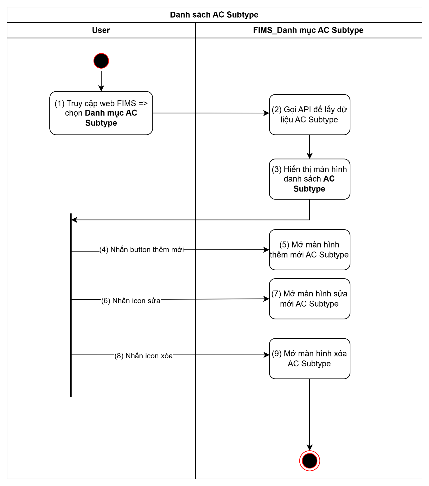
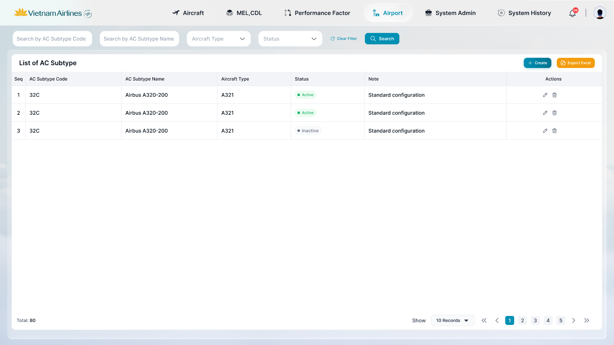
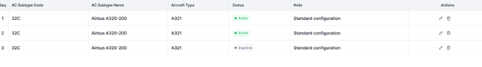

> **Ngữ cảnh chương (giữ nguyên từ nguồn):** mục `Data Maintenance (Danh mục dùng chung)`.

## Quản lý danh mục AC Subtype

Module quản lý danh mục AC Subtype cho phép thực hiện đầy đủ các chức năng: Xem danh sách, Tìm kiếm/Lọc, Xuất Excel, Thêm mới, Sửa, Xóa.

### Xem danh sách AC Subtype

| **Tên chức năng**: Xem danh sách AC Subtype | |
| --- | --- |
| Mục đích | Cho phép user xem, tìm kiếm và lọc, xuất excel danh sách AC Subtype hiện có trong hệ thống |
| Trigger | Người dùng truy cập vào web FIMS => mở đến module Danh mục / AC Subtype |
| Tiền điều kiện | Người dùng đăng nhập thành công và được phân quyền xem Danh mục AC Subtype |
| Hậu điều kiện | Màn hình danh sách AC Subtype được hiển thị |

#### Sơ đồ luồng hệ thống

#### Mô tả luồng xử lý

| **Bước** | **Mô tả** |
| --- | --- |
| Bước 1 | User truy cập web FIMS => mở đến module Danh mục / AC Subtype |
| Bước 2 | Hệ thống call API xuống BE lấy danh sách AC Subtype (mặc định không filter) |
| Bước 3 | Hiển thị danh sách AC Subtype trên giao diện. |
| Bước 4,5 | User nhấn button Create => Mở màn [thêm mới AC Subtype](TOSS.DM.AC_SUBTYPE_ADD_EDIT.FD.v0.1.md) |
| Bước 6,7 | User nhấn button Edit => Mở màn [Sửa AC Subtype](TOSS.DM.AC_SUBTYPE_ADD_EDIT.FD.v0.1.md) |
| Bước 8,9 | User nhấn button Delete => Mở màn [Xóa AC Subtype](TOSS.DM.AC_SUBTYPE_DELETE.FD.v0.1.md) |

#### Màn hình chức năng

#### Mô tả chi tiết màn hình

| **STT** | **Tên** | **Kiểu dữ liệu [Độ dài]** | **Mapping DB/API** | **Mô tả nghiệp vụ** |
| --- | --- | --- | --- | --- |
| * **Danh sách AC Subtype:**      * FE call API lấy lại danh sách AC Subtype mới nhất hiện tại để hiển thị trên giao diện người dùng bao gồm những thông tin sau:   + AC Subtype Code  + AC Subtype Name * Aircarft Type * Status * Note * Danh sách AC Subtype được sắp xếp theo thời gian cập nhật mới nhất. Trường hợp sửa bản ghi thì bản ghi đó được cho lên đầu * **Tìm kiếm:**      * Cơ chế Thu gọn/Mở rộng bộ lọc (Collapsible Fillter):   + [Tham chiếu kịch bản chức năng ẩn hiện filter](https://docs.google.com/document/d/1L5y0t4FCWe_vnNI65xNMRC-LM3lvLwYsQRAm_Nokv9A/edit?tab=t.0#heading=h.dgq51psil6dr) * Click vào các ô search để chọn lọc, tìm kiếm thông tin theo dữ liệu của AC Subtype * Trường hợp Searchbox không có dữ liệu: Mặc định tìm kiếm all dữ liệu tại cột đó * Người dùng thao tác thay đổi giá trị trường dữ liệu => click Enter/button Search => hệ thống thực hiện:   + Reload dữ liệu table phù hợp với bộ lọc   + Set current page=1 * Hiển thị kết quả tìm kiếm:   + Trường hợp API trả về data có KQ: hiển thị danh sách dữ liệu theo kết quả API trả về   + Trường hợp API trả về data rỗng hoặc lỗi: Hiển thị bảng danh sách với **chân trang = Tất cả danh sách : 0** | | | | |
|  | Title hệ thống | Label |  | * + [Tham chiếu Kịch bản title hệ thống](https://docs.google.com/document/d/1L5y0t4FCWe_vnNI65xNMRC-LM3lvLwYsQRAm_Nokv9A/edit?tab=t.0#bookmark=kix.f2nh07gdowb8) |
| 1 | Search AC Subtype Code | Textbox [0;10] | search_code | - Placeholder: Search by AC Subtype Code  - Trường để lọc: Tìm kiếm gần đúng theo [AC Subtype Code]  - Maxlength 10 ký tự  - Validate cho phép nhập chữ, số, và ký tự đặc biệt  - Nếu dữ liệu nhập vượt quá độ dài ô => thay thế phần vượt quá bằng ký tự “...” và có tooltip hiển thị toàn bộ nội dung nhập  - Nếu paste đoạn văn thì ghi nhận 10 ký tự đầu  - Tự động TRIM Spaces đầu cuối khi tìm kiếm |
| 2 | Search AC Subtype Name | Textbox [0;100] | search_name | - Placeholder: Search by AC Subtype Code  - Trường để lọc: Tìm kiếm gần đúng theo [AC Subtype Code]  - Maxlength 100 ký tự  - Validate cho phép nhập chữ, số, và ký tự đặc biệt  - Nếu dữ liệu nhập vượt quá độ dài ô => thay thế phần vượt quá bằng ký tự “...” và có tooltip hiển thị toàn bộ nội dung nhập  - Nếu paste đoạn văn thì ghi nhận 100 ký tự đầu  - Tự động TRIM Spaces đầu cuối khi tìm kiếm |
| 3 | Filter Aircraft Type | Dropdown (multi-select) | filter_aircraft_type_id | - Placeholder: Aircraft Type  - Trường để lọc: Tìm kiếm chính xác theo [Aircraft Type]  - Chỉ được chọn duy nhất 1 giá trị |
| 4 | Filter Status | Dropdown (single-select) | filter_status | - Placeholder: Status  - Trường để lọc: Tìm kiếm chính xác theo [Status]  - Các lựa chọn: Active / Inactive |
|  |  | Button |  | * Click vào  * Hệ thống thực hiện lọc dữ liệu dựa trên từ khoá * Hệ thống trả về danh sách dữ liệ u phù hợp với từ khoá tìm kiếm |
|  |  | Button |  | * Click vào  * Hệ thống:   + Xoá nội dung search   + Reset toàn trường lọc đã chọn   + Reset phân trang về trang đầu * Hiển thị lại danh sách ban đầu |
| 5 | Button Thêm mới | Button | btn_add | - Vị trí: góc trên bên phải  - Click => Hiển thị popup [Thêm mới AC Subtype](TOSS.DM.AC_SUBTYPE_ADD_EDIT.FD.v0.1.md) (xem 10.14.2) |
| 6 | Button Export Excel | Button | btn_export_excel | - Vị trí: góc trên bên phải, cạnh button Thêm mới  - Click => Xuất danh sách AC Subtype hiện tại (theo điều kiện filter đang áp dụng) ra file Excel  - Tham chiếu kịch bản Export dùng chung: mục 11.4  - Template: [Excel](https://docs.google.com/spreadsheets/d/1U27dCY-T-YCWcbJi8EzERRapkm9yVIlSWrpU6Clpb8c/edit?gid=0#gid=0) |
| 7 | AC Subtype Code | Textview | ac_subtype_code | - Hiển thị mã AC Subtype  - Trường hợp API trả về rỗng/lỗi: để trống |
| 8 | AC Subtype Name | Textview | ac_subtype_name | - Hiển thị tên AC Subtype  - Trường hợp API trả về rỗng/lỗi: để trống |
| 9 | Aircraft Type | Textview | aircraft_type_names | - Hiển thị tên Aircraft Type  - Trường hợp API trả về rỗng/lỗi: để trống |
| 10 | Trạng thái | Tag | status | - Active: Tag màu xanh lá  - Inactive: Tag màu xám |
| 11 | Icon Sửa | Button | btn_edit | - Click => Hiển thị popup [Sửa AC Subtype](TOSS.DM.AC_SUBTYPE_ADD_EDIT.FD.v0.1.md) (xem 10.14.2) |
| 12 | Icon Xóa | Button | btn_delete | - Click => Hiển thị popup xác nhận Xóa (xem 10.14.3) |
| 13 | Chân trang | Pagination |  | [Theo kịch bản phân trang](https://docs.google.com/document/d/1L5y0t4FCWe_vnNI65xNMRC-LM3lvLwYsQRAm_Nokv9A/edit?tab=t.0#heading=h.5b0ejgezpbny) |

---

*Nguồn: tách trung thực từ `sec-32-quan-ly-danh-muc-ac-subtype.md`, mục "Xem danh sách AC Subtype" (bản trích text của `VNA.TOSS_SRS_Data Maintenance_v0.1.docx`, chương Data Maintenance (Danh mục dùng chung)) — tương ứng dòng **#56** bảng §1 của [CATALOG.md](../CATALOG.md). Không chỉnh sửa nội dung nguồn (CLAUDE.md §0). 🖼 Hình ảnh màn hình: xem file `VNA.TOSS_SRS_Data Maintenance_v0.1.docx` gốc.*
