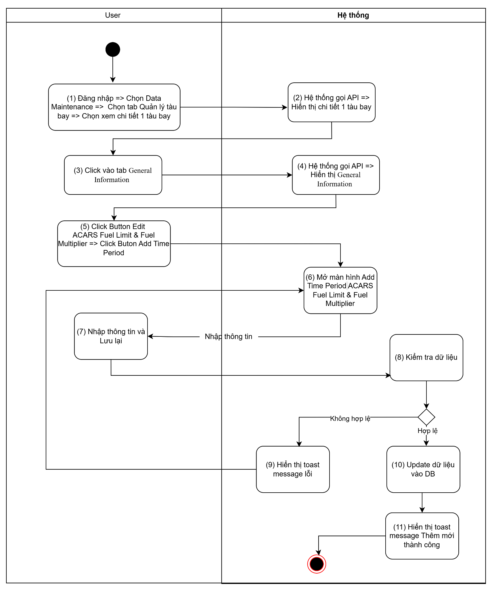
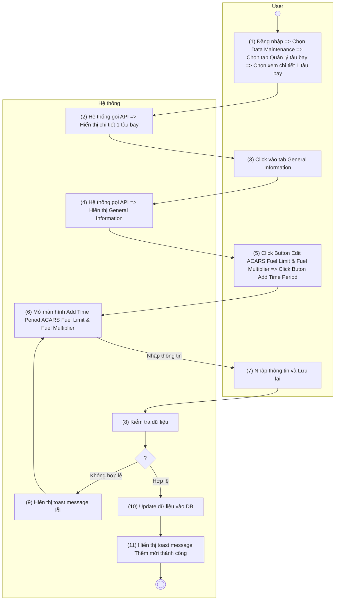
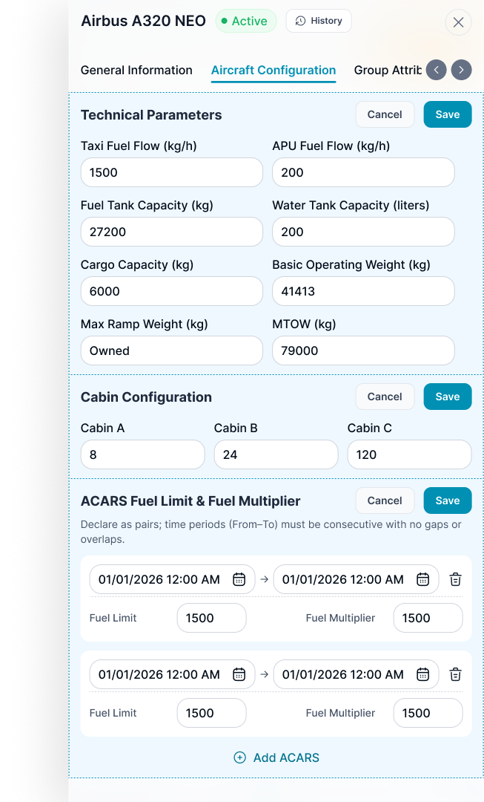

> **Ngữ cảnh chương (giữ nguyên từ nguồn):** mục `Data Maintenance (Danh mục dùng chung)`.

### Thêm mới ACARS Fuel Limit & Fuel Multiplier - tab Aircraft Configuration

| **Tên chức năng**: **Thêm mới ACARS Fuel Limit & Fuel Multiplier - tab Aircraft Configuration** | |
| --- | --- |
| **Mục đích** | Cho phép user Thêm mới ACARS Fuel Limit & Fuel Multiplier - tab Aircraft Configuration |
| **Trigger** | User click button “Add ” tại màn hình chi tiết tàu bay ACARS Fuel Limit & Fuel Multiplier - tab Aircraft Configuration |
| **Tiền điều kiện** | Người dùng đăng nhập thành công và được phân quyền Thêm mới ACARS Fuel Limit & Fuel Multiplier - tab Aircraft Configuration |
| **Hậu điều kiện** | Thêm mới thành công, dữ liệu được lưu vào DB |

#### Sơ đồ luồng

#### Mô tả luồng xử lý

| Bước | Chi tiết |
| --- | --- |
| 1 | Người dùng đăng nhập vào hệ thống TOSS, truy cập **Data Maintenance** → **Quản lý tàu bay** và chọn một tàu bay để xem thông tin chi tiết. |
| 2 | Hệ thống gọi API lấy thông tin chi tiết của tàu bay và hiển thị trên màn hình. |
| 3 | Người dùng chọn tab **Aircraft Configuration** |
| 4 | Hệ thống gọi API lấy thông tin Aircraft Configuration và hiển thị dữ liệu trên màn hình. |
| 5 | Người dùng nhấn nút **Edit** tại trường **ACARS Fuel Limit & Fuel Multiplier**  và **Click** nút **Button Add Time Period**. |
| 6 | Hệ thống mở màn hình **Add – ACARS Fuel Limit & Fuel Multiplier** . |
| 7 | Người dùng nhập thông tin và nhấn **Save**. |
| 8 | Hệ thống kiểm tra tính hợp lệ của dữ liệu nhập. |
| 9 | Trường hợp dữ liệu không hợp lệ, hệ thống hiển thị thông báo lỗi “**Failed to add ACARS Fuel Limit & Fuel Multiplier.”** |
| 10 | Trường hợp dữ liệu hợp lệ, hệ thống cập nhật dữ liệu vào cơ sở dữ liệu. |
| 11 | Hệ thống hiển thị thông báo **"Successfully add ACARS Fuel Limit & Fuel Multiplier. "**. |

#### Màn hình chức năng

#### Mô tả màn hình chi tiết

| **STT** | **Tên** | **Kiểu dữ liệu [Độ dài]** | **Mapping DB/API** | **Mô tả nghiệp vụ** |
| --- | --- | --- | --- | --- |
| * Trường hợp chưa có dữ liệu cấu hình, hệ thống hiển thị bảng trống, user click button edit => Hiển thị button thêm mới, cancel, save * User click button thêm mới => Hiển thị bản ghi trống cho user nhập, user chỉ được phép nhập các khoảng thời gian liên tiếp nhau,, From phải ngay sau To của dòng cuối cùng * Cho phép user thêm không giới hạn và cho phép scroll cả tab | | | | |
| 1 | From | Datetime | fromDate | * Mặc định: Để trống và cho nhập thông tin * Placeholder “Choose From ” * Cho phép chọn thời gian bắt đầu áp dụng cấu hình. * Định dạng DD/MM/YYYY HH:mm. * Bắt buộc nhập. * Thời gian bắt đầu phải nhỏ hơn thời gian kết thúc và phải liên tiếp với khoảng thời gian trước đó (không được trùng hoặc để khoảng trống) * Hệ thống không cho phép người dùng chọn khoảng thời gian đã được cấu hình ở các bản ghi trước đó. Khi thêm mới bản ghi, các thời điểm thuộc khoảng **From - To** đã tồn tại sẽ không được phép chọn. * Đối với khoảng thời gian của bản ghi đã được xóa, hệ thống cho phép người dùng lựa chọn lại khi thêm mới bản ghi. * Action: Out focus/click button Save, hệ thống validate, nếu   + Để trống ⇒ Hiển thị thông báo IM: “The **<field name>** field must not be empty.” |
| 2 | To | Datetime |  | * Mặc định: Để trống và cho nhập thông tin * Placeholder “Choose To” * Cho phép chọn thời gian kết thúc áp dụng cấu hình. * Định dạng DD/MM/YYYY HH:mm. * Bắt buộc nhập. * Thời gian kết thúc phải lớn hơn thời gian bắt đầu và phải đảm bảo các khoảng thời gian không chồng lấn (không được trùng hoặc để khoảng trống) * Hệ thống không cho phép người dùng chọn khoảng thời gian đã được cấu hình ở các bản ghi trước đó. Khi thêm mới bản ghi, các thời điểm thuộc khoảng **From - To** đã tồn tại sẽ không được phép chọn. * Đối với khoảng thời gian của bản ghi đã được xóa, hệ thống cho phép người dùng lựa chọn lại khi thêm mới bản ghi. * Action: Out focus/click button Save, hệ thống validate, nếu   + Để trống ⇒ Hiển thị thông báo IM: “The **<field name>** field must not be empty.” |
| 3 | Fuel Limit | Number |  | * Mặc định: Để trống và cho nhập thông tin * Placeholder “Choose Fuel Limit ” * Cho phép nhập giá trị Fuel Limit. * Bắt buộc nhập. * Maxlength 20 ký tự. Chặn nếu nhập quá 20 ký tự * Nếu paste dãy số > 20 ký tự, chỉ nhận 20 ký tự đầu tiên * Tự động TRIM Spaces đầu cuối khi out focus box * Validate   + Cho phép nhập số thực dương, số thập phân   + Dấu phân cách thập phân là dấu chấm (.).   + Không cho phép dấu phẩy (,), số âm, ký tự chữ, khoảng trắng giữa số, hay nhiều hơn 1 dấu chấm.   + Ví dụ hợp lệ: 1, 10.5, 1000.999.   + Ví dụ không hợp lệ: 0, -2, 1,5, 12.3456.   + Phần thập phân sau dấu phảy 4 số   + Phần nguyên để 15 số * Trường hợp nội dung dài vượt quá độ rộng box => di chuột vào hiện tooltips hiển thị full nội dung * Action: Out focus/click button Save, hệ thống validate, nếu   + Để trống ⇒ Hiển thị thông báo IM: “The **<field name>** field must not be empty.” |
| 4 | Fuel Multiplier | Number |  | * Mặc định: Để trống và cho nhập thông tin * Placeholder “Choose Fuel Multiplier ” * Cho phép nhập hệ số Fuel Multiplier. * Bắt buộc nhập. * Maxlength 20 ký tự. Chặn nếu nhập quá 20 ký tự * Nếu paste dãy số > 20 ký tự, chỉ nhận 20 ký tự đầu tiên * Tự động TRIM Spaces đầu cuối khi out focus box * Validate:   + Cho phép nhập số thực dương, số thập phân   + Dấu phân cách thập phân là dấu chấm (.).   + Không cho phép dấu phẩy (,), số âm, ký tự chữ, khoảng trắng giữa số, hay nhiều hơn 1 dấu chấm.   + Ví dụ hợp lệ: 1, 10.5, 1000.999.   + Ví dụ không hợp lệ: 0, -2, 1,5, 12.3456.   + Phần thập phân sau dấu phảy 4 số   + Phần nguyên để 15 số * Trường hợp nội dung dài vượt quá độ rộng box => di chuột vào hiện tooltips hiển thị full nội dung * Action: Out focus/click button Save, hệ thống validate, nếu   Để trống ⇒ Hiển thị thông báo IM: “The **<field name>** field must not be empty.” |
| 5 | Delete | Button |  | * Disable button xóa ở các bản ghi có sẵn   + ~~Enable button xoá đối với bản ghi cuối cùng, disable button xoá đối với bản ghi khác~~   + ~~Cho phép user xóa bản ghi cuối cùng ( theo thứ tự từ dưới lên)~~   + ~~Khi user xóa bản ghi cuối cùng thì button xóa ở bản ghi kế tiếp sẽ được enable~~   + Đối với dòng thêm mới chưa lưu được tạo khi người dùng nhấn button thêm mơi, hệ thống enable nút xóa để người dùng có thể xóa các dòng nhập thừa hoặc không còn nhu cầu sử dụng. Khi người dùng xóa dòng thêm mới chưa lưu, hệ thống xóa trực tiếp dòng đó khỏi bảng và không hiển thị popup xác nhận.   + Khi người dùng chạm vào button Delete đang disable, hệ thống hiển thị toast message: “ **This time period cannot be deleted**. **Please delete the latest time period first.** ”      * + Hệ thống hiển thị popup xác nhận xoá : [Xóa ACARS Fuel Limit & Fuel Multiplier - tab Aircraft Configuration](TOSS.DM.ACARS_FUEL_LIMIT_DELETE.FD.v0.1.md) |
| 6 | Cancel | Button |  | * Click button Cancel => Đóng màn hình thêm mới * Dữ liệu thay đổi không được lưu vào DB. |
| 7 | Save | Button |  | * User click button => Hệ thống lưu thông tin thêm mới hợp lệ, đồng thời lưu log thêm mới những trường thông tin:   + Time hiệu lực   + Fuel Limit   + Fuel Multiplier   Theo:   | **Thông tin lưu log** | **Mô tả** | | --- | --- | | **Date/Time** | Thời điểm thực hiện thao tác. | | **Changed By** | Người thực hiện thao tác. | | **Section** | Tên cụm block thay đổi thông tin | | **Action** | Loại thao tác được ghi nhận (**Add**, **Modify**, **Delete**). | | **Field** | Tên trường dữ liệu được thay đổi. | | **Old Value** | Giá trị của trường dữ liệu trước khi thay đổi. | | **New Value** | Giá trị của trường dữ liệu sau khi thay đổi. |  * TH API trả về thành công => Hiển thị toast thông báo thành công: “Successfully add ACARS Fuel Limit & Fuel Multiplier. ”      * TH API trả về lỗi => Hiển thị toast thông báo không thành công: “Failed to add ACARS Fuel Limit & Fuel Multiplier . ”    |

---

*Nguồn: tách trung thực từ `sec-33-quan-ly-tau-bay.md`, mục "Thêm mới ACARS Fuel Limit & Fuel Multiplier" (bản trích text của `VNA.TOSS_SRS_Data Maintenance_v0.1.docx`, chương Data Maintenance (Danh mục dùng chung)) — tương ứng dòng **#65** bảng §1 của [CATALOG.md](../CATALOG.md). Không chỉnh sửa nội dung nguồn (CLAUDE.md §0). 🖼 Hình ảnh màn hình: xem file `VNA.TOSS_SRS_Data Maintenance_v0.1.docx` gốc.*
