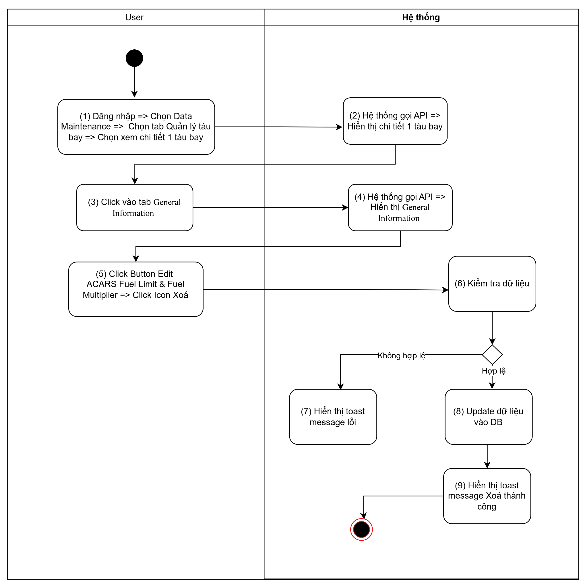
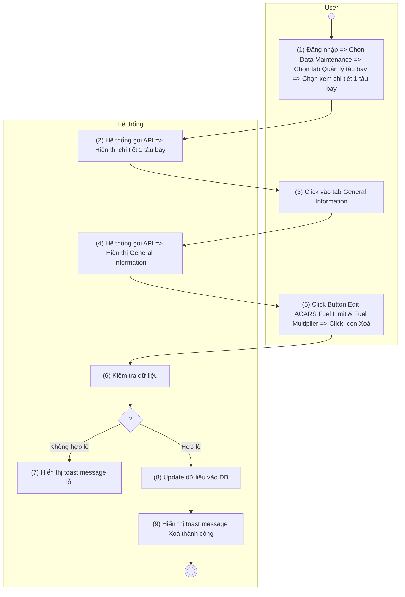
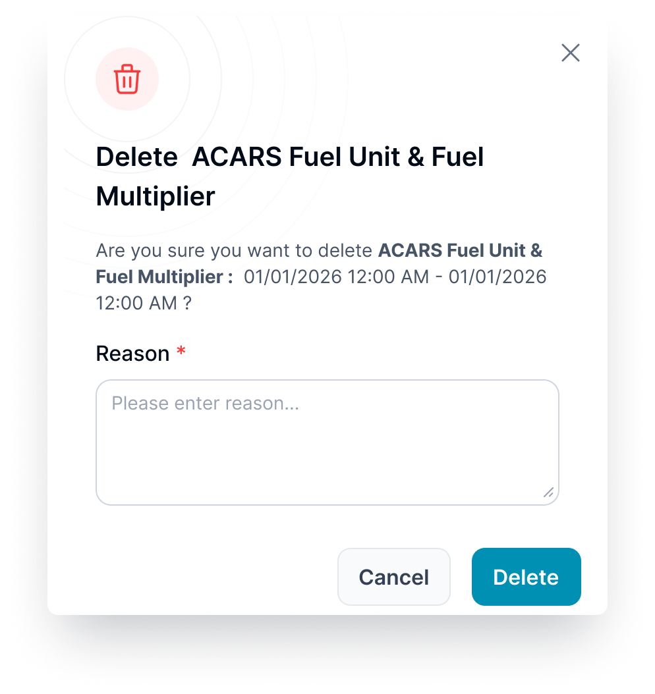

> **Ngữ cảnh chương (giữ nguyên từ nguồn):** mục `Data Maintenance (Danh mục dùng chung)`.

### Xóa ACARS Fuel Limit & Fuel Multiplier - tab Aircraft Configuration

| **Tên chức năng**: **Xoá ACARS Fuel Limit & Fuel Multiplier - tab Aircraft Configuration** | |
| --- | --- |
| **Mục đích** | Cho phép user Xoá ACARS Fuel Limit & Fuel Multiplier - tab Aircraft Configuration |
| **Trigger** | User click Icon “Xoá” tại màn hình chi tiết tàu bay ACARS Fuel Limit & Fuel Multiplier - tab Aircraft Configuration |
| **Tiền điều kiện** | Người dùng đăng nhập thành công và được phân quyền Xoá ACARS Fuel Limit & Fuel Multiplier - tab Aircraft Configuration |
| **Hậu điều kiện** | Xoá thành công, dữ liệu được lưu vào DB |

#### Sơ đồ luồng

#### Mô tả luồng xử lý

| Bước | Chi tiết |
| --- | --- |
| 1 | Người dùng đăng nhập vào hệ thống TOSS, truy cập **Data Maintenance** → **Quản lý tàu bay** và chọn một tàu bay để xem thông tin chi tiết. |
| 2 | Hệ thống gọi API lấy thông tin chi tiết của tàu bay và hiển thị trên màn hình. |
| 3 | Người dùng chọn tab Aircraft Configuration |
| 4 | Hệ thống gọi API lấy thông tin **Aircraft Configuration** và hiển thị dữ liệu trên màn hình. |
| 5 | Người dùng nhấn nút **Edit** tại trường **ACARS Fuel Unit & Fuel Multiplier** và chọn biểu tượng **Xóa** của Time Period cần xóa. |
| 6 | Hệ thống kiểm tra tính hợp lệ của dữ liệu trước khi thực hiện xóa. |
| 7 | Trường hợp dữ liệu không hợp lệ, hệ thống hiển thị thông báo lỗi “**Failed to delete ACARS Fuel Limit & Fuel Multiplier.”** |
| 8 | Trường hợp dữ liệu hợp lệ, hệ thống cập nhật dữ liệu vào cơ sở dữ liệu. |
| 9 | Hệ thống hiển thị thông báo **"Successfully delete ACARS Fuel Limit & Fuel Multiplier."**. |

#### Màn hình chức năng

#### Mô tả màn hình chi tiết

| **STT** | **Tên** | **Kiểu dữ liệu [Độ dài]** | **Mapping DB/API** | **Mô tả nghiệp vụ** |
| --- | --- | --- | --- | --- |
| * Enable button xoá đối với bản ghi cuối cùng, disable button xoá đối với bản ghi khác * Cho phép user xóa bản ghi cuối cùng ( theo thứ tự từ dưới lên) * Khi user xóa bản ghi cuối cùng thì button xóa ở bản ghi kế tiếp sẽ được enable * Khi người dùng chạm vào button Delete đang disable, hệ thống hiển thị tooltip/toast message:Khi người dùng chạm vào button Delete đang disable, hệ thống hiển thị toast message: “ **This time period cannot be deleted**. **Please delete the latest time period first.** ” | | | | |
| 1 |  | Icon |  | * Icon confirm  * Không cho thao tác |
| 2 |  | Icon |  | * Icon đóng popup * Click: Đóng popup xác nhận, hệ thống không cần xử lý gì, quay trở lại màn hình trước đó |
| 3 | Tiêu đề popup | Text |  | * Gắn cứng: "Delete ACARS Fuel Limit & Fuel Multiplier " |
| 4 | Reason | Text |  | * Bắt buộc nhập * Mặc định: Để trống và cho nhập thông tin * Placeholder: “Enter reason...” * Tối đa: 300 ký tự bao gồm chữ, số và ký tự đặc biệt * Chặn nếu nhập quá 300 ký tự * Nếu paste đoạn văn > 300 ký tự, chỉ nhận 300 ký tự đầu tiên * Tự động TRIM Spaces đầu cuối khi out focus box * Action: out focus/click button Lưu lại, hệ thống validate, nếu để trống ⇒Để trống ⇒ Hiển thị thông báo IM: “The **<field name>** field must not be empty.” |
| 5 | Content | Text |  | * Gắn cứng: "Are you sure you want to delete **ACARS Fuel Unit & Fuel Multiplier :** [ From - To ] ?" |
| 6 |  | Button |  | * Click: Đóng popup. Không thực hiện xóa ⇒ quay trở về màn hình trước đó |
| 7 |  | Button |  | * Click:   + Đóng popup xác nhận   + Xử lý Response API trả về, nếu:   **Status = 200**:   * + Hiển thị toast message thành công      * + Sau 3s hoặc người dùng bấm X: đóng toast   + Đóng popup xác nhận xóa ACARS Fuel Unit & Fuel Multiplier , tự động refresh màn danh sách và hiển thị danh sách ACARS Fuel Unit & Fuel Multiplier mới nhất   + Hệ thống xóa cứng bản ghi và đồng thời lưu log lịch sử   **Status ≠ 200**:   * + Hiển thị toast message lỗi theo thông tin API trả về        * Đồng thời lưu log xóa bao gồm những thông tin:   + Time hiệu lực   + Fuel limit   + Fuel Multiplier     Theo:   | **Thông tin lưu log** | **Mô tả** | | --- | --- | | **Date/Time** | Thời điểm thực hiện thao tác. | | **Changed By** | Người thực hiện thao tác. | | **Section** | Tên cụm block thay đổi thông tin | | **Action** | Loại thao tác được ghi nhận (**Add**, **Modify**, **Delete**). | | **Field** | Tên trường dữ liệu được thay đổi. | | **Old Value** | Giá trị của trường dữ liệu trước khi thay đổi. | | **New Value** | Giá trị của trường dữ liệu sau khi thay đổi. | |

---

*Nguồn: tách trung thực từ `sec-33-quan-ly-tau-bay.md`, mục "Xóa ACARS Fuel Limit & Fuel Multiplier" (bản trích text của `VNA.TOSS_SRS_Data Maintenance_v0.1.docx`, chương Data Maintenance (Danh mục dùng chung)) — tương ứng dòng **#66** bảng §1 của [CATALOG.md](../CATALOG.md). Không chỉnh sửa nội dung nguồn (CLAUDE.md §0). 🖼 Hình ảnh màn hình: xem file `VNA.TOSS_SRS_Data Maintenance_v0.1.docx` gốc.*
