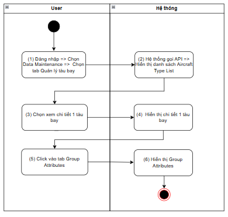
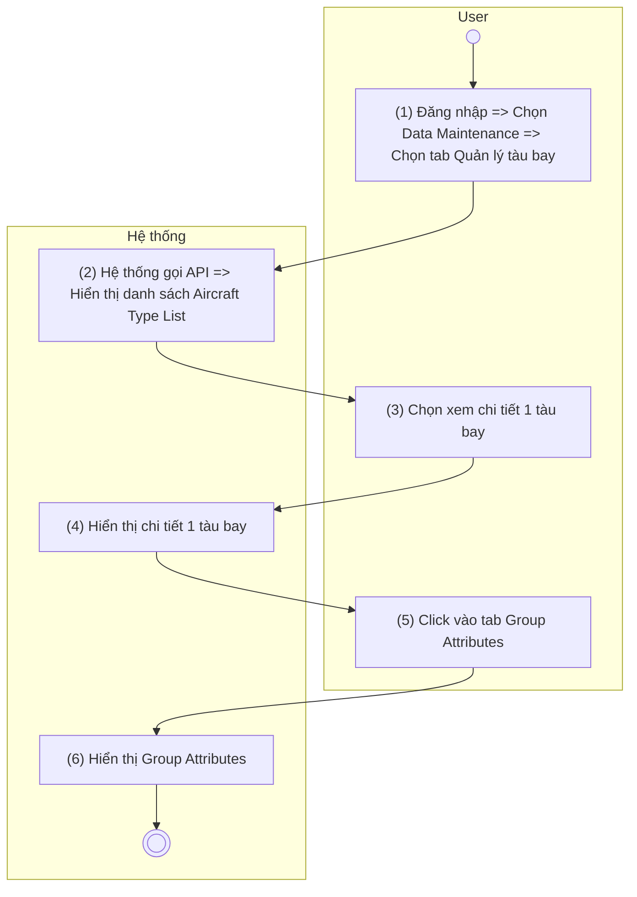
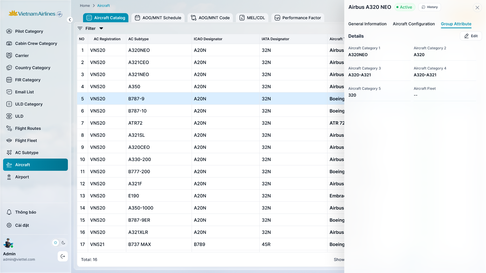

> **Ngữ cảnh chương (giữ nguyên từ nguồn):** mục `Data Maintenance (Danh mục dùng chung)`.

### [Xem chi tiết tàu bay](TOSS.DM.AIRCRAFT_DETAIL_GENERAL.FD.v0.1.md) - tab Group Attributes

| **Tên chức năng: [Xem chi tiết tàu bay](TOSS.DM.AIRCRAFT_DETAIL_GENERAL.FD.v0.1.md) - tab Group Attributes** | |
| --- | --- |
| **Mục đích** | Cho phép user [Xem chi tiết tàu bay](TOSS.DM.AIRCRAFT_DETAIL_GENERAL.FD.v0.1.md) - tab Group Attributes |
| **Trigger** | Người dùng truy cập vào web => Chọn Data Maintenance => nhấn Danh mục tàu bay => nhấn vào 1 dòng tàu bay bất kỳ => click Group Attributes |
| **Tiền điều kiện** | Người dùng đăng nhập thành công và được phân quyền xem phân hệ Tàu bay |
| **Hậu điều kiện** | Màn hình [Xem chi tiết tàu bay](TOSS.DM.AIRCRAFT_DETAIL_GENERAL.FD.v0.1.md) - tab Group Attributes hiển thị |

#### Sơ đồ luồng

#### Mô tả luồng xử lý

| Bước | Chi tiết |
| --- | --- |
| 1 | Người dùng đăng nhập vào hệ thống TOSS, truy cập module Data Maintenance và chọn tab Quản lý tàu bay (Aircraft Fleet) |
| 2 | Hệ thống gọi API lấy [danh sách Aircraft](TOSS.DM.AIRCRAFT_LIST.FD.v0.1.md) Type và hiển thị [danh sách tàu bay](TOSS.DM.AIRCRAFT_LIST.FD.v0.1.md). |
| 3 | Người dùng chọn một tàu bay để xem thông tin chi tiết |
| 4 | Hệ thống hiển thị màn hình chi tiết của tàu bay đã chọn . |
| 5 | Người dùng chọn tab Group Attributes |
| 6 | Hệ thống gọi API lấy thông tin Group Attributes của tàu bay và hiển thị dữ liệu trên màn hình |

#### Màn hình chức năng

#### Mô tả chi tiết màn hình

| **STT** | **Tên** | **Kiểu dữ liệu [Độ dài]** | **Mapping DB/API** | **Mô tả nghiệp vụ** |
| --- | --- | --- | --- | --- |
| 1 | Tab Group Attributes | Tab |  | User click vào tab => bôi đậm |
| 2 | Group Attributes | Title |  | * Fix cứng không cho thao tác |
| 3 | Aircraft Category 1 | Textview | aircraftCategory1 | * Danh mục phân loại tàu bay cấp 1. * Hiển thị tên danh mục theo dữ liệu API trả về. * Trường hợp API trả về **null/rỗng/lỗi**, hiển thị để trống. * Nếu độ dài dữ liệu vượt quá 2 dòng, hiển thị ba chấm […] ở cuối dòng thứ 2 và có tooltip hiển thị toàn bộ nội dung |
| 4 | Aircraft Category 2 | Textview | aircraftCategory2 | * Danh mục phân loại tàu bay cấp 2. * Hiển thị tên danh mục theo dữ liệu API trả về. * Trường hợp API trả về **null/rỗng/lỗi**, hiển thị để trống. * Nếu độ dài dữ liệu vượt quá 2 dòng, hiển thị ba chấm […] ở cuối dòng thứ 2 và có tooltip hiển thị toàn bộ nội dung |
| 5 | Aircraft Category 3 | Textview | aircraftCategory3 | * Danh mục phân loại tàu bay cấp 3. * Hiển thị tên danh mục theo dữ liệu API trả về. * Trường hợp API trả về **null/rỗng/lỗi**, hiển thị để trống. * Nếu độ dài dữ liệu vượt quá 2 dòng, hiển thị ba chấm […] ở cuối dòng thứ 2 và có tooltip hiển thị toàn bộ nội dung |
| 6 | Aircraft Category 4 | Textview | aircraftCategory4 | * Danh mục phân loại tàu bay cấp 4. * Hiển thị tên danh mục theo dữ liệu API trả về. * Trường hợp API trả về **null/rỗng/lỗi**, hiển thị để trống. * Nếu độ dài dữ liệu vượt quá 2 dòng, hiển thị ba chấm […] ở cuối dòng thứ 2 và có tooltip hiển thị toàn bộ nội dung |
| 7 | Aircraft Category 5 | Textview | aircraftCategory5 | * Danh mục phân loại tàu bay cấp 5. * Hiển thị tên danh mục theo dữ liệu API trả về. * Trường hợp API trả về **null/rỗng/lỗi**, hiển thị để trống. * Nếu độ dài dữ liệu vượt quá 2 dòng, hiển thị ba chấm […] ở cuối dòng thứ 2 và có tooltip hiển thị toàn bộ nội dung |
| 8 | Aircraft Fleet | Textview | aircraftFleet | * Hiển thị tên Fleet theo dữ liệu API trả về. * Trường hợp API trả về **null/rỗng/lỗi**, hiển thị để trống. * Nếu độ dài dữ liệu vượt quá 2 dòng, hiển thị ba chấm […] ở cuối dòng thứ 2 và có tooltip hiển thị toàn bộ nội dung |

---

*Nguồn: tách trung thực từ `sec-33-quan-ly-tau-bay.md`, mục "[Xem chi tiết tàu bay](TOSS.DM.AIRCRAFT_DETAIL_GENERAL.FD.v0.1.md) — tab Group Attributes" (bản trích text của `VNA.TOSS_SRS_Data Maintenance_v0.1.docx`, chương Data Maintenance (Danh mục dùng chung)) — tương ứng dòng **#62** bảng §1 của [CATALOG.md](../CATALOG.md). Không chỉnh sửa nội dung nguồn (CLAUDE.md §0). 🖼 Hình ảnh màn hình: xem file `VNA.TOSS_SRS_Data Maintenance_v0.1.docx` gốc.*
