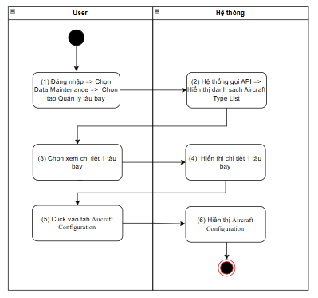
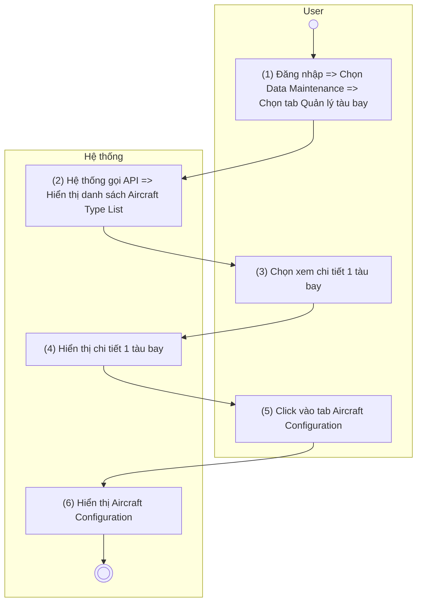
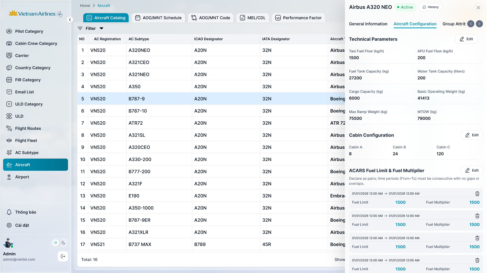

> **Ngữ cảnh chương (giữ nguyên từ nguồn):** mục `Data Maintenance (Danh mục dùng chung)`.

### [Xem chi tiết tàu bay](TOSS.DM.AIRCRAFT_DETAIL_GENERAL.FD.v0.1.md) - tab Aircraft Configuration

| **Tên chức năng: [Xem chi tiết tàu bay](TOSS.DM.AIRCRAFT_DETAIL_GENERAL.FD.v0.1.md) - tab Aircraft Configuration** | |
| --- | --- |
| **Mục đích** | Cho phép user [Xem chi tiết tàu bay](TOSS.DM.AIRCRAFT_DETAIL_GENERAL.FD.v0.1.md) - tab Aircraft Configuration |
| **Trigger** | Người dùng truy cập vào web => Chọn Data Maintenance => nhấn Danh mục tàu bay => nhấn vào 1 dòng tàu bay bất kỳ => click tag Aircraft Configuration |
| **Tiền điều kiện** | Người dùng đăng nhập thành công và được phân quyền xem phân hệ Tàu bay |
| **Hậu điều kiện** | Màn hình [Xem chi tiết tàu bay](TOSS.DM.AIRCRAFT_DETAIL_GENERAL.FD.v0.1.md) - tab Aircraft Configuration hiển thị |

#### Sơ đồ luồng

#### Mô tả luồng xử lý

| Bước | Chi tiết |
| --- | --- |
| 1 | Người dùng đăng nhập vào hệ thống TOSS, truy cập module Data Maintenance và chọn tab Quản lý tàu bay (Aircraft Fleet). |
| 2 | Hệ thống gọi API lấy [danh sách Aircraft](TOSS.DM.AIRCRAFT_LIST.FD.v0.1.md) Type và hiển thị [danh sách tàu bay](TOSS.DM.AIRCRAFT_LIST.FD.v0.1.md) |
| 3 | Người dùng chọn một tàu bay để xem thông tin chi tiết |
| 4 | Hệ thống hiển thị màn hình chi tiết của tàu bay đã chọn |
| 5 | Người dùng chọn tab Aircraft Configuration |
| 6 | Hệ thống gọi API lấy thông tin Aircraft Configuration của tàu bay và hiển thị dữ liệu trên màn hình |

#### Màn hình chức năng

#### Mô tả chi tiết màn hình

| **STT** | **Tên** | **Kiểu dữ liệu [Độ dài]** | **Mapping DB/API** | **Mô tả nghiệp vụ** |
| --- | --- | --- | --- | --- |
| 1 | Tab Aircraft Configuration | Tab |  | User click vào tab => bôi đậm |
| **Block: Technical Parameters** | | | | |
| **STT** | **Tên** | **Kiểu dữ liệu** | **Mapping DB/API** | **Mô tả nghiệp vụ** |
| 1 | Taxi Fuel Flow (kg/h) | Number | taxiFuelFlow | * Lượng nhiên liệu tiêu thụ khi tàu bay di chuyển trên mặt đất. Đơn vị: **kg/h**. * Giá trị phải **≥ 0**. * Hiển thị thông tin **Taxi Fuel Flow** theo dữ liệu API trả về. * Trường hợp API trả về **null/rỗng/lỗi**: để trống. * Nếu độ dài dữ liệu vượt quá 2 dòng, hiển thị ba chấm […] ở cuối dòng thứ 2 và có tooltip hiển thị toàn bộ nội dung |
| 2 | APU Fuel Flow (kg/h) | Number | apuFuelFlow | * Lượng nhiên liệu tiêu thụ của APU. Đơn vị: **kg/h**. * Giá trị phải **≥ 0**. * Hiển thị thông tin **APU Fuel Flow** theo dữ liệu API trả về. * Trường hợp API trả về **null/rỗng/lỗi**: để trống. * Nếu độ dài dữ liệu vượt quá 2 dòng, hiển thị ba chấm […] ở cuối dòng thứ 2 và có tooltip hiển thị toàn bộ nội dung |
| 3 | Fuel Tank Capacity (kg) | Number | fuelTankCapacity | * Dung tích tối đa của thùng nhiên liệu. Đơn vị: **kg** * Giá trị phải **≥ 0**. * Hiển thị thông tin **Fuel Tank Capacity** theo dữ liệu API trả về. * Trường hợp API trả về **null/rỗng/lỗi**: để trống. * Nếu độ dài dữ liệu vượt quá 2 dòng, hiển thị ba chấm […] ở cuối dòng thứ 2 và có tooltip hiển thị toàn bộ nội dung |
| 4 | Water Tank Capacity (liters) | Number | waterTankCapacity | * Dung tích tối đa của thùng nước sạch. Đơn vị: **lít** * Giá trị phải **≥ 0**. * Hiển thị thông tin **Water Tank Capacity** theo dữ liệu API trả về. * Trường hợp API trả về **null/rỗng/lỗi**: để trống. * Nếu độ dài dữ liệu vượt quá 2 dòng, hiển thị ba chấm […] ở cuối dòng thứ 2 và có tooltip hiển thị toàn bộ nội dung |
| 5 | Cargo Capacity (kg) | Number | cargoCapacity | * Khối lượng hàng hóa tối đa của tàu bay. Đơn vị: **kg**. * Giá trị phải **≥ 0**. * Hiển thị thông tin **Cargo Capacity** theo dữ liệu API trả về. * Trường hợp API trả về **null/rỗng/lỗi**: để trống. * Nếu độ dài dữ liệu vượt quá 2 dòng, hiển thị ba chấm […] ở cuối dòng thứ 2 và có tooltip hiển thị toàn bộ nội dung |
| 6 | Basic Operating Weight (kg) | Number | basicOperatingWeight | * Trọng lượng khai thác cơ bản của tàu bay (Basic Operating Weight - BOW). Đơn vị: **kg**. * Giá trị phải **≥ 0**. * Hiển thị thông tin **Basic Operating Weight** theo dữ liệu API trả về. * Trường hợp API trả về **null/rỗng/lỗi**: để trống. * Nếu độ dài dữ liệu vượt quá 2 dòng, hiển thị ba chấm […] ở cuối dòng thứ 2 và có tooltip hiển thị toàn bộ nội dung |
| 7 | Max Ramp Weight (kg) | Number | maxRampWeight | * Trọng lượng tối đa của tàu bay tại sân đỗ (Maximum Ramp Weight). Đơn vị: **kg**. * Giá trị phải **≥ 0**. * Hiển thị thông tin **Max Ramp Weight** theo dữ liệu API trả về. * Trường hợp API trả về **null/rỗng/lỗi**: để trống. * Nếu độ dài dữ liệu vượt quá 2 dòng, hiển thị ba chấm […] ở cuối dòng thứ 2 và có tooltip hiển thị toàn bộ nội dung |
| 8 | MTOW (kg) | Number | mtow | * Trọng lượng cất cánh tối đa của tàu bay (Maximum Take-off Weight). Đơn vị: **kg**. * Giá trị phải **≥ 0**. * -Hiển thị thông tin **MTOW** theo dữ liệu API trả về. * Trường hợp API trả về **null/rỗng/lỗi**: để trống. * Nếu độ dài dữ liệu vượt quá 2 dòng, hiển thị ba chấm […] ở cuối dòng thứ 2 và có tooltip hiển thị toàn bộ nội dung |
| **Block: Cabin Configuration** | | | | |
| 1 | Cabin A | Number | cabinA | * Số lượng ghế của khoang hành khách **Cabin A**. * Giá trị phải là số nguyên **≥ 0**. * Hiển thị thông tin **Cabin A** theo dữ liệu API trả về. * Trường hợp API trả về **null/rỗng/lỗi**: để trống. * Nếu độ dài dữ liệu vượt quá 2 dòng, hiển thị ba chấm […] ở cuối dòng thứ 2 và có tooltip hiển thị toàn bộ nội dung |
| 2 | Cabin B | Number | cabinB | * Số lượng ghế của khoang hành khách **Cabin B**. * Giá trị phải là số nguyên **≥ 0**. * Hiển thị thông tin **Cabin B** theo dữ liệu API trả về. * Trường hợp API trả về **null/rỗng/lỗi**: để trống. * Nếu độ dài dữ liệu vượt quá 2 dòng, hiển thị ba chấm […] ở cuối dòng thứ 2 và có tooltip hiển thị toàn bộ nội dung |
| 3 | Cabin C | Number | cabinC | * Số lượng ghế của khoang hành khách **Cabin C**. * Giá trị phải là số nguyên **≥ 0**. * Hiển thị thông tin **Cabin C** theo dữ liệu API trả về. * Trường hợp API trả về **null/rỗng/lỗi**: để trống. * Nếu độ dài dữ liệu vượt quá 2 dòng, hiển thị ba chấm […] ở cuối dòng thứ 2 và có tooltip hiển thị toàn bộ nội dung |
| **Block: ACARS Fuel Limit & Fuel Multiplier** | | | | |
| 1 | “Declare as pairs; time periods (From–To) must be consecutive with no gaps or overlaps.” | Text |  | * Fix cứng, không cho thao tác |
| 2 | From | Datetime | fromDate | * Thời điểm bắt đầu áp dụng cấu hình Fuel Limit và Fuel Multiplier. * Hiển thị theo định dạng **dd/MM/yyyy HH:mm**. * Hiển thị theo dữ liệu API trả về. * Trường hợp API trả về **null/rỗng/lỗi**, hiển thị để trống. |
| 3 | To | Datetime | toDate | * Thời điểm kết thúc áp dụng cấu hình Fuel Limit và Fuel Multiplier. * Hiển thị theo định dạng **dd/MM/yyyy HH:mm**. * Hiển thị theo dữ liệu API trả về.- Trường hợp API trả về **null/rỗng/lỗi**, hiển thị để trống. |
| 4 | Fuel Limit | Number | fuelLimit | * Giá trị Fuel Limit áp dụng trong khoảng thời gian hiệu lực.   Giá trị phải **≥ 0**.   * Hiển thị theo dữ liệu API trả về. * Trường hợp API trả về **null/rỗng/lỗi**, hiển thị để trống. * Nếu độ dài dữ liệu vượt quá 2 dòng, hiển thị ba chấm […] ở cuối dòng thứ 2 và có tooltip hiển thị toàn bộ nội dung |
| 5 | Fuel Multiplier | Decimal | fuelMultiplier | * Hệ số nhân nhiên liệu áp dụng trong khoảng thời gian hiệu lực. * Giá trị phải **≥ 0**. * Hiển thị theo dữ liệu API trả về. * Trường hợp API trả về **null/rỗng/lỗi**, hiển thị để trống. * Nếu độ dài dữ liệu vượt quá 2 dòng, hiển thị ba chấm […] ở cuối dòng thứ 2 và có tooltip hiển thị toàn bộ nội dung |

---

*Nguồn: tách trung thực từ `sec-33-quan-ly-tau-bay.md`, mục "[Xem chi tiết tàu bay](TOSS.DM.AIRCRAFT_DETAIL_GENERAL.FD.v0.1.md) — tab Aircraft Configuration" (bản trích text của `VNA.TOSS_SRS_Data Maintenance_v0.1.docx`, chương Data Maintenance (Danh mục dùng chung)) — tương ứng dòng **#61** bảng §1 của [CATALOG.md](../CATALOG.md). Không chỉnh sửa nội dung nguồn (CLAUDE.md §0). 🖼 Hình ảnh màn hình: xem file `VNA.TOSS_SRS_Data Maintenance_v0.1.docx` gốc.*
