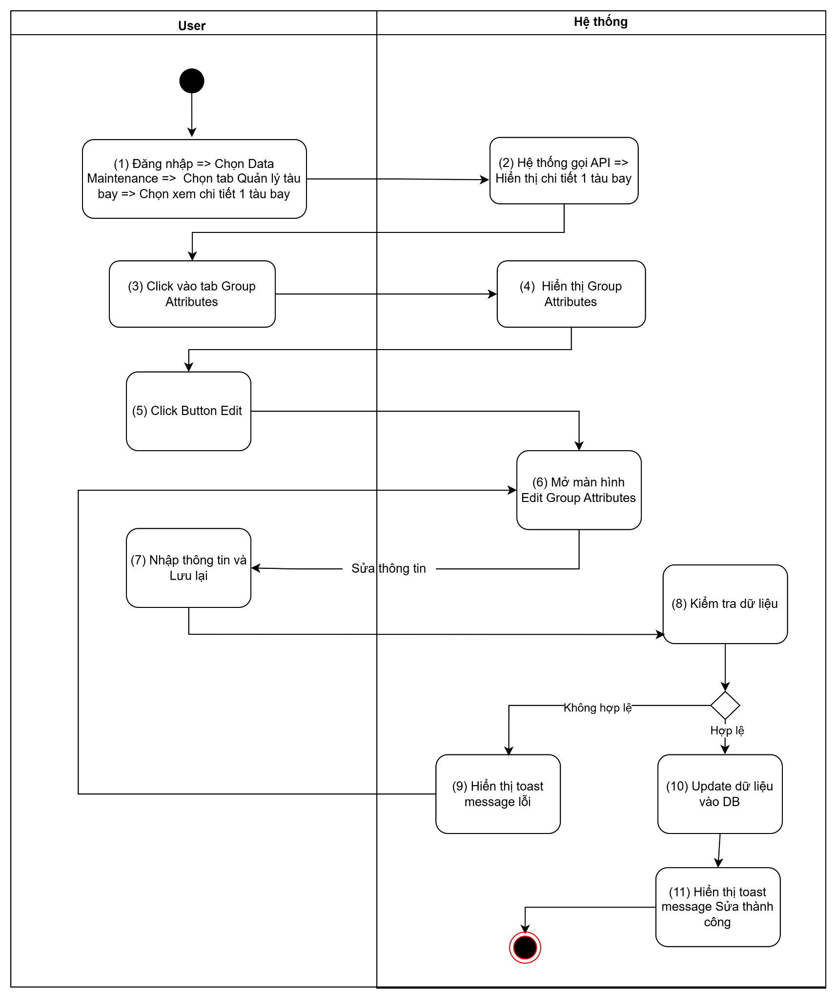
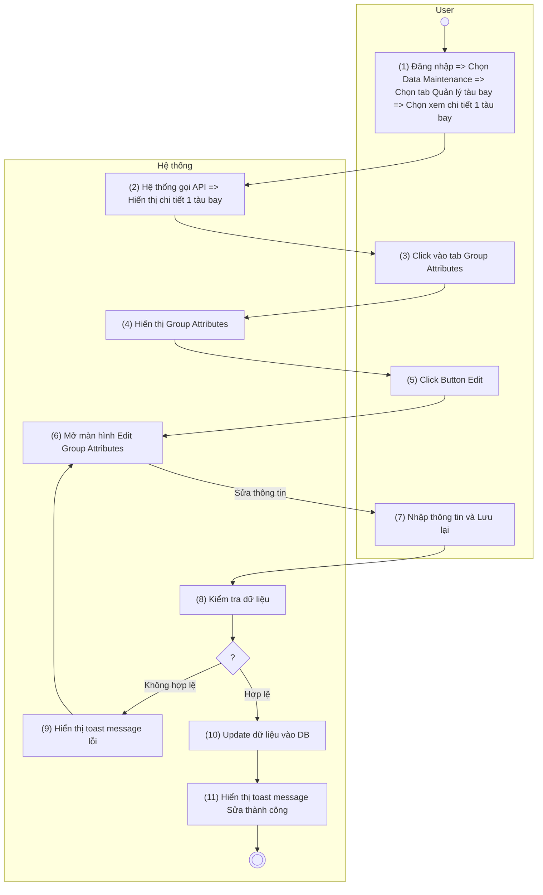
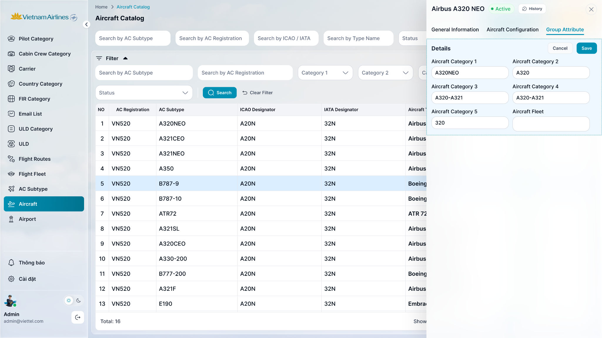

> **Ngữ cảnh chương (giữ nguyên từ nguồn):** mục `Data Maintenance (Danh mục dùng chung)`.

### Sửa [chi tiết tàu bay](TOSS.DM.AIRCRAFT_DETAIL_GENERAL.FD.v0.1.md) - tab Group Attributes

| **Tên chức năng**: **Sửa tàu bay - tab Group Attributes** | |
| --- | --- |
| **Mục đích** | Cho phép user chỉnh sửa thông tin Group Attributes |
| **Trigger** | User click button “Sửa” tại màn hình [chi tiết tàu bay](TOSS.DM.AIRCRAFT_DETAIL_GENERAL.FD.v0.1.md) Group Attributes |
| **Tiền điều kiện** | Người dùng đăng nhập thành công và được phân quyền Sửa tàu bay - tab Group Attributes |
| **Hậu điều kiện** | Sửa thành công, dữ liệu được lưu vào DB |

#### Sơ đồ luồng

#### Mô tả luồng xử lý

| Bước | Chi tiết |
| --- | --- |
| 1 | Người dùng đăng nhập vào hệ thống TOSS, truy cập Data Maintenance → Quản lý tàu bay và chọn một tàu bay để xem thông tin chi tiết |
| 2 | Hệ thống gọi API lấy thông tin chi tiết của tàu bay và hiển thị trên màn hình |
| 3 | Người dùng chọn tab Group Attributes |
| 4 | Hệ thống hiển thị thông tin Group Attributes của tàu bay . |
| 5 | Người dùng nhấn nút Edit |
| 6 | Hệ thống mở màn hình Edit Group Attributes |
| 7 | Người dùng cập nhật thông tin và nhấn Save |
| 8 | Hệ thống kiểm tra tính hợp lệ của dữ liệu nhập |
| 9 | Nếu dữ liệu không hợp lệ, hệ thống hiển thị thông báo lỗi và yêu cầu người dùng chỉnh sửa |
| 10 | Nếu dữ liệu hợp lệ, hệ thống cập nhật dữ liệu vào cơ sở dữ liệu |
| 11 | Hệ thống hiển thị thông báo "Updated successfully." |

#### Màn hình chức năng

#### Mô tả chi tiết màn hình

| **STT** | **Tên** | **Kiểu dữ liệu [Độ dài]** | **Mapping DB/API** | **Mô tả nghiệp vụ** |
| --- | --- | --- | --- | --- |
| * **Khi user đang edit tại tab này => Hệ thống thực hiện không cho thao tác ở các tab khác, chức năng khác trên màn và trên cùng 1 tab** | | | | |
| 1 | Tab Group Attributes | Tab |  | User click vào tab => bôi đậm |
| 2 | Group Attributes | Title |  | * Fix cứng không cho thao tác |
| 3 | Aircraft Category 1 | DDL | aircraftCategory1 | * Danh mục phân loại tàu bay cấp 1. * Hiển thị tên danh mục theo dữ liệu API trả về. * Trường hợp API trả về **null/rỗng/lỗi**, hiển thị để placeholder “Select Aircraft Category 1” * Action: Out focus/click button Save, hệ thống validate, nếu   + Để trống ⇒ Hiển thị thông báo IM: “The **<field name>** field must not be empty.” và hiển thị để placeholder “Select Aircraft Category 1” * Chỉ cho phép chọn 1 giá trị bao gồm các giá trị sau:   + A320NEO   + A321 CEO   + A321 NEO   + A350   + B787-9   + B787-10 |
| 4 | Aircraft Category 2 | DDL | aircraftCategory2 | * Danh mục phân loại tàu bay cấp 2. * Hiển thị tên danh mục theo dữ liệu API trả về. * Trường hợp API trả về **null/rỗng/lỗi**, hiển thị để placeholder “Select Aircraft Category 2” * Action: Out focus/click button Save, hệ thống validate, nếu   + Để trống ⇒ Hiển thị thông báo IM: “The **<field name>** field must not be empty.” và hiển thị để placeholder “Select Aircraft Category 2” * Chỉ cho phép chọn 1 giá trị bao gồm các giá trị sau:   + A320   + A321 CEO   + A321 NEO   + A350   + B787 |
| 5 | Aircraft Category 3 | DDL | aircraftCategory3 | * Danh mục phân loại tàu bay cấp 3. * Hiển thị tên danh mục theo dữ liệu API trả về. * Trường hợp API trả về **null/rỗng/lỗi** ,hiển thị để placeholder “Select Aircraft Category 3” * Action: Out focus/click button Save, hệ thống validate, nếu   + Để trống ⇒ Hiển thị thông báo IM: “The **<field name>** field must not be empty.” và hiển thị để placeholder “Select Aircraft Category 3” * Chỉ cho phép chọn 1 giá trị bao gồm các giá trị sau:   + A320-A321   + A350 * B787 |
| 6 | Aircraft Category 4 | DDL | aircraftCategory4 | * Danh mục phân loại tàu bay cấp 4. * Hiển thị tên danh mục theo dữ liệu API trả về. * Trường hợp API trả về **null/rỗng/lỗi**, hiển thị để placeholder “Select Aircraft Category 4” * Action: Out focus/click button Save, hệ thống validate, nếu   + Để trống ⇒ Hiển thị thông báo IM: “The **<field name>** field must not be empty.” và hiển thị để placeholder “Select Aircraft Category 4” * Chỉ cho phép chọn 1 giá trị bao gồm các giá trị sau:   + A320-A321   + A350-B787 |
| 7 | Aircraft Category 5 | DDL | aircraftCategory5 | * Danh mục phân loại tàu bay cấp 5. * Hiển thị tên danh mục theo dữ liệu API trả về. * Trường hợp API trả về **null/rỗng/lỗi**, hiển thị để placeholder “Select Aircraft Category 5” * Action: Out focus/click button Save, hệ thống validate, nếu   + Để trống ⇒ Hiển thị thông báo IM: “The **<field name>** field must not be empty.” và hiển thị để placeholder “Select Aircraft Category 5” * Chỉ cho phép chọn 1 giá trị bao gồm các giá trị sau:   + 320   + 32B   + 32D   + 32N   + 350   + 787 |
| 8 | Aircraft Fleet | DDL | aircraftFleet | * Hiển thị tên Fleet theo dữ liệu API trả về. * Trường hợp API trả về **null/rỗng/lỗi**, hiển thị để placeholder “Select Aircraft Fleet” * Action: Out focus/click button Save, hệ thống validate, nếu   + Để trống ⇒ Hiển thị thông báo IM: “The **<field name>** field must not be empty.” và hiển thị để placeholder “Select Aircraft Fleet” * Chỉ cho phép chọn 1 giá trị bao gồm các giá trị sau:   + A320   + A321   + A350   + B787   + ATR |
| 9 | Cancel | button |  | * Click button Hủy bỏ => Đóng màn hình sửa Dữ liệu thay đổi không được lưu vào DB |
| 10 | Save | button |  | * User click button => Hệ thống lưu thông tin chỉnh sửa hợp lệ, đồng thời lưu log chỉnh sửa những trường thông tin:   + Aircraft Category 1   + Aircraft Category 2   + Aircraft Category 3   + Aircraft Category 4   + Aircraft Category 5   + Aircraft Fleet   Theo:   | **Thông tin lưu log** | **Mô tả** | | --- | --- | | **Date/Time** | Thời điểm thực hiện thao tác. | | **Changed By** | Người thực hiện thao tác. | | **Section** | Tên cụm block thay đổi thông tin | | **Action** | Loại thao tác được ghi nhận (**Add**, **Modify**, **Delete**). | | **Field** | Tên trường dữ liệu được thay đổi. | | **Old Value** | Giá trị của trường dữ liệu trước khi thay đổi. | | **New Value** | Giá trị của trường dữ liệu sau khi thay đổi. |  * Hiển thị toast thông báo thành công: “Group Attributes successfully edited.”      * Hiển thị toast thông báo không thành công: “Failed to edit Group Attributes.”    |

---

*Nguồn: tách trung thực từ `sec-33-quan-ly-tau-bay.md`, mục "Sửa tàu bay — tab Group Attributes" (bản trích text của `VNA.TOSS_SRS_Data Maintenance_v0.1.docx`, chương Data Maintenance (Danh mục dùng chung)) — tương ứng dòng **#67** bảng §1 của [CATALOG.md](../CATALOG.md). Không chỉnh sửa nội dung nguồn (CLAUDE.md §0). 🖼 Hình ảnh màn hình: xem file `VNA.TOSS_SRS_Data Maintenance_v0.1.docx` gốc.*
