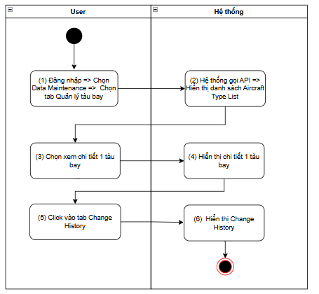
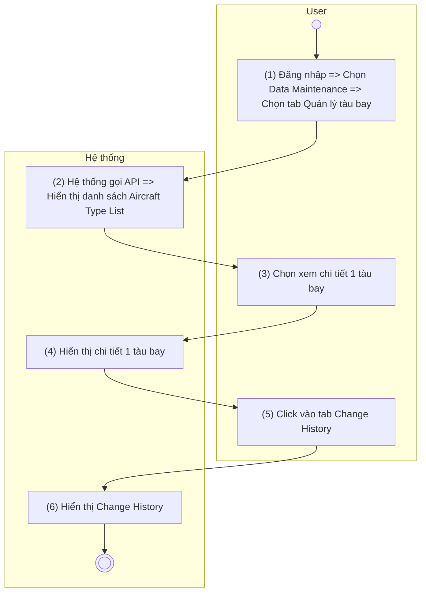
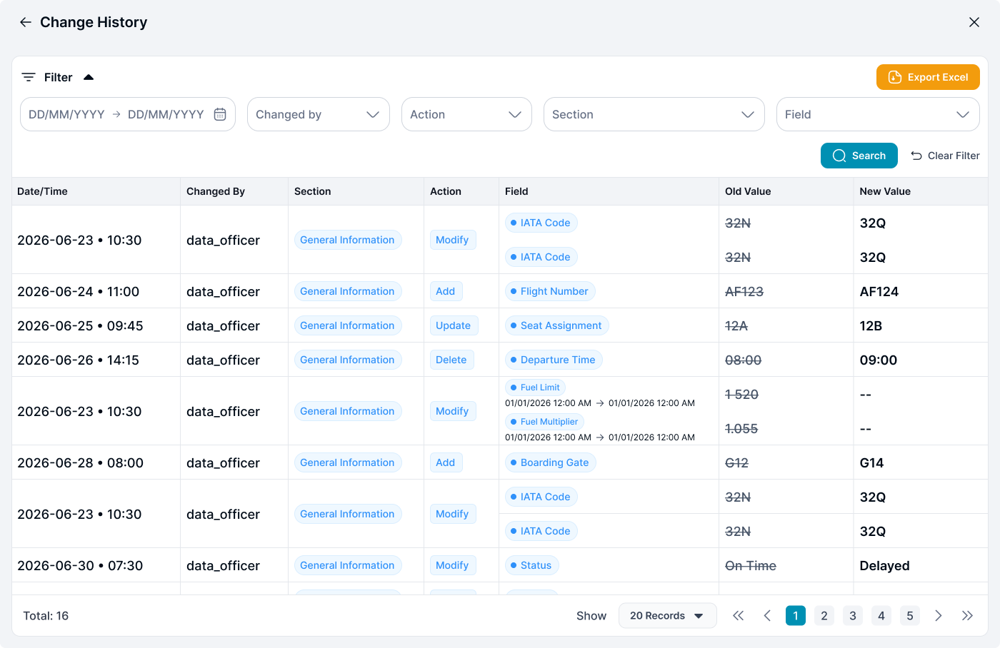
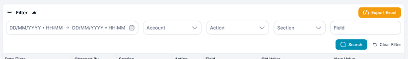
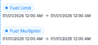

> **Ngữ cảnh chương (giữ nguyên từ nguồn):** mục `Data Maintenance (Danh mục dùng chung)`.

### Change History

| **Tên chức năng: Xem Change History** | |
| --- | --- |
| **Mục đích** | Cho phép user Xem Lịch sử chỉnh sửa |
| **Trigger** | Người dùng truy cập vào web => Chọn Data Maintenance => nhấn Danh mục tàu bay => nhấn vào 1 dòng tàu bay bất kỳ => click History |
| **Tiền điều kiện** | Người dùng đăng nhập thành công và được phân quyền xem phân hệ Tàu bay |
| **Hậu điều kiện** | Màn hình Xem lịch sửTàu bay |

#### Sơ đồ luồng

#### Mô tả luồng xử lý

| Bước | Chi tiết |
| --- | --- |
| 1 | Người dùng đăng nhập vào hệ thống TOSS, truy cập **Data Maintenance** → **Quản lý tàu bay** |
| 2 | Hệ thống gọi API lấy danh sách **Aircraft Type** và hiển thị [danh sách tàu bay](TOSS.DM.AIRCRAFT_LIST.FD.v0.1.md) |
| 3 | Người dùng chọn một tàu bay để xem thông tin chi tiết |
| 4 | Hệ thống hiển thị màn hình chi tiết của tàu bay đã chọn . |
| 5 | Người dùng chọn tab **Change History**. |
| 6 | Hệ thống gọi API lấy lịch sử thay đổi của tàu bay và hiển thị dữ liệu trên màn hình |

#### Màn hình chức năng

#### Mô tả chi tiết màn hình

| **STT** | **Tên** | **Kiểu dữ liệu[Độ dài dữ liệu]** | **Mapping DB/API** | **Mô tả** |
| --- | --- | --- | --- | --- |
| **Thông tin chung** | | | | |
|  |  | Ttitle |  | * Fix cứng không cho thao tác |
|  |  | Icon |  | * Click icon => Quay trở lại màn trước đó |
|  |  | Icon |  | * Click icon => Quay trở lại màn trước đó |
| * **Tìm kiếm**   ****   * + Click vào dòng dưới tiêu đề các cột để chọn lọc, tìm kiếm thông tin theo dữ liệu tại cột tương ứng.   + Trường hợp Searchbox không có dữ liệu: Mặc định tìm kiếm all dữ liệu tại cột đó   + Người dùng thao tác thay đổi giá trị trường dữ liệu =>out focus box => hệ thống thực hiện:     - Reload dữ liệu table phù hợp với bộ lọc     - Set current page=1   + Hiển thị kết quả tìm kiếm:     - Trường hợp API trả về data có KQ: hiển thị danh sách dữ liệu theo kết quả API trả về     - Trường hợp API trả về data rỗng hoặc lỗi: Hiển thị bảng danh sách với **chân trang = Tất cả danh sách : 0** | | | | |
| 2 |  | Datepicker |  | * Cho phép người dùng lựa chọn khoảng thời gian để lọc lịch sử thay đổi. * **Mặc định:** Để trống. * **Placeholder:** DD/MM/YYYY → DD/MM/YYYY. * Khi người dùng chọn ngày bắt đầu và ngày kết thúc, hệ thống thực hiện tìm kiếm các bản ghi có **Date/Time** nằm trong khoảng thời gian đã chọn. Người dùng có thể xóa giá trị để bỏ điều kiện lọc. |
| ~~3~~ | ~~To date~~ | ~~Datepicker~~ |  | * ~~Trường để lọc: Tìm kiếm chính xác theo [To date] (không tìm theo giờ)~~ * ~~Định dạng ngày dd/mm/yyyy~~ * ~~Click vào component  , hệ thống mở bộ lọc thời gian cho phép người dùng chọn. Không cho chọn ngày trùng với From date và phải lớn hơn From date~~ |
| 4 | Changed by | Textbox |  | * Placeholder: Search by User name * Trường để lọc: Tìm kiếm gần đúng theo [Changed by] * Maxlength 20 ký tự * Validate cho phép nhập chữ, số, và ký tự đặc biệt * Nếu dữ liệu nhập vượt quá độ dài ô => thay thế phần vượt quá bằng ký tự “...” và có tooltip hiển thị toàn bộ nội dung nhập * Nếu paste đoạn văn thì ghi nhận 20 ký tự đầu * Tự động TRIM Spaces đầu cuối khi tìm kiếm |
| 5 | Action | DDL |  | * Trường để lọc: Tìm kiếm chính xác theo [Action] * Các giá trị bao gồm:   + Modify   + Add   + Delete |
| 6 | Section | Textbox |  | * Placeholder: Search by section * Trường để lọc: Tìm kiếm gần đúng theo [Section] * Maxlength 50 ký tự * Validate cho phép nhập chữ, số, và ký tự đặc biệt * Nếu dữ liệu nhập vượt quá độ dài ô => thay thế phần vượt quá bằng ký tự “...” và có tooltip hiển thị toàn bộ nội dung nhập * Nếu paste đoạn văn thì ghi nhận 50 ký tự đầu * Tự động TRIM Spaces đầu cuối khi tìm kiếm |
| 7 | Field | Textbox |  | * Placeholder: Search by Field * Trường để lọc: Tìm kiếm gần đúng theo [Field] * Maxlength 50 ký tự * Validate cho phép nhập chữ, số, và ký tự đặc biệt * Nếu dữ liệu nhập vượt quá độ dài ô => thay thế phần vượt quá bằng ký tự “...” và có tooltip hiển thị toàn bộ nội dung nhập * Nếu paste đoạn văn thì ghi nhận 50 ký tự đầu * Tự động TRIM Spaces đầu cuối khi tìm kiếm |
|  |  |  |  |  |
| 8 |  | Button |  | * Click vào  * Hệ thống thực hiện lọc dữ liệu dựa trên từ khoá * Hệ thống trả về danh sách dữ liệ u phù hợp với từ khoá tìm kiếm |
| 9 |  | Button |  | * Click vào  * Hệ thống:   + Xoá nội dung search   + Reset toàn trường lọc đã chọn   + Reset phân trang về trang đầu * Hiển thị lại danh sách ban đầu |
| 10 | Export excel | Button |  | * Click vào => hệ thống thực hiện tạo file .xlsx để tải lịch sử tàu bay * Tên file tải về: TOSS_History_Aircraft_type_list_ddmmyyhhss * Nội dung file tải về lấy từ bảng Change History * Template: [TOSS_History_Aircraft_type_list_ddmmyyhhss](https://docs.google.com/spreadsheets/d/1Lfpp6dIa_7dRYIAcAZzCpJDrsGPMYDEO/edit?usp=drive_link&ouid=115403346570548127295&rtpof=true&sd=true) |
| **Bảng log** | | | | |
| 1 | Date/Time | Textview |  | * Hiển thị thời gian cập nhật dữ liệu * Định dạng dd/mm/yyyy hh:mxm |
| 2 | Changed By | Textview |  | * Hiển thị nội dung bao gồm [Name of the updater] / [ User update code] |
|  | ~~Tab~~ |  |  | * ~~Hiển thị các block khi user có hành sửa~~ |
| 3 | Section | Textview |  | * Hiển thị theo section |
| 4 | Action | Textview |  | * Hiển thị loại thao tác đã được thực hiện trên dữ liệu tại thời điểm ghi nhận lịch sử thay đổi. * Giá trị được hệ thống tự động ghi nhận gồm : Modify/ Add/ Delete |
| 5 | Field | Textview |  | * Hiển thị tên trường thông tin thay đổi * Đối với block ACARS Fuel Limit & Fuel Multiplier khi user chỉnh sửa/xóa/thêm mới => Hiển thị tên trường và khoảng thời gian hiệu lực  |
| 6 | Old value | Textview |  | * Hiển thị giá trị thông tin cũ, TH thêm mới hiển thị gạch ngang“-” * Hiện tối đa 2 dòng dữ liệu, nếu nội dung vượt quá 2 dòng, hiện dấu ba chấm […] tại cuối dòng thứ 2. Di chuột vào hiện tooltips full nội dung |
| 7 | New value | Textview |  | * Hiển thị giá trị thông tin mới, TH xóa hiển thị gạch ngang “-” * Hiện tối đa 2 dòng dữ liệu, nếu nội dung vượt quá 2 dòng, hiện dấu ba chấm […] tại cuối dòng thứ 2. Di chuột vào hiện tooltips full nội dung |
| 8 | Pagination |  |  | * [Theo kịch bản phân trang](https://docs.google.com/document/d/1L5y0t4FCWe_vnNI65xNMRC-LM3lvLwYsQRAm_Nokv9A/edit?tab=t.0#heading=h.abyqd0hrl467) |

---

*Nguồn: tách trung thực từ `sec-33-quan-ly-tau-bay.md`, mục "Change History (Tàu bay)" (bản trích text của `VNA.TOSS_SRS_Data Maintenance_v0.1.docx`, chương Data Maintenance (Danh mục dùng chung)) — tương ứng dòng **#68** bảng §1 của [CATALOG.md](../CATALOG.md). Không chỉnh sửa nội dung nguồn (CLAUDE.md §0). 🖼 Hình ảnh màn hình: xem file `VNA.TOSS_SRS_Data Maintenance_v0.1.docx` gốc.*
