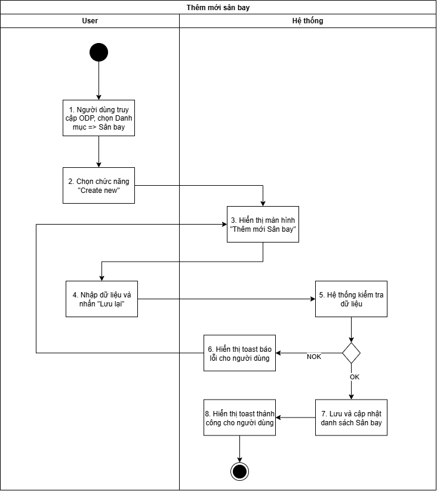
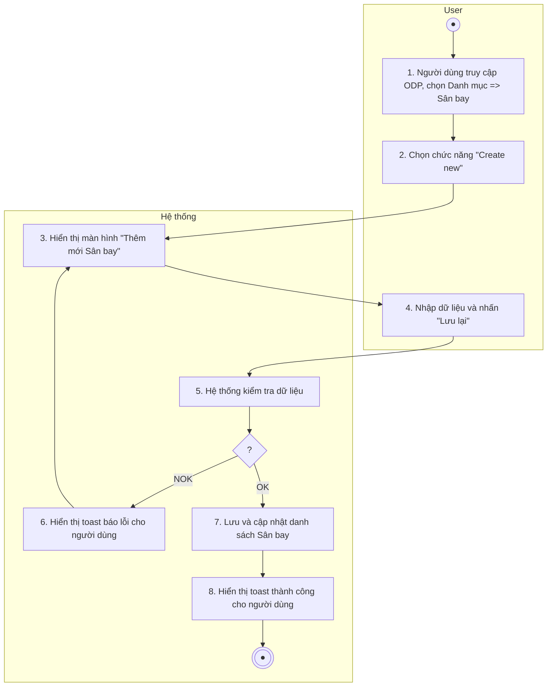
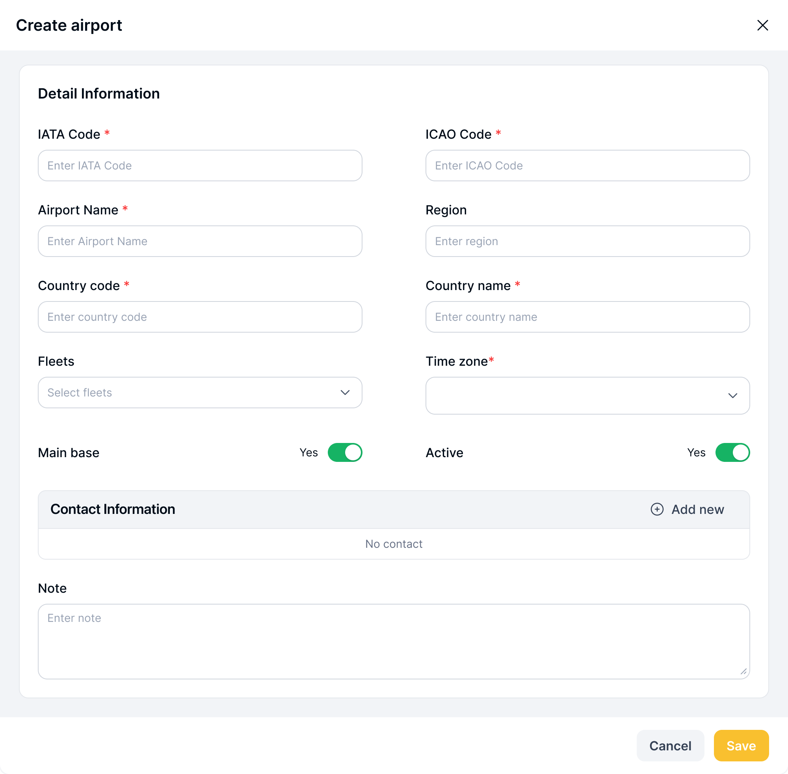
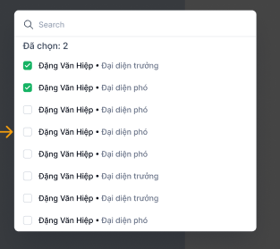
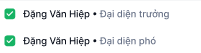
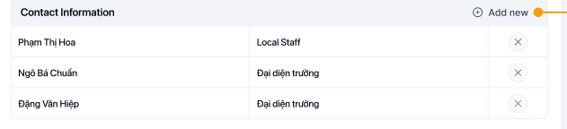

## Thêm mới sân bay

| **Tên chức năng: Thêm mới sân bay** | |
| --- | --- |
| **Mục đích** | Cho phép user Thêm mới sân bay |
| **Trigger** | Người dùng truy cập vào web FIMS => nhấn phân hệ Danh mục => Nhấn chọn sân bay => Chọn button “Create new” |
| **Tiền điều kiện** | Người dùng đăng nhập thành công và được phân quyền thêm sân bay |
| **Hậu điều kiện** | Thêm mới thành công sân bay |

### *Sơ đồ luồng hệ thống*

1. Sơ đồ luồng thêm mới sân bay

### *Mô tả luồng xử lý*

| **STT** | **Bước** | **Chi tiết** |
| --- | --- | --- |
|  | Bước 1 | Người dùng truy cập vào web FIMS =>Chọn tab Danh mục => Chọn”sân bay” |
|  | Bước 2 | Người dùng chọn button “Create new” |
|  | Bước 3 | Hệ thống hiển thị màn hình Thêm mới Sân bay |
|  | Bước 4 | User nhập dữ liệu và nhấn **Lưu lại** |
|  | Bước 5 | Hệ thống kiểm tra dữ liệu, nếu:   * Trường hợp thiếu dữ liệu bắt buộc/Sai định dạng valid/Call API tạo mới sân bay cho FIMS có lỗi => Báo lỗi theo bước 6 * Ngược lại: Tạo mới sân bay thành công => Thực hiện tiếp bước 7 & 8 |
|  | Bước 6 | Hiển thị toast báo lỗi cho người dùng:   * Trường hợp thiếu trường bắt buộc: Hiển thị inline message (IM) tại trường có lỗi [VL004](https://docs.google.com/document/d/1L5y0t4FCWe_vnNI65xNMRC-LM3lvLwYsQRAm_Nokv9A/edit?tab=t.0#bookmark=kix.oq8nkssherqj) * Trường hợp Sai định dạng valid: Hiển thị IM tại trường có lỗi [VL006](https://docs.google.com/document/d/1L5y0t4FCWe_vnNI65xNMRC-LM3lvLwYsQRAm_Nokv9A/edit?tab=t.0#bookmark=kix.lwrynb3cmu73) * Trường hợp Call API tạo mới trả về lỗi: hiển thị toast message (TM)   + Trường hợp lỗi API trả về có message: hiện [TB020](https://docs.google.com/document/d/1L5y0t4FCWe_vnNI65xNMRC-LM3lvLwYsQRAm_Nokv9A/edit?tab=t.0#bookmark=kix.zi1hm3rguphh)   + Hoặc hiện [TB021](https://docs.google.com/document/d/1L5y0t4FCWe_vnNI65xNMRC-LM3lvLwYsQRAm_Nokv9A/edit?tab=t.0#bookmark=kix.3pbjinevz4c0) |
|  | Bước 7 | Trường hợp tạo sân bay thành công: BE Lưu và cập nhật [danh sách sân bay](TOSS.DM.AIRPORT_LIST.FD.v0.1.md)  Trả API thành công cho FE |
|  | Bước 8 | FE Hiển thị toast thành công cho người dùng [TB019](https://docs.google.com/document/d/1L5y0t4FCWe_vnNI65xNMRC-LM3lvLwYsQRAm_Nokv9A/edit?tab=t.0#bookmark=kix.spmzvpry3i7f)  Đóng popup Tạo mới, tự động refresh màn danh sách và hiển thị [Danh sách sân bay](TOSS.DM.AIRPORT_LIST.FD.v0.1.md) mới nhất |

### *Màn hình chức năng*

1. Popup Thêm mới sân bay

### *Mô tả chi tiết màn hình*

| **STT** | **Tên** | **Kiểu dữ liệu [Độ dài dữ liệu]** | **Mapping DB/API** | **Mô tả** |
| --- | --- | --- | --- | --- |
|  | Title | Textview |  | * Text cứng “Create airport” |
|  | Icon X | Icon |  | * Click icon → Đóng popup. Điều hướng về màn trước đó |
|  | IATA code | Textbox | iata_code | * ~~Hiển thị [IATA Code] theo dữ liệu API trả về~~ * ~~Trường hợp API trả về rỗng/lỗi: hiện~~ * Placeholder “Enter IATA Code” * Bắt buộc nhập * Nhận dữ liệu dạng chữ, số, dấu chấm (.), gạch ngang (-), gạch dưới (_), 3 ký tự đầu bắt buộc nhập định dạng chữ in hoa. VD: ABC=> không nhập 3 ký tự đầu tiên bằng chữ in hoa=> chặn không cho phép nhập * Valid maxlength = 10 ký tự, chặn khi nhập quá 10 ký tự * Nếu paste đoạn văn > 10 ký tự, chỉ nhận 10 ký tự đầu tiên * Tự động TRIM Spaces đầu cuối khi out focus box * Trường hợp nội dung dài vượt quá độ rộng box => di chuột vào hiện tooltips hiển thị full nội dung * **Action**: Nhấn Enter/out focus/click button **Save**, hệ thống validate, nếu   + Để trống ⇒ Hiển thị thông báo IM: [VL004](https://docs.google.com/document/d/1L5y0t4FCWe_vnNI65xNMRC-LM3lvLwYsQRAm_Nokv9A/edit?tab=t.0#bookmark=kix.oq8nkssherqj)   + Trường hợp nhập mã IATA Code đã tồn tại trong hệ thống. => Hiển thị thông báo IM: [VL007](https://docs.google.com/document/d/1L5y0t4FCWe_vnNI65xNMRC-LM3lvLwYsQRAm_Nokv9A/edit?tab=t.0#bookmark=kix.s6302mi8qdnp) |
|  | ICAO code | Textbox | icao_code | * ~~Hiển thị [IATA Code] theo dữ liệu API trả về~~ * ~~Trường hợp API trả về rỗng/lỗi: hiện~~ placeholder “Enter ICAO Code” * Bắt buộc nhập * Nhận dữ liệu dạng chữ, số, dấu chấm (.), gạch ngang (-), gạch dưới (_), 4 ký tự đầu bắt buộc nhập định dạng chữ in hoa. VD: ABCD=> không nhập 4 ký tự đầu tiên bằng chữ in hoa=> chặn không cho phép nhập * Valid maxlength = 10 ký tự, chặn khi nhập quá 10 ký tự * Nếu paste đoạn văn > 10 ký tự, chỉ nhận 10 ký tự đầu tiên * Tự động TRIM Spaces đầu cuối khi out focus box * Trường hợp nội dung dài vượt quá độ rộng box => di chuột vào hiện tooltips hiển thị full nội dung * **Action**: Nhấn Enter/out focus/click button **Save**, hệ thống validate, nếu   + Để trống ⇒ Hiển thị thông báo IM: “Please enter ICAO Code”   + Trường hợp nhập mã ICAO Code đã tồn tại trong hệ thống. => Hiển thị thông báo IM: “ICAO Code already exists" |
|  | Airport Name | TextBox | airport_name | * Hiển thị [Airport Name] theo dữ liệu API trả về * Trường hợp API trả về rỗng/lỗi: hiện placeholder “Enter Airport Name” * Bắt buộc nhập * Nhận dữ liệu dạng chữ, số, dấu chấm (.), gạch ngang (-), gạch dưới (_) * Valid maxlength = 100 ký tự, chặn khi nhập quá 100 ký tự * Nếu paste đoạn văn > 100 ký tự, chỉ nhận 100 ký tự đầu tiên * Tự động TRIM Spaces đầu cuối khi out focus box * Trường hợp nội dung dài vượt quá độ rộng box => di chuột vào hiện tooltips hiển thị full nội dung * Cho phép trùng tên * Action: Nhấn Enter/out focus/click button Save, hệ thống validate, nếu   + Để trống ⇒ Hiển thị thông báo IM: “Please enter Airport Name” |
|  | Region | DDL | region | * Không bắt buộc chọn * Placeholder: “Chọn region” * **Action**: Nhấn Enter/out focus/click button **Lưu lại**, hệ thống lưu thông tin Region |
|  | Country code | Textbox | country_code | * Hiển thị [Country code] theo dữ liệu API trả về * Trường hợp API trả về rỗng/lỗi: hiện placeholder “Enter country code” * Không bắt buộc nhập * Nhận dữ liệu dạng chữ, số, và ký tự đặc biệt * Valid maxlength = 10 ký tự, chặn khi nhập quá 10 ký tự * Nếu paste đoạn văn > 10 ký tự, chỉ nhận 10 ký tự đầu tiên * Tự động TRIM Spaces đầu cuối khi out focus box * Trường hợp nội dung dài vượt quá độ rộng box => di chuột vào hiện tooltips hiển thị full nội dung * **Action**: Nhấn Enter/out focus/click button **Save**, hệ thống lưu thông tin Country code |
|  | Country name | DDL | country_name | * ~~Hiển thị [Country name] theo dữ liệu API trả về~~ * ~~Trường hợp API trả về rỗng/lỗi: hiện placeholder “Enter Country name”~~ * Không bắt buộc chọn * Nhận dữ liệu dạng chữ, số, dấu chấm (.), gạch ngang (-), gạch dưới (_) * Valid maxlength = 100 ký tự, chặn khi nhập quá 100 ký tự * Nếu paste đoạn văn > 100 ký tự, chỉ nhận 100 ký tự đầu tiên * Tự động TRIM Spaces đầu cuối khi out focus box * Trường hợp nội dung dài vượt quá độ rộng box => di chuột vào hiện tooltips hiển thị full nội dung * **Action**: Nhấn Enter/out focus/click button **Save**, hệ thống validate, nếu   + Để trống ⇒ Hiển thị thông báo IM: “Please enter Country name” |
|  | Fleets | DDL | fleet | * Hiển thị [Fleets] theo dữ liệu API trả về * Trường hợp API trả về rỗng/lỗi: hiện placeholder “Select Fleets” * Bắt buộc chọn * Các giá trị fleets API trả về * **Action**: Nhấn Enter/out focus/click button **Save**, hệ thống validate, nếu   + Để trống ⇒ Hiển thị thông báo IM:[VL004](https://docs.google.com/document/d/1L5y0t4FCWe_vnNI65xNMRC-LM3lvLwYsQRAm_Nokv9A/edit?tab=t.0#bookmark=kix.oq8nkssherqj) |
|  | Time zone | Dropdown |  | * Hiển thị danh sách [Time Zone] theo dữ liệu API trả về * Trường hợp API trả về rỗng/lỗi: hiển thị placeholder **“Select Time zone”** * Bắt buộc chọn * Chỉ cho phép chọn 01 giá trị * Không cho phép nhập tự do (không editable text) * Danh sách được sắp xếp theo GMT tăng dần * Trường hợp nội dung dài vượt quá độ rộng box ⇒ hiển thị tooltip khi hover để xem full nội dung |
|  | Main Base | Toggle switch | main_base | * Hiển thị trạng thái [Main Base] * Switch to turn Yes/No * Mặc định khi mở form là No |
|  | Active | Toggle switch | is_active/isActive | * Hiển thị theo trạng thái hoạt động của người dùng:   + Trạng thái = Active: On   + Trạng thái = Inactive: Off   + Cho phép user thao tác On/Off trạng thái hoạt động của người dùng   + Chi tiết kịch bản tham chiếu mục [Bật/tắt Hoạt động](../../../../SA-system-admin/srs/_parts/TOSS.SA.USER/TOSS.SA.TOGGLE_USER.FD.v0.1.md) |
|  | Contact Information |  |  | * Không bắt buộc thêm   **Thêm contact sân bay**:  Click => Hệ thống call API lấy trường [Họ và tên] , [Vị trí làm việc] từ phân hệ **Liên hệ.** Và các trường ấy phải của Liên hệ có [Loại] = Thường, [Trạng thái hoạt động] = Đang hoạt động   * Hiển thị Dropdown list các liên hệ với thông tin bao gồm [Họ và tên], [Vị trí làm việc] sắp xếp từ a -> z:    + :     - TH **Add**:   + Mặc định uncheck, user được phép tích chọn thêm nhiều liên hệ.  + Khi user tích chọn, hiển thị **Đã chọn**: [X], fix cứng “**Đã chọn**”, **X** là tổng số checkbox được chọn. Mặc định không hiện khi chưa có checkbox được chọn   * + - TH **Edit**: Không cho phép sửa * **Searchbox**:   + - Placeholder “Search”     - Cho phép nhận và tìm kiếm gần đúng theo [Họ và tên , Vị trí làm việc]     - Maxlength 100 ký tự     - Validate cho phép nhập chữ, số, và ký tự đặc biệt     - Nếu dữ liệu nhập vượt quá độ dài ô => thay thế phần vượt quá bằng ký tự “...” và có tooltip hiển thị toàn bộ nội dung nhập     - Nếu paste đoạn văn thì ghi nhận 100 ký tự đầu     - Tự động TRIM Spaces đầu cuối khi tìm kiếm Liên hệ     - Trường hợp Searchbox không có dữ liệu: Mặc định hiển thị full danh sách Liên hệ     - Người dùng thao tác thay đổi giá trị trường dữ liệu => debounce 0.5s/nhấn Enter => hệ thống thực hiện:       * Reload dữ liệu suggest phù hợp với từ khóa       * Highlight phần nội dung khớp với từ khóa       * Default focus vào dòng đầu tiên của tooltips   + Hiển thị kết quả tìm kiếm:     - Trường hợp API trả về data có KQ: hiển thị danh sách dữ liệu theo kết quả API trả về     - Trường hợp API trả về data rỗng hoặc lỗi: hiển thị “Không có kết quả nào liên quan” * **Action chọn người dùng** trong tooltips (User chọn 1 **suggest** bất kỳ, hoặc di chuyển focus và nhấn Enter)   => Đóng **tooltips** **suggest** và tự động insert thông tin người dùng vào bảng ( Khi user nhấn Add new thì sẽ không hiện Liên hệ ở bảng vào DDL nữa) :    **Xóa contact sân bay:**   * TH Add: User click icon => Xóa Liên hệ khỏi table ( Khi user nhấn Add new thi Liên hệ đó hiện lại ở DDL và ngược lại ) * TH Edit: User click icon => [Hiển thị popup cảnh báo](#bookmark=kix.vz18n0395dg1) |
|  | Note | Textbox |  | * Placeholder: Enter Note * Không bắt buộc nhập * Maxlength 3000 ký tự. Chặn nếu nhập quá 3000 ký tự * Nhận dữ liệu chữ, số, và ký tự đặc biệt * Nếu dữ liệu nhập vượt quá độ dài ô => thay thế phần vượt quá bằng ký tự “...” và có tooltip hiển thị toàn bộ nội dung nhập * Nếu paste đoạn văn thì ghi nhận 3000 ký tự đầu * Tự động TRIM Spaces đầu cuối khi out focus box * **Action**: Nhấn Enter/out focus/click button **Save**, hệ thống lưu thông tin ghi chú. Không có thông tin, lưu trống |
|  | Khung giờ cho phép khai thác |  | operating_hours |  |
|  | Thông số đường băng |  | runway_specifications |  |
|  | Chướng ngại vật |  | obstacles |  |
|  | Thiết bị mặt đất đáp ứng |  | ground_equipment |  |
|  | Có nạp nhiên liệu |  | is_fuel_available |  |
|  | Các thông tin khai thác khác |  | other_operational_info |  |
|  | Cancel | Button |  | * Click → Đóng popup. Điều hướng về màn trước đó * Dữ liệu không được lưu vào DB |
|  | Save | Button |  | * Click vào. Hệ thống kiểm tra   + [sân bay] đã tồn tại trong DB. Hiển thị toast message và giữ nguyên màn popup      * Dữ liệu hợp lệ, hệ thống lưu thành công và hiển thị toast message      * Lưu thông tin thành công → Đóng popup. Điều hướng về màn danh sách * Dữ liệu lưu trong DB |

---

*Nguồn: tách trung thực từ `sec-16-them-moi-san-bay.md` (bản trích text của `VNA.TOSS_SRS_Data Maintenance_v0.1.docx`, mục `Thêm mới sân bay`) — tương ứng dòng **#3** bảng §1 của [CATALOG.md](../CATALOG.md). Không chỉnh sửa nội dung nguồn (CLAUDE.md §0). 🖼 Hình ảnh màn hình: xem file `VNA.TOSS_SRS_Data Maintenance_v0.1.docx` gốc.*
