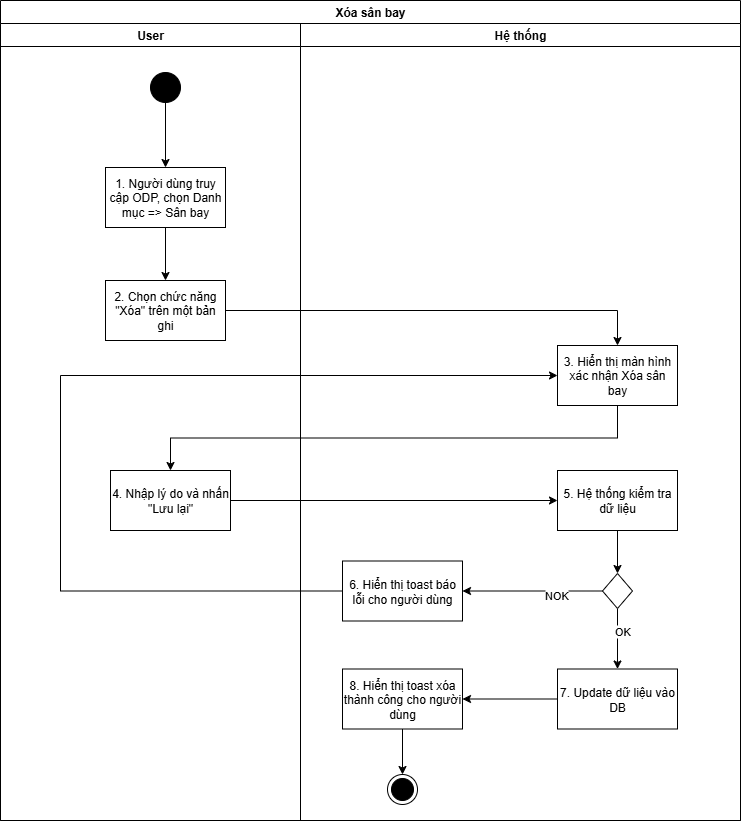
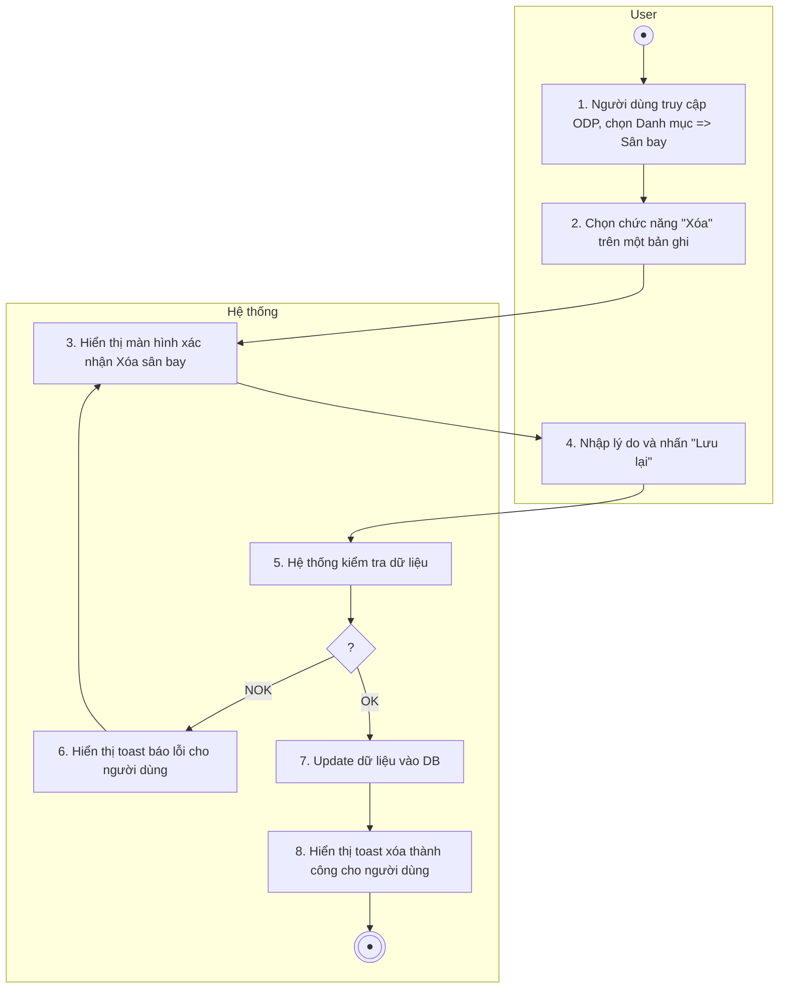
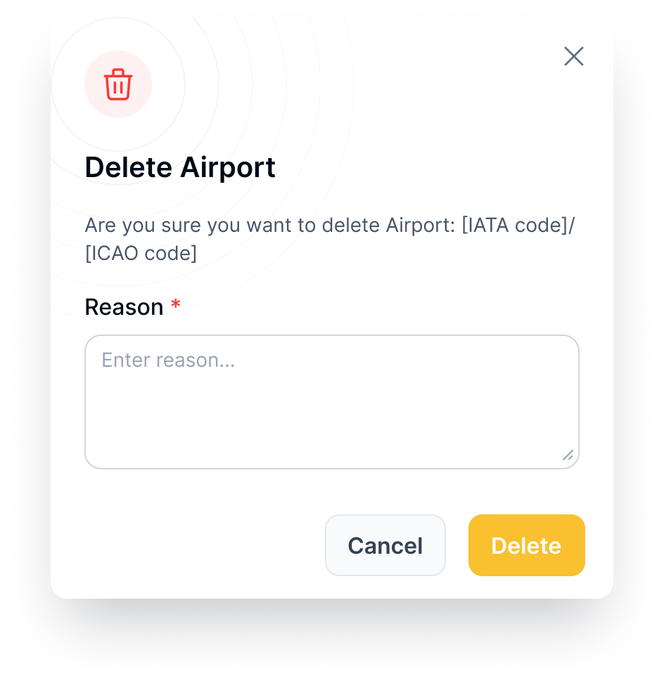

## Xóa sân bay

| **Tên chức năng: Xoá sân bay** | |
| --- | --- |
| **Mục đích** | Cho phép user xóa sân bay |
| **Trigger** | Người dùng truy cập vào web FIMS => nhấn phân hệ Danh mục => Nhấn chọn sân bay => Xem chi tiết => Chọn icon Xóa |
| **Tiền điều kiện** | Người dùng đăng nhập thành công và được phân quyền xóa sân bay |
| **Hậu điều kiện** | Xóa thành công sân bay |

### *Sơ đồ luồng hệ thống*

### *Mô tả luồng xử lý*

| **STT** | **Bước** | **Chi tiết** |
| --- | --- | --- |
|  | Bước 1 | User truy cập vào web FIMS => mở đến Danh mục => Sân bay => hiển thị màn hình [Danh sách Sân bay](TOSS.DM.AIRPORT_LIST.FD.v0.1.md) trên giao diện |
|  | Bước 2 | User click **Xóa** trên một bản ghi sân bay |
|  | Bước 3 | Mở màn hình xác nhận **Xóa sân bay** |
|  | Bước 4 | Người dùng nhập Lý do & nhấn button **Lưu lại** |
|  | Bước 5 | Hệ thống kiểm tra dữ liệu, nếu:   * Dữ liệu không hợp lệ: chuyển sang bước 6 * Ngược lại: chuyển sang bước 7&8 |
|  | Bước 6 | * TH chưa nhập lý do => hiện IM [VL007](https://docs.google.com/document/d/1L5y0t4FCWe_vnNI65xNMRC-LM3lvLwYsQRAm_Nokv9A/edit?tab=t.0#bookmark=kix.s6302mi8qdnp) * TH API trả về có messages lỗi khác [TB020](https://docs.google.com/document/d/1L5y0t4FCWe_vnNI65xNMRC-LM3lvLwYsQRAm_Nokv9A/edit?tab=t.0#bookmark=kix.zi1hm3rguphh) * Hoặc: [TB021](https://docs.google.com/document/d/1L5y0t4FCWe_vnNI65xNMRC-LM3lvLwYsQRAm_Nokv9A/edit?tab=t.0#bookmark=kix.3pbjinevz4c0) |
|  | Bước 7,8 | Trường hợp thành công: BE Lưu và cập nhật [danh sách sân bay](TOSS.DM.AIRPORT_LIST.FD.v0.1.md), trường **is_delete=true**  Trả API thành công cho FE  FE Hiển thị toast thành công cho người dùng [TB019](https://docs.google.com/document/d/1L5y0t4FCWe_vnNI65xNMRC-LM3lvLwYsQRAm_Nokv9A/edit?tab=t.0#bookmark=kix.spmzvpry3i7f)  Đóng popup xác nhận Xóa sân bay, tự động refresh màn danh sách và hiển thị [Danh sách sân bay](TOSS.DM.AIRPORT_LIST.FD.v0.1.md) mới nhất |

### *Màn hình chức năng*

### *Mô tả chi tiết màn hình*

| **STT** | **Tên** | **Kiểu dữ liệu [Độ dài dữ liệu]** | **Mapping DB/API** | **Mô tả** |
| --- | --- | --- | --- | --- |
|  | Title | Textview |  | * Text “Delete sân bay” * Text “Are you sure want to delete sân bay: [IATA code]/[ICAO code] |
|  | Reason | Text Area |  | * Mặc định để trống * Bắt buộc nhập * Placeholder = “Enter reason…” * Maxlength = 1000 ký tự, nếu paste chỉ nhận 1000 ký tự đầu tiên |
|  | Cancel | Button |  | * Click vào → Đóng popup. Điều hướng về màn danh sách |
|  | Delete | Button |  | * Click vào → Hệ thống kiểm tra trường [reason] không nhập thông tin hiển thị toast message [TB023](https://docs.google.com/document/d/1L5y0t4FCWe_vnNI65xNMRC-LM3lvLwYsQRAm_Nokv9A/edit?tab=t.0#bookmark=kix.d8xa5fwytpwe) * Hệ thống xóa thành công tài liệu khỏi danh sách. Hiển thị toast message [TB019](https://docs.google.com/document/d/1L5y0t4FCWe_vnNI65xNMRC-LM3lvLwYsQRAm_Nokv9A/edit?tab=t.0#bookmark=kix.spmzvpry3i7f) Xóa thành công → Đóng popup. Điều hướng về màn danh sách |

---

*Nguồn: tách trung thực từ `sec-18-xoa-san-bay.md` (bản trích text của `VNA.TOSS_SRS_Data Maintenance_v0.1.docx`, mục `Xóa sân bay`) — tương ứng dòng **#5** bảng §1 của [CATALOG.md](../CATALOG.md). Không chỉnh sửa nội dung nguồn (CLAUDE.md §0). 🖼 Hình ảnh màn hình: xem file `VNA.TOSS_SRS_Data Maintenance_v0.1.docx` gốc.*
