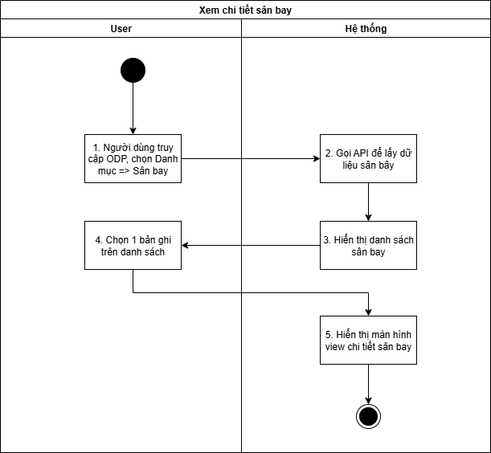
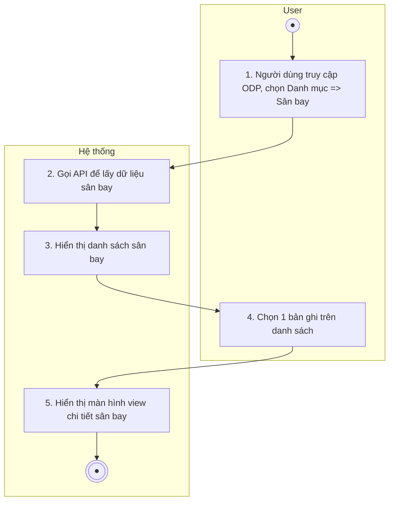
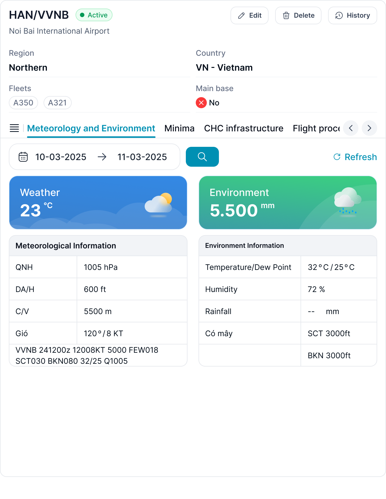

## Xem chi tiết sân bay

| **Tên chức năng: View detail sân bay** | |
| --- | --- |
| **Mục đích** | Cho phép user Xem chi tiết sân bay |
| **Trigger** | Người dùng truy cập vào web FIMS => mở đến module sân bay => click vào 1 bản ghi bất kỳ |
| **Tiền điều kiện** | Người dùng đăng nhập thành công và được phân quyền Danh mục sân bay |
| **Hậu điều kiện** | Mở màn hình Xem chi tiết sân bay trên giao diện người dùng |

### *Sơ đồ luồng hệ thống*

1. Sơ đồ luồng nghiệp vụ

### *Mô tả luồng xử lý*

| **STT** | **Bước** | **Chi tiết** |
| --- | --- | --- |
|  | Bước 1 | Truy cập web FIMS => mở đến Danh mục sân bay |
|  | Bước 2 | Hệ thống call API xuống BE lấy [danh sách sân bay](TOSS.DM.AIRPORT_LIST.FD.v0.1.md) |
|  | Bước 3 | Hiển thị [danh sách sân bay](TOSS.DM.AIRPORT_LIST.FD.v0.1.md) trên giao diện người dùng |
|  | Bước 4 | User click vào 1 bản ghi trên danh sách |
|  | Bước 5 | Hiển thị màn hình Xem chi tiết sân bay |

### *Màn hình chức năng*

1. Giao diện Thông tin chi tiết sân bay

### *Mô tả chi tiết màn hình danh sách*

| **STT** | **Tên** | **Kiểu dữ liệu [Độ dài dữ liệu]** | **Mapping DB/API** | **Mô tả** |
| --- | --- | --- | --- | --- |
| 1.  |  | Button |  | * Click button=> Hiển thị popup Edit sân bay |
|  |  | Button |  | * Click button=> Hiển thị popup History of sân bay |
|  |  | Button |  | * Click button=> Hiển thị popup Delete sân bay |
|  | IATA Code | Textview |  | * Hiển thị [IATA Code] theo dữ liệu API trả về * Trường hợp API trả về rỗng/lỗi: để trống trường |
|  | ICAO Code | Textview |  | * Hiển thị [ICAO Code] theo dữ liệu API trả về * Trường hợp API trả về rỗng/lỗi: để trống trường |
|  | Airport Name | Textview |  | * Hiển thị [Airport Name] theo dữ liệu API trả về * Trường hợp API trả về rỗng/lỗi: để trống trường |
|  | Region | Textview |  | * Hiển thị [Region] theo dữ liệu API trả về * Trường hợp API trả về rỗng/lỗi: để trống trường |
|  | Country name | Textview |  | * Hiển thị [Country name] theo dữ liệu API trả về * Trường hợp API trả về rỗng/lỗi: để trống trường |
|  | Fleets | Textview |  | * Hiển thị [Fleets] theo dữ liệu API trả về * Trường hợp API trả về rỗng/lỗi: để trống trường |
|  | Main Base | Textview |  | * Hiển thị [Base] theo dữ liệu API trả về * Trường hợp API trả về rỗng/lỗi: để trống trường |
|  | Note | Textview |  | * Hiển thị [Note] theo dữ liệu API trả về * Trường hợp API trả về rỗng/lỗi: để trống trường |
|  | Status | Textview |  | * Hiển thị thông tin [Trạng thái hoạt động] dưới dạng tag status theo dữ liệu API trả về   + Status=Active: Tag màu xanh lá   + Status=Is active: Tag màu xám |
|  | Tag chức năng | Toggle |  | * Màn hình hiển thị danh sách các phân hệ nghiệp vụ dưới dạng tab gồm: * Meteorology and Environment * Minima * CHC infrastructure * Flight procedures, …. * Cho phép người dùng chuyển đổi giữa các phân hệ để cấu hình quyền tương ứng * Khi chuyển tab, hệ thống hiển thị danh sách quyền của phân hệ được chọn |
|  | Time | Date |  | * Cho phép chọn khoảng ngày để xem dữ liệu * Hiển thị định dạng dd-mm-yyyy -> dd-mm-yyyy |
|  |  | Button | btn_search | * Click vào :   + Gửi yêu cầu tìm kiếm tới hệ thống.   + Gọi API lấy dữ liệu theo khoảng time * Hiển thị danh sách kết quả phù hợp trong bảng dữ liệu.   Khi người dùng **nhấn phím Enter trên bàn phím** khi lọc ngày :   * Hệ thống PHẢI thực hiện tìm kiếm tương đương với hành động click nút “Search”. * Kết quả tìm kiếm, logic xử lý và dữ liệu trả vềgiống hoàn toàn với nút Search |
|  |  | Button | btn_refresh | * Click : làm mới dữ liệu đang hiển thị |
|  |  | String |  | * Hiển thị thông tin thời tiết theo dữ liệu API trả về:   + Icon hiển thị theo điều kiện thời tiết ( nắng, mưa, nhiều mây,..)   + Hiển thị nhiệt độ theo đơn vị **°C** * Trường hợp API trả về rỗng/lỗi: để trống trường |
|  |  | String |  | * Hiển thị thông tin môi trường theo dữ liệu API trả về:   + Icon hiển thị theo điều kiện thời tiết ( nắng, mưa, nhiều mây,..)   + Hiển thị tổng lượng mưa theo thời gian xác định đơn vị **mm** * Trường hợp API trả về rỗng/lỗi: để trống trường |
|  |  |  |  |  |
|  |  |  |  |  |

---

*Nguồn: tách trung thực từ `sec-15-xem-chi-tiet-san-bay.md` (bản trích text của `VNA.TOSS_SRS_Data Maintenance_v0.1.docx`, mục `Xem chi tiết sân bay`) — tương ứng dòng **#2** bảng §1 của [CATALOG.md](../CATALOG.md). Không chỉnh sửa nội dung nguồn (CLAUDE.md §0). 🖼 Hình ảnh màn hình: xem file `VNA.TOSS_SRS_Data Maintenance_v0.1.docx` gốc.*
