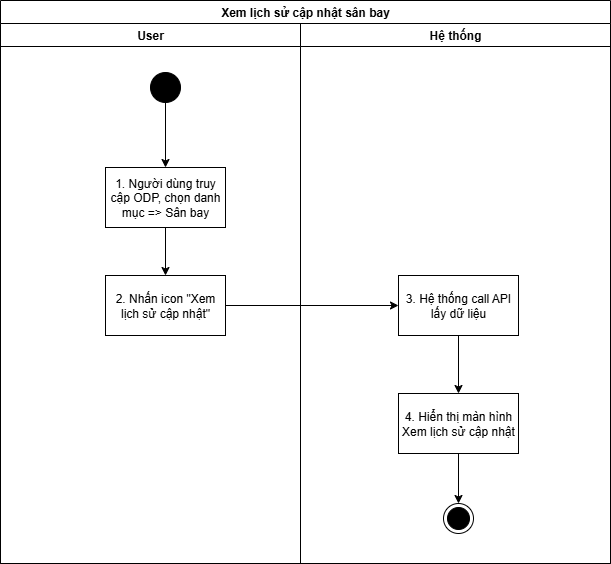
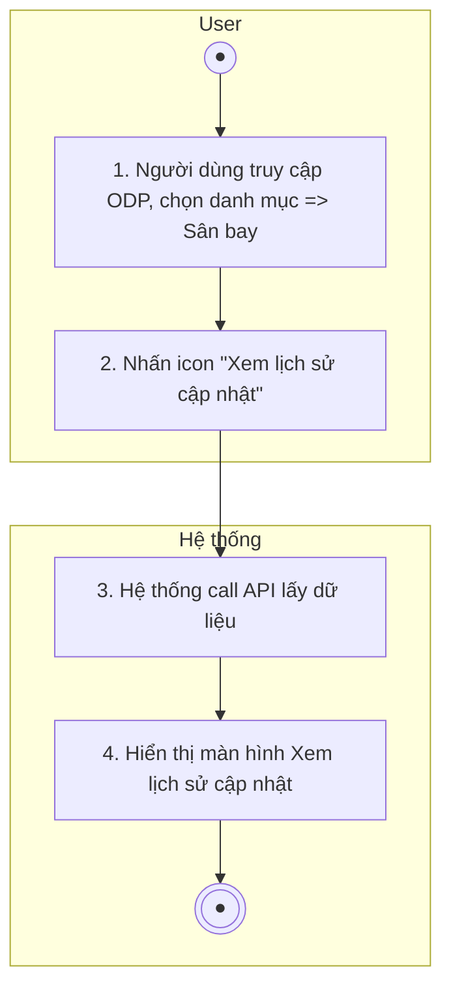
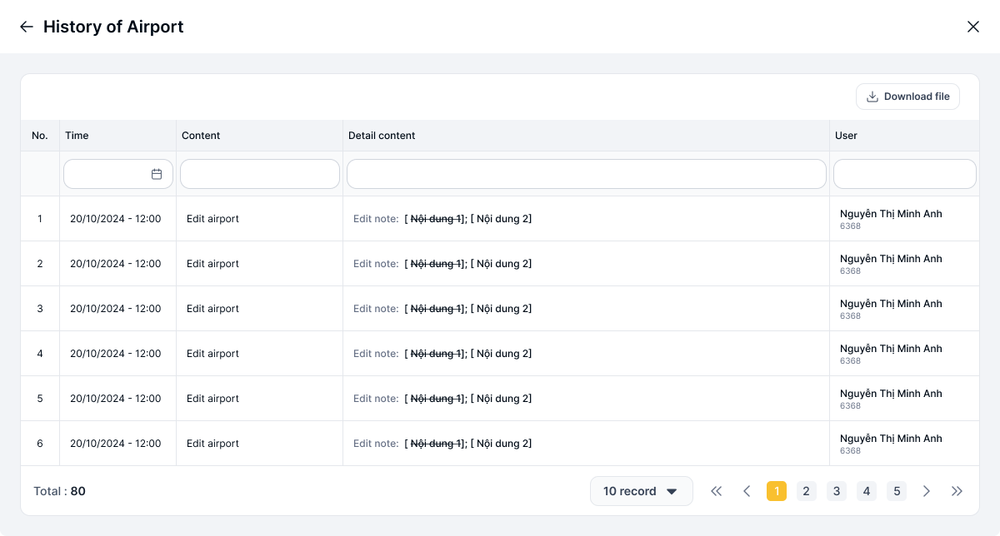

## Xem lịch sử sân bay

| **Tên chức năng: History of sân bay** | |
| --- | --- |
| **Mục đích** | Cho phép user Xem lịch sửsân bay |
| **Trigger** | Người dùng truy cập vào web FIMS => nhấn Danh mục sân bay => Nhấn chọn một bản ghi sân bay => nhấn vào History  Hoặc tại màn [Danh sách sân bay](TOSS.DM.AIRPORT_LIST.FD.v0.1.md) => Nhấn chọn icon “Edit” tại sân bay muốn chỉnh sửa => Click “ History”  Hoặc tại màn hình [Xem chi tiết sân bay](TOSS.DM.AIRPORT_DETAIL.FD.v0.1.md) => Click button “History” |
| **Tiền điều kiện** | Người dùng đăng nhập thành công và được phân quyền xem phân hệ sân bay |
| **Hậu điều kiện** | Màn hình History |

### *Sơ đồ luồng hệ thống*

1. Sơ đồ luồng hệ thống

### *Mô tả luồng xử lý*

| **Bước** | **Bước** | **Chi tiết** |
| --- | --- | --- |
|  | Bước 1 | Người dùng truy cập vào web FIMS => Danh mục sân bay => Hiển thị [danh sách sân bay](TOSS.DM.AIRPORT_LIST.FD.v0.1.md) |
|  | Bước 2 | Click icon Xem lịch sử tại danh sách hoặc button Xem lịch sử tại màn hình Xem chi tiết/ Sửa |
|  | Bước 3 | Hệ thống call API lấy dữ liệu lịch sử |
|  | Bước 4 | Mở màn hình History của sân bay |

### *Màn hình chức năng*

1. Giao diện Xem lịch sử sân bay

### *Mô tả chi tiết màn hình*

| **STT** | **Tên** | **Kiểu dữ liệu [Độ dài dữ liệu]** | **Mapping DB/API** | **Mô tả** |
| --- | --- | --- | --- | --- |
| **Thông tin chung** | | | | |
| 1 | Download file | Button |  | * Click vào => hệ thống thực hiện tạo file .xlsx để tải lịch sử sân bay * Tên file tải về: FIMS_History_sân bay_ddmmyyhhmm * Nội dung file tải về: tải theo cột dữ liệu view từ bảng sân bay * File: |
| **Lịch sử sân bay** | | | | |
| * **Tìm kiếm**   + Click vào dòng dưới tiêu đề các cột để chọn lọc, tìm kiếm thông tin theo dữ liệu tại cột tương ứng.   + Trường hợp Searchbox không có dữ liệu: Mặc định tìm kiếm all dữ liệu tại cột đó   + Người dùng thao tác thay đổi giá trị trường dữ liệu => debounce 0.5s/click Enter/out focus box => hệ thống thực hiện:     - Reload dữ liệu table phù hợp với bộ lọc     - Set current page=1   + Hiển thị kết quả tìm kiếm:     - Trường hợp API trả về data có KQ: hiển thị danh sách dữ liệu theo kết quả API trả về     - Trường hợp API trả về data rỗng hoặc lỗi: hiển thị “Không có kết quả nào liên quan” | | | | |
| 2 | Thời gian cập nhật | Datepicker | updated_at/updateAt | * Trường để lọc: Tìm kiếm chính xác theo [updateAt] (không tìm theo giờ) * Định dạng ngày dd/mm/yyyy |
| 3 | Nghiệp vụ ghi nhận | Dropdown list | operation_type/operationType | * Trường để lọc: Tìm kiếm chính xác theo [operationType] * Các giá trị tìm kiếm bao gồm: Edit * Nếu dữ liệu nhập vượt quá độ dài ô => thay thế phần vượt quá bằng ký tự “...” và có tooltip hiển thị toàn bộ nội dung nhập |
| 4 | Chi tiết cập nhật | Textbox | update_detail/updateDetail | * Trường để lọc: Tìm kiếm gần đúng theo [updateDetail] * Maxlength 255 ký tự * Validate cho phép nhập chữ, số, và ký tự đặc biệt * Nếu dữ liệu nhập vượt quá độ dài ô => thay thế phần vượt quá bằng ký tự “...” và có tooltip hiển thị toàn bộ nội dung nhập * Nếu paste đoạn văn thì ghi nhận 255 ký tự đầu * Tự động TRIM Spaces đầu cuối khi tìm kiếm |
| 5 | Người cập nhật trạng thái | Combobox | updated_by/updateBy | * Trường để lọc: Tìm kiếm gần đúng theo [updateBy] * Maxlength 255 ký tự * Validate cho phép nhập chữ, số, và ký tự đặc biệt * Nếu dữ liệu nhập vượt quá độ dài ô => thay thế phần vượt quá bằng ký tự “...” và có tooltip hiển thị toàn bộ nội dung nhập * Nếu paste đoạn văn thì ghi nhận 255 ký tự đầu * Tự động TRIM Spaces đầu cuối khi tìm kiếm |
| * **Bảng log** * Dữ liệu sắp xếp theo thứ tự các lịch sử có thời gian cập nhật mới nhất được hiển thị lên đầu danh sách | | | | |
| 6 | No. | Textview |  | * Hiển thị số thứ tự, bắt đầu từ 1, tăng 1 đơn vị từ dòng tiếp theo * Danh sách hiển thị tối đa 6 dòng dữ liệu |
| 7 | Thời gian cập nhật | Textview | updated_at/updateAt | * Hiển thị thời gian cập nhật dữ liệu * Định dạng dd/mm/yyyy hh:mm |
| 8 | Nghiệp vụ ghi nhận | Textview | operation_type/operationType | * Hiển thị nghiệp vụ ghi nhận thay đổi dữ liệu trên bảng [Danh sách sân bay](TOSS.DM.AIRPORT_LIST.FD.v0.1.md), bao gồm: Add sân bay /Edit sân bay |
| 9 | Chi tiết cập nhật | Textview | update_detail/updateDetail | * Hiển thị chi tiết [cập nhật sân bay](TOSS.DM.AIRPORT_UPDATE.FD.v0.1.md) * Hiện tối đa 2 dòng dữ liệu, nếu nội dung vượt quá 2 dòng, hiện dấu ba chấm […] tại cuối dòng thứ 2. Di chuột vào hiện tooltips full nội dung * Cách ghi nhận log:   + Edit sân bay: [Tên trường]: [~~Nội dung bị xóa/thay đổi~~] > [Nội dung sau cập nhật] |
| 10 | Người cập nhật trạng thái | Textview | updated_by/updateBy | * Hiển thị thông tin người cập nhật dữ liệu * Nội dung bao gồm [Tên người cập nhật] / [Mã người cập nhật] |
| 11 | Phân trang |  |  | * [Theo kịch bản phân trang](https://docs.google.com/document/d/1L5y0t4FCWe_vnNI65xNMRC-LM3lvLwYsQRAm_Nokv9A/edit?tab=t.0#heading=h.abyqd0hrl467) |

# QUẢN LÝ CHẶNG BAY

---

*Nguồn: tách trung thực từ `sec-19-xem-lich-su-san-bay.md` (bản trích text của `VNA.TOSS_SRS_Data Maintenance_v0.1.docx`, mục `Xem lịch sử sân bay`) — tương ứng dòng **#6** bảng §1 của [CATALOG.md](../CATALOG.md). Không chỉnh sửa nội dung nguồn (CLAUDE.md §0). 🖼 Hình ảnh màn hình: xem file `VNA.TOSS_SRS_Data Maintenance_v0.1.docx` gốc.*
