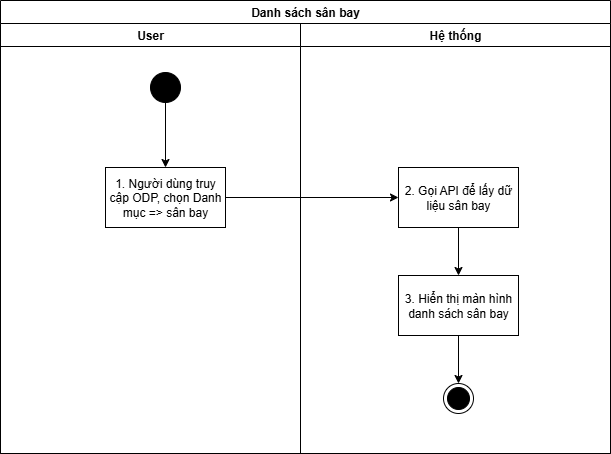
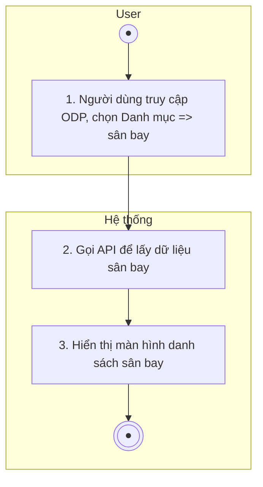
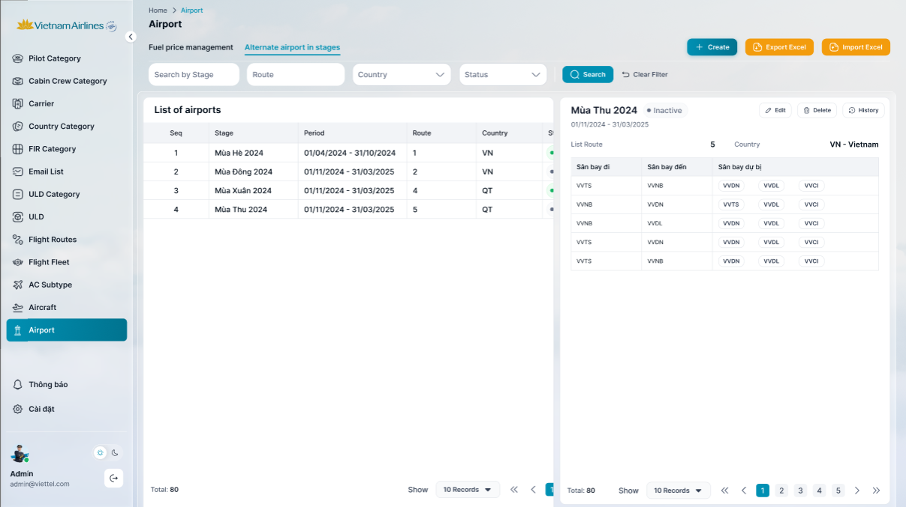
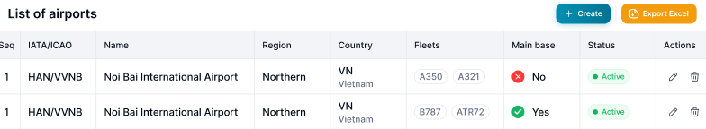

## Danh sách sân bay

| **Tên chức năng: Danh sách sân bay** | |
| --- | --- |
| **Mục đích** | Cho phép user Xem danh sách sân bay |
| **Trigger** | Người dùng truy cập vào web FIMS => mở đến module Danh mục /sân bay |
| **Tiền điều kiện** | Người dùng đăng nhập thành công và được phân quyền Danh mục sân bay |
| **Hậu điều kiện** | Mở màn hình danh sách sân bay trên giao diện người dùng |

### *Sơ đồ luồng hệ thống*

1. Sơ đồ luồng nghiệp vụ

### *Mô tả luồng xử lý*

| **STT** | **Bước** | **Chi tiết** |
| --- | --- | --- |
|  | Bước 1 | Truy cập web FIMS => mở đến module Danh mục/ sân bay |
|  | Bước 2 | Hệ thống call API xuống BE lấy danh sách sân bay |
|  | Bước 3 | Hiển thị danh sách sân bay trên giao diện người dùng |

### *Màn hình chức năng*

1. Giao diện Danh sách sân bay

### *Mô tả chi tiết màn hình danh sách*

| **STT** | **Tên** | **Kiểu dữ liệu [Độ dài dữ liệu]** | **Mapping DB/API** | **Mô tả** |
| --- | --- | --- | --- | --- |
|  | Title hệ thống |  |  | * + [Tham chiếu Kịch bản title hệ thống](https://docs.google.com/document/d/1L5y0t4FCWe_vnNI65xNMRC-LM3lvLwYsQRAm_Nokv9A/edit?tab=t.0#bookmark=kix.f2nh07gdowb8) |
| Danh sách sân bay    FE call API lấy lại DS sân bay mới nhất hiện tại để hiển thị trên giao diện người dùng  Các dữ liệu sân bay được đồng bộ từ hệ thống FIMS, bao gồm các thông tin sau:   * IATA/ICAO * Name * Region * Country * Fleets | | | | |
|  | List of airports | Title |  | * Fix cứng text “List of airports” |
|  |  | Button |  | * Click vào => hệ thống thực hiện tạo file .xlsx để tải danh sách Airport về máy * Tên file tải về: FIMS_sân bay_ddmmyyhhmm * File: [FIMS_PILOT_090226_0854.xlsx](https://docs.google.com/spreadsheets/d/1jvVJpj-4XHxs-WZjo5hkfi-CmYEZQGMVce8_6Uf2yNc/edit?usp=sharing) * Nội dung file tải về: tải theo cột dữ liệu view từ bảng Airport |
|  |  | Button |  | * Click button → Mở popup “Create new” |
|  | **Tìm kiếm**   * Cơ chế Thu gọn/Mở rộng bộ lọc (Collapsible Fillter):   + [Tham chiếu kịch bản chức năng ẩn hiện filter](https://docs.google.com/document/d/1L5y0t4FCWe_vnNI65xNMRC-LM3lvLwYsQRAm_Nokv9A/edit?tab=t.0#heading=h.dgq51psil6dr) * Click vào dòng dưới tiêu đề các cột để chọn lọc, tìm kiếm thông tin theo dữ liệu tại cột tương ứng. * Trường hợp Searchbox không có dữ liệu: Mặc định tìm kiếm all dữ liệu tại cột đó * Người dùng thao tác thay đổi giá trị trường dữ liệu =>click Search/ click Enter/out focus box => hệ thống thực hiện:   + Reload dữ liệu table phù hợp với bộ lọc   + Set current page=1 * Hiển thị kết quả tìm kiếm:   + Trường hợp API trả về data có KQ: hiển thị danh sách dữ liệu theo kết quả API trả về   + Trường hợp API trả về data rỗng hoặc lỗi: Hiển thị bảng danh sách với **chân trang = Tất cả danh sách : 0** | | | |
|  | Search by IATA | Textbox |  | * Trường để lọc: Tìm kiếm gần đúng theo [IATA Code] * Maxlength 100 ký tự * Validate cho phép nhập chữ, số, và ký tự đặc biệt * Nếu dữ liệu nhập vượt quá độ dài ô => thay thế phần vượt quá bằng ký tự “...” và có tooltip hiển thị toàn bộ nội dung nhập * Nếu paste đoạn văn thì ghi nhận 20 ký tự đầu * Tự động TRIM Spaces đầu cuối khi tìm kiếm |
|  | Search by ICAO | Textbox |  | * Trường để lọc: Tìm kiếm gần đúng theo [ICAO Code] * Maxlength 100 ký tự * Validate cho phép nhập chữ, số, và ký tự đặc biệt * Nếu dữ liệu nhập vượt quá độ dài ô => thay thế phần vượt quá bằng ký tự “...” và có tooltip hiển thị toàn bộ nội dung nhập * Nếu paste đoạn văn thì ghi nhận 100 ký tự đầu * Tự động TRIM Spaces đầu cuối khi tìm kiếm |
|  | Airport Name | TextBox |  | * Trường để lọc: Tìm kiếm gần đúng theo [Airport Name] * Maxlength 100 ký tự * Validate cho phép nhập chữ, số, và ký tự đặc biệt * Nếu dữ liệu nhập vượt quá độ dài ô => thay thế phần vượt quá bằng ký tự “...” và có tooltip hiển thị toàn bộ nội dung nhập * Nếu paste đoạn văn thì ghi nhận 100 ký tự đầu * Tự động TRIM Spaces đầu cuối khi tìm kiếm |
|  | Region | Textbox |  | * Trường để lọc: Tìm kiếm gần đúng theo [Region] * Maxlength 100 ký tự * Validate cho phép nhập chữ, số, và ký tự đặc biệt * Nếu dữ liệu nhập vượt quá độ dài ô => thay thế phần vượt quá bằng ký tự “...” và có tooltip hiển thị toàn bộ nội dung nhập * Nếu paste đoạn văn thì ghi nhận 100 ký tự đầu * Tự động TRIM Spaces đầu cuối khi tìm kiếm |
|  | Country name | Textbox |  | * Trường để lọc: Tìm kiếm gần đúng theo [Country name] * Maxlength 100 ký tự * Validate cho phép nhập chữ, số, và ký tự đặc biệt * Nếu dữ liệu nhập vượt quá độ dài ô => thay thế phần vượt quá bằng ký tự “...” và có tooltip hiển thị toàn bộ nội dung nhập * Nếu paste đoạn văn thì ghi nhận 100 ký tự đầu * Tự động TRIM Spaces đầu cuối khi tìm kiếm |
|  | Fleets | Multiple select search |  | * Trường để lọc: Tìm kiếm chính xác theo [Fleets] * Cho phép lựa chọn danh mục [Fleet] theo API trả về để lọc |
|  | Main Base | DDL |  | * Trường để lọc: Tìm kiếm chính xác theo [Main base] * Giá trị chọn lọc:   + Yes   + No |
|  | Status | DDL |  | * Trường để lọc: Tìm kiếm chính xác theo [Status] * Giá trị chọn lọc:   + Active   + Inactive |
|  | Chi tiết danh sách   * Hệ thống call API xuống BE, lấy danh sách sân bay   → hiển thị danh sách sân bay trên màn hình   * Danh sách Sân bay sắp xếp theo thứ tự α-β của trường Mã IATA Code * Khi user click vào 1 bản ghi bất kỳ → hiển thị màn hình [Xem chi tiết sân bay](TOSS.DM.AIRPORT_DETAIL.FD.v0.1.md) | | | |
|  | No | Textview |  | * Hiển thị STT tăng dần theo số lượng bản ghi |
|  | IATA/ICAO | Textview |  | * Hiển thị [IATA/ICAO] theo dữ liệu API trả về * Hiển thị tối đa 2 dòng dữ liệu * Nếu độ dài dữ liệu vượt quá 2 dòng, hiển thị ba chấm […] ở cuối dòng thứ 2 và có tooltip hiển thị toàn bộ nội dung * Trường hợp API trả về rỗng/lỗi: để trống trường |
|  | Name | Textview |  | * Hiển thị [Airport Name] theo dữ liệu API trả về * Hiển thị tối đa 2 dòng dữ liệu * Nếu độ dài dữ liệu vượt quá 2 dòng, hiển thị ba chấm […] ở cuối dòng thứ 2 và có tooltip hiển thị toàn bộ nội dung * Trường hợp API trả về rỗng/lỗi: để trống trường |
|  | Region | Textview |  | * Hiển thị [Region] theo dữ liệu API trả về * ~~Định dạng dd/mm/yyyy~~ * Hiển thị tối đa 2 dòng dữ liệu * Nếu độ dài dữ liệu vượt quá 2 dòng, hiển thị ba chấm […] ở cuối dòng thứ 2 và có tooltip hiển thị toàn bộ nội dung * Trường hợp API trả về rỗng/lỗi: để trống trường |
|  | Country | Textview |  | * Hiển thị [Country ] theo dữ liệu API trả về * Hiển thị tối đa 2 dòng dữ liệu * Nếu độ dài dữ liệu vượt quá 2 dòng, hiển thị ba chấm […] ở cuối dòng thứ 2 và có tooltip hiển thị toàn bộ nội dung * Trường hợp API trả về rỗng/lỗi: để trống trường |
|  | Fleets | Textview |  | * Hiển thị [Fleets] theo dữ liệu API trả về * Hiển thị tối đa 2 dòng dữ liệu * Nếu độ dài dữ liệu vượt quá 2 dòng, hiển thị ba chấm […] ở cuối dòng thứ 2 và có tooltip hiển thị toàn bộ nội dung * Trường hợp API trả về rỗng/lỗi: để trống trường |
|  | Main Base | Textview |  | * Hiển thị [Base] theo dữ liệu API trả về * Hiển thị tối đa 2 dòng dữ liệu * Nếu độ dài dữ liệu vượt quá 2 dòng, hiển thị ba chấm […] ở cuối dòng thứ 2 và có tooltip hiển thị toàn bộ nội dung * Trường hợp API trả về rỗng/lỗi: để trống trường |
|  | Status | Tagview |  | * Hiển thị TagStatus theo dữ liệu API trả về   + Status=Active: Tag màu xanh lá   + Status=Inactive: Tag màu xám * Trường hợp API trả về rỗng/lỗi: để trống trường |
|  | Actions | Icon function |  | * Hiển thị các function theo trạng thái (chi tiết được mô tả tại Bảng function theo trạng thái hoạt động của vai trò bên dưới) * Click  mở màn hình [Sửa vai trò](https://docs.google.com/document/d/11hp5UbcDLXGUWg--FudOX8CiILbqZwy6/edit#heading=h.1fs81ms). Đối với các vai trò có Trạng thái = “Đã xóa” không hiển thị icon * Click  mở màn hình [Xóa vai trò](https://docs.google.com/document/d/11hp5UbcDLXGUWg--FudOX8CiILbqZwy6/edit#heading=h.2ex5uie). Đối với admin mặc định hệ thống không hiển thị icon |
|  | Chân trang | Pagination |  | [Theo kịch bản phân trang](https://docs.google.com/document/d/1L5y0t4FCWe_vnNI65xNMRC-LM3lvLwYsQRAm_Nokv9A/edit?tab=t.0#heading=h.abyqd0hrl467) |

---

*Nguồn: tách trung thực từ `sec-14-danh-sach-san-bay.md` (bản trích text của `VNA.TOSS_SRS_Data Maintenance_v0.1.docx`, mục `Danh sách sân bay`) — tương ứng dòng **#1** bảng §1 của [CATALOG.md](../CATALOG.md). Không chỉnh sửa nội dung nguồn (CLAUDE.md §0). 🖼 Hình ảnh màn hình: xem file `VNA.TOSS_SRS_Data Maintenance_v0.1.docx` gốc.*
