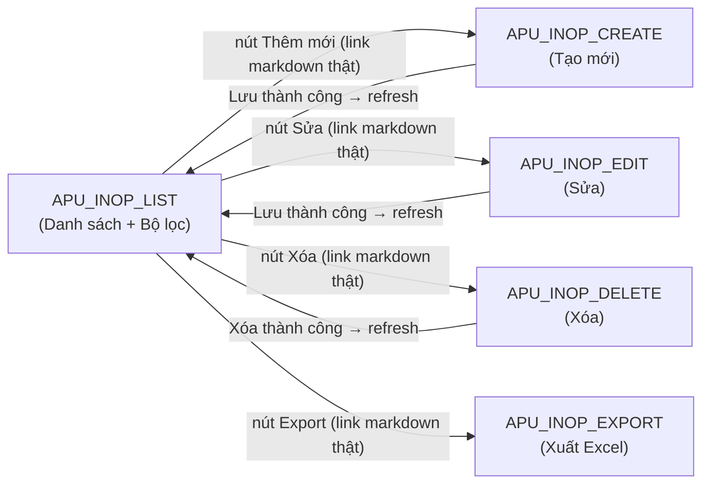

# Tổng quan nhóm — Quản lý tàu bay APU INOP

> **Phạm vi file:** file này **không phải 1 chức năng mới** — chỉ tổng hợp lại cấu trúc chung + quan hệ giữa các Function Document đã có sẵn trong nhóm `TOSS.DM.APU` (5 file) và trích dẫn nguyên trạng các phụ thuộc đã ghi trong nội dung từng file. Không suy diễn quan hệ mới ngoài bằng chứng có sẵn (CLAUDE.md §0).
>
> **Lưu ý nguồn gốc:** nhóm này **chưa từng được đăng ký trong CATALOG.md/INDEX.md** trước 2026-07-15 — đã bổ sung đầy đủ (dòng #70–74, §2.12, §3 dòng #16, §4.6) cùng đợt tạo file này. Cả 5 file đều dẫn nguồn **BR-420** (Business Requirement), khác với 14 danh mục còn lại của module Data Maintenance vốn trích từ `sec-NN` của `VNA.TOSS_SRS_Data Maintenance_v0.1.docx` — khả năng nội dung này được soạn trực tiếp từ BRD, chưa qua vòng SRS chính thức như phần còn lại của module. [Cần làm rõ với BA Lead/VNA/VTIT].
>
> **[Cập nhật 2026-07-15 (tiếp) — chỉ đạo trực tiếp BA Lead, KHÔNG trích từ BR-420 gốc]** Bổ sung state machine 4 trạng thái xử lý (Hỏng — chưa sửa chữa → Đang sửa chữa → Đã khôi phục — chờ xác nhận → Đã xác nhận khôi phục, thay cho tính Active/Closed trực tiếp từ `to_date`) + 2 mã định danh tự sinh (Mã khai báo toàn cục, Lần khai báo theo tàu bay) trên các file liên quan — xem CATALOG.md §4.7 và §8 dưới đây.
>
> **[Cập nhật 2026-07-15 (tiếp) — chỉnh sửa bất thường cấu trúc]** File `FILTER` đã **xóa** — nội dung gộp vào §Bộ lọc của LIST, khớp quy ước 13 nhóm khác của module. File `EDIT` gộp Sửa+Xóa ban đầu đã **tách** thành 2 file riêng: `EDIT` (chỉ Sửa) + `DELETE` (chỉ Xóa), khớp quy ước tách file Sửa/Xóa của module. Toàn bộ nội dung §1–§9 dưới đây đã cập nhật theo cấu trúc mới.

## 1. Danh sách Function Document trong nhóm

| # | Function Document | Chức năng | Loại | Trigger | Số trường | Số bước |
|---|---|---|---|---|---|---|
| 1 | [TOSS.DM.APU_INOP_LIST.FD.v0.1.md](TOSS.DM.APU_INOP_LIST.FD.v0.1.md) | Danh sách khai báo APU INOP | Danh sách | Truy cập Danh mục Tàu bay → APU INOP | 8 | 4 |
| 2 | [TOSS.DM.APU_INOP_CREATE.FD.v0.1.md](TOSS.DM.APU_INOP_CREATE.FD.v0.1.md) | Tạo khai báo APU INOP | Tạo mới | Nút "Thêm mới" trên màn Danh sách | 6 | 6 |
| 3 | [TOSS.DM.APU_INOP_EDIT.FD.v0.1.md](TOSS.DM.APU_INOP_EDIT.FD.v0.1.md) | Sửa khai báo APU INOP | Sửa | Nút Sửa trên dòng bản ghi | 3 | 6 |
| 4 | [TOSS.DM.APU_INOP_DELETE.FD.v0.1.md](TOSS.DM.APU_INOP_DELETE.FD.v0.1.md) | Xóa khai báo APU INOP | Xóa | Nút Xóa trên dòng bản ghi | 0 (chỉ xác nhận) | 5 |
| 5 | [TOSS.DM.APU_INOP_EXPORT.FD.v0.1.md](TOSS.DM.APU_INOP_EXPORT.FD.v0.1.md) | Xuất Excel danh sách APU INOP | Action (export) | Nút Export trên màn Danh sách | 7 | 5 |

*(Nguồn: [CATALOG.md](../CATALOG.md) dòng #70–74 — nhóm "Quản lý tàu bay — APU INOP (BR-420)", tổng 5 chức năng.)*

## 2. Prototype (Figma)

> *(Chưa có — để trống chờ gắn link Figma prototype cho nhóm APU INOP. Cập nhật khi mockup team bàn giao.)*

| Màn hình | Function Document | Link Figma |
|---|---|---|
| Danh sách khai báo APU INOP | [TOSS.DM.APU_INOP_LIST.FD.v0.1.md](TOSS.DM.APU_INOP_LIST.FD.v0.1.md) | *(chưa có)* |
| Tạo khai báo APU INOP | [TOSS.DM.APU_INOP_CREATE.FD.v0.1.md](TOSS.DM.APU_INOP_CREATE.FD.v0.1.md) | *(chưa có)* |
| Sửa khai báo APU INOP | [TOSS.DM.APU_INOP_EDIT.FD.v0.1.md](TOSS.DM.APU_INOP_EDIT.FD.v0.1.md) | *(chưa có)* |
| Xóa khai báo APU INOP | [TOSS.DM.APU_INOP_DELETE.FD.v0.1.md](TOSS.DM.APU_INOP_DELETE.FD.v0.1.md) | *(chưa có)* |
| Xuất Excel danh sách APU INOP | [TOSS.DM.APU_INOP_EXPORT.FD.v0.1.md](TOSS.DM.APU_INOP_EXPORT.FD.v0.1.md) | *(chưa có)* |

*(Mỗi file feature trong nhóm cũng có mục "Giao diện mẫu" riêng để trống cùng lý do — xem footer từng file.)*

## 3. Sơ đồ quan hệ trong nhóm

Mô hình quan hệ: **LIST là màn hình trung tâm** giống nhóm AC Subtype, bao gồm cả bộ lọc (Bộ lọc trước đây tách riêng ở file `FILTER` — đã xóa, gộp vào LIST 2026-07-15). Sau khi tách EDIT/DELETE và bổ sung link markdown thật (2026-07-15), cả 4 quan hệ LIST→CREATE/EDIT/DELETE/EXPORT đều có link xác nhận — khớp quy ước nhóm AC Subtype — xem chi tiết §4.

## 4. Chi tiết liên kết trong nhóm

| Từ | Tới | Ngữ cảnh | Nguồn |
|---|---|---|---|
| LIST | CREATE | STT 2 bảng "Mô tả chi tiết màn hình": nút "Thêm mới" → mở popup, có link markdown thật | LIST §Mô tả chi tiết màn hình STT 2 |
| CREATE | LIST | Sau khi Lưu hợp lệ (Bước 6): lưu bản ghi, refresh danh sách, đóng popup | CREATE §Mô tả luồng xử lý Bước 6 |
| LIST | EXPORT | STT 3 bảng "Mô tả chi tiết màn hình": Button Export, có link markdown thật (bổ sung 2026-07-15, khớp Trigger đã mô tả ở EXPORT.FD) | LIST §Mô tả chi tiết màn hình STT 3 |
| LIST | EDIT | STT 8 bảng "Mô tả chi tiết màn hình": Button Sửa, có link markdown thật (bổ sung 2026-07-15) | LIST §Mô tả chi tiết màn hình STT 8 |
| EDIT | LIST | Sau khi Sửa thành công (Bước 6): cập nhật bản ghi, refresh danh sách | EDIT §Mô tả luồng xử lý Bước 6 |
| LIST | DELETE | STT 8 bảng "Mô tả chi tiết màn hình": Button Xóa, có link markdown thật (bổ sung 2026-07-15) | LIST §Mô tả chi tiết màn hình STT 8 |
| DELETE | LIST | Sau khi Xóa thành công (Bước 5): xóa bản ghi, refresh danh sách | DELETE §Mô tả luồng xử lý Bước 5 |

## 5. Bất thường nội bộ nhóm — đã xử lý (khác nhóm AC Subtype — không có ở đó)

| # | Bất thường | Mô tả | Trạng thái |
|---|---|---|---|
| 1 | Export button thiếu trong bảng trường LIST | `APU_INOP_EXPORT.FD` mô tả Trigger là nút Export "trên màn hình Danh sách APU INOP", nhưng bảng "Mô tả chi tiết màn hình" của LIST trước đó không liệt kê nút này | **Đã xử lý 2026-07-15** — LIST bổ sung dòng Button Export (STT 3, link markdown thật tới EXPORT.FD) |
| 2 | Quy tắc chuyển Trạng thái xử lý khi Sửa (tuần tự hay tự do) | Chưa xác nhận bắt buộc chuyển đúng thứ tự tuần tự hay được chọn tự do bất kỳ giá trị nào trong 4 trạng thái | **BA Lead xác nhận 2026-07-15 — Tự do**, không ràng buộc thứ tự. Đã cập nhật `TOSS.DM.APU_INOP_EDIT.FD.v0.1.md` §Form sửa |

*(Điểm còn để ngỏ, chưa xử lý trong đợt này: nguồn BR-420 của cả nhóm chưa được xác nhận là đã qua vòng SRS chính thức của VNA/VTIT hay còn là bản nháp nội bộ — xem CATALOG.md §4.6 điểm 1.)*

*(2 bất thường trước đó — "EDIT gộp Sửa+Xóa" và "FILTER trùng lặp với Bộ lọc LIST" — đã được xử lý 2026-07-15: EDIT tách thành EDIT/DELETE riêng; FILTER đã xóa, nội dung gộp vào LIST. Xem ghi chú đầu file.)*

## 6. Quan hệ với nhóm khác trong module Data Maintenance

Không phải liên kết markdown trực tiếp, mà là **phụ thuộc dữ liệu có trích dẫn bằng văn bản** trong chính nội dung nguồn:

| Chiều | Nhóm liên quan | Mô tả | Nguồn |
|---|---|---|---|
| APU INOP phụ thuộc → AIRCRAFT | `TOSS.DM.AIRCRAFT` | Trường "Mã tàu bay" trong CREATE là Dropdown/Search lấy từ "danh mục tàu bay đang khai thác" | CREATE §Form tạo khai báo, trường "Mã tàu bay" |

## 7. Quan hệ chéo MODULE (ngoài Data Maintenance)

Phát hiện đáng chú ý — **khác nhóm AC Subtype (không có quan hệ chéo module nào)**, nhóm APU INOP có 1 tham chiếu văn bản rõ ràng tới module **Flight Dispatch (FD)**:

> LIST §Nghiệp vụ chính, mục 3: *"Cảnh báo khai thác: Khi tàu bay có khai báo Active được xếp vào chuyến bay đến sân bay không có GPU/GPS/ASU, hệ thống phát cảnh báo APU INOP (**phạm vi Flight Dispatch**, không xử lý trong màn này)."*

Đây là tham chiếu **văn xuôi, không kèm link** — theo đúng phương pháp đã thống nhất, **không được tính vào** [ma trận liên kết chéo module chính thức](../../../../quan-ly-yeu-cau/MA-TRAN-LIEN-KET-CHEO-MODULE.md) (ma trận đó chỉ đếm link/trích dẫn URL tường minh). Ghi nhận riêng tại đây vì có giá trị nghiệp vụ rõ ràng: dữ liệu khai báo APU INOP do module DM quản lý được **module FD tiêu thụ** để tính cảnh báo trên màn giám sát chuyến bay — nhưng chưa có bằng chứng file/link cụ thể phía FD trỏ ngược lại nhóm này (đã kiểm tra: 2 file FD MONITORING mới phân rã 2026-07-14 không nhắc "APU").

## 8. Mô tả dữ liệu tương tác trong nhóm

Thực thể chính là **Khai báo APU INOP** (khai báo tàu bay hỏng APU trong 1 khoảng thời gian) — cả 5 file LIST/CREATE/EDIT/DELETE/EXPORT cùng thao tác trên 1 bản ghi; tham số lọc (§8.2) là transient, thuộc về LIST (bộ lọc tích hợp, không còn file FILTER riêng).

> **[Cập nhật 2026-07-15 — chỉ đạo trực tiếp BA Lead]** State machine 4 trạng thái + 2 mã định danh tự sinh dưới đây **không phải trích từ BR-420 gốc** — là nội dung nghiệp vụ BA Lead cung cấp trực tiếp qua trao đổi, xem CATALOG.md §4.7 để biết đầy đủ bối cảnh + phần còn để ngỏ.

### 8.1 Trường lưu trữ (thuộc tính thực thể)

| Trường | Mapping | Kiểu dữ liệu | Bắt buộc? | Ghi/Đọc bởi | Ghi chú |
|---|---|---|---|---|---|
| Mã khai báo | `declaration_code` | Textview, chỉ đọc | Tự sinh, không nhập tay | CREATE (sinh khi Lưu), LIST/EXPORT (đọc) | **[Mới 2026-07-15]** Định dạng `APU-YYYY-NNNN`, tăng dần toàn hệ thống — không phân biệt tàu bay |
| Mã tàu bay | `aircraft_code` | Textview (LIST) · Dropdown/Search (CREATE) | Bắt buộc | LIST (đọc), CREATE (ghi) | **Khóa sau khi tạo** — không cho sửa ở EDIT; phụ thuộc ngoài nhóm vào `TOSS.DM.AIRCRAFT` (xem §6) |
| Lần khai báo | `declaration_seq` | Textview, chỉ đọc | Tự sinh, không nhập tay | CREATE (sinh khi Lưu), LIST/EXPORT (đọc) | **[Mới 2026-07-15]** Đếm riêng theo Mã tàu bay — lần 1, 2, 3... cho mỗi tàu bay khác nhau, không dùng chung bộ đếm với Mã khai báo |
| Từ ngày | `from_date` | Textview (LIST) · Datepicker (CREATE) | Bắt buộc; mặc định = ngày hiện tại khi tạo | LIST (đọc), CREATE (ghi) | **Khóa sau khi tạo** — không cho sửa ở EDIT |
| Đến ngày | `to_date` | Textview (LIST) · Datepicker (CREATE/EDIT) | Không bắt buộc — trống = "Chưa xác định" | LIST (đọc), CREATE (ghi), EDIT (sửa được) | Độc lập với Trạng thái xử lý — validate: nếu nhập phải ≥ Từ ngày |
| Trạng thái xử lý | `processing_status` | Tag (LIST) · Dropdown (EDIT) | Bắt buộc; khởi tạo = "Hỏng — chưa sửa chữa" khi Tạo | CREATE (khởi tạo), EDIT (sửa được), LIST (đọc) | **[Mới 2026-07-15]** 4 giá trị theo thứ tự nghiệp vụ tự nhiên: Hỏng — chưa sửa chữa → Đang sửa chữa → Đã khôi phục — chờ xác nhận → Đã xác nhận khôi phục. Chuyển trạng thái qua Create/Edit, actor có quyền 2 thao tác này thì thực hiện được. **Quy tắc chuyển khi Sửa: tự do** (BA Lead xác nhận 2026-07-15), không ràng buộc thứ tự |
| Ghi chú | `note` | Textview (LIST) · Textarea [500] (CREATE/EDIT) | Không bắt buộc | LIST (đọc), CREATE (ghi), EDIT (sửa được) | |
| Trạng thái *(nhãn tổng hợp — không lưu DB riêng)* | — | Tag (Active=xanh/Closed=xám) | — | LIST (đọc, suy diễn) | **[Cập nhật 2026-07-15]** Trạng thái xử lý ∈{Hỏng chưa sửa, Đang sửa, Đã khôi phục chờ xác nhận} → Active; = Đã xác nhận khôi phục → Closed. *(Trước 2026-07-15: suy trực tiếp từ `to_date IS NULL OR to_date >= hôm nay`, không qua Trạng thái xử lý.)* |

### 8.2 Tham số truy vấn (transient — không lưu trữ)

| Tham số | Mapping | Kiểu dữ liệu | Dùng ở |
|---|---|---|---|
| Mã tàu bay (lọc) | `aircraft_code` | Textbox (Optional) | LIST §Bộ lọc — tìm gần đúng |
| Từ ngày (lọc) | `from_date` | Datepicker (Optional) | LIST §Bộ lọc — lọc theo khoảng |
| Đến ngày (lọc) | `to_date` | Datepicker (Optional) | LIST §Bộ lọc — lọc theo khoảng; validate Từ ngày ≤ Đến ngày |
| Trạng thái xử lý (lọc) | `processing_status` | Dropdown (Optional) — [Cần xác nhận: single/multi-select] | LIST §Bộ lọc — **[Mới 2026-07-15]**, khắc phục khoảng trống nguồn cũ (Trigger LIST vốn đã nhắc "Trạng thái" là 1 trong 4 trường lọc nhưng bảng Bộ lọc gốc thiếu, xem CATALOG.md §4.6) |

### 8.3 Dữ liệu xuất Excel (không phải trường lưu trữ — cấu hình export)

| Cột xuất | Mapping | Định dạng |
|---|---|---|
| Mã khai báo | `declaration_code` | **[Mới 2026-07-15]** Text — `APU-YYYY-NNNN` |
| Mã tàu bay | `aircraft_code` | Text |
| Lần khai báo | `declaration_seq` | **[Mới 2026-07-15]** Số nguyên |
| Từ ngày | `from_date` | dd/mm/yyyy |
| Đến ngày | `to_date` | dd/mm/yyyy; NULL → "Chưa xác định" |
| Trạng thái xử lý | `processing_status` | **[Mới 2026-07-15]** Text — 1 trong 4 giá trị |
| Ghi chú | `note` | Text |

Tên file xuất: `FIMS_APU_INOP_ddmmyy_hhmmss.xlsx`. Cột xuất trùng khớp hoàn toàn 7/7 trường lưu trữ (trừ Trạng thái tổng hợp Active/Closed, không xuất riêng) — không phát sinh trường mới ngoài từ điển §2.12.

**Nguồn:** hợp nhất từ bảng trường của 5 file trong nhóm + [CATALOG.md](../CATALOG.md) §2.12 "Thực thể Khai báo APU INOP" + §4.7 (bối cảnh đầy đủ về nguồn gốc chỉ đạo BA Lead cho state machine + 2 mã định danh, mới thêm/cập nhật 2026-07-15).

## 9. Quan hệ chéo module (theo ma trận chính thức)

Nhóm `TOSS.DM.APU` **không xuất hiện** trong [ma trận liên kết chéo module](../../../../quan-ly-yeu-cau/MA-TRAN-LIEN-KET-CHEO-MODULE.md) (ma trận chỉ đếm link markdown/URL tường minh) — không có Function Document nào của nhóm này link trực tiếp sang module khác, và cũng không có Function Document module khác link vào nhóm này. Tham chiếu văn xuôi tới Flight Dispatch đã ghi riêng tại §7.

---

*Nguồn: tổng hợp từ 5 file feature trong nhóm (`TOSS.DM.APU_INOP_LIST/CREATE/EDIT/DELETE/EXPORT.FD.v0.1.md`, nguồn BR-420) + [CATALOG.md](../CATALOG.md) dòng #70–74, §2.12, §3 dòng #16, §4.6, §4.7. Không chỉnh sửa nội dung nguồn, chỉ tổ chức lại quan hệ đã có sẵn (CLAUDE.md §0) — riêng §8 (v0.3) là ngoại lệ có chủ đích: nội dung state machine + 2 mã định danh do BA Lead trực tiếp cung cấp qua trao đổi 2026-07-15 (không trích từ BR-420), ghi lại theo đúng thẩm quyền quyết định nghiệp vụ của BA Lead (CLAUDE.md §0). Tạo theo yêu cầu BA Lead 2026-07-15 (v0.1), cùng cấu trúc đã áp dụng cho nhóm `TOSS.DM.AC_SUBTYPE`; bổ sung §2 "Prototype (Figma)" cùng ngày (v0.2) — bảng để trống chờ gắn link Figma theo từng màn hình; bổ sung state machine 4 trạng thái + 2 mã định danh tự sinh vào §1/§5/§8 (v0.3); cập nhật toàn bộ §1–§9 theo cấu trúc file thực tế sau khi xóa FILTER (gộp vào LIST) và tách EDIT thành EDIT/DELETE (v0.4); xử lý 2 bất thường theo yêu cầu BA Lead — xác nhận LIST→EXPORT đã có link markdown thật (không còn là suy luận), xác nhận quy tắc chuyển Trạng thái xử lý là tự do (v0.5).*
