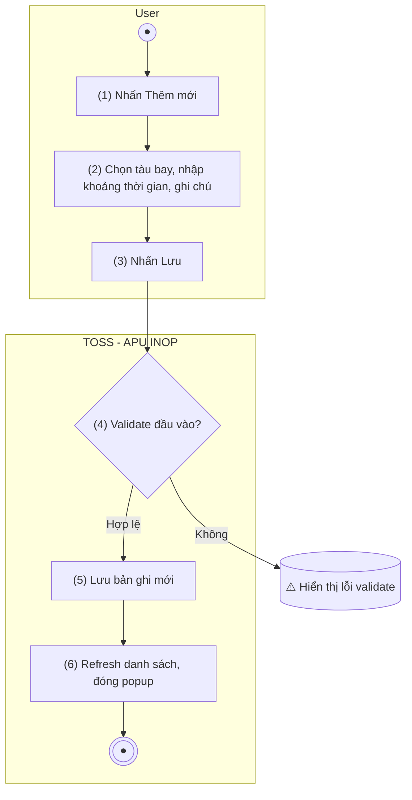

> **Ngữ cảnh chương (giữ nguyên từ nguồn):** mục `Data Maintenance (Danh mục dùng chung)`.
>
> **[Cập nhật 2026-07-15 — theo chỉ đạo BA Lead]** Bổ sung: (a) hệ thống tự sinh **Mã khai báo** toàn cục (`APU-YYYY-NNNN`) và **Lần khai báo** riêng theo tàu bay ngay khi tạo bản ghi; (b) khởi tạo **Trạng thái xử lý** = "Hỏng — chưa sửa chữa" (bước đầu của state machine 4 trạng thái, xem [TOSS.DM.APU_INOP_LIST.FD.v0.1.md](TOSS.DM.APU_INOP_LIST.FD.v0.1.md) §Nghiệp vụ chính).

## Quản lý tàu bay — APU INOP

### Tạo khai báo APU INOP

| **Tên chức năng: Tạo khai báo APU INOP** | |
| --- | --- |
| **Mục đích** | Cho phép user tạo khai báo tàu bay hỏng APU trong một khoảng thời gian, kèm ghi chú |
| **Trigger** | User nhấn "Thêm mới" trên màn hình Danh sách APU INOP |
| **Tiền điều kiện** | User đăng nhập thành công |
| **Hậu điều kiện** | Bản ghi được lưu và hiển thị trên Danh sách |

#### Sơ đồ luồng hệ thống

1. Sơ đồ luồng nghiệp vụ

#### Mô tả luồng xử lý

| **Bước** | **Chi tiết** |
| --- | --- |
| 1 | User nhấn "Thêm mới" |
| 2 | Hệ thống mở popup Thêm khai báo APU INOP |
| 3 | User chọn tàu bay, nhập từ ngày, đến ngày (optional), ghi chú (optional) |
| 4 | User nhấn "Lưu" |
| 5 | Hệ thống validate dữ liệu |
| 6 | Hệ thống sinh **Mã khai báo** (tăng dần toàn hệ thống) + **Lần khai báo** (đếm riêng theo Mã tàu bay vừa chọn), gán **Trạng thái xử lý** = "Hỏng — chưa sửa chữa", lưu bản ghi, refresh danh sách, đóng popup *(cập nhật 2026-07-15)* |

#### Form tạo khai báo

| **Tên trường** | **Kiểu** | **Bắt buộc** | **Mapping** | **Mô tả** |
| --- | --- | --- | --- | --- |
| Mã khai báo | Textview (chỉ đọc, tự sinh sau khi Lưu) | — | `declaration_code` | **[Mới 2026-07-15]** Không hiển thị trên form nhập (chưa có giá trị trước khi Lưu) — hệ thống tự sinh `APU-YYYY-NNNN` khi lưu thành công, tăng dần toàn hệ thống |
| Lần khai báo | Textview (chỉ đọc, tự sinh sau khi Lưu) | — | `declaration_seq` | **[Mới 2026-07-15]** Không hiển thị trên form nhập — hệ thống tự đếm theo Mã tàu bay đã chọn (lần 1, 2, 3... riêng cho từng tàu bay) khi lưu thành công |
| Mã tàu bay | Dropdown/Search | Có | aircraft_code | Chọn tàu bay từ danh mục tàu bay đang khai thác |
| Từ ngày | Datepicker | Có | from_date | Ngày bắt đầu hỏng APU. Mặc định = ngày hiện tại |
| Đến ngày | Datepicker | Không | to_date | Ngày kết thúc hỏng APU. Để trống = chưa xác định (coi là đang hiệu lực) |
| Trạng thái xử lý | *(không hiển thị trên form — hệ thống tự gán)* | — | `processing_status` | **[Mới 2026-07-15]** Luôn khởi tạo = "Hỏng — chưa sửa chữa" khi tạo mới; người dùng không chọn được ở bước tạo, chỉ đổi được qua màn Sửa |
| Ghi chú | Textarea | Không | note | Ghi chép thông tin thêm về khai báo. Maxlength 500 ký tự |

#### Validation

| **Trường** | **Rule** | **Thông báo lỗi** |
| --- | --- | --- |
| Mã tàu bay | Bắt buộc | "Vui lòng chọn tàu bay" |
| Từ ngày | Bắt buộc; định dạng dd/mm/yyyy | "Vui lòng nhập ngày bắt đầu" |
| Đến ngày | Nếu nhập phải >= Từ ngày | "Ngày kết thúc phải >= ngày bắt đầu" |
| Ghi chú | Tối đa 500 ký tự | "Ghi chú không được vượt quá 500 ký tự" |

#### Button hành động

| **Button** | **Hành động** |
| --- | --- |
| Lưu | Validate → Lưu → Refresh → Đóng popup |
| Hủy | Đóng popup, không lưu |

#### Giao diện mẫu

> *(Hình ảnh mockup: cần bổ sung từ Figma/mockup team)*

---

*Nguồn: BR-420 — khai báo tàu bay hỏng APU (APU INOP) theo khoảng thời gian From_DT / To_DT (To_DT có thể chưa xác định). **Cập nhật 2026-07-15 (chỉ đạo trực tiếp BA Lead, không phải trích từ BR-420 gốc):** bổ sung sinh tự động Mã khai báo + Lần khai báo, khởi tạo Trạng thái xử lý = "Hỏng — chưa sửa chữa".*