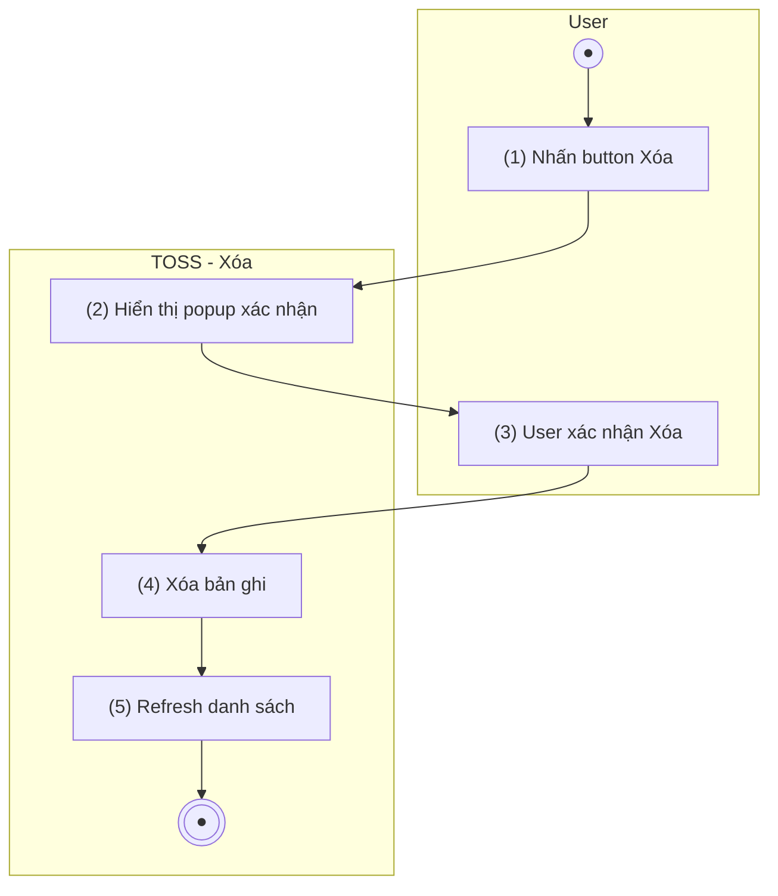

> **Ngữ cảnh chương (giữ nguyên từ nguồn):** mục `Data Maintenance (Danh mục dùng chung)`.
>
> **Tách từ file gộp `TOSS.DM.APU_INOP_EDIT.FD.v0.1.md` (Sửa+Xóa) ngày 2026-07-15** — khớp quy ước tách file Sửa/Xóa riêng biệt mà 14 nhóm khác của module Data Maintenance đều dùng (vd AC Subtype có `_ADD_EDIT` + `_DELETE`). Nội dung giữ nguyên trung thực từ file gốc "Phần 2 — Xóa khai báo APU INOP", không chỉnh sửa nội dung nghiệp vụ (CLAUDE.md §0).

## Quản lý tàu bay — APU INOP

### Xóa khai báo APU INOP

| **Tên chức năng: Xóa khai báo APU INOP** | |
| --- | --- |
| **Mục đích** | Cho phép user xóa khai báo không còn cần thiết |
| **Trigger** | User nhấn button Xóa trên dòng bản ghi |
| **Tiền điều kiện** | User đăng nhập thành công |
| **Hậu điều kiện** | Bản ghi bị xóa; danh sách refresh |

#### Sơ đồ luồng hệ thống

1. Sơ đồ luồng nghiệp vụ

#### Mô tả luồng xử lý

| **Bước** | **Chi tiết** |
| --- | --- |
| 1 | User nhấn button Xóa trên dòng bản ghi |
| 2 | Hệ thống hiển thị popup xác nhận |
| 3 | User xác nhận Xóa |
| 4 | Hệ thống xóa bản ghi |
| 5 | Hệ thống refresh danh sách |

#### Button hành động

| **Button** | **Hành động** |
| --- | --- |
| Xác nhận | Xóa → Đóng popup → Refresh |
| Hủy | Đóng popup, không xóa |

#### Giao diện mẫu

> *(Hình ảnh mockup: cần bổ sung từ Figma/mockup team)*

---

*Nguồn: BR-420 — quản lý khai báo APU INOP. **Tách 2026-07-15** từ file gộp `TOSS.DM.APU_INOP_EDIT.FD.v0.1.md` (Sửa+Xóa) — không thay đổi nội dung nghiệp vụ, chỉ tổ chức lại theo đúng quy ước tách file của module (CLAUDE.md §0).*
