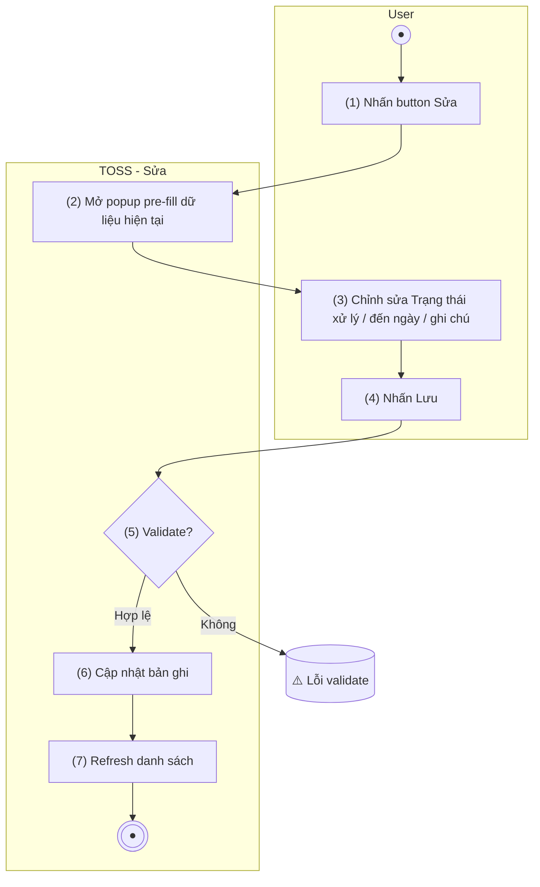

> **Ngữ cảnh chương (giữ nguyên từ nguồn):** mục `Data Maintenance (Danh mục dùng chung)`.
>
> **[Cập nhật 2026-07-15 — theo chỉ đạo BA Lead]** Bổ sung trường **Trạng thái xử lý** vào form Sửa (4 giá trị: Hỏng — chưa sửa chữa / Đang sửa chữa / Đã khôi phục — chờ xác nhận / Đã xác nhận khôi phục) — xem [TOSS.DM.APU_INOP_LIST.FD.v0.1.md](TOSS.DM.APU_INOP_LIST.FD.v0.1.md) §Nghiệp vụ chính. Actor được phân quyền thao tác Sửa (cùng quyền với Thêm mới) là actor thực hiện chuyển trạng thái — không có vai trò/luồng phê duyệt riêng. **[Cần làm rõ]** Quy tắc validate: bắt buộc chuyển tuần tự (chỉ chọn được trạng thái kế tiếp) hay tự do chọn bất kỳ giá trị nào trong 4 giá trị — BA Lead chưa xác nhận, form dưới đây mô tả Dropdown không giới hạn lựa chọn, chờ xác nhận thêm.
>
> **[Cập nhật 2026-07-15 (tiếp) — tách file]** Tách riêng khỏi file gộp `TOSS.DM.APU_INOP_EDIT.FD.v0.1.md` (Sửa+Xóa) ban đầu — thao tác **Xóa** nay ở file riêng [TOSS.DM.APU_INOP_DELETE.FD.v0.1.md](TOSS.DM.APU_INOP_DELETE.FD.v0.1.md), khớp quy ước tách file Sửa/Xóa riêng biệt mà 14 nhóm khác của module Data Maintenance đều dùng (vd AC Subtype có `_ADD_EDIT` + `_DELETE`). Không mất nội dung — toàn bộ luồng Xóa được chuyển nguyên vẹn sang file mới.

## Quản lý tàu bay — APU INOP

### Sửa khai báo APU INOP

| **Tên chức năng: Sửa khai báo APU INOP** | |
| --- | --- |
| **Mục đích** | Cho phép user chỉnh sửa thông tin khai báo (Trạng thái xử lý, đến ngày, ghi chú) |
| **Trigger** | User nhấn button Sửa trên dòng bản ghi |
| **Tiền điều kiện** | User đăng nhập thành công |
| **Hậu điều kiện** | Bản ghi được cập nhật; danh sách refresh |

#### Sơ đồ luồng hệ thống

1. Sơ đồ luồng nghiệp vụ

#### Mô tả luồng xử lý

| **Bước** | **Chi tiết** |
| --- | --- |
| 1 | User nhấn button Sửa trên dòng bản ghi |
| 2 | Hệ thống mở popup pre-fill dữ liệu hiện tại |
| 3 | User chỉnh sửa Trạng thái xử lý / đến ngày / ghi chú *(cập nhật 2026-07-15 — bổ sung Trạng thái xử lý)* |
| 4 | User nhấn "Lưu" |
| 5 | Hệ thống validate đầu vào |
| 6 | Hệ thống cập nhật bản ghi, refresh danh sách, đóng popup |

#### Form sửa (các trường cho phép chỉnh sửa)

| **Tên trường** | **Kiểu** | **Bắt buộc** | **Mapping** | **Mô tả** |
| --- | --- | --- | --- | --- |
| Trạng thái xử lý | Dropdown | Có | `processing_status` | **[Mới 2026-07-15]** Chọn 1 trong 4 giá trị: Hỏng — chưa sửa chữa / Đang sửa chữa / Đã khôi phục — chờ xác nhận / Đã xác nhận khôi phục. [Cần làm rõ] quy tắc giới hạn lựa chọn (tuần tự hay tự do) — xem ghi chú đầu file |
| Đến ngày | Datepicker | Không | to_date | Ngày kết thúc hỏng APU. Trống = chưa xác định (đang hiệu lực) |
| Ghi chú | Textarea | Không | note | Ghi chú bổ sung. Maxlength 500 ký tự |

> **Lưu ý:** Mã tàu bay, Từ ngày, Mã khai báo, Lần khai báo **không được sửa** sau khi tạo — chỉ Trạng thái xử lý, Đến ngày, Ghi chú được phép sửa.

#### Validation

| **Trường** | **Rule** | **Thông báo lỗi** |
| --- | --- | --- |
| Đến ngày | Nếu nhập phải >= Từ ngày | "Ngày kết thúc phải lớn hơn hoặc bằng ngày bắt đầu" |
| Ghi chú | Tối đa 500 ký tự | "Ghi chú không được vượt quá 500 ký tự" |

#### Button hành động

| **Button** | **Hành động** |
| --- | --- |
| Lưu | Validate → Cập nhật → Đóng popup → Refresh |
| Hủy | Đóng popup, không lưu |

#### Giao diện mẫu

> *(Hình ảnh mockup: cần bổ sung từ Figma/mockup team)*

---

*Nguồn: BR-420 — quản lý khai báo APU INOP. **Cập nhật 2026-07-15 (chỉ đạo trực tiếp BA Lead, không phải trích từ BR-420 gốc):** bổ sung trường Trạng thái xử lý (4 giá trị) vào form Sửa; tách riêng khỏi luồng Xóa (nay ở [TOSS.DM.APU_INOP_DELETE.FD.v0.1.md](TOSS.DM.APU_INOP_DELETE.FD.v0.1.md)) để khớp quy ước tách file của 14 nhóm khác trong module.*
