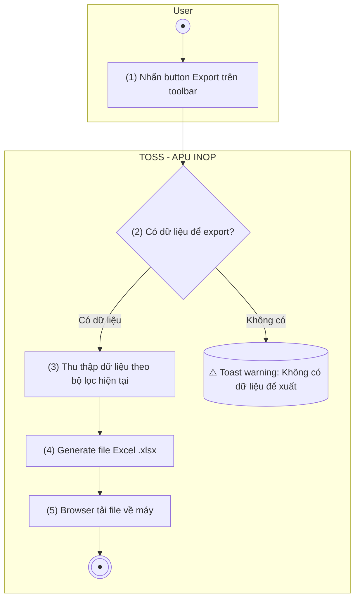

> **Ngữ cảnh chương (giữ nguyên từ nguồn):** mục `Data Maintenance (Danh mục dùng chung)`.
>
> **[Cập nhật 2026-07-15 — theo chỉ đạo BA Lead]** Bổ sung 3 cột xuất mới: Mã khai báo, Lần khai báo, Trạng thái xử lý — khớp với các trường mới thêm ở LIST/CREATE/EDIT.

## Quản lý tàu bay — APU INOP

### Xuất Excel danh sách APU INOP

| **Tên chức năng: Xuất Excel danh sách APU INOP** | |
| --- | --- |
| **Mục đích** | Cho phép user xuất danh sách khai báo APU INOP ra file Excel để phục vụ báo cáo, đối soát |
| **Trigger** | User nhấn button Export/ Xuất Excel trên màn hình Danh sách APU INOP |
| **Tiền điều kiện** | User đã truy cập màn hình Danh sách APU INOP |
| **Hậu điều kiện** | File Excel được tải về máy user với dữ liệu phù hợp theo bộ lọc hiện tại |

#### Sơ đồ luồng hệ thống

1. Sơ đồ luồng nghiệp vụ

#### Mô tả luồng xử lý

| **Bước** | **Chi tiết** |
| --- | --- |
| 1 | User nhấn button Export trên màn hình Danh sách APU INOP |
| 2 | Hệ thống kiểm tra: có dữ liệu để export không? Nếu không → cảnh báo |
| 3 | Hệ thống thu thập toàn bộ dữ liệu hiển thị trên bảng (theo bộ lọc hiện tại) |
| 4 | Hệ thống generate file Excel với format chuẩn |
| 5 | Browser tải file về máy user |

#### Mô tả chi tiết

| **Thành phần** | **Mô tả** |
| --- | --- |
| Button Export | Button trên toolbar màn hình Danh sách APU INOP; icon: biểu tượng Excel/Download |
| Dữ liệu xuất | Bao gồm toàn bộ cột hiển thị trên bảng tại thời điểm xuất (theo bộ lọc đang áp dụng) |
| Format file | `.xlsx` (Excel 2007+) |
| Tên file | `FIMS_APU_INOP_ddmmyy_hhmmss.xlsx` (VD: `FIMS_APU_INOP_14072026_143052.xlsx`) |
| Header | Dòng đầu tiên chứa tên các cột tương ứng với bảng hiển thị |
| Không có dữ liệu | Nếu bảng trống: hiển thị thông báo "Không có dữ liệu để xuất" |

#### Các cột dữ liệu xuất

| **STT** | **Tên cột** | **Mapping** | **Định dạng** |
| --- | --- | --- | --- |
| 1 | Mã khai báo | `declaration_code` | **[Mới 2026-07-15]** Text — `APU-YYYY-NNNN` |
| 2 | Mã tàu bay | aircraft_code | Text |
| 3 | Lần khai báo | `declaration_seq` | **[Mới 2026-07-15]** Số nguyên |
| 4 | Từ ngày | from_date | dd/mm/yyyy |
| 5 | Đến ngày | to_date | dd/mm/yyyy; NULL → "Chưa xác định" |
| 6 | Trạng thái xử lý | `processing_status` | **[Mới 2026-07-15]** Text — 1 trong 4 giá trị (Hỏng — chưa sửa chữa / Đang sửa chữa / Đã khôi phục — chờ xác nhận / Đã xác nhận khôi phục) |
| 7 | Ghi chú | note | Text |

#### Xử lý lỗi

| **Trường hợp** | **Xử lý** |
| --- | --- |
| Không có dữ liệu | Hiển thị toast/warning "Không có dữ liệu để xuất" |
| Lỗi kết nối server | Hiển thị toast error "Xuất file thất bại. Vui lòng thử lại" |
| File quá lớn (> 10,000 dòng) | Xuất theo batch hoặc có thông báo trước cho user |

---

*Nguồn: BR-420 — quản lý APU INOP phục vụ cảnh báo khai thác; chức năng export theo mẫu danh sách tiêu chuẩn FIMS. **Cập nhật 2026-07-15 (chỉ đạo trực tiếp BA Lead, không phải trích từ BR-420 gốc):** bổ sung 3 cột xuất Mã khai báo/Lần khai báo/Trạng thái xử lý.*