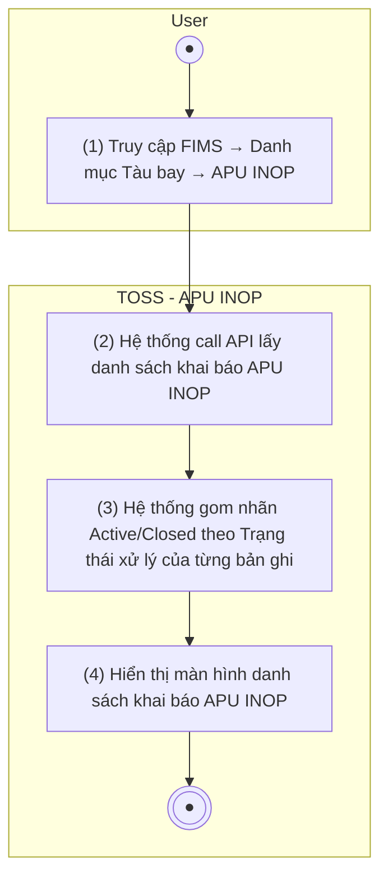

> **Ngữ cảnh chương (giữ nguyên từ nguồn):** mục `Data Maintenance (Danh mục dùng chung)`.
>
> **[Cập nhật 2026-07-15 — theo chỉ đạo BA Lead]** Nguồn ban đầu (2026-07-14) chỉ mô hình hóa 1 trạng thái nhị phân tính toán (Active/Closed suy từ `to_date` so với hôm nay). BA Lead xác nhận quy trình khai báo APU hỏng thực tế cần **4 trạng thái xử lý tuần tự** (Hỏng — chưa sửa chữa → Đang sửa chữa → Đã khôi phục — chờ xác nhận → Đã xác nhận khôi phục), cộng thêm **2 mã định danh tự sinh**: mã khai báo toàn cục (`APU-YYYY-NNNN`) và số lần khai báo riêng theo từng tàu bay. Active/Closed **vẫn giữ** làm nhãn tổng hợp (gom nhóm 3 trạng thái đầu = Active, trạng thái cuối = Closed) nhưng nay suy từ **Trạng thái xử lý** thay vì tính trực tiếp từ `to_date`. Đã cập nhật §Nghiệp vụ chính, bảng cột danh sách, và bộ lọc bên dưới; đồng bộ cùng đợt với CREATE/EDIT/DELETE/EXPORT.
>
> **[Cập nhật 2026-07-15 (tiếp) — chỉnh sửa bất thường cấu trúc theo yêu cầu BA Lead]** (1) File `TOSS.DM.APU_INOP_FILTER.FD.v0.1.md` đã **xóa** — nội dung gộp vào §Bộ lọc bên dưới, khớp quy ước 13 nhóm khác của module (không có file Filter/Search riêng). (2) Bảng "Mô tả chi tiết màn hình" bổ sung dòng Button Export (trước đó bị thiếu dù `EXPORT.FD` mô tả trigger là nút trên chính màn này). (3) Thao tác Sửa/Xóa (STT Hành động) nay có link markdown thật tới 2 file riêng biệt `TOSS.DM.APU_INOP_EDIT.FD.v0.1.md` / `TOSS.DM.APU_INOP_DELETE.FD.v0.1.md` (trước đó không có link).

## Quản lý tàu bay — APU INOP

### Danh sách khai báo APU INOP

| **Tên chức năng: Xem danh sách khai báo APU INOP** | |
| --- | --- |
| **Mục đích** | Cho phép user xem danh sách các khai báo tàu bay hỏng APU (INOP) đang có hiệu lực và lịch sử khai báo |
| **Trigger** | Người dùng truy cập FIMS → Danh mục Tàu bay → APU INOP |
| **Tiền điều kiện** | Người dùng đăng nhập thành công |
| **Hậu điều kiện** | Mở màn hình danh sách khai báo APU INOP trên giao diện người dùng |

#### Sơ đồ luồng hệ thống

1. Sơ đồ luồng nghiệp vụ

#### Mô tả luồng xử lý

| **Bước** | **Chi tiết** |
| --- | --- |
| 1 | Truy cập FIMS → Danh mục Tàu bay → APU INOP |
| 2 | Hệ thống call API lấy danh sách khai báo APU INOP (bao gồm cả đang active và đã đóng) |
| 3 | Hệ thống gom nhãn tổng hợp: **Trạng thái xử lý** ∈ {Hỏng — chưa sửa chữa, Đang sửa chữa, Đã khôi phục — chờ xác nhận} → **Active**; **Trạng thái xử lý** = Đã xác nhận khôi phục → **Closed** *(cập nhật 2026-07-15 — trước đó tính trực tiếp từ `To_DT` so với hôm nay, nay suy từ trường Trạng thái xử lý — xem ghi chú đầu file)* |
| 4 | Hiển thị danh sách khai báo APU INOP trên giao diện người dùng |

#### Mô tả chi tiết màn hình

| **STT** | **Tên** | **Kiểu dữ liệu** | **Mapping DB/API** | **Mô tả nghiệp vụ** |
| --- | --- | --- | --- | --- |
| 1 | Breadcrumb / Tiêu đề | Label | | "Danh mục Tàu bay / APU INOP" |
| 2 | Button Thêm mới | Button | btn_add | Click → mở popup [Tạo khai báo APU INOP](TOSS.DM.APU_INOP_CREATE.FD.v0.1.md) |
| 3 | Button Export | Button | btn_export | **[Mới 2026-07-15]** Click → xuất Excel danh sách hiện tại theo bộ lọc đang áp dụng, xem [Xuất Excel danh sách APU INOP](TOSS.DM.APU_INOP_EXPORT.FD.v0.1.md) — khắc phục khoảng trống nguồn cũ (trước đó EXPORT.FD mô tả nút này nhưng LIST không liệt kê) |
| 4 | Bộ lọc (Collapsible) | Filter Panel | | Mặc định thu gọn; click icon chevron để mở rộng / thu gọn. Chi tiết xem §Bộ lọc bên dưới |
| 5 | Danh sách khai báo APU INOP | Table | | Hiển thị toàn bộ bản ghi khai báo APU INOP của fleet, sắp xếp theo Ngày bắt đầu giảm dần (mới nhất trên) |
| 6 | Phân trang | Pagination | | Mặc định 20 bản ghi/trang; hỗ trợ chuyển trang, chọn số bản ghi/trang |

#### Danh sách khai báo APU INOP

| **STT** | **Tên cột** | **Kiểu** | **Mapping** | **Mô tả** |
| --- | --- | --- | --- | --- |
| 1 | Mã khai báo | Textview | `declaration_code` | **[Mới 2026-07-15]** Mã khai báo tự sinh toàn hệ thống, định dạng `APU-YYYY-NNNN` (vd `APU-2026-0001`) — tăng dần, không phụ thuộc tàu bay. Chỉ đọc |
| 2 | Mã tàu bay | Textview | aircraft_code | Mã tàu bay (VD: VN-A889) |
| 3 | Lần khai báo | Textview | `declaration_seq` | **[Mới 2026-07-15]** Số thứ tự khai báo riêng theo từng tàu bay (vd lần 1, 2, 3 của cùng VN-A889) — tự sinh, chỉ đọc |
| 4 | Từ ngày | Textview | from_date | Ngày bắt đầu hỏng APU, định dạng dd/mm/yyyy |
| 5 | Đến ngày | Textview | to_date | Ngày kết thúc hỏng APU. NULL = chưa xác định → hiển thị "Chưa xác định" |
| 6 | Trạng thái xử lý | Tag | `processing_status` | **[Mới 2026-07-15]** 1 trong 4 giá trị: Hỏng — chưa sửa chữa / Đang sửa chữa / Đã khôi phục — chờ xác nhận / Đã xác nhận khôi phục. Cột "Trạng thái" (Active/Closed) là nhãn tổng hợp suy từ cột này (xem §Nghiệp vụ chính) |
| 7 | Ghi chú | Textview | note | Ghi chú thông tin khai báo APU INOP |
| 8 | Hành động | Button Group | | Button [Sửa](TOSS.DM.APU_INOP_EDIT.FD.v0.1.md) / [Xóa](TOSS.DM.APU_INOP_DELETE.FD.v0.1.md) *(cập nhật 2026-07-15 — bổ sung link markdown thật, trước đó không có)* |

#### Bộ lọc

> **[Cập nhật 2026-07-15]** Bảng gốc (2026-07-14) chỉ có 3 trường lọc, dù STT3 bảng "Mô tả chi tiết màn hình" ở trên đã liệt kê "Trạng thái" là 1 trong 4 trường lọc — đây là khoảng trống trong bản trích ban đầu, nay bổ sung để khớp đúng mô tả đã có sẵn. **[Cập nhật 2026-07-15 (tiếp) — gộp nội dung từ file `TOSS.DM.APU_INOP_FILTER.FD.v0.1.md`** (đã xóa, xem ghi chú đầu file): nguồn ban đầu tách riêng 1 file mô tả lại gần như nguyên vẹn cùng vùng UI này — khác quy ước của 13 nhóm khác trong module Data Maintenance (không có file Filter/Search riêng, toàn bộ mô tả bộ lọc nằm trong LIST). Đã gộp phần nội dung phong phú hơn (luồng xử lý đặc biệt, validate) từ file đó vào đây, không mất thông tin.

| **Tên trường** | **Kiểu** | **Mapping** | **Mô tả** |
| --- | --- | --- | --- |
| Mã tàu bay | Textbox (Optional) | aircraft_code | Tìm kiếm gần đúng theo mã tàu bay |
| Từ ngày | Datepicker (Optional) | from_date | Lọc từ ngày bắt đầu |
| Đến ngày | Datepicker (Optional) | to_date | Lọc đến ngày bắt đầu; validate: nếu nhập cả 2, Từ ngày phải ≤ Đến ngày, nếu không → cảnh báo "Từ ngày không được lớn hơn Đến ngày" |
| Trạng thái xử lý | Dropdown (Optional) — [Cần xác nhận: single hay multi-select] | `processing_status` | **[Mới 2026-07-15]** Lọc theo 1 trong 4 giá trị: Hỏng — chưa sửa chữa / Đang sửa chữa / Đã khôi phục — chờ xác nhận / Đã xác nhận khôi phục |
| Button Tìm kiếm | Button | btn_search | Thực hiện lọc; nhấn Enter ở ô nhập liệu tương đương click nút này |
| Button Reset | Button | btn_reset | Xóa lọc, hiển thị toàn bộ danh sách |

##### Luồng xử lý đặc biệt (gộp từ file FILTER cũ)

| **Trường hợp** | **Xử lý** |
| --- | --- |
| API trả về data rỗng | Hiển thị bảng với dòng "Không có dữ liệu phù hợp" |
| Không nhập gì, nhấn Tìm kiếm | Hiển thị toàn bộ danh sách (tương đương Reset) |
| Nhấn Enter ở ô nhập liệu | Thực hiện tìm kiếm tương đương nhấn nút Tìm kiếm |
| Từ ngày > Đến ngày | Cảnh báo "Từ ngày không được lớn hơn Đến ngày" |

#### Nghiệp vụ chính

1. **[Cập nhật 2026-07-15] Trạng thái xử lý — 4 giá trị theo thứ tự nghiệp vụ tự nhiên** (BA Lead xác nhận, thay thế tính toán trực tiếp từ `To_DT`):
   1. **Hỏng — chưa sửa chữa** — trạng thái khởi tạo, hệ thống tự gán khi tạo khai báo mới (xem CREATE).
   2. **Đang sửa chữa**
   3. **Đã khôi phục — chờ xác nhận**
   4. **Đã xác nhận khôi phục** — trạng thái kết thúc.

   Chuyển trạng thái thực hiện qua chính màn hình Thêm mới (khởi tạo) và Sửa (cập nhật) — actor nào được phân quyền 2 thao tác này thì được thực hiện chuyển trạng thái, không có vai trò/luồng phê duyệt riêng. **[BA Lead xác nhận 2026-07-15]** Quy tắc validate khi Sửa là **tự do** — cho phép chọn bất kỳ giá trị nào trong 4 giá trị, không ràng buộc phải chuyển đúng thứ tự tuần tự.
2. **Active/Closed là nhãn tổng hợp** (giữ lại cho hiển thị dạng thẻ màu, không phải trường lưu trữ riêng): Trạng thái xử lý ∈ {1, 2, 3} → hiển thị thẻ **Active** (xanh); Trạng thái xử lý = 4 (Đã xác nhận khôi phục) → hiển thị thẻ **Closed** (xám).
3. **Cho phép Đến ngày (to_date) = NULL**: Khai báo hỏng APU có thể chưa xác định ngày kết thúc; trường này độc lập với Trạng thái xử lý — một khai báo có thể đang ở trạng thái "Đang sửa chữa" mà vẫn chưa có Đến ngày xác định.
4. **2 mã định danh tự sinh** (BA Lead xác nhận 2026-07-15, không cho người dùng nhập tay): **Mã khai báo** toàn hệ thống (`APU-YYYY-NNNN`, tăng dần, không phân biệt tàu bay) và **Lần khai báo** riêng theo từng tàu bay (đếm lại từ 1 cho mỗi mã tàu bay khác nhau) — xem CREATE §Form tạo khai báo.
5. **Cảnh báo khai thác**: Khi tàu bay có khai báo Active (Trạng thái xử lý ∈ {1,2,3}) được xếp vào chuyến bay đến sân bay không có GPU/GPS/ASU, hệ thống phát cảnh báo APU INOP (phạm vi Flight Dispatch, không xử lý trong màn này).

#### Giao diện mẫu

> *(Hình ảnh mockup: cần bổ sung từ Figma/mockup team)*

---

*Nguồn: BR-420 — Hệ thống phải quản lý tình trạng APU và Packs của từng tàu bay, bao gồm khai báo tàu bay hỏng APU theo khoảng thời gian (From_DT, To_DT có thể chưa xác định) để làm cơ sở cảnh báo tàu hỏng APU không được khai thác đến các sân bay không cung cấp GPU/GPS/ASU. **Cập nhật 2026-07-15 (chỉ đạo trực tiếp BA Lead, không phải trích từ BR-420 gốc):** bổ sung state machine 4 trạng thái xử lý + 2 mã định danh tự sinh (Mã khai báo toàn cục, Lần khai báo theo tàu bay) — xem ghi chú đầu file + §Nghiệp vụ chính. **Cập nhật 2026-07-15 (tiếp) — chỉnh sửa 3 điểm bất thường cấu trúc theo yêu cầu BA Lead:** gộp file FILTER (đã xóa) vào §Bộ lọc; bổ sung dòng Button Export vào bảng trường; bổ sung link markdown thật cho Sửa/Xóa (nay trỏ 2 file riêng biệt EDIT/DELETE) — xem [TOSS.DM.APU.MD.v0.1.md](TOSS.DM.APU.MD.v0.1.md) §5 để biết trạng thái đã xử lý.*