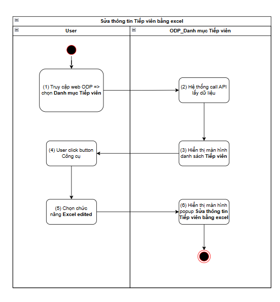
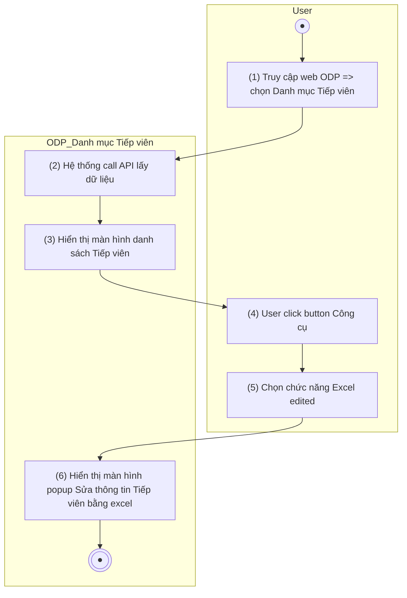

> **Ngữ cảnh chương (giữ nguyên từ nguồn):** mục `Data Maintenance (Danh mục dùng chung)`.

### [Sửa thông tin Tiếp viên](TOSS.DM.ATTENDANT_EDIT_MANUAL.FD.v0.1.md) bằng excel

| **Tên chức năng: [Sửa thông tin Tiếp viên](TOSS.DM.ATTENDANT_EDIT_MANUAL.FD.v0.1.md) bằng excel** | |
| --- | --- |
| **Mục đích** | Cho phép user [Sửa thông tin Tiếp viên](TOSS.DM.ATTENDANT_EDIT_MANUAL.FD.v0.1.md) bằng excel |
| **Trigger** | Người dùng truy cập vào web FIMS => mở đến module Danh mục/Danh mục Tiếp viên => click button **Công cụ** => Chọn chức năng **Excel edited** |
| **Tiền điều kiện** | Người dùng đăng nhập thành công và được phân quyền Sửa trên Danh mục Tiếp viên |
| **Hậu điều kiện** | Mở màn hình popup **[Sửa thông tin Tiếp viên](TOSS.DM.ATTENDANT_EDIT_MANUAL.FD.v0.1.md) bằng excel** trên giao diện người dùng |

#### Sơ đồ luồng hệ thống

1. Sơ đồ luồng nghiệp vụ

#### Mô tả luồng xử lý

| **Bước** | **Chi tiết** |
| --- | --- |
|  | Truy cập web FIMS => mở đến module Danh mục/Danh mục Tiếp viên |
|  | Hệ thống call API xuống BE lấy [danh sách Tiếp viên](TOSS.DM.ATTENDANT_LIST.FD.v0.1.md) |
|  | Hiển thị [danh sách Tiếp viên](TOSS.DM.ATTENDANT_LIST.FD.v0.1.md) trên giao diện người dùng |
|  | User click button **Công cụ** trên danh sách |
|  | Sau đó nhấn vào chức năng **Excel edited** |
|  | Hệ thống mở màn hình popup [Sửa thông tin Tiếp viên](TOSS.DM.ATTENDANT_EDIT_MANUAL.FD.v0.1.md) bằng excel trên giao diện người dùng |

#### Màn hình chức năng

1. Giao diện [Sửa thông tin Tiếp viên](TOSS.DM.ATTENDANT_EDIT_MANUAL.FD.v0.1.md) bằng excel

#### Mô tả chi tiết màn hình danh sách

| **STT** | **Tên** | **Kiểu dữ liệu**  **[Độ dài dữ liệu]** | **Mapping DB/API** | **Mô tả nghiệp vụ** |
| --- | --- | --- | --- | --- |
|  | Tương tự kịch bản [Sửa thông tin Phi công bằng excel](../TOSS.DM.PILOT/TOSS.DM.PILOT_EDIT_EXCEL.FD.v0.1.md)  [Template_Import_Tiep_Vien](https://docs.google.com/spreadsheets/d/1xHFGlQ8OGZ4-0TLyOEMdYE_SYjcoOGoE/edit?usp=sharing&ouid=100481381661925960730&rtpof=true&sd=true) | | | |

---

*Nguồn: tách trung thực từ `sec-23-quan-ly-danh-muc-tiep-vien.md`, mục "[Sửa thông tin Tiếp viên](TOSS.DM.ATTENDANT_EDIT_MANUAL.FD.v0.1.md) bằng excel" (bản trích text của `VNA.TOSS_SRS_Data Maintenance_v0.1.docx`, chương Data Maintenance (Danh mục dùng chung)) — tương ứng dòng **#16** bảng §1 của [CATALOG.md](../CATALOG.md). Không chỉnh sửa nội dung nguồn (CLAUDE.md §0). 🖼 Hình ảnh màn hình: xem file `VNA.TOSS_SRS_Data Maintenance_v0.1.docx` gốc.*
