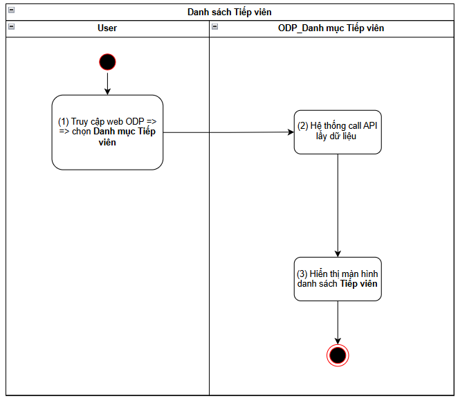
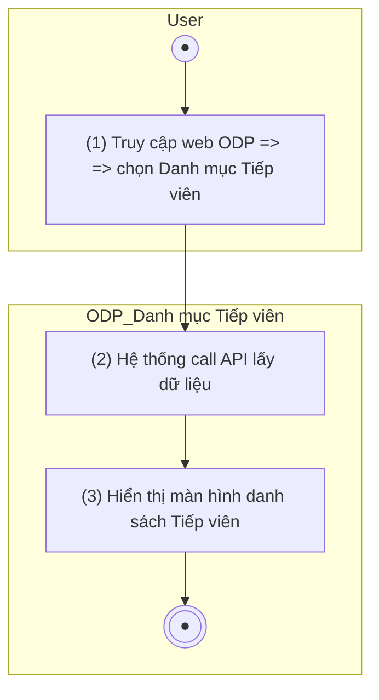
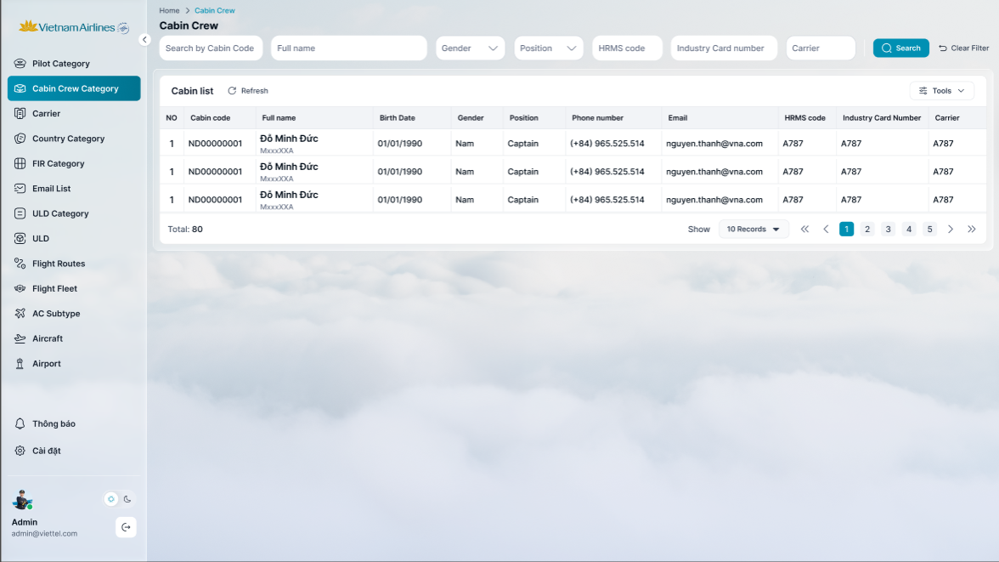
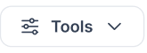
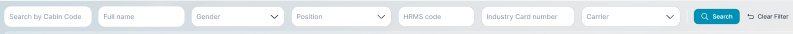

> **Ngữ cảnh chương (giữ nguyên từ nguồn):** mục `Data Maintenance (Danh mục dùng chung)`.

## Quản lý danh mục Tiếp viên

### Xem danh sách Tiếp viên

| **Tên chức năng: Xem danh sách Tiếp viên** | |
| --- | --- |
| **Mục đích** | Cho phép user Xem danh sách Tiếp viên/FIMS |
| **Trigger** | Người dùng truy cập vào web FIMS => mở đến module Danh mục/Danh mục Tiếp viên |
| **Tiền điều kiện** | Người dùng đăng nhập thành công và được phân quyền Danh mục Tiếp viên |
| **Hậu điều kiện** | Mở màn hình danh sách Tiếp viên trên giao diện người dùng |

#### Sơ đồ luồng hệ thống

1. Sơ đồ luồng nghiệp vụ

#### Mô tả luồng xử lý

| **Bước** | **Chi tiết** |
| --- | --- |
|  | Truy cập web FIMS => mở đến module Danh mục/Danh mục Tiếp viên |
|  | Hệ thống call API xuống BE lấy danh sách Tiếp viên |
|  | Hiển thị danh sách Tiếp viên trên giao diện người dùng |

#### Màn hình chức năng

1. Giao diện Danh sách Tiếp viên

#### Mô tả chi tiết màn hình danh sách

| **STT** | **Tên** | **Kiểu dữ liệu**  **[Độ dài dữ liệu]** | **Mapping DB/API** | **Mô tả nghiệp vụ** |
| --- | --- | --- | --- | --- |
|  | Title hệ thống |  |  | * + [Tham chiếu Kịch bản title hệ thống](https://docs.google.com/document/d/1L5y0t4FCWe_vnNI65xNMRC-LM3lvLwYsQRAm_Nokv9A/edit?tab=t.0#bookmark=kix.f2nh07gdowb8) |
|  | Cabin list | Title |  | * Fix cứng text “Cabin list” |
|  |  | Button | btn_refresh | Click: refresh màn hình => FE call API lấy lại DS Tiếp viên mới nhất hiện tại để hiển thị trên giao diện người dùng  Điều kiện hiển thị TV: trường is_delete=false   * Trường hợp response API trả về thành công và có dữ liệu: hiển thị danh sách TV vào bảng bên dưới * Ngược lại: (API trả về rỗng hoặc lỗi) Hiển thị bảng danh sách với chân trang = Tất cả danh sách : 0 |
|  |  | Button | btn_action | * Hiển thị dưới dạng Button list * Click vào => hiển thị tooltips menu action   + Excel edited   + Export   + Đồng bộ AVES * Click lại lần 2 => đóng tooltips  | Excel edited | * Ý nghĩa: [Sửa thông tin Tiếp viên](TOSS.DM.ATTENDANT_EDIT_MANUAL.FD.v0.1.md) bằng cách import file excel * Click → mở popup [Sửa thông tin Tiếp viên bằng excel](TOSS.DM.ATTENDANT_EDIT_EXCEL.FD.v0.1.md) | | --- | --- | | Export | * Export thông tin danh sách Tiếp viên ra file excel với format: [Danh sách Tiếp viên](https://docs.google.com/document/d/11hp5UbcDLXGUWg--FudOX8CiILbqZwy6/edit#heading=h.w7xrr0altwpq) * Tham chiếu kịch bản [Export](https://docs.google.com/document/d/1L5y0t4FCWe_vnNI65xNMRC-LM3lvLwYsQRAm_Nokv9A/edit?tab=t.0#heading=h.db8s772z49o4) | | Đồng bộ AVES | * Click button → Hệ thống call API đồng bộ thông tin TV từ hệ thống AVES, trong đó   Input: TypeUser=Tiếp viên  Output: AVES trả thông tin của TV lấy từ AVES,  → hệ thống update thông tin cho người dùng nhóm TV (mapping theo mã Crewcode) trên Danh mục TV và [Danh sách người dùng](../../../../SA-system-admin/srs/_parts/TOSS.SA.USER/TOSS.SA.USER_LIST.FD.v0.1.md), bao gồm:   * + Full name   + Birth Date   + Gender   + Cabin code   + Position   + Phone number   + Industry Card Number   + Carrier   + Main base   + Fleet   + Last Access Time   + Status Active   **Lưu ý**:   * + Chỉ update các phần thông tin có value được trả về từ AVES. Nếu trường dữ liệu trả về = ∅ => không update thông tin cho trường đó   + Với trường **Đội tàu bay**: mapping gần bằng với Danh mục [đội bay](https://docs.google.com/document/d/11hp5UbcDLXGUWg--FudOX8CiILbqZwy6/edit#heading=h.3r6zjac): ([mã đội bay trên Aves]=[3 ký tự cuối trong mã đội bay trên Danh mục [đội bay](https://docs.google.com/document/d/11hp5UbcDLXGUWg--FudOX8CiILbqZwy6/edit#heading=h.3r6zjac) ]) - (ví dụ Aves=787 map =A787/Danh mục đội bay) => hệ thống xử lý nếu:     - Đội bay đã được gán với người dùng: không cần update thông tin này     - Đội bay chưa được gán với người dùng: gán thêm đội bay cho người dùng     - Đội bay chưa được khai báo trên Danh mục [đội bay](https://docs.google.com/document/d/11hp5UbcDLXGUWg--FudOX8CiILbqZwy6/edit#heading=h.3r6zjac): không cần update thông tin này   + Với trường **Mainbase**: mapping chính xác với Danh mục [Mainbase](https://docs.google.com/document/d/11hp5UbcDLXGUWg--FudOX8CiILbqZwy6/edit#heading=h.wy8ajl), nếu:     - Mainbase đã được gán với người dùng: không cần update thông tin này     - Mainbase chưa được gán với người dùng: gán thêm Mainbase cho người dùng     - Mainbase chưa được khai báo trên Danh mục [Mainbase](https://docs.google.com/document/d/11hp5UbcDLXGUWg--FudOX8CiILbqZwy6/edit#heading=h.wy8ajl): không cần update thông tin này   Nếu Crewcode TV không map được với người dùng nào trên hệ thống nhóm TV → chỉ hiển thị thông tin TV đó trên Danh mục TV , không hiển thị thông tin TV trên danh mục người dùng   * Cơ chế tự động: Định kỳ 1 ngày/ lần => hệ thống call API đồng bộ danh sách TV từ hệ thống AVES để update thông tin mới nhất cho TV và người dùng tương ứng (nếu có) | |
|  | **Tìm kiếm**  ****   * Cơ chế Thu gọn/Mở rộng bộ lọc (Collapsible Fillter):   + [Tham chiếu kịch bản chức năng ẩn hiện filter](https://docs.google.com/document/d/1L5y0t4FCWe_vnNI65xNMRC-LM3lvLwYsQRAm_Nokv9A/edit?tab=t.0#heading=h.dgq51psil6dr) * Click vào dòng dưới tiêu đề các cột để chọn lọc, tìm kiếm thông tin theo dữ liệu tại cột tương ứng. * Trường hợp Searchbox không có dữ liệu: Mặc định tìm kiếm all dữ liệu tại cột đó * Người dùng thao tác thay đổi giá trị trường dữ liệu => click Enter/out focus box => hệ thống thực hiện:   + Reload dữ liệu table phù hợp với bộ lọc   + Set current page=1 * Hiển thị kết quả tìm kiếm:   + Trường hợp API trả về data có KQ: hiển thị danh sách dữ liệu theo kết quả API trả về   + Trường hợp API trả về data rỗng hoặc lỗi: Hiển thị bảng danh sách với **chân trang = Tất cả danh sách : 0** | | | |
|  | Cabin code | Textbox | flight_attendant_code/flighAttendantCode | * Trường để lọc: Tìm kiếm gần đúng theo [Cabin code] * Maxlength 20 ký tự * Validate cho phép nhập chữ, số, và ký tự đặc biệt * Nếu dữ liệu nhập vượt quá độ dài ô => thay thế phần vượt quá bằng ký tự “...” và có tooltip hiển thị toàn bộ nội dung nhập * Nếu paste đoạn văn thì ghi nhận 20 ký tự đầu * Tự động TRIM Spaces đầu cuối khi tìm kiếm |
|  | Full name | Textbox [0;100] | full_name/fullName | * Trường để lọc: Tìm kiếm gần đúng theo [fullName] * Maxlength 100 ký tự * Validate cho phép nhập chữ, số, và ký tự đặc biệt * Nếu dữ liệu nhập vượt quá độ dài ô => thay thế phần vượt quá bằng ký tự “...” và có tooltip hiển thị toàn bộ nội dung nhập * Nếu paste đoạn văn thì ghi nhận 100 ký tự đầu * Tự động TRIM Spaces đầu cuối khi tìm kiếm |
|  | ~~Birth Date~~ | ~~datepicker~~ | ~~date_of_birth / dateOfBirth~~ | * ~~Trường để lọc: Tìm kiếm gần đúng theo [dateOfBirth]~~ * ~~Định dạng dd/mm/yyyy - dd/mm/yyyy~~ * ~~Nếu dữ liệu nhập vượt quá độ dài ô => thay thế phần vượt quá bằng ký tự “...” và có tooltip hiển thị toàn bộ nội dung nhập~~ |
|  | Gender | DDL [Nam.Nữ] | gender | * Trường để lọc: Tìm kiếm chính xác theo [gender] * Giá trị chọn lọc:   + Nam   + Nữ |
|  | Position | Dropdown | position | * Trường để lọc: Tìm kiếm chính xác theo [position] * Giá trị chọn lọc:   + Captain   + Admin   + … * Nếu dữ liệu vượt quá độ dài ô => thay thế phần vượt quá bằng ký tự “...” và có tooltip hiển thị toàn bộ nội dung * ~~Trường để lọc: Tìm kiếm gần đúng theo [position]~~ * ~~Maxlength 50 ký tự~~ * ~~Validate cho phép nhập chữ, số, và ký tự đặc biệt~~ * ~~Nếu dữ liệu nhập vượt quá độ dài ô => thay thế phần vượt quá bằng ký tự “...” và có tooltip hiển thị toàn bộ nội dung nhập~~ * ~~Nếu paste đoạn văn thì ghi nhận 50 ký tự đầu~~ * ~~Tự động TRIM Spaces đầu cuối khi tìm kiếm~~ |
|  | ~~Số điện thoại~~ | ~~Numberbox [0;20]~~ | ~~phone_number/phoneNumber~~ | * ~~Trường để lọc: Tìm kiếm gần đúng theo [phoneNumber]~~ * ~~Maxlength 20 ký tự~~ * ~~Validate cho phép nhập số~~ * ~~Nếu dữ liệu nhập vượt quá độ dài ô => thay thế phần vượt quá bằng ký tự “...” và có tooltip hiển thị toàn bộ nội dung nhập~~ * ~~Nếu paste đoạn văn thì ghi nhận 20 ký tự đầu~~ * ~~Tự động TRIM Spaces đầu cuối khi tìm kiếm~~ |
|  | ~~Email~~ | ~~Textbox [0;100]~~ | ~~email~~ | * ~~Trường để lọc: Tìm kiếm gần đúng theo [email]~~ * ~~Maxlength 100 ký tự~~ * ~~Validate cho phép nhập chữ, số, và ký tự đặc biệt~~ * ~~Nếu dữ liệu nhập vượt quá độ dài ô => thay thế phần vượt quá bằng ký tự “...” và có tooltip hiển thị toàn bộ nội dung nhập~~ * ~~Nếu paste đoạn văn thì ghi nhận 100 ký tự đầu~~ * ~~Tự động TRIM Spaces đầu cuối khi tìm kiếm~~ |
|  | HRMS Code | Textbox | hrms_code/hrmsCode | * Trường để lọc: Tìm kiếm gần đúng theo [hrmsCode)] * Maxlength 100 ký tự * Validate cho phép nhập chữ, số, và ký tự đặc biệt * Nếu dữ liệu nhập vượt quá độ dài ô => thay thế phần vượt quá bằng ký tự “...” và có tooltip hiển thị toàn bộ nội dung nhập * Nếu paste đoạn văn thì ghi nhận 100 ký tự đầu * Tự động TRIM Spaces đầu cuối khi tìm kiếm |
|  | Industry Card number | Textbox | industry_card_number/industryCardNumber | * Trường để lọc: Tìm kiếm gần đúng theo [industryCardNumber] * Maxlength 100 ký tự * Validate cho phép nhập chữ, số, và ký tự đặc biệt * Nếu dữ liệu nhập vượt quá độ dài ô => thay thế phần vượt quá bằng ký tự “...” và có tooltip hiển thị toàn bộ nội dung nhập * Nếu paste đoạn văn thì ghi nhận 100 ký tự đầu * Tự động TRIM Spaces đầu cuối khi tìm kiếm |
|  | Carrier | Textbox [0;100] | carrier | * Trường để lọc: Tìm kiếm gần đúng theo [carrier] * Maxlength 100 ký tự * Validate cho phép nhập chữ, số, và ký tự đặc biệt * Nếu dữ liệu nhập vượt quá độ dài ô => thay thế phần vượt quá bằng ký tự “...” và có tooltip hiển thị toàn bộ nội dung nhập * Nếu paste đoạn văn thì ghi nhận 100 ký tự đầu * Tự động TRIM Spaces đầu cuối khi tìm kiếm |
|  | ~~Main base~~ | ~~Textbox [0;100]~~ | ~~main_base/mainBase~~ | * ~~Trường để lọc: Tìm kiếm gần đúng theo [mainBase]~~ * ~~Maxlength 100 ký tự~~ * ~~Validate cho phép nhập chữ, số, và ký tự đặc biệt~~ * ~~Nếu dữ liệu nhập vượt quá độ dài ô => thay thế phần vượt quá bằng ký tự “...” và có tooltip hiển thị toàn bộ nội dung nhập~~ * ~~Nếu paste đoạn văn thì ghi nhận 100 ký tự đầu~~ * ~~Tự động TRIM Spaces đầu cuối khi tìm kiếm~~ |
|  | ~~Đội tàu bay~~ | ~~Textbox [0;20]~~ | ~~fleet~~ | * ~~Trường để lọc: Tìm kiếm gần đúng theo [fleet]~~ * ~~Maxlength 20 ký tự~~ * ~~Validate cho phép nhập chữ, số, và ký tự đặc biệt~~ * ~~Nếu dữ liệu nhập vượt quá độ dài ô => thay thế phần vượt quá bằng ký tự “...” và có tooltip hiển thị toàn bộ nội dung nhập~~ * ~~Nếu paste đoạn văn thì ghi nhận 20 ký tự đầu~~ * ~~Tự động TRIM Spaces đầu cuối khi tìm kiếm~~ |
|  | Status | DDL [Active, Inactive] | active_status | * Trường để lọc: Tìm kiếm chính xác theo [active_status] * Giá trị chọn lọc:   + Active   + Inactive |
|  | Chi tiết danh sách   * Hệ thống call API xuống BE, lấy danh sách TV thỏa mãn điều kiện:   + TypeUsser = Tiếp viên   + Trạng thái **is_delete=false** * → hiển thị [danh sách người dùng](../../../../SA-system-admin/srs/_parts/TOSS.SA.USER/TOSS.SA.USER_LIST.FD.v0.1.md) là Tiếp viên trên màn hình * Danh sách TV sắp xếp theo thứ tự α-β của trường Mã Tiếp viên * Khi user click vào 1 bản ghi bất kỳ → hiển thị màn hình [Xem chi tiết Tiếp viên_Thông tin Tiếp viên](TOSS.DM.ATTENDANT_DETAIL.FD.v0.1.md) | | | |
|  | TT | Textview |  | * Hiển thị STT tăng dần theo số lượng bản ghi |
|  | Cabin code | Textview | cabin_code | * Hiển thị [cabin_code] theo dữ liệu API trả về * Hiển thị tối đa 2 dòng dữ liệu * Nếu độ dài dữ liệu vượt quá 2 dòng, hiển thị ba chấm […] ở cuối dòng thứ 2 và có tooltip hiển thị toàn bộ nội dung * Trường hợp API trả về rỗng/lỗi: để trống trường |
|  | Full name | Textview | full_name/fullName | * Hiển thị [fullName] theo dữ liệu API trả về * Hiển thị tối đa 2 dòng dữ liệu * Nếu độ dài dữ liệu vượt quá 2 dòng, hiển thị ba chấm […] ở cuối dòng thứ 2 và có tooltip hiển thị toàn bộ nội dung * Trường hợp API trả về rỗng/lỗi: để trống trường |
|  | Birth Date | Textview | date_of_birth / dateOfBirth | * Hiển thị [dateOfBirth] theo dữ liệu API trả về * Định dạng dd/mm/yyyy * Hiển thị tối đa 2 dòng dữ liệu * Nếu độ dài dữ liệu vượt quá 2 dòng, hiển thị ba chấm […] ở cuối dòng thứ 2 và có tooltip hiển thị toàn bộ nội dung * Trường hợp API trả về rỗng/lỗi: để trống trường |
|  | Gender | Textview | gender | * Hiển thị [gender] theo dữ liệu API trả về * Trường hợp API trả về rỗng/lỗi: để trống trường |
|  | Position | Textview | position | * Hiển thị [position] theo dữ liệu API trả về * Hiển thị tối đa 2 dòng dữ liệu * Nếu độ dài dữ liệu vượt quá 2 dòng, hiển thị ba chấm […] ở cuối dòng thứ 2 và có tooltip hiển thị toàn bộ nội dung * Trường hợp API trả về rỗng/lỗi: để trống trường |
|  | Phone number | Textview | phone_number/phoneNumber | * Hiển thị [phoneNumber] theo dữ liệu API trả về * Hiển thị tối đa 2 dòng dữ liệu * Nếu độ dài dữ liệu vượt quá 2 dòng, hiển thị ba chấm […] ở cuối dòng thứ 2 và có tooltip hiển thị toàn bộ nội dung * Trường hợp API trả về rỗng/lỗi: để trống trường |
|  | Email | Textview | email | * Hiển thị [email] theo dữ liệu API trả về * Hiển thị tối đa 2 dòng dữ liệu * Nếu độ dài dữ liệu vượt quá 2 dòng, hiển thị ba chấm […] ở cuối dòng thứ 2 và có tooltip hiển thị toàn bộ nội dung * Trường hợp API trả về rỗng/lỗi: để trống trường |
|  | HRMS code | Textview | hrms_code/hrmsCode | * Hiển thị [hrmsCode] theo dữ liệu API trả về * Hiển thị tối đa 2 dòng dữ liệu * Nếu độ dài dữ liệu vượt quá 2 dòng, hiển thị ba chấm […] ở cuối dòng thứ 2 và có tooltip hiển thị toàn bộ nội dung * Trường hợp API trả về rỗng/lỗi: để trống trường |
|  | Industry Card Number | Textview | industry_card_number/industryCardNumber | * Hiển thị [industryCardNumber] theo dữ liệu API trả về * Hiển thị tối đa 2 dòng dữ liệu * Nếu độ dài dữ liệu vượt quá 2 dòng, hiển thị ba chấm […] ở cuối dòng thứ 2 và có tooltip hiển thị toàn bộ nội dung * Trường hợp API trả về rỗng/lỗi: để trống trường |
|  | Carrier | Textview | carrier | * Hiển thị [carrier] theo dữ liệu API trả về * Hiển thị tối đa 2 dòng dữ liệu * Nếu độ dài dữ liệu vượt quá 2 dòng, hiển thị ba chấm […] ở cuối dòng thứ 2 và có tooltip hiển thị toàn bộ nội dung * Trường hợp API trả về rỗng/lỗi: để trống trường * Với TH nhiều user sử dụng cùng 1 mã tiếp viên=> Lấy dữ liệu user active đầu tiên |
|  | Main base | Textview | main_base/mainBase | * Hiển thị [mainBase] theo dữ liệu API trả về * Hiển thị tối đa 2 dòng dữ liệu * Nếu độ dài dữ liệu vượt quá 2 dòng, hiển thị ba chấm […] ở cuối dòng thứ 2 và có tooltip hiển thị toàn bộ nội dung * Trường hợp API trả về rỗng/lỗi: để trống trường |
|  | Fleet | Textview | fleet/rank | * Hiển thị [rank] theo dữ liệu Rank/API trả về   Cách xử lý dữ liệu:  Ví dụ Rank="**350**:X,**787**:X,**321**:B"  => hệ thống lấy các phần ký tự trước dấu [:] sau đó mapping gần bằng với Danh mục [đội bay](https://docs.google.com/document/d/11hp5UbcDLXGUWg--FudOX8CiILbqZwy6/edit#heading=h.3r6zjac): ([code 3 ký tự cuối/mã đội bay trên Aves]=[3 ký tự cuối trong mã đội bay trên Danh mục [đội bay](https://docs.google.com/document/d/11hp5UbcDLXGUWg--FudOX8CiILbqZwy6/edit#heading=h.3r6zjac) ]) - (ví dụ Aves=787 **map =** A787/Danh mục đội bay) =>   * + nếu khớp: hiển thị thông tin đội bay theo Danh mục [đội bay](https://docs.google.com/document/d/11hp5UbcDLXGUWg--FudOX8CiILbqZwy6/edit#heading=h.3r6zjac)   + nếu không khớp: hiển thị thông tin theo dữ liệu AVES trả về   Các đội bay phân cách nhau bởi dấu [;]   * Hiển thị tối đa 2 dòng dữ liệu * Nếu độ dài dữ liệu vượt quá 2 dòng, hiển thị ba chấm […] ở cuối dòng thứ 2 và có tooltip hiển thị toàn bộ nội dung * Trường hợp API trả về rỗng/lỗi: để trống trường |
|  | Last Access Time | Textview | last_access_time | * Hiển thị [last_access_time] theo dữ liệu API trả về * Hiển thị định dạng dd/mm/yyyy - hh:mm * Trường hợp API trả về rỗng/lỗi: để trống trường |
|  | Status | Tagview | active_status | * Hiển thị TagStatus * Hệ thống check theo **Crew code**  ~~t~~rong màn quản lý người dùng ~~mapping~~ với **~~Người dùng nhóm~~ thông tin Tiếp viên**, lấy và hiển thị theo trạng thái của người dùng tương ứng   + Status=Active: Tag màu xanh lá   + Status=Inactive: Tag màu xám * Trường hợp có > 1 **Người dùng nhóm Tiếp viên** cùng **Crew code** với **Tiếp viên** này =>   + nếu Ǝ Người dùng có trạng thái = Active => hiển thị theo trạng thái = Active   + nếu tất cả Người dùng đều có trạng thái = Inactive => hiển thị theo trạng thái = Inactive * Trường hợp API trả về rỗng/lỗi: để trống trường |
|  | Chân trang | Pagination |  | * [Theo kịch bản phân trang](https://docs.google.com/document/d/1L5y0t4FCWe_vnNI65xNMRC-LM3lvLwYsQRAm_Nokv9A/edit?tab=t.0#heading=h.abyqd0hrl467) |

---

*Nguồn: tách trung thực từ `sec-23-quan-ly-danh-muc-tiep-vien.md`, mục "Xem danh sách Tiếp viên" (bản trích text của `VNA.TOSS_SRS_Data Maintenance_v0.1.docx`, chương Data Maintenance (Danh mục dùng chung)) — tương ứng dòng **#12** bảng §1 của [CATALOG.md](../CATALOG.md). Không chỉnh sửa nội dung nguồn (CLAUDE.md §0). 🖼 Hình ảnh màn hình: xem file `VNA.TOSS_SRS_Data Maintenance_v0.1.docx` gốc.*
