> **Ngữ cảnh chương (giữ nguyên từ nguồn):** mục `Data Maintenance (Danh mục dùng chung)`.

### Thêm mới/Sửa Carrier

| **Tên chức năng: Thêm mới/ Sửa Carrier** | |
| --- | --- |
| **Mục đích** | Cho phép user Thêm mới/ Sửa Carrier |
| **Trigger** | Người dùng truy cập vào web FIMS => Danh mục => Carrier => nhấn Thêm mới để thêm mới hoặc chọn icon “Sửa” để sửa Carrier |
| **Tiền điều kiện** | Người dùng đăng nhập thành công và được phân quyền Thêm mới/Sửa Carrier trên phân hệ Carrier của Danh mục |
| **Hậu điều kiện** | Màn hình Thêm mới/ Sửa Carrier |

#### Sơ đồ luồng hệ thống

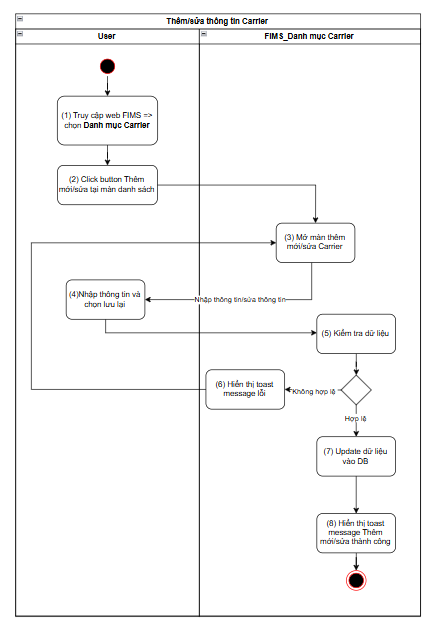

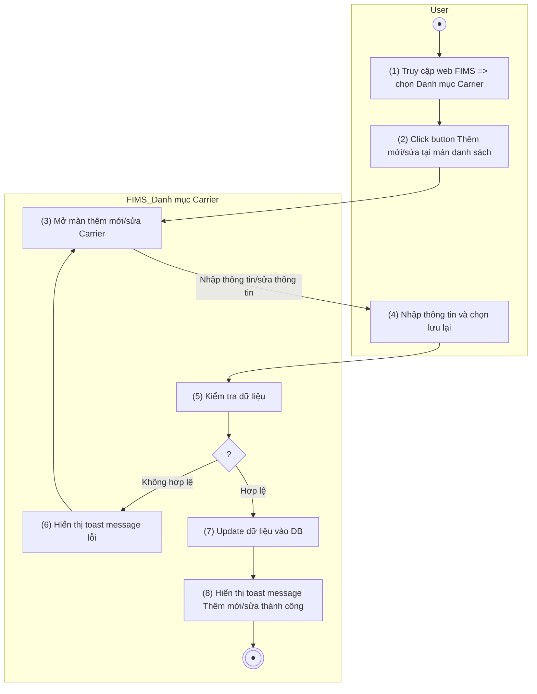

1. Sơ đồ luồng hệ thống

#### Mô tả luồng xử lý

| **Bước** | **Chi tiết** |
| --- | --- |
| Bước 1 | User truy cập vào web FIMS => mở đến module Danh mục => Chọn Carrier => hiển thị màn hình Carrier |
| Bước 2 | User click button Thêm mới hoặc icon “Sửa” tại Carrier muốn sửa |
| Bước 3 | Hệ thống hiển thị màn hình Thêm mới/ Sửa Carrier  Cho phép User thêm Carrier hoặc chỉnh sửa thông tin Carrier |
| Bước 4 | User nhập dữ liệu/update dữ liệu và nhấn **Lưu lại** |
| Bước 5 | * Hệ thống kiểm tra dữ liệu, nếu:   + Dữ liệu không hợp lệ: chuyển sang Bước 6   + Ngược lại chuyển sang Bước 7 |
| Bước 6 | Hiển thị toast báo lỗi cho người dùng:   * Trường hợp thiếu trường bắt buộc: Hiển thị inline message (IM) tại trường có lỗi [VL004](https://docs.google.com/document/d/1L5y0t4FCWe_vnNI65xNMRC-LM3lvLwYsQRAm_Nokv9A/edit?tab=t.0#bookmark=kix.oq8nkssherqj) * Trường hợp Sai định dạng valid: Hiển thị IM tại trường có lỗi [VL006](https://docs.google.com/document/d/1L5y0t4FCWe_vnNI65xNMRC-LM3lvLwYsQRAm_Nokv9A/edit?tab=t.0#bookmark=kix.lwrynb3cmu73) * Trường hợp Call API tạo mới trả về lỗi: hiển thị toast message (TM)   + Trường hợp lỗi API trả về có message: hiện [TB020](https://docs.google.com/document/d/1L5y0t4FCWe_vnNI65xNMRC-LM3lvLwYsQRAm_Nokv9A/edit?tab=t.0#bookmark=kix.zi1hm3rguphh)   + Hoặc hiện [TB021](https://docs.google.com/document/d/1L5y0t4FCWe_vnNI65xNMRC-LM3lvLwYsQRAm_Nokv9A/edit?tab=t.0#bookmark=kix.3pbjinevz4c0) |
| Bước 7 | Update dữ liệu vào DB |
| Bước 8 | Hiển thị toast message Thêm mới/Sửa thành công; Đóng màn hình Thêm mới/Sửa |

#### Màn hình chức năng

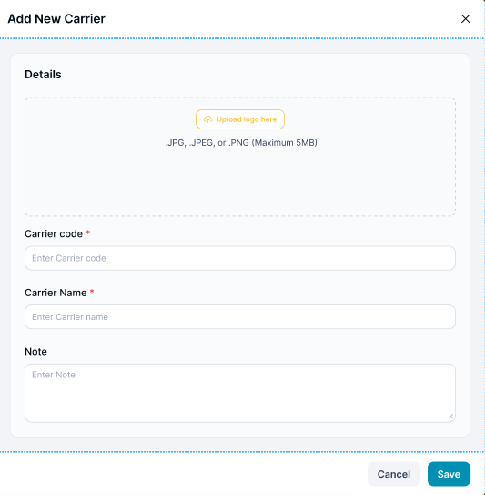

1. Giao diện Thêm mới Carrier

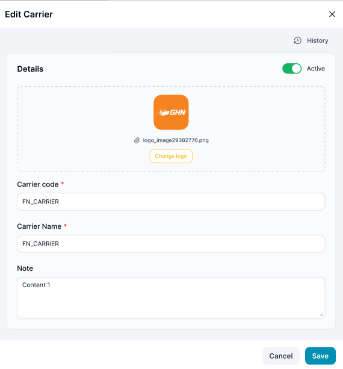

1. Giao diện Sửa Carrier

#### Mô tả chi tiết màn hình

| **STT** | **Tên** | **Kiểu dữ liệu[Độ dài dữ liệu]** | **Mapping DB/API** | **Mô tả** |
| --- | --- | --- | --- | --- |
| 1 | Carrier code | Textbox |  | * TH **Thêm mới**:   + Mặc định: Để trống và cho nhập thông tin   + Placeholder “Enter Carrier Code”   + Bắt buộc nhập * TH **Sửa**: Hiển thị [ Carrier Code ], cho phép xóa trắng hoặc chỉnh sửa * **Validate chung:** * Maxlength 5 ký tự. Chặn nếu nhập quá 5 ký tự * Validate   + Cho phép nhập chữ, số, dấu gạch ngang [-]; dấu gạch dưới [_]; dấu chấm [.]; dấu gạch chéo [/]   + Chặn trùng dữ liệu * Nếu dữ liệu nhập vượt quá độ dài ô => thay thế phần vượt quá bằng ký tự “...” và có tooltip hiển thị toàn bộ nội dung nhập * Nếu paste đoạn văn thì ghi nhận 5 ký tự đầu * Tự động TRIM Spaces đầu cuối khi out focus box * **Action**: Nhấn Enter/out focus/click button **Lưu lại**, hệ thống validate, nếu   + Để trống ⇒ Hiển thị thông báo inline:” Đây là trường thông tin bắt buộc nhập”   + Trường hợp **Carrier Code đã tồn tại** ⇒ Hiển thị thông báo toast: “Mã Carrier đã tồn tại” |
| 2 | Carrier Name | Textbox |  | * TH **Thêm mới**:   + Mặc định: Để trống và cho nhập thông tin   + Placeholder “Enter Carrier Name”   + Bắt buộc nhập * TH **Sửa**: Hiển thị [ Carrier Name], cho phép xóa trắng hoặc chỉnh sửa * **Validate chung:** * Maxlength 100 ký tự. Chặn nếu nhập quá 100 ký tự * Validate   + Cho phép nhập chữ, số, dấu gạch ngang [-]; dấu gạch dưới [_]; dấu chấm [.]; dấu gạch chéo [/]   + Chặn trùng dữ liệu * Nếu dữ liệu nhập vượt quá độ dài ô => thay thế phần vượt quá bằng ký tự “...” và có tooltip hiển thị toàn bộ nội dung nhập * Nếu paste đoạn văn thì ghi nhận 100 ký tự đầu * Tự động TRIM Spaces đầu cuối khi out focus box * **Action**: Nhấn Enter/out focus/click button **Lưu lại**, hệ thống validate, nếu   + Để trống ⇒ Hiển thị thông báo inline:” Đây là trường thông tin bắt buộc nhập”   + Trường hợp **Carrier Name đã tồn tại** ⇒ Hiển thị thông báo toast: “ Carrier Name đã tồn tại” |
| 3 | Upload logo here | Group box Folder thumbnail |  | * TH **Thêm mới**: hiển thị button **Upload logo here**   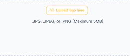   * + Mặc định: Để trống và cho phép tải file   + Place holder “Upload logo here”   + Bắt buộc nhập * TH **Sửa**: Hiển thị [File ảnh] và button **Thay đổi logo**   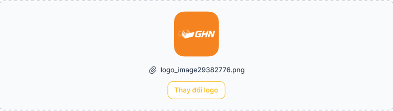   * Button upload ảnh avatar cho thư mục * Nhấn=> Mở cửa sổ Folder của thiết bị, cho phép user chọn file ảnh( định dạng file cho phép: .JPG, JPEG, >PNG) và upload lên hệ thống * Cho phép user kéo thả file ảnh hoặc nhấn button tải lên logo để insert vào hệ thống, hệ thống check validate: * File vượt dung lượng tối đa: highlight đỏ viền box **Folder thumbnail** và hiển thị inline message “Dữ liệu vượt quá dung lượng tối đa 5MB !” * File không đúng định dạng nhận: highlight đỏ viền box **Folder thumbnail** và hiển thị inline message “Dữ liệu không đúng định dạng !” * Trường hợp lỗi khác do hệ thống trả về và có message lỗi: Hiển thị toast message đến người dùng theo nội dung lỗi hệ thống trả về * 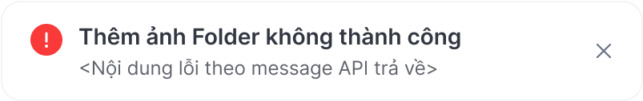 * Các trường hợp lỗi còn lại: Hiển thị toast message lỗi * 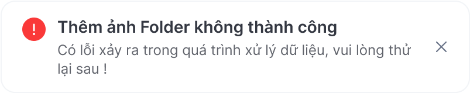 * Trường hợp load ảnh lên thành công: Insert ảnh lên hệ thống và hiển thị vào vùng ảnh của group   Valid file ảnh:   * Định dạng nhận: .JPG, .JPEG và .PNG * Dung lượng tối đa: 5MB   **Nội dung bao gồm:**   * Ảnh được gán lên, hệ thống resize về kích thước 80x80 (px) để hiển thị trên màn hình * Tên file: Gồm Icon đính kèm ảnh  + Tên file ảnh  * Button **Thay đổi logo**: Nhấn vào => Mở cửa số Folder của thiết bị, cho phép user chọn file ảnh (định dạng file cho phép chọn .JPEG, .JPG or .PNG) và upload lên hệ thống thay thế cho ảnh đã load lên trước đó * Action lưu ảnh tải lên: Khi user nhấn button **Create** để lưu thao tác thêm Folder, hệ thống kiểm tra **Folder thumbnail** nếu: * Chưa có ảnh nào được tải lên: highlight đỏ viền box **Folder thumbnail** và hiển thị inline message “Không được để trống trường này !” * Có ảnh được tải lên: Lưu ảnh logo cho Folder |
| 4 | Note | Textbox |  | * TH **Thêm mới**:   + Mặc định: Để trống và cho nhập thông tin   + Placeholder “Kéo tập tin vào đây”   + Không bắt buộc nhập * TH **Sửa**: Hiển thị [Thông tin ghi chú] * Maxlength 1000 ký tự. Chặn nếu nhập quá 1000 ký tự * Nhận dữ liệu chữ, số, và ký tự đặc biệt * Nếu dữ liệu nhập vượt quá độ dài ô => thay thế phần vượt quá bằng ký tự “...” và có tooltip hiển thị toàn bộ nội dung nhập * Nếu paste đoạn văn thì ghi nhận 1000 ký tự đầu * Tự động TRIM Spaces đầu cuối khi out focus box * **Action**: Nhấn Enter/out focus/click button **Lưu lại**, hệ thống lưu thông tin ghi chú |
| 5 | Status | Toggle switch button |  | * TH On Toggle Switch button: **Active** * Ngược lại: **Inactive**   Update Toggle switch button **Hoạt động** thành **On/Off** tương ứng trạng thái |
| 6 | Save | Button |  | Luôn Enable, nếu nhập thông tin thêm mới/ sửa đủ và đúng định dạng, hệ thống thực hiện   * Lưu thông tin thêm mới, cập nhật * Hiển thị màn hình thông báo kết quả nếu: * Response API trả về status 200: hiển thị toast message thành công:   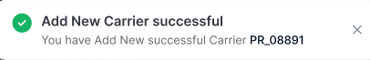  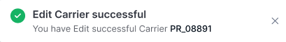  => Đóng popup thêm mới/ sửa và trở về màn hình Danh mục Carrier   * Ngược lại: hiển thị toast message lỗi tương ứng với API trả về:   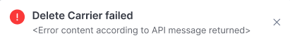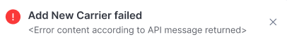   * Sau 3s hoặc người dùng click “x” đóng toast |
| 7 | Cancel | Button |  | * Đóng với màn hình Sửa * Hủy bỏ với màn hình Thêm mới * Luôn enable, click button đóng giao diện Thêm mới/ Sửa, hệ thống không xử lý gì thêm, trở ra màn hình danh mục Carrier |

---

*Nguồn: tách trung thực từ `sec-24-quan-ly-danh-muc-carrier.md`, mục "Thêm mới/Sửa Carrier" (bản trích text của `VNA.TOSS_SRS_Data Maintenance_v0.1.docx`, chương Data Maintenance (Danh mục dùng chung)) — tương ứng dòng **#18** bảng §1 của [CATALOG.md](../CATALOG.md). Không chỉnh sửa nội dung nguồn (CLAUDE.md §0). 🖼 Hình ảnh màn hình: xem file `VNA.TOSS_SRS_Data Maintenance_v0.1.docx` gốc.*
