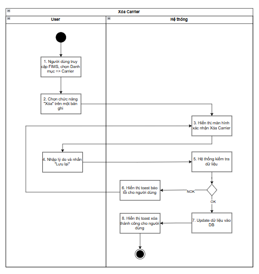
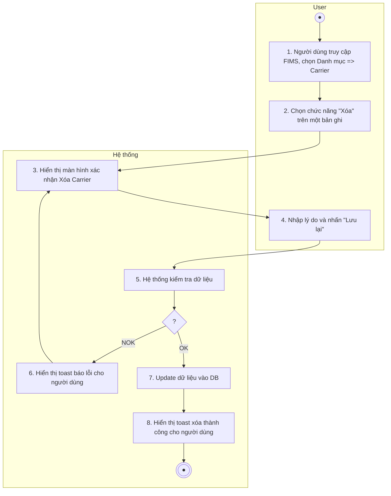
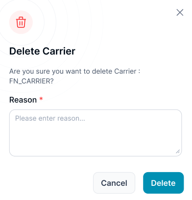
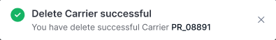
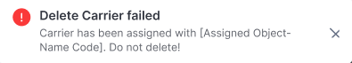

> **Ngữ cảnh chương (giữ nguyên từ nguồn):** mục `Data Maintenance (Danh mục dùng chung)`.

### Xóa Carrier

| **Tên chức năng: Xóa Carrier** | |
| --- | --- |
| **Mục đích** | Cho phép user Xóa Carrier |
| **Trigger** | Người dùng truy cập vào web FIMS=> nhấn phân hệ Danh mục => Carrier => nhấn icon Xóa |
| **Tiền điều kiện** | Người dùng đăng nhập thành công và được phân quyền trên phân hệ Carrier |
| **Hậu điều kiện** | Màn hình xác nhận **Xóa Carrier** được hiển thị |

#### Sơ đồ luồng hệ thống

1. Sơ đồ luồng hệ thống

#### Mô tả luồng xử lý

| **Bước** | **Chi tiết** |
| --- | --- |
| Bước 1 | * User truy cập vào web FIMS => mở đến module Danh mục => Chọn Carrier => hiển thị màn hình Carrier |
| Bước 2 | * User click **icon “ Xóa”** |
| Bước 3 | * Mở màn hình xác nhận **Xóa** Carrier |
| Bước 4 | * Người dùng nhập Lý do & nhấn button **Lưu lại** |
| Bước 5 | Hệ thống kiểm tra dữ liệu, nếu:   * Dữ liệu không hợp lệ: chuyển sang bước 6   + Dữ liệu xóa hợp lệ: Carrier chưa được gắn vào bất kỳ user nào   + Dữ liệu không hợp lệ: Carrier đã được gán thông tin * Ngược lại: chuyển sang bước 7 |
| Bước 6 | * Hiển thị toast message lỗi đến người dùng |
| Bước 7, 8 | * Update dữ liệu vào DB. Hiển thị toast message Xóa thành công |

#### Màn hình chức năng

1. Giao diện xác nhận Xóa Carrier

#### Mô tả chi tiết màn hình

| **STT** | **Tên** | **Kiểu dữ liệu[Độ dài dữ liệu]** | **Mapping DB/API** | **Mô tả** |
| --- | --- | --- | --- | --- |
|  |  | Icon |  | * Icon confirm  * Không cho thao tác |
|  |  | Icon |  | * Icon đóng popup * Click: Đóng popup xác nhận, hệ thống không cần xử lý gì, trở ra màn hình [Danh sách Carrier](TOSS.DM.CARRIER_LIST.FD.v0.1.md) |
|  | Title | Textview |  | * Xóa Carrier * Không cho thao tác |
|  | Content | Textview |  | * Hiển thị [Bạn có chắc chắn muốn xóa Carrier:< Mã Carrier>- <Tên Carrier> không?] * Trong đó: < Mã Carrier> và < Tên Carrier> lấy theo thông tin của Carrier bị xóa * Không cho thao tác |
|  | Reason | Textbox |  | * Bắt buộc nhập * Mặc định: Để trống và cho nhập thông tin * Placeholder: “Vui lòng nhập lý do...” * Tối đa: 1000 ký tự bao gồm chữ, số và ký tự đặc biệt * Chặn nếu nhập quá 1000 ký tự * Nếu paste đoạn văn > 1000 ký tự, chỉ nhận 1000 ký tự đầu tiên * Bắt buộc nhập * Tự động TRIM Spaces đầu cuối khi out focus box * **Action**: Nhấn Enter/out focus/click button **Lưu lại**, hệ thống validate, nếu   + Để trống ⇒ Hiển thị thông báo inline:” Không được để trống” |
|  | Cancel | Button |  | * Click: Đóng popup xác nhận, hệ thống không cần xử lý gì, đóng popup Xác nhận xóa và trở ra màn hình Cơ quan đơn vị |
|  | Delete | Button |  | Click:   * Đóng popup xác nhận * FE call API update trạng thái **is_delete=true** của đơn vị bị xóa * Xử lý Response API trả về, nếu:   + **Status = 200**:   + Hiển thị toast message thành công      * + Sau 3s hoặc người dùng bấm X: đóng toast   + Đóng popup xác nhận đơn vị, tự động refresh màn danh sách và hiển thị [danh sách Carrier](TOSS.DM.CARRIER_LIST.FD.v0.1.md) mới nhất   + **Status ≠ 200**:   + Hiển thị toast message lỗi theo thông tin API trả về, nếu Carrier đã được gán với user, trên FON, E-checklist, hiển thị thông báo lỗi      * + Sau 3s hoặc người dùng bấm X: đóng toast   + Hệ thống không cần xử lý gì |

---

*Nguồn: tách trung thực từ `sec-24-quan-ly-danh-muc-carrier.md`, mục "Xóa Carrier" (bản trích text của `VNA.TOSS_SRS_Data Maintenance_v0.1.docx`, chương Data Maintenance (Danh mục dùng chung)) — tương ứng dòng **#20** bảng §1 của [CATALOG.md](../CATALOG.md). Không chỉnh sửa nội dung nguồn (CLAUDE.md §0). 🖼 Hình ảnh màn hình: xem file `VNA.TOSS_SRS_Data Maintenance_v0.1.docx` gốc.*
