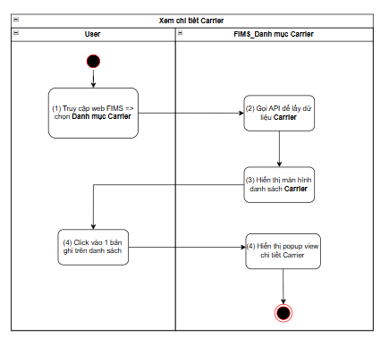
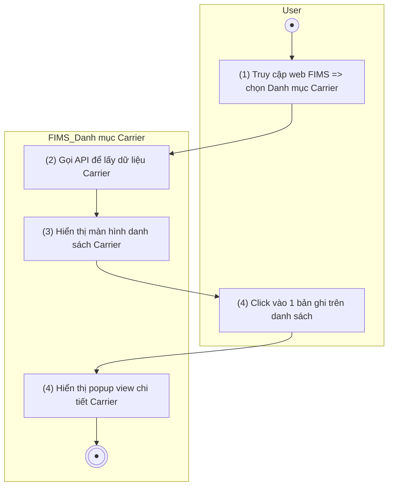
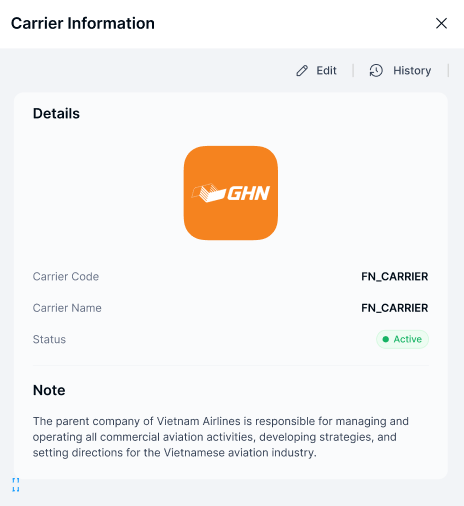

> **Ngữ cảnh chương (giữ nguyên từ nguồn):** mục `Data Maintenance (Danh mục dùng chung)`.

### Xem chi tiết Carrier

| **Tên chức năng: Xem chi tiết Carrier** | |
| --- | --- |
| **Mục đích** | Cho phép user Xem chi tiết Carrier |
| **Trigger** | Người dùng truy cập vào web FIMS => nhấn Danh mục => Carrier => nhấn vào 1 dòng Carrier bất kỳ |
| **Tiền điều kiện** | Người dùng đăng nhập thành công và được phân quyền xem phân hệ Carrier |
| **Hậu điều kiện** | Màn hình Xem chi tiết Carrier hiển thị |

#### Sơ đồ luồng hệ thống

1. Sơ đồ luồng hệ thống

#### Mô tả luồng xử lý

| **Bước** | **Chi tiết** |
| --- | --- |
| Bước 1 | User truy cập vào web FIMS => mở đến module Danh mục=> Carrier |
| Bước 2,3 | Hệ thống gọi API lấy dữ liệu Carrier, hiển thị màn hình [danh sách Carrier](TOSS.DM.CARRIER_LIST.FD.v0.1.md) trên giao diện |
| Bước 4 | User click vào 1 dòng bất kỳ trên [Danh sách Carrier](TOSS.DM.CARRIER_LIST.FD.v0.1.md) |
| Bước 5 | Hệ thống hiển thị popup Xem chi tiết Carrier |

#### Màn hình chức năng

1. Giao diện Xem chi tiết Carrier

#### Mô tả chi tiết màn hình

| **STT** | **Tên** | **Kiểu dữ liệu[Độ dài dữ liệu]** | **Mapping DB/API** | **Mô tả** |
| --- | --- | --- | --- | --- |
| **Thông tin chi tiết** | | | | |
| 1 | Tittle | Textview |  | * Hiển thị tittle: Carrier Information * Không cho chỉnh sửa |
| 2 | Logo | Textview |  | * Hiển thị logo Carier * Không cho chỉnh sửa |
| 3 | Carrier Code | Textview |  | * Hiển thị thông tin [Mã Carrier] theo dữ liệu API trả về * Trường hợp API trả về lỗi/rỗng: hiện **N/A** |
| 4 | Carrier Name | Textview |  | * Hiển thị thông tin [Carrier Name] theo dữ liệu API trả về * Trường hợp API trả về lỗi/rỗng: hiện **N/A** |
| 5 | Status | Textview |  | * Hiển thị thông tin [Trạng thái hoạt động] dưới dạng tagstatus theo dữ liệu API trả về * Trường hợp API trả về lỗi/rỗng: hiện **N/A** |
| 6 | Note | Textview |  | * Hiển thị thông tin [Ghi chú] theo dữ liệu API trả về * Trường hợp API trả về lỗi/rỗng: hiện **N/A** |
| 7 | Function | Textview |  | Bao gồm các function sau   * Sửa => Ẩn khi user không được phân quyền Sửa * Lịch sử => Ẩn khi user không được phân quyền Xem   Click function => mở màn hình chức năng tương ứng |

---

*Nguồn: tách trung thực từ `sec-24-quan-ly-danh-muc-carrier.md`, mục "Xem chi tiết Carrier" (bản trích text của `VNA.TOSS_SRS_Data Maintenance_v0.1.docx`, chương Data Maintenance (Danh mục dùng chung)) — tương ứng dòng **#19** bảng §1 của [CATALOG.md](../CATALOG.md). Không chỉnh sửa nội dung nguồn (CLAUDE.md §0). 🖼 Hình ảnh màn hình: xem file `VNA.TOSS_SRS_Data Maintenance_v0.1.docx` gốc.*
