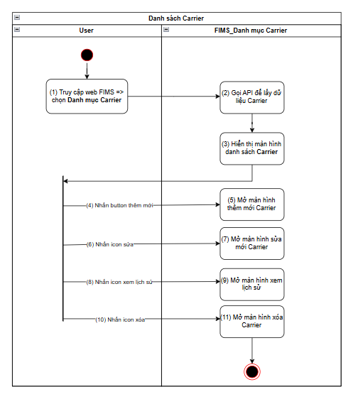
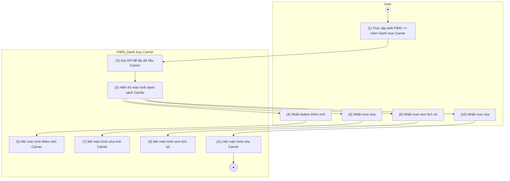
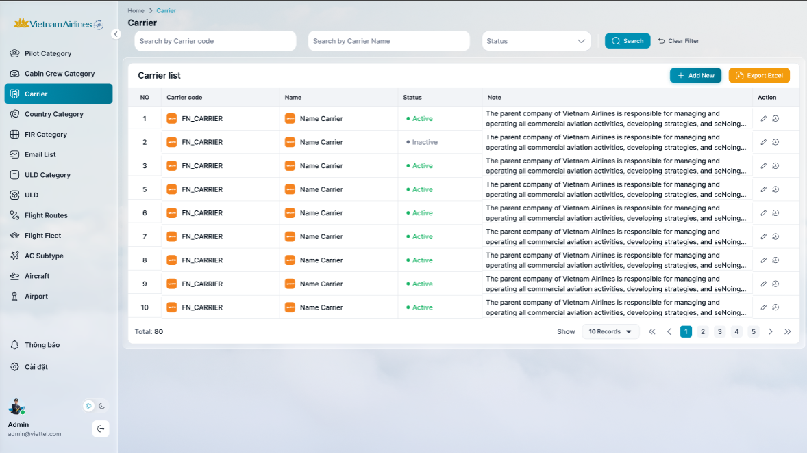
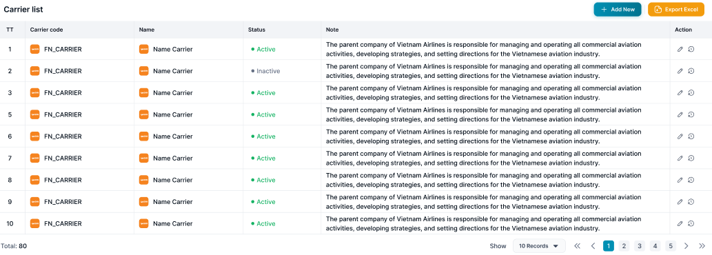

> **Ngữ cảnh chương (giữ nguyên từ nguồn):** mục `Data Maintenance (Danh mục dùng chung)`.

## Quản lý danh mục Carrier

### Xem danh sách Carrier

| **Tên chức năng: Danh sách Carrier** | |
| --- | --- |
| **Mục đích** | Cho phép user xem Danh sách Carrier |
| **Trigger** | Người dùng truy cập vào web FIMS => nhấn Danh mục=> Carrier |
| **Tiền điều kiện** | Người dùng đăng nhập thành công và được phân quyền xem Danh mục=> Carrier |
| **Hậu điều kiện** | Danh sách Carrier hiển thị trên giao diện |

#### Sơ đồ luồng hệ thống

1. Sơ đồ luồng hệ thống

#### Mô tả luồng xử lý

| **Bước** | **Chi tiết** |
| --- | --- |
| Bước 1 | User truy cập vào web FIMS => mở đến module Danh mục=>Carrier |
| Bước 2,3 | Hệ thống gọi API lấy dữ liệu Carrier và hiển thị lên giao diện |
| Bước 4,5 | User click “Thêm mới” => Hệ thống hiển thị màn hình [Thêm mới Carrier](TOSS.DM.CARRIER_ADD_EDIT.FD.v0.1.md) |
| Bước 6,7 | User click icon “Sửa” => Hệ thống hiển thị màn hình [Sửa Carrier](TOSS.DM.CARRIER_ADD_EDIT.FD.v0.1.md) |
| Bước 8,9 | User click icon “Xem lịch sử” => Hệ thống hiển thị màn hình [Xem lịch sử Carrier](TOSS.DM.CARRIER_HISTORY.FD.v0.1.md) |
| Bước 10,11 | User click icon “Xóa” => Hệ thống hiển thị màn hình [Xóa Carrier](TOSS.DM.CARRIER_DELETE.FD.v0.1.md) |

#### Màn hình chức năng

1. Giao diện Carrier

#### Mô tả chi tiết màn hình

| **STT** | **Tên** | **Kiểu dữ liệu[Độ dài dữ liệu]** | **Mapping DB/API** | **Mô tả** |
| --- | --- | --- | --- | --- |
| Title hệ thống | | * + [Tham chiếu Kịch bản title hệ thống](https://docs.google.com/document/d/1L5y0t4FCWe_vnNI65xNMRC-LM3lvLwYsQRAm_Nokv9A/edit?tab=t.0#bookmark=kix.f2nh07gdowb8) | | |
| Danh mục Carrier    FE call API lấy Danh sách Carrier mới nhất hiện tại để hiển thị trên giao diện người dùng | | | | |
| 1 | ~~Thêm mới~~  ~~~~ | Button |  | ~~Luôn Enble~~  ~~Click button, gọi chức năng [Thêm mới Carrier](TOSS.DM.CARRIER_ADD_EDIT.FD.v0.1.md)~~   * Click vào  * Hệ thống hiển thị trang thêm mới |
| 2 |  | Button |  | * Click vào => hệ thống thực hiện tạo file .xlsx để tải danh sách Carrier về máy * Tên file tải về: FIMS_Carrier_ddmmyyhhss * Nội dung file tải về: tải theo cột dữ liệu view từ bảng danh mục Carrier * Trường hợp tạo file lỗi => hiển thị toast báo lỗi    |
| **Tìm kiếm**   * Cơ chế Thu gọn/Mở rộng bộ lọc (Collapsible Fillter):   + [Tham chiếu kịch bản chức năng ẩn hiện filter](https://docs.google.com/document/d/1L5y0t4FCWe_vnNI65xNMRC-LM3lvLwYsQRAm_Nokv9A/edit?tab=t.0#heading=h.dgq51psil6dr)   ● Click vào dòng dưới tiêu đề các cột để chọn lọc, tìm kiếm thông tin theo dữ liệu tại cột tương ứng.  ● Trường hợp Searchbox không có dữ liệu: Mặc định tìm kiếm all dữ liệu tại cột đó  ● Người dùng thao tác thay đổi giá trị trường dữ liệu => click Enter/out focus box => hệ thống thực hiện:  ○ Reload dữ liệu table phù hợp với bộ lọc  ○ Set current page=1  ● Hiển thị kết quả tìm kiếm:  ○ Trường hợp API trả về data có KQ: hiển thị danh sách dữ liệu theo kết quả API trả về  Trường hợp API trả về data rỗng hoặc lỗi: Hiển thị bảng danh sách với **chân trang = Tất cả danh sách : 0** | | | | |
| 3 | Carrier code | Textview |  | ● Trường để lọc: Tìm kiếm gần đúng theo [Mã Carrier]  ● Maxlength 20 ký tự  ● Validate cho phép nhập chữ, số, và ký tự đặc biệt  ● Nếu dữ liệu nhập vượt quá độ dài ô => thay thế phần vượt quá bằng ký tự “...” và có tooltip hiển thị toàn bộ nội dung nhập  ● Nếu paste đoạn văn thì ghi nhận 20 ký tự đầu  ● Tự động TRIM Spaces đầu cuối khi tìm kiếm |
| 4 | Status | Dropdownlist |  | ● Trường để lọc: Tìm kiếm chính xác theo [Trạng thái hoạt động]  ● Giá trị chọn lọc, chỉ được chọn duy nhất 1 giá trị:  ○ Active  ○ Inactive  ● Nếu dữ liệu chọn vượt quá độ dài ô => thay thế phần vượt quá bằng ký tự “...” và có tooltip hiển thị toàn bộ nội dung nhập  Trường hợp Searchbox không có dữ liệu: Mặc định tìm kiếm all dữ liệu tại cột đó |
| 5 | Carrier Name | Text |  | * Trường để lọc: Tìm kiếm gần đúng theo [Carrier Name] * Maxlength 20 ký tự * Validate cho phép nhập chữ, số, và ký tự đặc biệt * Nếu dữ liệu nhập vượt quá độ dài ô => thay thế phần vượt quá bằng ký tự “...” và có tooltip hiển thị toàn bộ nội dung nhập * Nếu paste đoạn văn thì ghi nhận 20 ký tự đầu * Tự động TRIM Spaces đầu cuối khi tìm kiếm |
| 6 |  | Button |  | * Click vào  * Hệ thống lọc dữ liệu dựa trên nội dung trường lọc * Hệ thống trả về danh sách dữ liệu phù hợp với từ khoá tìm kiếm |
| 7 |  | Button |  | * Click vào  * Hệ thống   + Xoá nội dung search   + Reset toàn bộ truòng lọc đã chọn   + Reset phân trang về trang đầu * Hệ thống gọi API lấy danh sách dữ liệu mặc định * Hiển thị lại danh sách ban đầu |
| Chi tiết danh sách  ● Danh sách Carrier sắp xếp theo thứ tự tăng dần của mã Carrier  ● Khi user click vào 1 bản ghi bất kỳ → hiển thị màn hình [Xem chi tiết carrier](TOSS.DM.CARRIER_DETAIL.FD.v0.1.md) | | | | |
| 8 | TT | Textview |  | * Hiển thị STT bản ghi tăng dần |
| 9 | Logo-Carrier code | Textview |  | * Hiển thị thông tin logo kèm Mã Carrier theo dữ liệu API trả về * Hiển thị tối đa 2 dòng dữ liệu * View: logo-Mã * Nếu độ dài dữ liệu vượt quá 2 dòng, hiển thị ba chấm […] ở cuối dòng thứ 2 và có tooltip hiển thị toàn bộ nội dung |
| 10 | Logo-Carrier Name | Textview |  | * Hiển thị thông tin logo kèm Mã Carrier theo dữ liệu API trả về * Hiển thị tối đa 2 dòng dữ liệu * View: logo-Name * Nếu độ dài dữ liệu vượt quá 2 dòng, hiển thị ba chấm […] ở cuối dòng thứ 2 và có tooltip hiển thị toàn bộ nội dung |
| 11 | Status | Textview |  | * Hiển thị TagStatus theo dữ liệu API trả về   + Status=Active: Tag màu xanh lá   + Status=Inactive: Tag màu xám   + Người dùng [Admin]: mặc định = [Active] |
| 12 | Note | Textview |  | * Hiển thị ghi chú theo dữ liệu API trả về * Hiển thị tối đa 2 dòng dữ liệu * Nếu độ dài dữ liệu vượt quá 2 dòng, hiển thị ba chấm […] ở cuối dòng thứ 2 và có tooltip hiển thị toàn bộ nội dung |
| 13 | Action | Button |  | Bao gồm các function sau   * Sửa => Ẩn khi user không được phân quyền Sửa * Lịch sử => Ẩn khi user không được phân quyền Xem   Click function => mở màn hình chức năng tương ứng |
| 14 | Footer | Pagination |  | [Theo kịch bản phân trang](https://docs.google.com/document/d/1L5y0t4FCWe_vnNI65xNMRC-LM3lvLwYsQRAm_Nokv9A/edit?tab=t.0#heading=h.abyqd0hrl467) |

---

*Nguồn: tách trung thực từ `sec-24-quan-ly-danh-muc-carrier.md`, mục "Xem danh sách Carrier" (bản trích text của `VNA.TOSS_SRS_Data Maintenance_v0.1.docx`, chương Data Maintenance (Danh mục dùng chung)) — tương ứng dòng **#17** bảng §1 của [CATALOG.md](../CATALOG.md). Không chỉnh sửa nội dung nguồn (CLAUDE.md §0). 🖼 Hình ảnh màn hình: xem file `VNA.TOSS_SRS_Data Maintenance_v0.1.docx` gốc.*
