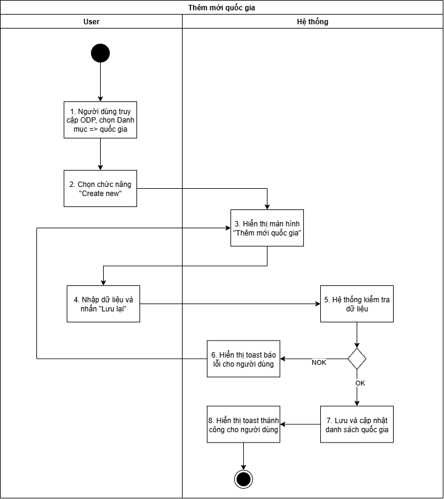
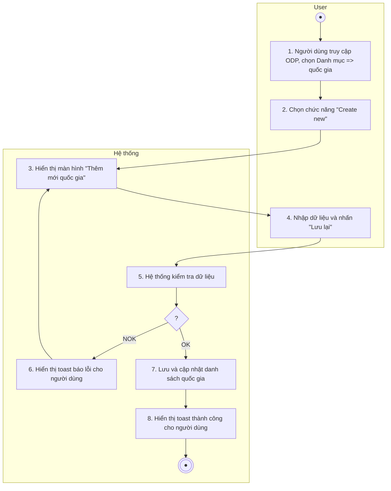
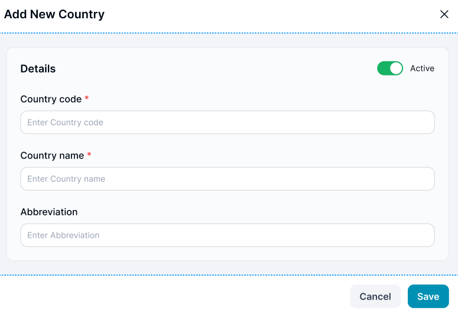

> **Ngữ cảnh chương (giữ nguyên từ nguồn):** mục `Data Maintenance (Danh mục dùng chung)`.

### Thêm mới Quốc gia

| **Tên chức năng: Thêm mới Quốc gia** | |
| --- | --- |
| **Mục đích** | Cho phép user Thêm mới quốc gia |
| **Trigger** | Người dùng truy cập vào web FIMS => nhấn phân hệ Danh mục => Nhấn chọn Quốc gia => Chọn button “Thêm mới” |
| **Tiền điều kiện** | Người dùng đăng nhập thành công và được phân quyền thêm quốc gia |
| **Hậu điều kiện** | Thêm mới thành công quốc gia |

#### Sơ đồ luồng hệ thống

1. Sơ đồ luồng hệ thống thêm mới quốc gia

#### Mô tả luồng xử lý

| **STT** | **Bước** | **Chi tiết** |
| --- | --- | --- |
|  | Bước 1 | Người dùng truy cập vào web FIMS =>Chọn tab Danh mục => Chọn”quốc gia” |
|  | Bước 2 | Người dùng chọn button “Thêm mới” |
|  | Bước 3 | Hệ thống hiển thị màn hình Thêm mới Quốc gia |
|  | Bước 4 | User nhập dữ liệu và nhấn **Lưu lại** |
|  | Bước 5 | Hệ thống kiểm tra dữ liệu, nếu:   * Trường hợp thiếu dữ liệu bắt buộc/Sai định dạng valid/Call API tạo mới quốc gia cho FIMS có lỗi => Báo lỗi theo bước 6 * Ngược lại: Tạo mới quốc gia thành công => Thực hiện tiếp bước 7 & 8 |
|  | Bước 6 | Hiển thị toast báo lỗi cho người dùng:   * Trường hợp thiếu trường bắt buộc: Hiển thị inline message (IM) tại trường có lỗi [VL004](https://docs.google.com/document/d/1L5y0t4FCWe_vnNI65xNMRC-LM3lvLwYsQRAm_Nokv9A/edit?tab=t.0#bookmark=kix.oq8nkssherqj) * Trường hợp Sai định dạng valid: Hiển thị IM tại trường có lỗi [VL006](https://docs.google.com/document/d/1L5y0t4FCWe_vnNI65xNMRC-LM3lvLwYsQRAm_Nokv9A/edit?tab=t.0#bookmark=kix.lwrynb3cmu73) * Trường hợp Call API tạo mới trả về lỗi: hiển thị toast message (TM)   + Trường hợp lỗi API trả về có message: hiện [TB020](https://docs.google.com/document/d/1L5y0t4FCWe_vnNI65xNMRC-LM3lvLwYsQRAm_Nokv9A/edit?tab=t.0#bookmark=kix.zi1hm3rguphh)   + Hoặc hiện [TB021](https://docs.google.com/document/d/1L5y0t4FCWe_vnNI65xNMRC-LM3lvLwYsQRAm_Nokv9A/edit?tab=t.0#bookmark=kix.3pbjinevz4c0) |
|  | Bước 7 | Trường hợp tạo quốc gia thành công: BE Lưu và cập nhật [danh sách quốc gia](TOSS.DM.COUNTRY_LIST.FD.v0.1.md)  Trả API thành công cho FE |
|  | Bước 8 | FE Hiển thị toast thành công cho người dùng[TB019](https://docs.google.com/document/d/1L5y0t4FCWe_vnNI65xNMRC-LM3lvLwYsQRAm_Nokv9A/edit?tab=t.0#bookmark=kix.spmzvpry3i7f)  Đóng popup Tạo mới, tự động refresh màn danh sách và hiển thị [Danh sách quốc gia](TOSS.DM.COUNTRY_LIST.FD.v0.1.md) mới nhất |

#### Màn hình chức năng

1. Giao diện thêm mới quốc gia

#### Mô tả chi tiết màn hình

| **STT** | **Tên** | **Kiểu dữ liệu [Độ dài dữ liệu]** | **Mapping DB/API** | **Mô tả** |
| --- | --- | --- | --- | --- |
|  | Title | Textview |  | * Text cứng “Thêm mới Quốc gia” |
|  | Icon X | Icon |  | * Click icon → Đóng popup. Điều hướng về màn trước đó |
| 3. |  | Toggle Switch |  | * Mặc định: Active * TH On Toggle Switch button: **Active** * Ngược lại: **Inactive** * Update Toggle switch button **Hoạt động** thành **Active/Inactive** tương ứng trạng thái |
|  | Country code | TextBox [0;20] | country_code/countryCode | * Mặc định: Để trống và cho nhập thông tin * Placeholder “Nhập mã Quốc gia” * Bắt buộc nhập * Maxlength 20 ký tự. Chặn nếu nhập quá 20 ký tự * Nếu paste đoạn văn > 20 ký tự, chỉ nhận 20 ký tự đầu tiên * Tự động TRIM Spaces đầu cuối khi out focus box * Validate   + Cho phép nhập chữ, số, dấu gạch ngang [-]; dấu gạch dưới [_]; dấu chấm [.]; dấu gạch chéo [/]   + Chặn trùng dữ liệu * Trường hợp nội dung dài vượt quá độ rộng box => di chuột vào hiện tooltips hiển thị full nội dung * **Action**: Nhấn Enter/out focus/click button **Save**, hệ thống validate, nếu   + Để trống ⇒ Hiển thị thông báo IM: [VL004](https://docs.google.com/document/d/1L5y0t4FCWe_vnNI65xNMRC-LM3lvLwYsQRAm_Nokv9A/edit?tab=t.0#bookmark=kix.oq8nkssherqj)   + Trường hợp nhập mã quốc gia đã tồn tại trong hệ thống. => Hiển thị thông báo IM: [VL007](https://docs.google.com/document/d/1L5y0t4FCWe_vnNI65xNMRC-LM3lvLwYsQRAm_Nokv9A/edit?tab=t.0#bookmark=kix.s6302mi8qdnp) |
|  | Country name | TextBox [0;100] | country_name/countryName | Mặc định: Để trống và cho nhập thông tin  Placeholder “Nhập tên Quốc gia”  Bắt buộc nhập  Maxlength 100 ký tự. Chặn nếu nhập quá 100 ký tự  Nếu paste đoạn văn > 100 ký tự, chỉ nhận 100 ký tự đầu tiên  Tự động TRIM Spaces đầu cuối khi out focus box  Validate   * + Cho phép nhập chữ, số, dấu gạch ngang [-]; dấu gạch dưới [_]; dấu chấm [.]; dấu gạch chéo [/]   + Chặn trùng dữ liệu   Trường hợp nội dung dài vượt quá độ rộng box => di chuột vào hiện tooltips hiển thị full nội dung  Action: Nhấn Enter/out focus/click button Save, hệ thống validate, nếu   * + Để trống ⇒ Hiển thị thông báo IM: [VL004](https://docs.google.com/document/d/1L5y0t4FCWe_vnNI65xNMRC-LM3lvLwYsQRAm_Nokv9A/edit?tab=t.0#bookmark=kix.oq8nkssherqj)   + Trường hợp nhập tên quốc gia đã tồn tại trong hệ thống. => Hiển thị thông báo IM: [VL007](https://docs.google.com/document/d/1L5y0t4FCWe_vnNI65xNMRC-LM3lvLwYsQRAm_Nokv9A/edit?tab=t.0#bookmark=kix.s6302mi8qdnp) |
|  | Abbreviation | TextBox [0;100] | abbreviation_name/abbreviationName | * Mặc định: Để trống và cho nhập thông tin * Placeholder “Nhập tên viết tắt” * Không bắt buộc nhập * Maxlength 100 ký tự. Chặn nếu nhập quá 100 ký tự * Nếu paste đoạn văn > 100 ký tự, chỉ nhận 100 ký tự đầu tiên * Tự động TRIM Spaces đầu cuối khi out focus box * Validate   + Cho phép nhập chữ, số, dấu gạch ngang [-]; dấu gạch dưới [_]; dấu chấm [.]; dấu gạch chéo [/] * Trường hợp nội dung dài vượt quá độ rộng box => di chuột vào hiện tooltips hiển thị full nội dung * Action: Nhấn Enter/out focus/click button Save, hệ thống validate, nếu   + Để trống ⇒ Hiển thị thông báo IM: [VL004](https://docs.google.com/document/d/1L5y0t4FCWe_vnNI65xNMRC-LM3lvLwYsQRAm_Nokv9A/edit?tab=t.0#bookmark=kix.oq8nkssherqj) |
|  | Cancel | Button | btn_cancel | * Click → Đóng popup. Điều hướng về màn trước đó * Dữ liệu không được lưu vào DB |
|  | Save | Button | btn_save | * Click vào. Hệ thống kiểm tra   + [quốc gia] đã tồn tại trong DB. Hiển thị toast message [TB020](https://docs.google.com/document/d/1L5y0t4FCWe_vnNI65xNMRC-LM3lvLwYsQRAm_Nokv9A/edit?tab=t.0#bookmark=kix.zi1hm3rguphh) và giữ nguyên màn popup   + Dữ liệu hợp lệ, hệ thống lưu thành công và hiển thị toast message [TB019](https://docs.google.com/document/d/1L5y0t4FCWe_vnNI65xNMRC-LM3lvLwYsQRAm_Nokv9A/edit?tab=t.0#bookmark=kix.spmzvpry3i7f)     - Lưu thông tin thành công → Đóng popup. Điều hướng về màn danh sách     - Dữ liệu lưu trong DB |

---

*Nguồn: tách trung thực từ `sec-25-quan-ly-danh-muc-quoc-gia.md`, mục "Thêm mới Quốc gia" (bản trích text của `VNA.TOSS_SRS_Data Maintenance_v0.1.docx`, chương Data Maintenance (Danh mục dùng chung)) — tương ứng dòng **#23** bảng §1 của [CATALOG.md](../CATALOG.md). Không chỉnh sửa nội dung nguồn (CLAUDE.md §0). 🖼 Hình ảnh màn hình: xem file `VNA.TOSS_SRS_Data Maintenance_v0.1.docx` gốc.*
