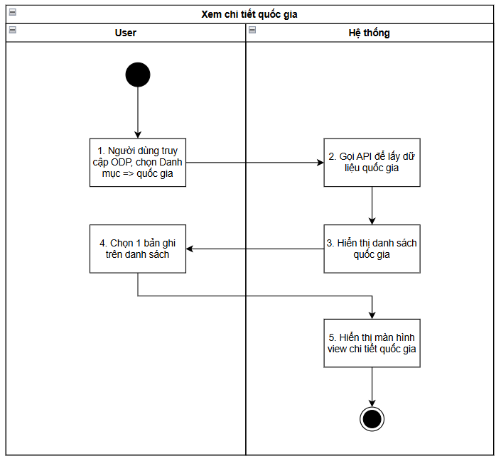
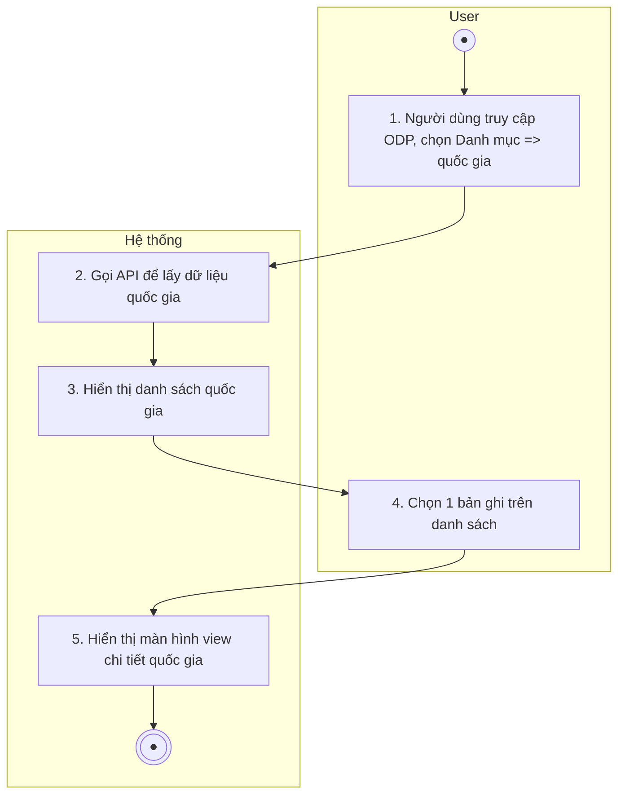
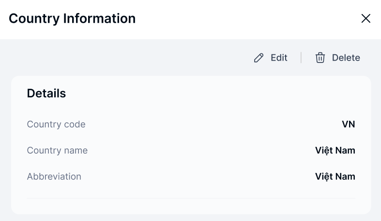

> **Ngữ cảnh chương (giữ nguyên từ nguồn):** mục `Data Maintenance (Danh mục dùng chung)`.

### Xem chi tiết Quốc gia

| **Tên chức năng: Xem chi tiết quốc gia** | |
| --- | --- |
| **Mục đích** | Cho phép user Xem chi tiết Quốc gia |
| **Trigger** | Người dùng truy cập vào web FIMS => mở đến module Quốc gia => click vào 1 bản ghi bất kỳ |
| **Tiền điều kiện** | Người dùng đăng nhập thành công và được phân quyền Danh mục Quốc gia |
| **Hậu điều kiện** | Mở màn hình Xem chi tiết Quốc gia-Thông tin Quốc gia trên giao diện người dùng |

#### Sơ đồ luồng hệ thống

1. Sơ đồ luồng xem chi tiết quốc gia

#### Mô tả luồng xử lý

| **STT** | **Bước** | **Chi tiết** |
| --- | --- | --- |
|  | Bước 1 | Truy cập web FIMS => mở đến Danh mục quốc gia |
|  | Bước 2 | Hệ thống call API xuống BE lấy [danh sách quốc gia](TOSS.DM.COUNTRY_LIST.FD.v0.1.md) |
|  | Bước 3 | Hiển thị [danh sách quốc gia](TOSS.DM.COUNTRY_LIST.FD.v0.1.md) trên giao diện người dùng |
|  | Bước 4 | User click vào 1 bản ghi trên danh sách |
|  | Bước 5 | Hiển thị màn hình Xem chi tiết quốc gia |

#### Màn hình chức năng

1. Giao diện xem chi tiết quốc gia

#### Mô tả chi tiết màn hình

| **STT** | **Tên** | **Kiểu dữ liệu [Độ dài dữ liệu]** | **Mapping DB/API** | **Mô tả** |
| --- | --- | --- | --- | --- |
|  | Title | Textview |  | * Text cứng “Country Information” |
|  | Icon X | Icon |  | * Click icon → Đóng popup. Điều hướng về màn trước đó |
|  |  | Button | btn_edit | * Click button=> Hiển thị popup [Sửa quốc gia](TOSS.DM.COUNTRY_EDIT.FD.v0.1.md) |
|  |  | Button | btn_delete | * Click button=> Hiển thị popup [Xóa quốc gia](TOSS.DM.COUNTRY_DELETE.FD.v0.1.md) |
| Thông tin chi tiết | | | | |
|  | Country code | Textview | country_code/countryCode | Hiển thị [countryCode] theo dữ liệu API trả về  Trường hợp API trả về rỗng/lỗi: để trống trường |
|  | Country name | Textview | country_name/countryName | Hiển thị [countryName] theo dữ liệu API trả về  Trường hợp API trả về rỗng/lỗi: để trống trường |
|  | Abbreviation | Textview | abbreviation_name/abbreviationName | Hiển thị [abbreviationName] theo dữ liệu API trả về  Trường hợp API trả về rỗng/lỗi: để trống trường |

---

*Nguồn: tách trung thực từ `sec-25-quan-ly-danh-muc-quoc-gia.md`, mục "Xem chi tiết Quốc gia" (bản trích text của `VNA.TOSS_SRS_Data Maintenance_v0.1.docx`, chương Data Maintenance (Danh mục dùng chung)) — tương ứng dòng **#26** bảng §1 của [CATALOG.md](../CATALOG.md). Không chỉnh sửa nội dung nguồn (CLAUDE.md §0). 🖼 Hình ảnh màn hình: xem file `VNA.TOSS_SRS_Data Maintenance_v0.1.docx` gốc.*
