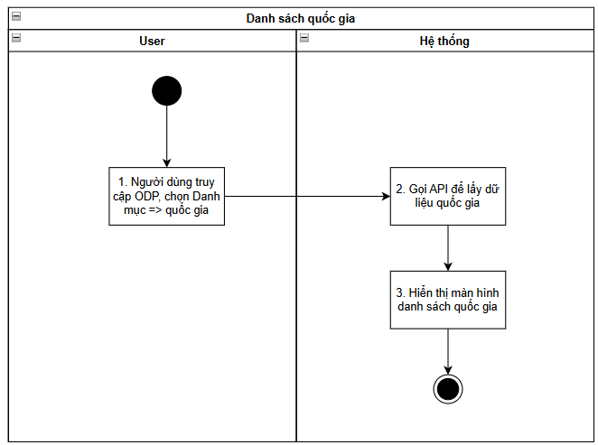
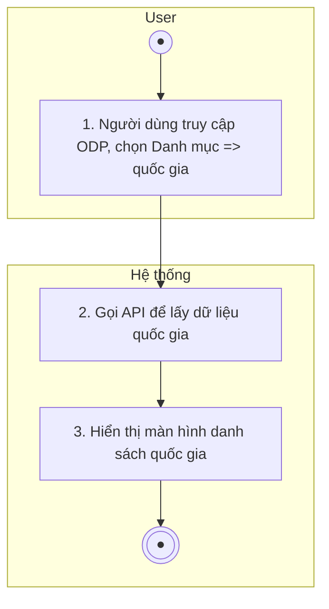
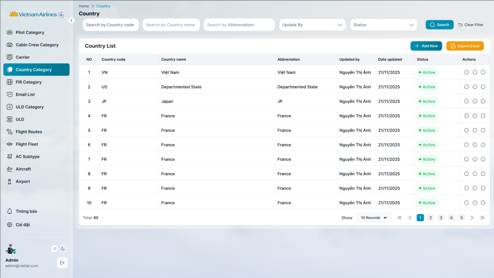
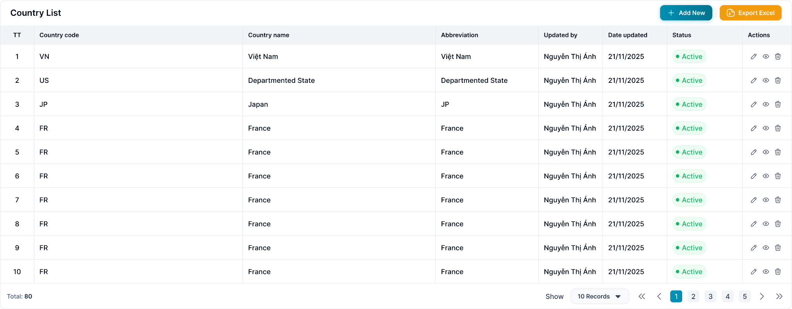

> **Ngữ cảnh chương (giữ nguyên từ nguồn):** mục `Data Maintenance (Danh mục dùng chung)`.

## Quản lý danh mục Quốc gia

### Xem danh sách Quốc gia

| **Tên chức năng: Quốc gia** | |
| --- | --- |
| **Mục đích** | Cho phép user Xem danh sách Quốc gia |
| **Trigger** | Người dùng truy cập vào web FIMS => mở đến module Danh mục/ Quốc gia |
| **Tiền điều kiện** | Người dùng đăng nhập thành công và được phân quyền Danh mục Quốc gia |
| **Hậu điều kiện** | Mở màn hình danh sách Quốc gia trên giao diện người dùng |

#### Sơ đồ luồng hệ thống

1. Sơ đồ luồng hệ thống danh mục Quốc gia

#### Mô tả luồng xử lý

| **Bước** | **Chi tiết** |
| --- | --- |
|  | Truy cập web FIMS => mở đến module Danh mục/Danh mục Quốc gia |
|  | Hệ thống call API xuống BE lấy danh sách Quốc gia |
|  | Hiển thị danh sách Quốc gia trên giao diện người dùng |

#### Màn hình chức năng

1. Giao diện danh mục quốc gia

#### Mô tả chi tiết màn hình

| **STT** | **Tên** | **Kiểu dữ liệu [Độ dài dữ liệu]** | **Mapping DB/API** | **Mô tả** |
| --- | --- | --- | --- | --- |
|  | Title hệ thống |  |  | * + [Tham chiếu Kịch bản title hệ thống](https://docs.google.com/document/d/1L5y0t4FCWe_vnNI65xNMRC-LM3lvLwYsQRAm_Nokv9A/edit?tab=t.0#bookmark=kix.f2nh07gdowb8) |
| Danh sách quốc gia    FE call API lấy lại DS quốc gia mới nhất hiện tại để hiển thị trên giao diện người dùng | | | | |
|  | Country List | Title |  | * Fix cứng text “Country List” |
|  |  | Button | btn_export | * Click vào => hệ thống thực hiện tạo file .xlsx để tải danh sách Quốc gia về máy * Tên file tải về: FIMS_quốc_gia_ddmmyyhhmm * File: [Danh mục Quốc gia](https://docs.google.com/spreadsheets/d/1FJZe9WbwiHNjY_RbOOQedL3SNUiT7BvPoj0uKJzis-s/edit?gid=0#gid=0) * Nội dung file tải về: tải theo cột dữ liệu view từ bảng Quốc gia |
|  |  | Button | btn_create | * Click button → Mở popup “Thêm mới” |
|  | **Tìm kiếm**  ****   * Cơ chế Thu gọn/Mở rộng bộ lọc (Collapsible Fillter):   + [Tham chiếu kịch bản chức năng ẩn hiện filter](https://docs.google.com/document/d/1L5y0t4FCWe_vnNI65xNMRC-LM3lvLwYsQRAm_Nokv9A/edit?tab=t.0#heading=h.dgq51psil6dr) * Click vào dòng dưới tiêu đề các cột để chọn lọc, tìm kiếm thông tin theo dữ liệu tại cột tương ứng. * Trường hợp Searchbox không có dữ liệu: Mặc định tìm kiếm all dữ liệu tại cột đó * Người dùng thao tác thay đổi giá trị trường dữ liệu => click Enter/out focus box => hệ thống thực hiện:   + Reload dữ liệu table phù hợp với bộ lọc   + Set current page=1 * Hiển thị kết quả tìm kiếm:   + Trường hợp API trả về data có KQ: hiển thị danh sách dữ liệu theo kết quả API trả về   + Trường hợp API trả về data rỗng hoặc lỗi: Hiển thị bảng danh sách với **chân trang = Tất cả danh sách : 0** | | | |
|  | ~~Mã quốc gia~~  Country code | Textbox | country_code/countryCode | * Trường để lọc: Tìm kiếm gần đúng theo [countryCode] * Maxlength 20 ký tự * Validate cho phép nhập chữ, số, và ký tự đặc biệt * Nếu dữ liệu nhập vượt quá độ dài ô => thay thế phần vượt quá bằng ký tự “...” và có tooltip hiển thị toàn bộ nội dung nhập * Nếu paste đoạn văn thì ghi nhận 20 ký tự đầu * Tự động TRIM Spaces đầu cuối khi tìm kiếm |
|  | ~~Tên quốc gia~~  Country Name | Textbox | country_name/countryName | * Trường để lọc: Tìm kiếm gần đúng theo [countryName] * Maxlength 100 ký tự * Validate cho phép nhập chữ, số, và ký tự đặc biệt * Nếu dữ liệu nhập vượt quá độ dài ô => thay thế phần vượt quá bằng ký tự “...” và có tooltip hiển thị toàn bộ nội dung nhập * Nếu paste đoạn văn thì ghi nhận 100 ký tự đầu * Tự động TRIM Spaces đầu cuối khi tìm kiếm |
|  | ~~Tên viết tắt~~  Abbreviation | Textbox | abbreviation_name/abbreviationName | * Trường để lọc: Tìm kiếm gần đúng theo [abbreviationName] * Maxlength 100 ký tự * Validate cho phép nhập chữ, số, và ký tự đặc biệt * Nếu dữ liệu nhập vượt quá độ dài ô => thay thế phần vượt quá bằng ký tự “...” và có tooltip hiển thị toàn bộ nội dung nhập * Nếu paste đoạn văn thì ghi nhận 100 ký tự đầu * Tự động TRIM Spaces đầu cuối khi tìm kiếm |
|  | Updated by | Combo box | updated_by/updateBy | * Trường để lọc: Tìm kiếm chọn chính xác theo [updateBy] * Các giá trị tìm kiếm bao gồm: Danh sách user được phần quyền thao tác trên phân hệ Quản lý nhóm người dùng/FIMS * Nếu dữ liệu nhập vượt quá độ dài ô => thay thế phần vượt quá bằng ký tự “...” và có tooltip hiển thị toàn bộ nội dung nhập |
|  | Status | Dropdownlist [Đang hoạt động, Ngừng hoạt động] | status | * Trường để lọc: Tìm kiếm chính xác theo [status] * Các giá trị lựa chọn:   + Đang hoạt động   + Ngừng hoạt động |
|  |  | Button |  | * Click vào  * Hệ thống thực hiện lọc dữ liệu dựa trên từ khoá * Hệ thống trả về danh sách dữ liệu phù hợp với từ khoá tìm kiếm |
|  |  | Button |  | * Click vào  * Hệ thống:   + Xoá nội dung search   + Reset toàn trường lọc đã chọn   + Reset phân trang về trang đầu * Hệ thống gọi API lấy dánh sách dữ liệu mặc định * Hiển thị lại danh sách ban đầu |
|  | Chi tiết danh sách   * Hệ thống call API xuống BE, lấy danh sách quốc gia   → hiển thị danh sách quốc gia trên màn hình   * Danh sách PC sắp xếp theo thứ tự α-β của trường Mã quốc gia * Khi user click vào 1 bản ghi bất kỳ → hiển thị màn hình [Xem chi tiết quốc gia](TOSS.DM.COUNTRY_DETAIL.FD.v0.1.md) | | | |
|  | TT | Textview |  | * Hiển thị STT tăng dần theo số lượng bản ghi |
|  | Country Code | Textview | country_code/countryCode | * Hiển thị [countryCode] theo dữ liệu API trả về * Hiển thị tối đa 2 dòng dữ liệu * Nếu độ dài dữ liệu vượt quá 2 dòng, hiển thị ba chấm […] ở cuối dòng thứ 2 và có tooltip hiển thị toàn bộ nội dung |
|  | Country Name | Textview | country_name/countryName | * Hiển thị [countryName] theo dữ liệu API trả về * Hiển thị tối đa 2 dòng dữ liệu * Nếu độ dài dữ liệu vượt quá 2 dòng, hiển thị ba chấm […] ở cuối dòng thứ 2 và có tooltip hiển thị toàn bộ nội dung |
|  | Abbreviation Name | Textview | abbreviation_name/abbreviationName | * Hiển thị [abbreviationName] theo dữ liệu API trả về * Hiển thị tối đa 2 dòng dữ liệu * Nếu độ dài dữ liệu vượt quá 2 dòng, hiển thị ba chấm […] ở cuối dòng thứ 2 và có tooltip hiển thị toàn bộ nội dung * Trường hợp API trả về rỗng/lỗi: để trống trường |
|  | Updated By | Textview | updated_by/updateBy | * Hiển thị thông tin người cập nhật dữ liệu * Nội dung bao gồm * Updated By Name] * Updated By code] |
|  | Date updated | Textview | updated_at/updateAt | * Hiển thị thời gian cập nhật dữ liệu * Định dạng dd/mm/yyyy hh:mm |
|  | Status | Textview | status | * Hiển thị thông tin [status] dưới dạng tag status theo dữ liệu API trả về   + Status=Active: Tag màu xanh lá   + Status=Is active: Tag màu xám |
|  | Actions | Button |  | Bao gồm các function sau   * Sửa => Ẩn khi user không được phân quyền Sửa * Lịch sử => Ẩn khi user không được phân quyền Xem * Xoá => Ẩn khi user không được phân quyền Xoá   Click function => mở màn hình chức năng tương ứng |
|  | Footer | Pagination |  | [Theo kịch bản phân trang](https://docs.google.com/document/d/1L5y0t4FCWe_vnNI65xNMRC-LM3lvLwYsQRAm_Nokv9A/edit?tab=t.0#heading=h.abyqd0hrl467) |

---

*Nguồn: tách trung thực từ `sec-25-quan-ly-danh-muc-quoc-gia.md`, mục "Xem danh sách Quốc gia" (bản trích text của `VNA.TOSS_SRS_Data Maintenance_v0.1.docx`, chương Data Maintenance (Danh mục dùng chung)) — tương ứng dòng **#22** bảng §1 của [CATALOG.md](../CATALOG.md). Không chỉnh sửa nội dung nguồn (CLAUDE.md §0). 🖼 Hình ảnh màn hình: xem file `VNA.TOSS_SRS_Data Maintenance_v0.1.docx` gốc.*
