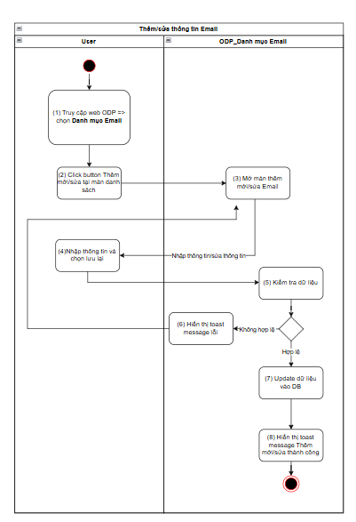
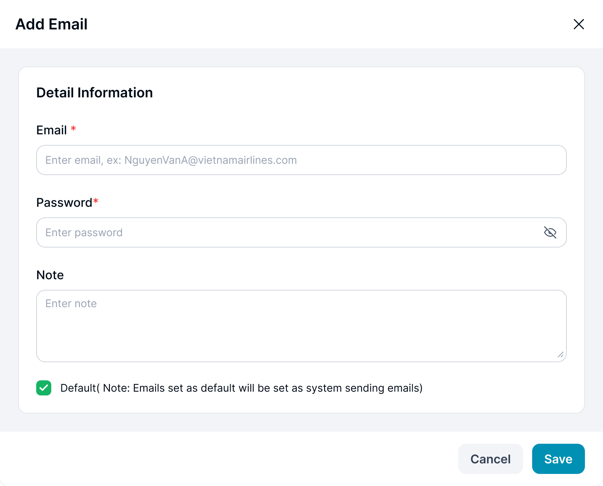
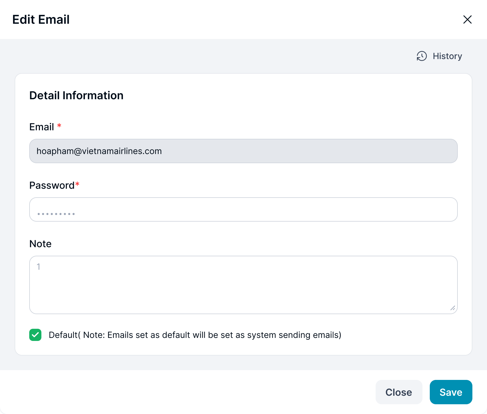

> **Ngữ cảnh chương (giữ nguyên từ nguồn):** mục `Data Maintenance (Danh mục dùng chung)`.

### Thêm mới/Sửa Email

| **Tên chức năng: Add/ Edit Email** | |
| --- | --- |
| **Mục đích** | Cho phép user Add/ Edit Email |
| **Trigger** | Người dùng truy cập vào web FIMS => Danh mục => Email => nhấn Add new hoặc chọn icon “ Edit” để Edit Email |
| **Tiền điều kiện** | Người dùng đăng nhập thành công và được phân quyền Add/Edit Email trên phân hệ Email của Danh mục |
| **Hậu điều kiện** | Màn hình Add/ Edit Email |

#### Sơ đồ luồng hệ thống

Hình 27. Sơ đồ luồng hệ thống

#### Mô tả luồng xử lý

| **Bước** | **Chi tiết** |
| --- | --- |
| 1 | * User truy cập vào web FIMS => mở đến module Danh mục => Chọn Email   => hiển thị màn hình [Danh sách Email](TOSS.DM.EMAIL_LIST.FD.v0.1.md) |
| 2 | * User click button Add new hoặc icon “ Edit” tại Email muốn chỉnh sửa |
| 3 | * Hệ thống hiển thị màn hình Add/ Edit Email * Cho phép User thêm Email hoặc chỉnh sửa thông tin Email |
| 4 | * User nhập dữ liệu/update dữ liệu và nhấn **Lưu lại** |
| 5 | * Hệ thống kiểm tra dữ liệu, nếu:   + Dữ liệu không hợp lệ: chuyển sang bước 6   + Ngược lại chuyển sang bước 7 |
| 6 | * Hiển thị toast message lỗi đến người dùng |
| 7 | * Update dữ liệu vào DB |
| 8 | Hiển thị toast message Thêm mới/Sửa thành công; Đóng màn hình Thêm mới/ Sửa |

#### Màn hình chức năng

Hình 28. Giao diện Add Email

Hình 29. Giao diện Edit Email

#### Mô tả chi tiết màn hình

| **STT** | **Tên** | **Kiểu dữ liệu [Độ dài dữ liệu]** | **Mapping DB/API** | **Mô tả** |
| --- | --- | --- | --- | --- |
|  | Email | Textbox  [0;100] | email | * TH **Add**:   + Mặc định: Để trống, cho phép nhập   + Placeholder “Enter email, ex: NguyenVanA@vietnamairlines.com”   + Bắt buộc nhập * TH **Edit**: Hiển thị [email ] **cho phép chỉnh sửa Email** * **Validate:**   + Maxlength 100 ký tự. Chặn nếu nhập quá 100 ký tự   + Nhận ký tự chữ cái, số và ký tự đặc biệt, nhập định dạng mail: @vietnamairlines.com   + Nếu dữ liệu nhập vượt quá độ dài ô => thay thế phần vượt quá bằng ký tự “...” và có tooltip hiển thị toàn bộ nội dung nhập   + Nếu paste đoạn văn thì nhận 100 ký tự đầu   + Tự động TRIM Spaces đầu cuối khi out focus box * **Action**: Nhấn Enter/out focus/click button **Save**, hệ thống validate, nếu   + Để trống ⇒ Hiển thị thông báo inline:” Please enter email”   + Trường hợp **Email đã tồn tại** ⇒ Hiển thị thông báo toast: “Email already exists”   + Dữ liệu nhập không có domain mail nội bộ @viettnamairlines.com, sai ký tự ⇒ Hiển thị thông báo IM: “Email is not in correct format.” |
|  | Password | Textbox  [8;32] | password | ● TH **Add**:  o Mặc định: Để trống, cho phép nhập  o Placeholder “Enter password”  o Bắt buộc nhập  o Click => hiển thị mật khẩu trong box, icon chuyển sang trạng thái . Nhấn icon => ẩn mật khẩu và đổi lại icon  ● TH **Edit**: Hiển thị [ Password ở dạng mã hóa], cho phép xóa trắng hoặc chỉnh sửa  ● **Validate chung**:  o Validate độ dài 32 ký tự, chặn khi nhập quá 32 ký tự, Minlength=8 ký tự  o Nhận ký tự chữ cái, số và ký tự đặc biệt, Mật khẩu phải có ít nhất một chữ cái hoa, một chữ cái thường, một chữ số, và một ký tự đặc biệt (ví dụ: @, #, $, %, &).  o Nếu paste đoạn văn > 32 ký tự, chỉ nhận 32 ký tự đầu tiên  o Tự động TRIM Spaces đầu cuối khi out focus box  o Tự động mã hóa dữ liệu và hiển thị … khi người dùng nhập mật khẩu  ● **Action**: Nhấn Enter/out focus/click button **Save**, hệ thống validate, nếu   * Để trống ⇒ Hiển thị thông báo IM: “Please enter password” * Nhập thiếu ký tự mật khẩu, không bao gồm đầy đủ các ký tự quy định=> Hệ thống hiển thị thông báo IM “Password is not in correct format” |
|  | Note | Textbox  [0;3000] | note | 1. TH **Add**:    1. Mặc định: Để trống và cho nhập thông tin    2. Placeholder “Enter note”    3. Không bắt buộc nhập  * TH **Edit**: Hiển thị [note] * **Validate chung**:  1. Maxlength 3000 ký tự. Chặn nếu nhập quá 3000 ký tự 2. Nhận dữ liệu chữ, số, và ký tự đặc biệt 3. Nếu dữ liệu nhập vượt quá độ dài ô => thay thế phần vượt quá bằng ký tự “...” và có tooltip hiển thị toàn bộ nội dung nhập 4. Nếu paste đoạn văn thì ghi nhận 3000 ký tự đầu 5. Tự động TRIM Spaces đầu cuối khi out focus box  * **Action**: Nhấn Enter/out focus/click button **Save**, hệ thống lưu thông tin ghi chú * Không có thông tin, lưu trống |
|  | Set default | Checkbox | set_default | * Text: Default( Note: Emails set as default will be set as system sending emails) * TH **Add**: Mặc định uncheck * Th **Edit**: Hiển thị thông tin [set default], cho phép check-uncheck |
|  | History( với TH Edit) | Button | btn_history | * Gọi chức năng [Xem lịch sử Email](TOSS.DM.EMAIL_HISTORY.FD.v0.1.md) |
|  | Cancel/Close | Button | btn_cancel/  btn_close | * Close với màn hình **Edit** * Cancel với màn hình **Add** * Luôn enable, click button đóng giao diện Add/ Edit, hệ thống không xử lý gì thêm, trở ra màn hình danh sách Giải pháp |
|  | Save | Button | btn_save | Click:   * + Đóng màn hình Add/Edit   + Call API Update dữ liệu Email vào database   + Hiển thị màn hình thông báo kết quả update nếu:     - Response API trả về status 200: hiển thị toast message thành công: [TB019](https://docs.google.com/document/d/1L5y0t4FCWe_vnNI65xNMRC-LM3lvLwYsQRAm_Nokv9A/edit?tab=t.0#bookmark=kix.spmzvpry3i7f)     - Ngược lại: hiển thị toast message lỗi theo dữ liệu API trả về:[TB020](https://docs.google.com/document/d/1L5y0t4FCWe_vnNI65xNMRC-LM3lvLwYsQRAm_Nokv9A/edit?tab=t.0#bookmark=kix.zi1hm3rguphh)     - Check dữ liệu các bản ghi: Chỉ tồn tại duy nhất 1 bản ghi email ở trạng thái Active được đặt làm mặc định=>Khi add/edit 1 bản ghi đã tồn tại email ở trạng thái active (mặc định)=> click Save hiển thị thông báo lỗi: [TB024](https://docs.google.com/document/d/1L5y0t4FCWe_vnNI65xNMRC-LM3lvLwYsQRAm_Nokv9A/edit?tab=t.0#bookmark=kix.wn2qm42013p8) |

---

*Nguồn: tách trung thực từ `sec-27-quan-ly-danh-sach-email.md`, mục "Thêm mới/Sửa Email" (bản trích text của `VNA.TOSS_SRS_Data Maintenance_v0.1.docx`, chương Data Maintenance (Danh mục dùng chung)) — tương ứng dòng **#34** bảng §1 của [CATALOG.md](../CATALOG.md). Không chỉnh sửa nội dung nguồn (CLAUDE.md §0). 🖼 Hình ảnh màn hình: xem file `VNA.TOSS_SRS_Data Maintenance_v0.1.docx` gốc.*
