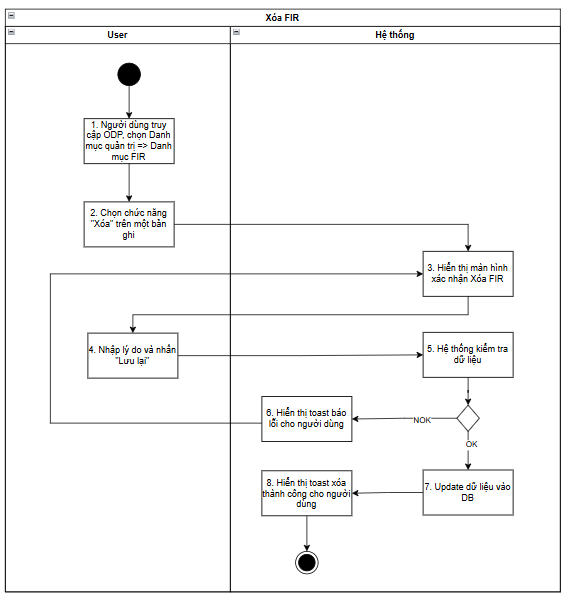
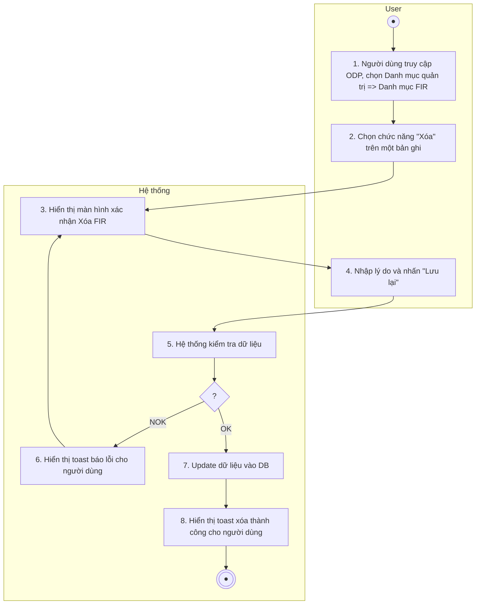
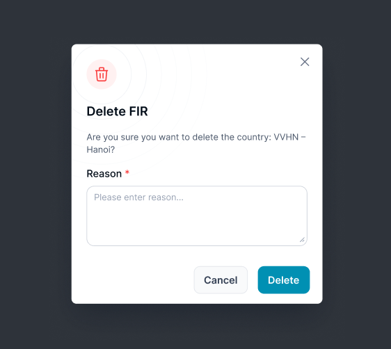
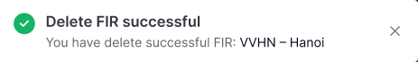
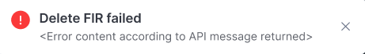

> **Ngữ cảnh chương (giữ nguyên từ nguồn):** mục `Data Maintenance (Danh mục dùng chung)`.

### Xóa FIR

| **Tên chức năng: Xoá FIR** | |
| --- | --- |
| **Mục đích** | Cho phép user Delete FIR |
| **Trigger** | Người dùng truy cập vào web FIMS => nhấn phân hệ Danh mục => Nhấn chọn FIR => Xem chi tiết => Chọn icon Xóa |
| **Tiền điều kiện** | Người dùng đăng nhập thành công và được phân quyền xóa FIR |
| **Hậu điều kiện** | Xóa thành công FIR |

### Sơ đồ luồng hệ thống

1. Sơ đồ luồng xóa FIR

### Mô tả luồng xử lý

| **Bước** | **Chi tiết** |
| --- | --- |
| Bước 1 | User truy cập vào web FIMS => mở đến Category => FIR => hiển thị màn hình [Danh sách FIR](TOSS.DM.FIR_LIST.FD.v0.1.md) trên giao diện |
| Bước 2 | User click **Delete** trên một bản ghi FIR |
| Bước 3 | Mở màn hình xác nhận **Delete FIR** |
| Bước 4 | Người dùng nhập Lý do & nhấn button **Save** |
| Bước 5 | Hệ thống kiểm tra dữ liệu, nếu:   * Dữ liệu không hợp lệ: chuyển sang bước 6 * Ngược lại: chuyển sang bước 7&8 |
| Bước 6 | * TH chưa nhập lý do => hiện IM [VL007](https://docs.google.com/document/d/1L5y0t4FCWe_vnNI65xNMRC-LM3lvLwYsQRAm_Nokv9A/edit?tab=t.0#bookmark=kix.s6302mi8qdnp) * TH API trả về có messages lỗi khác [TB020](https://docs.google.com/document/d/1L5y0t4FCWe_vnNI65xNMRC-LM3lvLwYsQRAm_Nokv9A/edit?tab=t.0#bookmark=kix.zi1hm3rguphh) * Hoặc: [TB021](https://docs.google.com/document/d/1L5y0t4FCWe_vnNI65xNMRC-LM3lvLwYsQRAm_Nokv9A/edit?tab=t.0#bookmark=kix.3pbjinevz4c0) |
| Bước 7,8 | Trường hợp thành công: BE Lưu và cập nhật [danh sách FIR](TOSS.DM.FIR_LIST.FD.v0.1.md), trường **is_delete=true**  Trả API thành công cho FE  FE Hiển thị toast thành công cho người dùng [TB019](https://docs.google.com/document/d/1L5y0t4FCWe_vnNI65xNMRC-LM3lvLwYsQRAm_Nokv9A/edit?tab=t.0#bookmark=kix.spmzvpry3i7f)  Đóng popup xác nhận Xóa FIR, tự động refresh màn danh sách và hiển thị [Danh sách FIR](TOSS.DM.FIR_LIST.FD.v0.1.md) mới nhất |

### Màn hình chức năng

1. Giao diện xóa FIR

### Mô tả chi tiết màn hình

| **STT** | **Tên** | **Kiểu dữ liệu [Độ dài dữ liệu]** | **Mapping DB/API** | **Mô tả** |
| --- | --- | --- | --- | --- |
|  | Title | Textview |  | * Text “Delete FIR” * Text “Are you sure you want to delete the country : [firCode] - [firName] |
|  | Reason | Text Area | reason | * Mặc định để trống * Bắt buộc nhập * Placeholder = “Please enter reason...…” * Maxlength = 1000 ký tự, nếu paste chỉ nhận 1000 ký tự đầu tiên |
|  | Cancel | Button | btn_cancel | * Click vào → Đóng popup. Điều hướng về màn danh sách |
|  | Save | Button | btn_delete | Click:   * Đóng popup xác nhận * FE call API update FIR thành **Đã xóa** * Xử lý Response API trả về, nếu:   **Status = 200**:   * + Hiển thị toast message thành công      * + Sau 3s hoặc người dùng bấm X: đóng toast   + Update trạng thái của fir trên danh sách thành **Đã xóa,** không còn hiệu lực sử dụng.   **Status ≠ 200**:   * + Hiển thị toast message lỗi      * + Sau 3s hoặc người dùng bấm X: đóng toast   + Hệ thống không cần xử lý gì |

---

*Nguồn: tách trung thực từ `sec-26-quan-ly-danh-muc-fir.md`, mục "Xóa FIR" (bản trích text của `VNA.TOSS_SRS_Data Maintenance_v0.1.docx`, chương Data Maintenance (Danh mục dùng chung)) — tương ứng dòng **#30** bảng §1 của [CATALOG.md](../CATALOG.md). Không chỉnh sửa nội dung nguồn (CLAUDE.md §0). 🖼 Hình ảnh màn hình: xem file `VNA.TOSS_SRS_Data Maintenance_v0.1.docx` gốc.*
