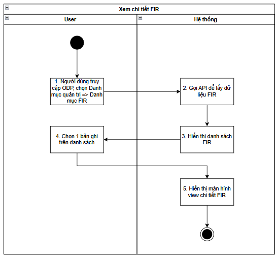
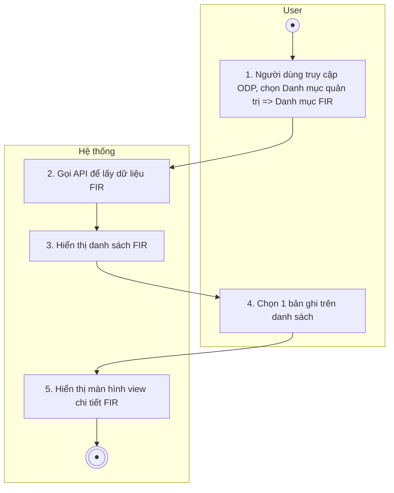
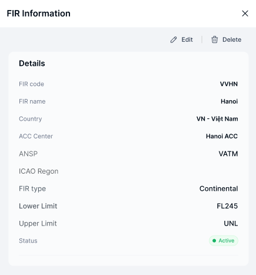

> **Ngữ cảnh chương (giữ nguyên từ nguồn):** mục `Data Maintenance (Danh mục dùng chung)`.

### Xem chi tiết FIR

| **Tên chức năng: Xem chi tiết FIR** | |
| --- | --- |
| **Mục đích** | Cho phép user Xem chi tiết FIR |
| **Trigger** | Người dùng truy cập vào web FIMS => mở đến module FIR => click vào 1 bản ghi bất kỳ |
| **Tiền điều kiện** | Người dùng đăng nhập thành công và được phân quyền Danh mục FIR |
| **Hậu điều kiện** | Mở màn hình Xem chi tiết FIR-Thông tin FIR trên giao diện người dùng |

### Sơ đồ luồng hệ thống

1. Sơ đồ luồng xem chi tiết FIR

### Mô tả luồng xử lý

| **Bước** | **Chi tiết** |
| --- | --- |
| Bước 1 | Truy cập web FIMS => mở đến Category FIR |
| Bước 2 | Hệ thống call API xuống BE lấy [danh sách FIR](TOSS.DM.FIR_LIST.FD.v0.1.md) |
| Bước 3 | Hiển thị [danh sách FIR](TOSS.DM.FIR_LIST.FD.v0.1.md) trên giao diện người dùng |
| Bước 4 | User click vào 1 bản ghi trên danh sách |
| Bước 5 | Hiển thị màn hình FIR Information |

### Màn hình chức năng

1. Giao diện xem chi tiết FIR

### Mô tả chi tiết màn hình

| **STT** | **Tên** | **Kiểu dữ liệu [Độ dài dữ liệu]** | **Mapping DB/API** | **Mô tả** |
| --- | --- | --- | --- | --- |
|  | Title | Textview |  | * Text cứng “FIR Information” |
|  | Icon X | Icon |  | * Click icon → Đóng popup. Điều hướng về màn trước đó |
|  |  | Button | btn_edit | * Click button=> Hiển thị popup Edit FIR |
|  |  | Button | btn_delete | * Click button=> Hiển thị popup Delete FIR |
| Thông tin chi tiết | | | | |
|  | FIR code | Textview | fir_code/firCode | Hiển thị [firCode] theo dữ liệu API trả về  Trường hợp API trả về rỗng/lỗi: để trống trường |
|  | FIR name | Textview | fir_name/firName | Hiển thị [firName] theo dữ liệu API trả về  Trường hợp API trả về rỗng/lỗi: để trống trường |
|  | Country | Textview | country_id/countryId | Hiển thị [countryId] theo dữ liệu API trả về  Trường hợp API trả về rỗng/lỗi: để trống trường |
|  | ACC center | Textview | acc_center/accCenter | Hiển thị [accCenter] theo dữ liệu API trả về  Trường hợp API trả về rỗng/lỗi: để trống trường |
|  | ANSP | Textview | ansp | Hiển thị [ansp] theo dữ liệu API trả về  Trường hợp API trả về rỗng/lỗi: để trống trường |
|  | ICAO | Textview | icao_code | Hiển thị [icao_code] theo dữ liệu API trả về  Trường hợp API trả về rỗng/lỗi: để trống trường |
|  | FIR type | Textview | fir_type | Hiển thị [fir_type] theo dữ liệu API trả về  Trường hợp API trả về rỗng/lỗi: để trống trường |
| 13. | Lower Limit | Textview | lower_limit | Hiển thị [lower_limit] theo dữ liệu API trả về  Trường hợp API trả về rỗng/lỗi: để trống trường |
| 14. | Upper Limit | Textview | upper_limit | Hiển thị [uppwe_limit] theo dữ liệu API trả về  Trường hợp API trả về rỗng/lỗi: để trống trường |
| 15. | Status | Textview | status | * Hiển thị thông tin [status] dưới dạng tag status theo dữ liệu API trả về   + Status=Active: Tag màu xanh lá   + Status=In active: Tag màu xám |

---

*Nguồn: tách trung thực từ `sec-26-quan-ly-danh-muc-fir.md`, mục "Xem chi tiết FIR" (bản trích text của `VNA.TOSS_SRS_Data Maintenance_v0.1.docx`, chương Data Maintenance (Danh mục dùng chung)) — tương ứng dòng **#31** bảng §1 của [CATALOG.md](../CATALOG.md). Không chỉnh sửa nội dung nguồn (CLAUDE.md §0). 🖼 Hình ảnh màn hình: xem file `VNA.TOSS_SRS_Data Maintenance_v0.1.docx` gốc.*
