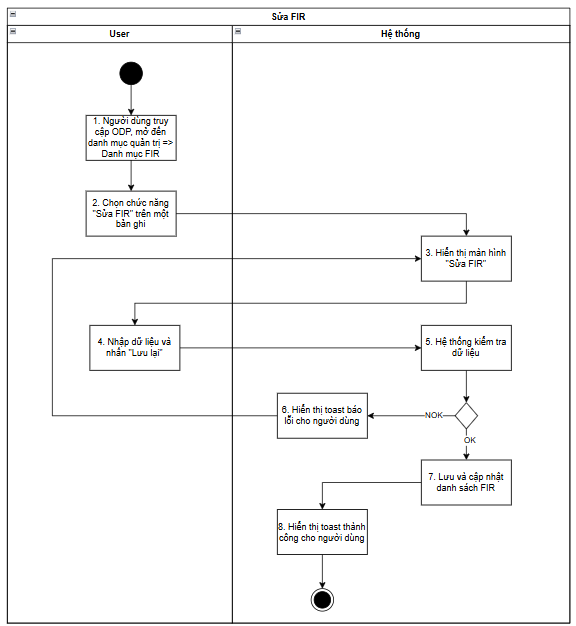
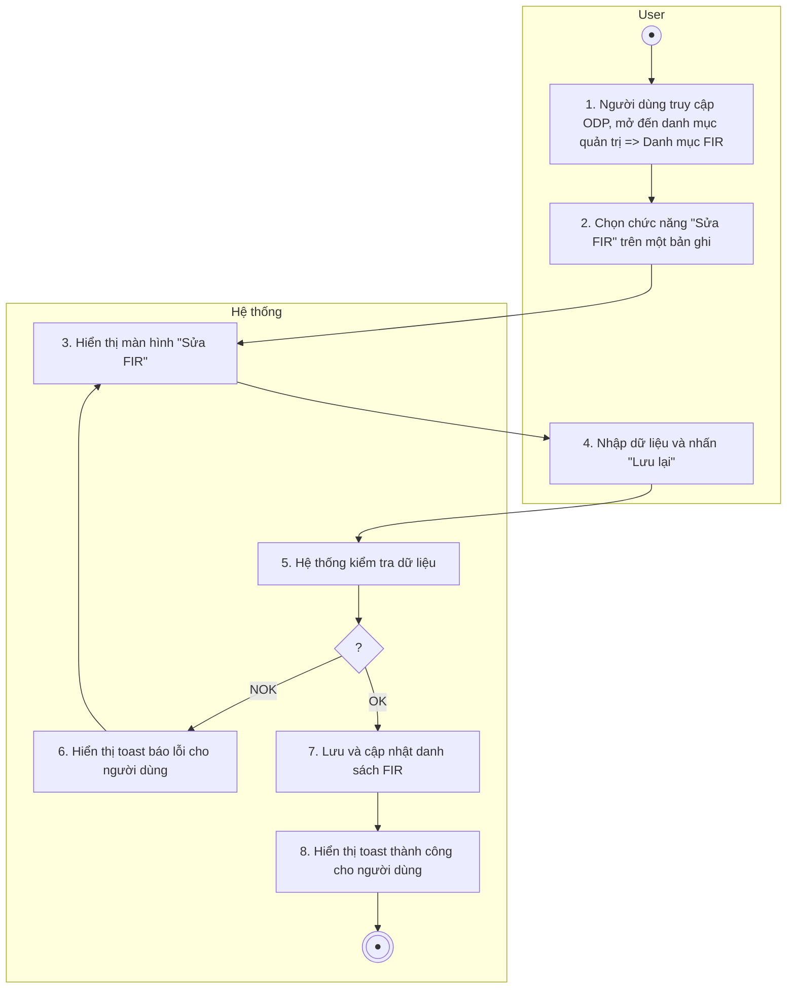
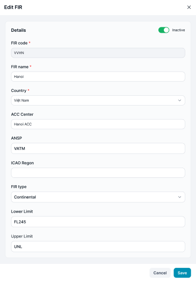

> **Ngữ cảnh chương (giữ nguyên từ nguồn):** mục `Data Maintenance (Danh mục dùng chung)`.

### Sửa FIR

| **Tên chức năng: Sửa FIR** | |
| --- | --- |
| **Mục đích** | Cho phép user Sửa thông tin FIR |
| **Trigger** | Người dùng truy cập vào web FIMS =>mở đến module FIR => chọn icon “Edit” tại FIR muốn chỉnh sửa thông tin |
| **Tiền điều kiện** | Người dùng đăng nhập thành công và được phân quyền Sửa trên FIR |
| **Hậu điều kiện** | Mở màn hình popup **Sửa FIR** trên giao diện người dùng |

### Sơ đồ luồng hệ thống

1. Sơ đồ luồng sửa FIR

### Mô tả luồng xử lý

| **STT** | **Bước** | **Chi tiết** |
| --- | --- | --- |
|  | Bước 1 | User truy cập vào web FIMS => mở đến module Danh mục => FIR  => hiển thị màn hình [Danh sách FIR](TOSS.DM.FIR_LIST.FD.v0.1.md) |
|  | Bước 2 | User click icon “Edit” tại FIR muốn chỉnh sửa |
|  | Bước 3 | Hệ thống hiển thị màn hình sửa FIR  Cho phép User chỉnh sửa thông tin FIR |
|  | Bước 4 | User update dữ liệu và nhấn **Save** |
|  | Bước 5 | Hệ thống kiểm tra dữ liệu, nếu:   * Dữ liệu không hợp lệ: chuyển sang Bước 6 * Ngược lại chuyển sang Bước 7 |
|  | Bước 6 | Hiển thị toast message lỗi đến người dùng |
|  | Bước 7 | Update dữ liệu vào DB |
|  | Bước 8 | Hiển thị toast message Sửa thành công; Đóng màn hình Sửa |

### Màn hình chức năng

1. Giao diện sửa thông tin FIR

### Mô tả chi tiết màn hình

| **STT** | **Tên** | **Kiểu dữ liệu [Độ dài dữ liệu]** | **Mapping DB/API** | **Mô tả** |
| --- | --- | --- | --- | --- |
| 1 | Title | Textview |  | * Text cứng “Edit FIR” |
| 2 | Icon X | Icon |  | * Click icon → Đóng popup. Điều hướng về màn trước đó |
| 3 | Status | Toggle Switch | status | * Hiển thị [status] theo dữ liệu API trả về * Toggle **Active**→ hiển thị label: **Đang hoạt động** * Toggle **Inactive** → hiển thị label: **Ngừng hoạt động** * Update Toggle switch button **Hoạt động** thành **Active/Inactive** tương ứng trạng thái |
| 4 | FIR code | TextBox | fir_code/firCode | * Hiển thị [firCode] theo dữ liệu API trả về * Không cho phép sửa * Maxlength 20 ký tự. Chặn nếu nhập quá 20 ký tự * Nếu paste đoạn văn > 20 ký tự, chỉ nhận 20 ký tự đầu tiên * Tự động TRIM Spaces đầu cuối khi out focus box * Validate   + Cho phép nhập chữ, số, dấu gạch ngang [-]; dấu gạch dưới [_]; dấu chấm [.]; dấu gạch chéo [/]   + Chặn trùng dữ liệu * Trường hợp nội dung dài vượt quá độ rộng box => di chuột vào hiện tooltips hiển thị full nội dung * **Action**: Nhấn Enter/out focus/click button **Save**, hệ thống validate, nếu   + Để trống ⇒ Hiển thị thông báo IM: [VL004](https://docs.google.com/document/d/1L5y0t4FCWe_vnNI65xNMRC-LM3lvLwYsQRAm_Nokv9A/edit?tab=t.0#bookmark=kix.oq8nkssherqj)   + Trường hợp nhập mã FIR đã tồn tại trong hệ thống. => Hiển thị thông báo IM: [VL007](https://docs.google.com/document/d/1L5y0t4FCWe_vnNI65xNMRC-LM3lvLwYsQRAm_Nokv9A/edit?tab=t.0#bookmark=kix.s6302mi8qdnp) |
| 5 | FIR name | TextBox | fir_name/firName | * Hiển thị [firName] theo dữ liệu API trả về * Trường hợp API trả về rỗng/lỗi: hiện placeholder “Enter FIR name” * Bắt buộc nhập * Maxlength 100 ký tự. Chặn nếu nhập quá 100 ký tự * Nếu paste đoạn văn > 100 ký tự, chỉ nhận 100 ký tự đầu tiên * Tự động TRIM Spaces đầu cuối khi out focus box * Validate   + Cho phép nhập chữ, số, dấu gạch ngang [-]; dấu gạch dưới [_]; dấu chấm [.]; dấu gạch chéo [/]   + Chặn trùng dữ liệu * Trường hợp nội dung dài vượt quá độ rộng box => di chuột vào hiện tooltips hiển thị full nội dung * Action: Nhấn Enter/out focus/click button Save, hệ thống validate, nếu   + Để trống ⇒ Hiển thị thông báo IM: [VL004](https://docs.google.com/document/d/1L5y0t4FCWe_vnNI65xNMRC-LM3lvLwYsQRAm_Nokv9A/edit?tab=t.0#bookmark=kix.oq8nkssherqj)   + Trường hợp nhập tên FIR đã tồn tại trong hệ thống. => Hiển thị thông báo IM: [VL007](https://docs.google.com/document/d/1L5y0t4FCWe_vnNI65xNMRC-LM3lvLwYsQRAm_Nokv9A/edit?tab=t.0#bookmark=kix.s6302mi8qdnp) |
| 6 | Country | DDL | country_id/countryId | * Hiển thị [countryId] theo dữ liệu API trả về * Trường hợp API trả về rỗng/lỗi: hiện placeholder “Select quốc gia” * Bắt buộc chọn * Các giá trị countryId API trả về * **Action**: Nhấn Enter/out focus/click button **Save**, hệ thống validate, nếu   + Để trống ⇒ Hiển thị thông báo IM: [VL004](https://docs.google.com/document/d/1L5y0t4FCWe_vnNI65xNMRC-LM3lvLwYsQRAm_Nokv9A/edit?tab=t.0#bookmark=kix.oq8nkssherqj) |
| 7 | ACC center | TextBox | acc_center/accCenter | Hiển thị [accCenter] theo dữ liệu API trả về  Trường hợp API trả về rỗng/lỗi: hiện placeholder “Nhập trung tâm ACC”  Không bắt buộc nhập  Maxlength 100 ký tự. Chặn nếu nhập quá 100 ký tự  Nếu paste đoạn văn > 100 ký tự, chỉ nhận 100 ký tự đầu tiên  Tự động TRIM Spaces đầu cuối khi out focus box  Validate   * + Cho phép nhập chữ, số, dấu gạch ngang [-]; dấu gạch dưới [_]; dấu chấm [.]; dấu gạch chéo [/]   Trường hợp nội dung dài vượt quá độ rộng box => di chuột vào hiện tooltips hiển thị full nội dung  Action: Nhấn Enter/out focus/click button Save, hệ thống validate, nếu   * + Để trống ⇒ Hiển thị thông báo IM: [VL004](https://docs.google.com/document/d/1L5y0t4FCWe_vnNI65xNMRC-LM3lvLwYsQRAm_Nokv9A/edit?tab=t.0#bookmark=kix.oq8nkssherqj) |
| 8 | ANSP | Textbox |  | * Hiển thị [ANSP] theo dữ liệu API trả về * Trường hợp API trả về rỗng/lỗi: hiện placeholder “Enter ANSP” * Không bắt buộc nhập * Maxlength 100 ký tự. Chặn nếu nhập quá 100 ký tự * Nếu paste đoạn văn > 100 ký tự, chỉ nhận 100 ký tự đầu tiên * Tự động TRIM Spaces đầu cuối khi out focus box * Validate   + Cho phép nhập chữ, số, dấu gạch ngang [-]; dấu gạch dưới [_]; dấu chấm [.]; dấu gạch chéo [/]   + Chặn trùng dữ liệu * Trường hợp nội dung dài vượt quá độ rộng box => di chuột vào hiện tooltips hiển thị full nội dung * Action: Nhấn Enter/out focus/click button Save, hệ thống validate, nếu   + Để trống ⇒ Hiển thị thông báo IM: [VL004](https://docs.google.com/document/d/1L5y0t4FCWe_vnNI65xNMRC-LM3lvLwYsQRAm_Nokv9A/edit?tab=t.0#bookmark=kix.oq8nkssherqj)   + Trường hợp nhập tên FIR đã tồn tại trong hệ thống. => Hiển thị thông báo IM: [VL007](https://docs.google.com/document/d/1L5y0t4FCWe_vnNI65xNMRC-LM3lvLwYsQRAm_Nokv9A/edit?tab=t.0#bookmark=kix.s6302mi8qdnp) |
| 9 | ·ICAO | Textbox | icao_code | * Hiển thị [icao_code] theo dữ liệu API trả về * Trường hợp API trả về rỗng/lỗi: hiện placeholder “Select ICAO” * Không bắt buộc nhập * Các giá trị regionTypeId API trả về * **Action**: Nhấn Enter/out focus/click button **Save**, hệ thống lưu thông tin ghi chú. Không có thông tin, lưu trống |
| 10 | FIR type | DDL |  | * Hiển thị [fir type] theo dữ liệu API trả về * Trường hợp API trả về rỗng/lỗi: hiện placeholder “Select Fir type” * Không bắt buộc chọn   Các giá trị regionTypeId API trả về  **Action**: Nhấn Enter/out focus/click button **Save**, hệ thống lưu thông tin ghi chú. Không có thông tin, lưu trống |
| 11 | Lower Limit | Textbox |  | * Hiển thị [Lower Limit] theo dữ liệu API trả về * Trường hợp API trả về rỗng/lỗi: hiện placeholder “Enter Lower Limit” * Không bắt buộc nhập * Maxlength 100 ký tự. Chặn nếu nhập quá 100 ký tự * Nếu paste đoạn văn > 100 ký tự, chỉ nhận 100 ký tự đầu tiên * Tự động TRIM Spaces đầu cuối khi out focus box * Validate   + Cho phép nhập chữ, số, dấu gạch ngang [-]; dấu gạch dưới [_]; dấu chấm [.]; dấu gạch chéo [/]   + Chặn trùng dữ liệu * Trường hợp nội dung dài vượt quá độ rộng box => di chuột vào hiện tooltips hiển thị full nội dung * Action: Nhấn Enter/out focus/click button Save, hệ thống validate, nếu * Để trống ⇒ Hiển thị thông báo IM:[VL004](https://docs.google.com/document/d/1L5y0t4FCWe_vnNI65xNMRC-LM3lvLwYsQRAm_Nokv9A/edit?tab=t.0#bookmark=kix.oq8nkssherqj) * Trường hợp nhập tên FIR đã tồn tại trong hệ thống. => Hiển thị thông báo IM:[VL007](https://docs.google.com/document/d/1L5y0t4FCWe_vnNI65xNMRC-LM3lvLwYsQRAm_Nokv9A/edit?tab=t.0#bookmark=kix.s6302mi8qdnp) |
| 12 | Upper Limit | Textbox |  | * Hiển thị [Upper Limit ] theo dữ liệu API trả về * Trường hợp API trả về rỗng/lỗi: hiện placeholder “Enter Upper Limit ” * Không bắt buộc nhập * Maxlength 100 ký tự. Chặn nếu nhập quá 100 ký tự * Nếu paste đoạn văn > 100 ký tự, chỉ nhận 100 ký tự đầu tiên * Tự động TRIM Spaces đầu cuối khi out focus box * Validate   + Cho phép nhập chữ, số, dấu gạch ngang [-]; dấu gạch dưới [_]; dấu chấm [.]; dấu gạch chéo [/]   + Chặn trùng dữ liệu * Trường hợp nội dung dài vượt quá độ rộng box => di chuột vào hiện tooltips hiển thị full nội dung * Action: Nhấn Enter/out focus/click button Save, hệ thống validate, nếu * Để trống ⇒ Hiển thị thông báo IM:[VL004](https://docs.google.com/document/d/1L5y0t4FCWe_vnNI65xNMRC-LM3lvLwYsQRAm_Nokv9A/edit?tab=t.0#bookmark=kix.oq8nkssherqj) * Trường hợp nhập tên FIR đã tồn tại trong hệ thống. => Hiển thị thông báo IM:[VL007](https://docs.google.com/document/d/1L5y0t4FCWe_vnNI65xNMRC-LM3lvLwYsQRAm_Nokv9A/edit?tab=t.0#bookmark=kix.s6302mi8qdnp) |
| 13 | Cancel | Button | btn_cancel | * Click → Đóng popup. Điều hướng về màn trước đó * Dữ liệu không được lưu vào DB |
| 14 | Save | Button | btn_save | * Click vào. Hệ thống kiểm tra   + [FIR] đã tồn tại trong DB. Hiển thị toast message [TB020](https://docs.google.com/document/d/1L5y0t4FCWe_vnNI65xNMRC-LM3lvLwYsQRAm_Nokv9A/edit?tab=t.0#bookmark=kix.zi1hm3rguphh) và giữ nguyên màn popup   + Dữ liệu hợp lệ, hệ thống lưu thành công và hiển thị toast message [TB019](https://docs.google.com/document/d/1L5y0t4FCWe_vnNI65xNMRC-LM3lvLwYsQRAm_Nokv9A/edit?tab=t.0#bookmark=kix.spmzvpry3i7f)     - Lưu thông tin thành công → Đóng popup. Điều hướng về màn danh sách     - Dữ liệu lưu trong DB |

---

*Nguồn: tách trung thực từ `sec-26-quan-ly-danh-muc-fir.md`, mục "Sửa FIR" (bản trích text của `VNA.TOSS_SRS_Data Maintenance_v0.1.docx`, chương Data Maintenance (Danh mục dùng chung)) — tương ứng dòng **#29** bảng §1 của [CATALOG.md](../CATALOG.md). Không chỉnh sửa nội dung nguồn (CLAUDE.md §0). 🖼 Hình ảnh màn hình: xem file `VNA.TOSS_SRS_Data Maintenance_v0.1.docx` gốc.*
