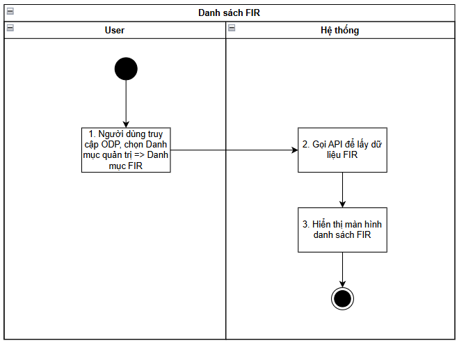
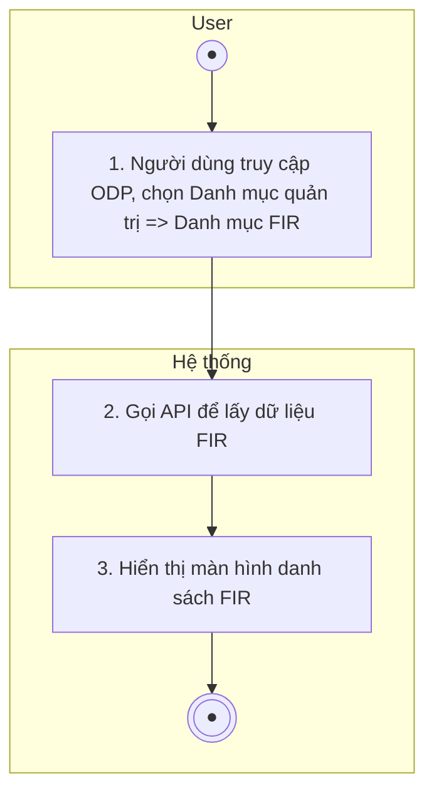
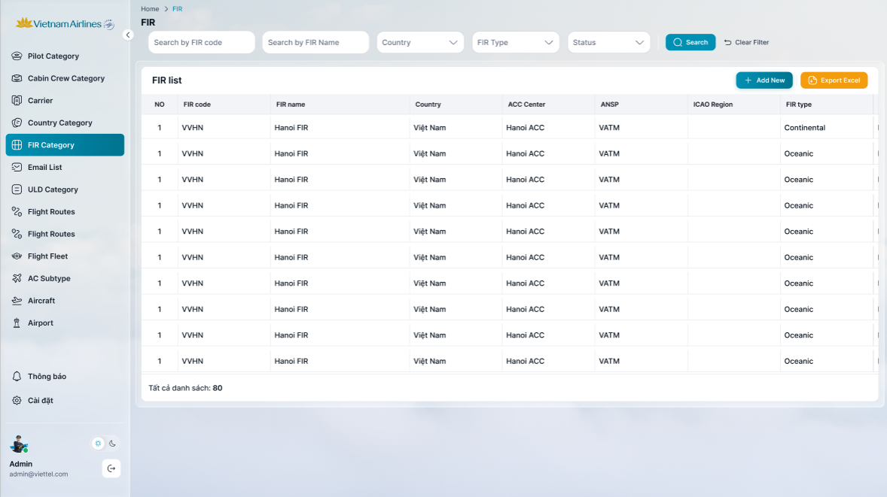
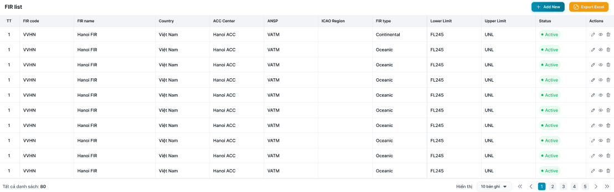
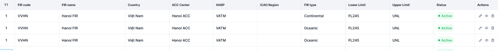

> **Ngữ cảnh chương (giữ nguyên từ nguồn):** mục `Data Maintenance (Danh mục dùng chung)`.

## Quản lý danh mục FIR

### Xem danh sách FIR

| **Tên chức năng: FIR** | |
| --- | --- |
| **Mục đích** | Cho phép user Xem danh sách FIR |
| **Trigger** | Người dùng truy cập vào web FIMS => mở đến module Danh mục/ FIR |
| **Tiền điều kiện** | Người dùng đăng nhập thành công và được phân quyền Danh mục FIR |
| **Hậu điều kiện** | Mở màn hình danh sách FIR trên giao diện người dùng |

#### Sơ đồ luồng hệ thống

1. Sơ đồ luồng hệ thống danh mục FIR

### Mô tả luồng xử lý

| **Bước** | **Chi tiết** |
| --- | --- |
| 1 | Truy cập web FIMS => mở đến module Danh mục/Danh mục FIR |
| 2 | Hệ thống call API xuống BE lấy danh sách FIR |
| 3 | Hiển thị danh sách FIR trên giao diện người dùng |

### Màn hình chức năng

1. Giao diện danh mục FIR

### Mô tả chi tiết màn hình

| **STT** | **Tên** | **Kiểu dữ liệu [Độ dài dữ liệu]** | **Mapping DB/API** | **Mô tả** |
| --- | --- | --- | --- | --- |
| 1 | Title hệ thống |  |  | * + [Tham chiếu Kịch bản title hệ thống](https://docs.google.com/document/d/1L5y0t4FCWe_vnNI65xNMRC-LM3lvLwYsQRAm_Nokv9A/edit?tab=t.0#bookmark=kix.f2nh07gdowb8) |
| Danh sách FIR    FE call API lấy lại DS FIR mới nhất hiện tại để hiển thị trên giao diện người dùng | | | | |
| 2 | FIR list | Title |  | * Fix cứng text “FIR list” |
| 3 |  | Button | btn_export | * Click vào => hệ thống thực hiện tạo file .xlsx để tải danh sách FIR về máy * Tên file tải về: FIMS_fir_ddmmyyhhmm * File: [Danh mục FIR](https://docs.google.com/spreadsheets/d/1HVCvXNIeS8pYSOf4yNMfAXM4nZYKsCsdPLS_h0aI0TA/edit?gid=0#gid=0) * Nội dung file tải về: tải theo cột dữ liệu view từ bảng FIR |
| 4 |  | Button | btn_create | * Click button → Mở popup “Add new” |
| 5 | **Tìm kiếm**  ****   * Cơ chế Thu gọn/Mở rộng bộ lọc (Collapsible Fillter):   + [Tham chiếu kịch bản chức năng ẩn hiện filter](https://docs.google.com/document/d/1L5y0t4FCWe_vnNI65xNMRC-LM3lvLwYsQRAm_Nokv9A/edit?tab=t.0#heading=h.dgq51psil6dr) * Click vào dòng dưới tiêu đề các cột để chọn lọc, tìm kiếm thông tin theo dữ liệu tại cột tương ứng. * Trường hợp Searchbox không có dữ liệu: Mặc định tìm kiếm all dữ liệu tại cột đó * Người dùng thao tác thay đổi giá trị trường dữ liệu => click Enter/out focus box => hệ thống thực hiện:   + Reload dữ liệu table phù hợp với bộ lọc   + Set current page=1 * Hiển thị kết quả tìm kiếm:   + Trường hợp API trả về data có KQ: hiển thị danh sách dữ liệu theo kết quả API trả về   + Trường hợp API trả về data rỗng hoặc lỗi: Hiển thị bảng danh sách với **chân trang = Tất cả danh sách : 0** | | | |
| 6 | Search by FIR code | Textbox | fir_code/firCode | * Trường để lọc: Tìm kiếm gần đúng theo [firCode] * Maxlength 20 ký tự * Validate cho phép nhập chữ, số, và ký tự đặc biệt * Nếu dữ liệu nhập vượt quá độ dài ô => thay thế phần vượt quá bằng ký tự “...” và có tooltip hiển thị toàn bộ nội dung nhập * Nếu paste đoạn văn thì ghi nhận 20 ký tự đầu * Tự động TRIM Spaces đầu cuối khi tìm kiếm |
| 7 | Search by FIR Name | Textbox | fir_name/firName | * Trường để lọc: Tìm kiếm gần đúng theo [firName] * Maxlength 100 ký tự * Validate cho phép nhập chữ, số, và ký tự đặc biệt * Nếu dữ liệu nhập vượt quá độ dài ô => thay thế phần vượt quá bằng ký tự “...” và có tooltip hiển thị toàn bộ nội dung nhập * Nếu paste đoạn văn thì ghi nhận 100 ký tự đầu * Tự động TRIM Spaces đầu cuối khi tìm kiếm |
| 8 | Country | Combobox | country_id/countryId | * Trường để lọc: Tìm kiếm gần đúng theo [country] * Nhập nội dung để gọi ý ra các giá trị * Các giá trị lựa chọn:   + VN   + QT   + … |
| ~~9~~ | FIR Type | Dropdownlist |  | * Trường để lọc: Tìm kiếm chính xác theo [firtype] * Các giá trị lựa chọn:   + Continental   + Oceanic |
| 10 | Status | Dropdownlist [Active, INactive] | status | * Trường để lọc: Tìm kiếm chính xác theo [status] * Các giá trị lựa chọn:   + Active   + Inactive |
| 11 | ~~~~ | Button |  | * Click vào  * Hệ thống lọc dữ liệu dựa trên nội dung trường lọc * Hệ thống trả về danh sách dữ liệu phù hợp với từ khoá tìm kiếm |
| 12 | ~~~~ | Button |  | * Click vào  * Hệ thống   + Xoá nội dung search   + Reset toàn bộ truòng lọc đã chọn   + Reset phân trang về trang đầu * Hệ thống gọi API lấy danh sách dữ liệu mặc định * Hiển thị lại danh sách ban đầu |
| Chi tiết danh sách     * Hệ thống call API xuống BE, lấy danh sách FIR   → hiển thị danh sách FIR trên màn hình   * Danh sách FIR sắp xếp theo thứ tự α-β của trường Mã FIR * Khi user click vào 1 bản ghi bất kỳ → hiển thị màn hình [Xem chi tiết FIR](TOSS.DM.FIR_DETAIL.FD.v0.1.md) | | | | |
| 13 | TT | Textview |  | * Hiển thị STT tăng dần theo số lượng bản ghi |
| 14 | FIR code | Textview | fir_code/firCode | * Hiển thị [firCode] theo dữ liệu API trả về * Hiển thị tối đa 2 dòng dữ liệu * Nếu độ dài dữ liệu vượt quá 2 dòng, hiển thị ba chấm […] ở cuối dòng thứ 2 và có tooltip hiển thị toàn bộ nội dung * Trường hợp API trả về rỗng/lỗi: để trống trường |
| 15 | FIR name | Textview | fir_name/firName | * Hiển thị [firName] theo dữ liệu API trả về * Hiển thị tối đa 2 dòng dữ liệu * Nếu độ dài dữ liệu vượt quá 2 dòng, hiển thị ba chấm […] ở cuối dòng thứ 2 và có tooltip hiển thị toàn bộ nội dung * Trường hợp API trả về rỗng/lỗi: để trống trường |
| 16 | Country | Textview | country_id/countryId | * Hiển thị [Country] theo dữ liệu API trả về * Hiển thị tối đa 2 dòng dữ liệu * Nếu độ dài dữ liệu vượt quá 2 dòng, hiển thị ba chấm […] ở cuối dòng thứ 2 và có tooltip hiển thị toàn bộ nội dung * Trường hợp API trả về rỗng/lỗi: để trống trường |
| 17 | ACC Center | Textview | acc_center/accCenter | * Hiển thị [accCenter] theo dữ liệu API trả về * Hiển thị tối đa 2 dòng dữ liệu * Nếu độ dài dữ liệu vượt quá 2 dòng, hiển thị ba chấm […] ở cuối dòng thứ 2 và có tooltip hiển thị toàn bộ nội dung * Trường hợp API trả về rỗng/lỗi: để trống trường |
| 18 | ICAO Region | Textview | icao_code | * Hiển thị [icao_code] theo dữ liệu API trả về * Hiển thị tối đa 2 dòng dữ liệu * Nếu độ dài dữ liệu vượt quá 2 dòng, hiển thị ba chấm […] ở cuối dòng thứ 2 và có tooltip hiển thị toàn bộ nội dung * Trường hợp API trả về rỗng/lỗi: để trống trường |
| 19 | FIR type | Textview | fir_type | * Hiển thị thông tin [fir_type]ưdưới dạng tag status theo dữ liệu API trả về   + Continental   + Oceanic * Trường hợp API trả về lỗi/rỗng: hiện **N/A** |
| 20 | Lower Limit | Textview |  | * Hiển thị [lowerlimit] theo dữ liệu API trả về * Hiển thị tối đa 2 dòng dữ liệu * Nếu độ dài dữ liệu vượt quá 2 dòng, hiển thị ba chấm […] ở cuối dòng thứ 2 và có tooltip hiển thị toàn bộ nội dung * Trường hợp API trả về rỗng/lỗi: để trống trường |
| 21 | Upper Limit | Textview |  | * Hiển thị [upperlimit] theo dữ liệu API trả về * Hiển thị tối đa 2 dòng dữ liệu * Nếu độ dài dữ liệu vượt quá 2 dòng, hiển thị ba chấm […] ở cuối dòng thứ 2 và có tooltip hiển thị toàn bộ nội dung * Trường hợp API trả về rỗng/lỗi: để trống trường |
| 22 | Status | Textview | status | * Hiển thị thông tin [status] dưới dạng tag status theo dữ liệu API trả về   + Status=Active: Tag màu xanh lá   + Status=Is active: Tag màu xám |
| 23 | Actions | Button |  | Bao gồm các function sau   * Sửa => Ẩn khi user không được phân quyền Sửa * Lịch sử => Ẩn khi user không được phân quyền Xem * Xoá => Ẩn khi user không được phân quyền Xoá   Click function => mở màn hình chức năng tương ứng |
| 24 | Chân trang | Pagination |  | [Theo kịch bản phân trang](https://docs.google.com/document/d/1L5y0t4FCWe_vnNI65xNMRC-LM3lvLwYsQRAm_Nokv9A/edit?tab=t.0#heading=h.abyqd0hrl467) |

---

*Nguồn: tách trung thực từ `sec-26-quan-ly-danh-muc-fir.md`, mục "Xem danh sách FIR" (bản trích text của `VNA.TOSS_SRS_Data Maintenance_v0.1.docx`, chương Data Maintenance (Danh mục dùng chung)) — tương ứng dòng **#27** bảng §1 của [CATALOG.md](../CATALOG.md). Không chỉnh sửa nội dung nguồn (CLAUDE.md §0). 🖼 Hình ảnh màn hình: xem file `VNA.TOSS_SRS_Data Maintenance_v0.1.docx` gốc.*
