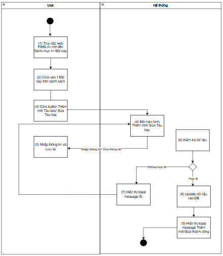
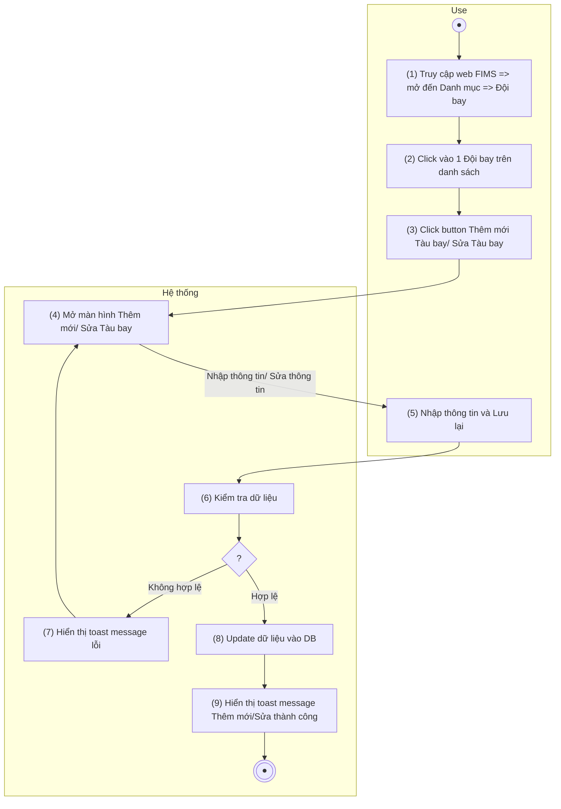
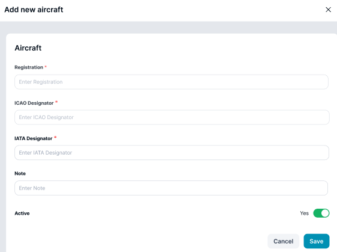
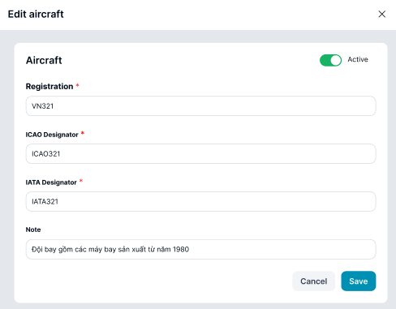
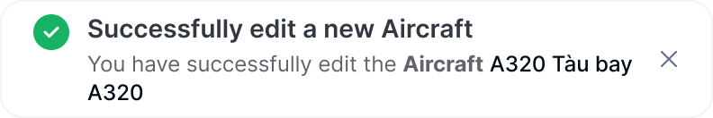

> **Ngữ cảnh chương (giữ nguyên từ nguồn):** mục `Data Maintenance (Danh mục dùng chung)`.

### Thêm/Sửa Tàu bay

| **Tên chức năng: Thêm/Sửa Tàu bay** | |
| --- | --- |
| **Mục đích** | Cho phép user **Thêm/Sửa Tàu bay** |
| **Trigger** | Người dùng truy cập vào web Fims => nhấn phân hệ Danh mục => Đội bay => click vào 1 Đội bay => nhấn Button Thêm mới Tàu bay/Sửa tàu bay |
| **Tiền điều kiện** | Người dùng đăng nhập thành công và được phân quyền trên phân hệ tàu bay |
| **Hậu điều kiện** | Màn hình **Thêm/Sửa Tàu bay** được hiển thị |

#### Sơ đồ luồng hệ thống

#### Mô tả luồng xử lý

| **Bước** | **Chi tiết** |
| --- | --- |
| 1 | User truy cập vào web Fims => mở đến module Danh mục => Chọn Đội bay  => hiển thị màn hình Đội bay => nhấn vào 1 đội bay => hiển thị chi tiết đội bay |
| 2 | User click button Thêm mới hoặc icon “ Sửa” tại Tàu bay muốn sửa |
| 3 | Hệ thống hiển thị màn hình Thêm mới/ Sửa Tàu bay  Cho phép User thêm Tàu bay vào Đội bay hoặc chỉnh sửa thông tin Tàu bay của Đội bay |
| 4 | User nhập dữ liệu/update dữ liệu và nhấn **Lưu lại** |
| 5 | * Hệ thống kiểm tra dữ liệu, nếu:   + Dữ liệu không hợp lệ: chuyển sang bước 6   + Ngược lại chuyển sang bước 7 |
| 6 | Hiển thị toast message lỗi đến người dùng |
| 7 | Update dữ liệu vào DB |
| 8 | Hiển thị toast message Thêm mới/Sửa thành công; Đóng màn hình Thêm mới/Sửa |

#### Màn hình chức năng

****

****

#### Mô tả chi tiết màn hình

| **STT** | **Tên** | **Kiểu dữ liệu [Độ dài dữ liệu]** | **Mapping DB/API** | **Mô tả** |
| --- | --- | --- | --- | --- |
|  | Registration | Texxtbox |  | * TH **Thêm mới**:   + Mặc định: Để trống và cho nhập thông tin   + Placeholder “Enter Registration ”   + Bắt buộc nhập * TH **Sửa**: Hiển thị [Registration ] cho phép xóa trắng hoặc chỉnh sửa * **Validate chung:** * Maxlength 20 ký tự. Chặn nếu nhập quá 20 ký tự * Validate   + Cho phép nhập chữ, số, dấu gạch ngang [-]; dấu gạch dưới [_]; dấu chấm [.]; dấu gạch chéo [/]   + Chặn trùng dữ liệu * Nếu dữ liệu nhập vượt quá độ dài ô => thay thế phần vượt quá bằng ký tự “...” và có tooltip hiển thị toàn bộ nội dung nhập * Nếu paste đoạn văn thì ghi nhận 20 ký tự đầu * Tự động TRIM Spaces đầu cuối khi out focus box * **Action**: Nhấn Enter/out focus/click button **Lưu lại**, hệ thống validate, nếu   + Để trống ⇒ Hiển thị thông báo inline:” Đây là trường thông tin bắt buộc nhập”   Trường hợp **Registration đã tồn tại** ⇒ Hiển thị thông báo toast: “Registration đã tồn tại” |
|  | ICAO Designator | Tex tbox |  | * TH **Thêm mới**:   + Mặc định: Để trống và cho nhập thông tin   + Placeholder “Enter ICAO Designator”   + Bắt buộc nhập * TH **Sửa**: Hiển thị [ICAO Designator] cho phép xóa trắng hoặc chỉnh sửa * **Validate chung:** * Maxlength 20 ký tự. Chặn nếu nhập quá 20 ký tự * Validate   + Cho phép nhập chữ, số, dấu gạch ngang [-]; dấu gạch dưới [_]; dấu chấm [.]; dấu gạch chéo [/]   + Chặn trùng dữ liệu * Nếu dữ liệu nhập vượt quá độ dài ô => thay thế phần vượt quá bằng ký tự “...” và có tooltip hiển thị toàn bộ nội dung nhập * Nếu paste đoạn văn thì ghi nhận 20 ký tự đầu * Tự động TRIM Spaces đầu cuối khi out focus box * **Action**: Nhấn Enter/out focus/click button **Lưu lại**, hệ thống validate, nếu   + Để trống ⇒ Hiển thị thông báo inline:” Đây là trường thông tin bắt buộc nhập”   Trường hợp **ICAO Designator đã tồn tại** ⇒ Hiển thị thông báo toast: “ICAO Designator đã tồn tại” |
|  | IATA Designator | Textbox |  | * TH **Thêm mới**:   + Mặc định: Để trống và cho nhập thông tin   + Placeholder “Enter IATA Designator”   + Bắt buộc nhập * TH **Sửa**: Hiển thị [flightfleet_code] cho phép xóa trắng hoặc chỉnh sửa * **Validate chung:** * Maxlength 20 ký tự. Chặn nếu nhập quá 20 ký tự * Validate   + Cho phép nhập chữ, số, dấu gạch ngang [-]; dấu gạch dưới [_]; dấu chấm [.]; dấu gạch chéo [/]   + Chặn trùng dữ liệu * Nếu dữ liệu nhập vượt quá độ dài ô => thay thế phần vượt quá bằng ký tự “...” và có tooltip hiển thị toàn bộ nội dung nhập * Nếu paste đoạn văn thì ghi nhận 20 ký tự đầu * Tự động TRIM Spaces đầu cuối khi out focus box * **Action**: Nhấn Enter/out focus/click button **Lưu lại**, hệ thống validate, nếu   + Để trống ⇒ Hiển thị thông báo inline:” Đây là trường thông tin bắt buộc nhập”   Trường hợp **IATA Designator đã tồn tại** ⇒ Hiển thị thông báo toast: “IATA Designator đã tồn tại” |
|  | Note | Texxtbox |  | * TH **Thêm mới**:   + Mặc định: Để trống và cho nhập thông tin   + Placeholder “Enter Note”   + Không bắt buộc nhập * TH **Sửa**: Hiển thị [note] * Maxlength 3000 ký tự. Chặn nếu nhập quá 3000 ký tự * Nhận dữ liệu chữ, số, và ký tự đặc biệt * Nếu dữ liệu nhập vượt quá độ dài ô => thay thế phần vượt quá bằng ký tự “...” và có tooltip hiển thị toàn bộ nội dung nhập * Nếu paste đoạn văn thì ghi nhận 3000 ký tự đầu * Tự động TRIM Spaces đầu cuối khi out focus box * **Action**: Nhấn Enter/out focus/click button **Lưu lại**, hệ thống lưu thông tin ghi chú * Không có thông tin, lưu trống |
|  | Status | Toggle switch button |  | * TH **Thêm mới**    + TH On Toggle Swith button: **Đang hoạt động**   + Ngược lại: **Ngừng hoạt động** * TH **Sửa**   + TH On Toggle Swith button: Đang hoạt động   + Ngược lại: Ngừng hoạt động   + Update Toggle switch button **Hoạt động** thành **On/Off** tương ứng trạng thái |
|  | cancel / Đóng | Button |  | * Đóng với màn hình Sửa * Hủy bỏ với màn hình Thêm mới * Lươn enable, click button đóng giao diện Thêm mới/ Sửa, hệ thống không xử lý gì thêm, trở ra màn hình [danh sách Tàu bay](../TOSS.DM.AIRCRAFT/TOSS.DM.AIRCRAFT_LIST.FD.v0.1.md) |
|  | Save | Button |  | Click:   * + Đóng màn hình Thêm mới/Sửa   + Call API Update dữ liệu Đội bay vào database   + Hiển thị màn hình thông báo kết quả update nếu:     - Response API trả về status 200: hiển thị toast message thành công:        * + - Ngược lại: hiển thị toast message lỗi      |

---

*Nguồn: tách trung thực từ `sec-31-quan-ly-danh-muc-doi-bay.md`, mục "Thêm/Sửa Tàu bay (trong Đội bay)" (bản trích text của `VNA.TOSS_SRS_Data Maintenance_v0.1.docx`, chương Data Maintenance (Danh mục dùng chung)) — tương ứng dòng **#54** bảng §1 của [CATALOG.md](../CATALOG.md). Không chỉnh sửa nội dung nguồn (CLAUDE.md §0). 🖼 Hình ảnh màn hình: xem file `VNA.TOSS_SRS_Data Maintenance_v0.1.docx` gốc.*
