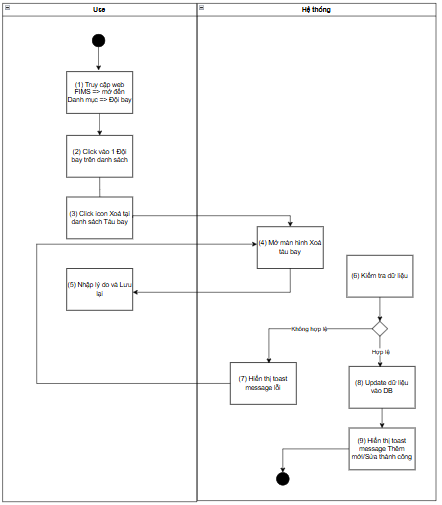
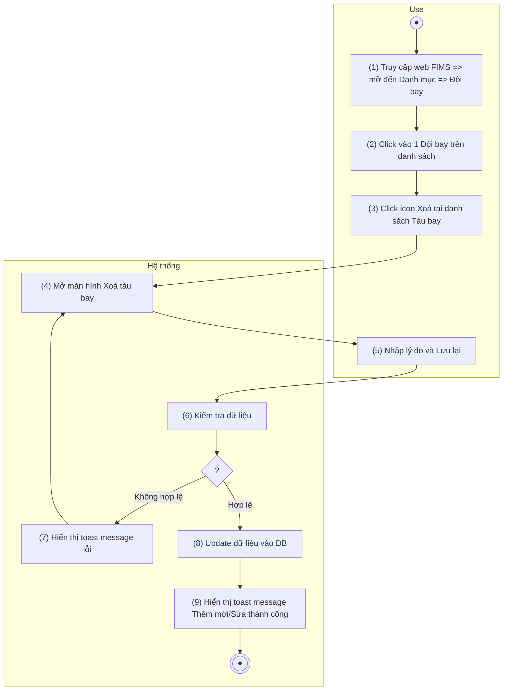
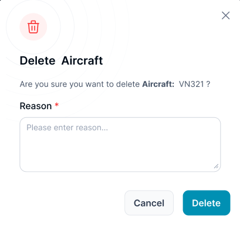
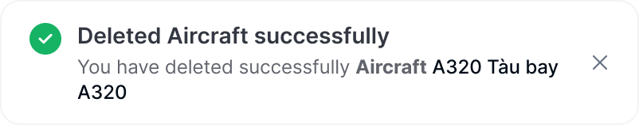

> **Ngữ cảnh chương (giữ nguyên từ nguồn):** mục `Data Maintenance (Danh mục dùng chung)`.

### Xoá Tàu bay

| **Tên chức năng: Xóa Tàu bay** | |
| --- | --- |
| **Mục đích** | Cho phép user Xóa Tàu bay |
| **Trigger** | Người dùng truy cập vào web Fims => nhấn phân hệ Danh mục => Đội bay => Chọn 1 Đội bay =>Nhấn icon Xoá Tàu bay trong Đội bay |
| **Tiền điều kiện** | Người dùng đăng nhập thành công và được phân quyền trên phân hệ Tàu bay |
| **Hậu điều kiện** | Màn hình xác nhận **Xóa Tàu bay** được hiển thị |

#### Sơ đồ luồng hệ thống

****

#### Mô tả luồng xử lý

| **Bước** | **Chi tiết** |
| --- | --- |
| 1 | User truy cập vào web Fims => mở đến module Danh mục => Chọn Đội bay => hiển thị màn hình Đội bay => nhấn vào 1 đội bay => hiển thị chi tiết đội bay |
| 2 | User click **icon “ Xóa”** Tàu bay của Đội bay |
| 3 | * Mở màn hình xác nhận **Xóa** Tàu bay |
| 4 | * Người dùng nhập Lý do & nhấn button **Lưu lại** |
| 5 | * Hệ thống kiểm tra dữ liệu, nếu:   + Dữ liệu không hợp lệ: chuyển sang bước 6   + Dữ liệu xóa hợp lệ: Đội bay chưa được gắn vào bất kỳ user nào  + Dữ liệu không hợp lệ: Đội bay đã được gán thông tin   * + Ngược lại: chuyển sang bước 7 |
| 6 | * Hiển thị toast message lỗi đến người dùng |
| 7 | * Update dữ liệu vào DB |

#### Màn hình chức năng

****

#### Mô tả chi tiết màn hình

| **STT** | **Tên** | **Kiểu dữ liệu [Độ dài dữ liệu]** | **Mapping DB/API** | **Mô tả** |
| --- | --- | --- | --- | --- |
| **1.** | **** | Icon |  | * Fix cứng, không cho thao tác |
| **2.** | **** | Icon |  | * Icon đóng popup * Click: Đóng popup, hệ thống không cần xử lý gì, trở ra màn hình [Danh sách Tàu bay](../TOSS.DM.AIRCRAFT/TOSS.DM.AIRCRAFT_LIST.FD.v0.1.md) |
| **3.** | Title | Textview |  | * Xóa Tàu bay * Không cho thao tác |
| **4.** | Content | Textview |  | * Hiển thị [Bạn có chắc chắn muốn xóa Tàu bay:< Mã Tàu bay >- <Tên Tàu bay > không?] * Trong đó: < Mã Tàu bay > và < Tên Tàu bay > lấy theo thông tin của Tàu bay bị xóa * Không cho thao tác |
|  | Reason | Textbox |  | * Bắt buộc nhập * Mặc định: Để trống và cho nhập thông tin * Placeholder: “Please enter reason.....” * Tối đa: 1000 ký tự bao gồm chữ, số và ký tự đặc biệt * Chặn nếu nhập quá 1000 ký tự * Nếu paste đoạn văn > 1000 ký tự, chỉ nhận 1000 ký tự đầu tiên * Bắt buộc nhập * Tự động TRIM Spaces đầu cuối khi out focus box * **Action**: Nhấn Enter/out focus/click button **Lưu lại**, hệ thống validate, nếu   + Để trống ⇒ Hiển thị thông báo inline:” Không được để trống” |
|  | **** | Button |  | * Click: Đóng popup xác nhận, hệ thống không cần xử lý gì, đóng popup Xác nhận xóa và trở ra màn hình Tàu bay |
|  | **** | Button |  | Click:   * Đóng popup xác nhận * FE call API update trạng thái **is_delete=true** của đơn vị bị xóa * Xử lý Response API trả về, nếu:   **Status = 200**:   * + Hiển thị toast message thành công      * + Sau 3s hoặc người dùng bấm X: đóng toast   + Đóng popup xác nhận xóa Tàu bay, tự động refresh màn danh sách và hiển thị [danh sách Tàu bay](../TOSS.DM.AIRCRAFT/TOSS.DM.AIRCRAFT_LIST.FD.v0.1.md) mới nhất   **Status ≠ 200**:   * + Hiển thị toast message lỗi theo thông tin API trả về   + Hiển thị erorr message khi đội bay được gán với user: Tàu bay đã được liên kết với các chức năng khác |

---

*Nguồn: tách trung thực từ `sec-31-quan-ly-danh-muc-doi-bay.md`, mục "Xoá Tàu bay (trong Đội bay)" (bản trích text của `VNA.TOSS_SRS_Data Maintenance_v0.1.docx`, chương Data Maintenance (Danh mục dùng chung)) — tương ứng dòng **#55** bảng §1 của [CATALOG.md](../CATALOG.md). Không chỉnh sửa nội dung nguồn (CLAUDE.md §0). 🖼 Hình ảnh màn hình: xem file `VNA.TOSS_SRS_Data Maintenance_v0.1.docx` gốc.*
