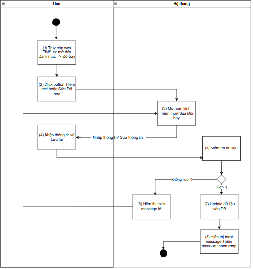
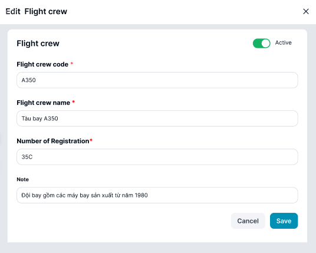
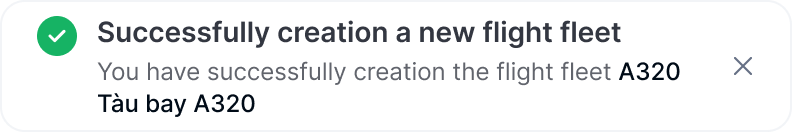
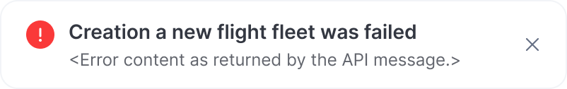
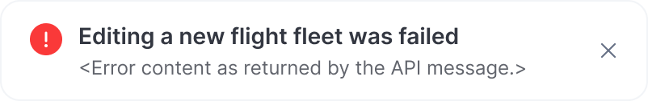

> **Ngữ cảnh chương (giữ nguyên từ nguồn):** mục `Data Maintenance (Danh mục dùng chung)`.

### Thêm/Sửa Đội bay

| **Tên chức năng: Thêm mới/ Sửa Đội bay** | |
| --- | --- |
| **Mục đích** | Cho phép user Thêm mới/ Sửa Đội bay |
| **Trigger** | Người dùng truy cập vào web Fims => Danh mục => nhấn Thêm mới hoặc chọn icon “ Sửa” để sửa Đội bay |
| **Tiền điều kiện** | Ngư ời dùng đăng nhập thành công và được phân quyền Thêm mới/Sửa Đội bay trên phân hệ Đội bay của Danh mục |
| **Hậu điều kiện** | Màn hình Thêm mới/ Sửa Đội bay |

#### Sơ đồ luồng hệ thống

****

#### Mô tả luồng xử lý

| **Bước** | **Chi tiết** |
| --- | --- |
| 1 | User truy cập vào web Fims => mở đến module Danh mục => Chọn Đội bay  => hiển thị màn hình Đội bay |
| 2 | User click button Thêm mới hoặc icon “ Sửa” tại Đội bay muốn sửa |
| 3 | Hệ thống hiển thị màn hình Thêm mới/ Sửa Đội bay  Cho phép User thêm Đội bay hoặc chỉnh sửa thông tin Đội bay |
| 4 | User nhập dữ liệu/update dữ liệu và nhấn **Lưu lại** |
| 5 | * Hệ thống kiểm tra dữ liệu, nếu:   + Dữ liệu không hợp lệ: chuyển sang bước 6   + Ngược lại chuyển sang bước 7 |
| 6 | Hiển thị toast message lỗi đến người dùng |
| 7 | Update dữ liệu vào DB |
| 8 | Hiển thị toast message Thêm mới/Sửa thành công; Đóng màn hình Thêm mới/Sửa |

#### Màn hình chức năng

****

#### Mô tả chi tiết màn hình

| **STT** | **Tên** | **Kiểu dữ liệu [Độ dài dữ liệu]** | **Mapping DB/API** | **Mô tả** |
| --- | --- | --- | --- | --- |
| **1.** | Flight Fleet Code | Textbox | flightfleet_code | * TH **Thêm mới**:   + Mặc định: Để trống và cho nhập thông tin   + Placeholder “Enter Flight fleet code”   + Bắt buộc nhập * TH **Sửa**: Hiển thị [flightfleet_code] cho phép xóa trắng hoặc chỉnh sửa * **Validate chung:** * Maxlength 20 ký tự. Chặn nếu nhập quá 20 ký tự * Validate   + Cho phép nhập chữ, số, dấu gạch ngang [-]; dấu gạch dưới [_]; dấu chấm [.]; dấu gạch chéo [/]. Không cho phép nhập space   + Chặn trùng dữ liệu * Nếu dữ liệu nhập vượt quá độ dài ô => thay thế phần vượt quá bằng ký tự “...” và có tooltip hiển thị toàn bộ nội dung nhập * Nếu paste đoạn văn thì ghi nhận 20 ký tự đầu * Tự động TRIM Spaces đầu cuối khi out focus box * **Action**: Nhấn Enter/out focus/click button **Lưu lại**, hệ thống validate, nếu   + Để trống ⇒ Hiển thị thông báo inline:” Đây là trường thông tin bắt buộc nhập”   Trường hợp **Mã Đội bay đã tồn tại** ⇒ Hiển thị thông báo toast: “Mã Đội bay đã tồn tại” |
| **2.** | Flight fleet name | Textbox |  | * TH **Thêm mới**:   + Mặc định: Để trống và cho nhập thông tin   + Placeholder “Enter Flight fleet name”   + Bắt buộc nhập * TH **Sửa**: Hiển thị [ flightfleet_name] cho phép xóa trắng hoặc chỉnh sửa * **Validate chung:** * Maxlength 20 ký tự. Chặn nếu nhập quá 20 ký tự * Validate   + Cho phép nhập chữ, số, dấu gạch ngang [-]; dấu gạch dưới [_]; dấu chấm [.]; dấu gạch chéo [/]   + Chặn trùng dữ liệu * Nếu dữ liệu nhập vượt quá độ dài ô => thay thế phần vượt quá bằng ký tự “...” và có tooltip hiển thị toàn bộ nội dung nhập * Nếu paste đoạn văn thì ghi nhận 20 ký tự đầu * Tự động TRIM Spaces đầu cuối khi out focus box * **Action**: Nhấn Enter/out focus/click button **Lưu lại**, hệ thống validate, nếu   + Để trống ⇒ Hiển thị thông báo inline:” Đây là trường thông tin bắt buộc nhập”   Trường hợp **Tên Đội bay đã tồn tại** ⇒ Hiển thị thông báo toast: “Tên Đội bay đã tồn tại” |
|  | Number of Registration | Textbox |  | * TH **Thêm mới**:   + Mặc định: Để trống và cho nhập thông tin   + Placeholder “Enter Number of Registration”   + Bắt buộc nhập * TH **Sửa**: Hiển thị [ Number of Registration ] cho phép xóa trắng hoặc chỉnh sửa * **Validate chung:** * Maxlength 20 ký tự. Chặn nếu nhập quá 20 ký tự * Validate   + Cho phép nhập chữ, số, dấu gạch ngang [-]; dấu gạch dưới [_]; dấu chấm [.]; dấu gạch chéo [/]   + Chặn trùng dữ liệu * Nếu dữ liệu nhập vượt quá độ dài ô => thay thế phần vượt quá bằng ký tự “...” và có tooltip hiển thị toàn bộ nội dung nhập * Nếu paste đoạn văn thì ghi nhận 20 ký tự đầu * Tự động TRIM Spaces đầu cuối khi out focus box * **Action**: Nhấn Enter/out focus/click button **Lưu lại**, hệ thống validate, nếu   + Để trống ⇒ Hiển thị thông báo inline:” Đây là trường thông tin bắt buộc nhập”   Trường hợp **Number of Registration đã tồn tại** ⇒ Hiển thị thông báo toast: “Number of Registration đã tồn tại” |
| **3.** | Note | Textbox |  | * TH **Thêm mới**:   + Mặc định: Để trống và cho nhập thông tin   + Placeholder “Enter Note”   + Không bắt buộc nhập * TH **Sửa**: Hiển thị [note] * Maxlength 3000 ký tự. Chặn nếu nhập quá 3000 ký tự * Nhận dữ liệu chữ, số, và ký tự đặc biệt * Nếu dữ liệu nhập vượt quá độ dài ô => thay thế phần vượt quá bằng ký tự “...” và có tooltip hiển thị toàn bộ nội dung nhập * Nếu paste đoạn văn thì ghi nhận 3000 ký tự đầu * Tự động TRIM Spaces đầu cuối khi out focus box * **Action**: Nhấn Enter/out focus/click button **Lưu lại**, hệ thống lưu thông tin ghi chú * Không có thông tin, lưu trống |
| **4.** | Status | Toggle switch button |  | * TH **Thêm mới**    + TH On Toggle Swwith button: **Đang hoạt động**   + Ngược lại: **Ngừng hoạt động** * TH **Sửa**   + TH On Toggle Swwith button: Đang hoạt động   + Ngược lại: Ngừng hoạt động   + Update Toggle switch button **Hoạt động** thành **On/Off** tương ứng trạng thái |
|  | Cancel/ Đóng | Button |  | * Đóng với màn hình Sửa * Hủy bỏ với màn hình Thêm mới * Lươn enable, click button đóng giao diện Thêm mới/ Sửa, hệ thống không xử lý gì thêm, trở ra màn hình [danh sách Đội bay](TOSS.DM.FLEET_LIST.FD.v0.1.md) |
|  | Save | Button |  | Click:   * + Đóng màn hình Thêm mới/Sửa   + Call API Update dữ liệu Đội bay vào database   + Hiển thị màn hình thông báo kết quả update nếu:     - Response API trả về status 200: hiển thị toast message thành công:        * + - Ngược lại: hiển thị toast message lỗi      |

---

*Nguồn: tách trung thực từ `sec-31-quan-ly-danh-muc-doi-bay.md`, mục "Thêm/Sửa Đội bay" (bản trích text của `VNA.TOSS_SRS_Data Maintenance_v0.1.docx`, chương Data Maintenance (Danh mục dùng chung)) — tương ứng dòng **#51** bảng §1 của [CATALOG.md](../CATALOG.md). Không chỉnh sửa nội dung nguồn (CLAUDE.md §0). 🖼 Hình ảnh màn hình: xem file `VNA.TOSS_SRS_Data Maintenance_v0.1.docx` gốc.*
