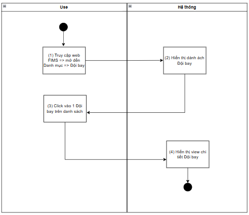
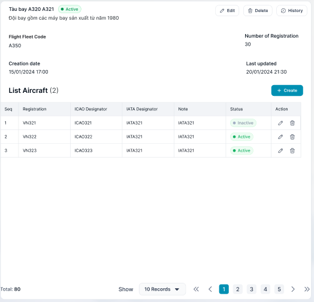

> **Ngữ cảnh chương (giữ nguyên từ nguồn):** mục `Data Maintenance (Danh mục dùng chung)`.

### Xem chi tiết Đội bay

| **Tên chức năng: Xem chi tiết Đội bay** | |
| --- | --- |
| **Mục đích** | Cho phép user Xem chi tiết Đội bay |
| **Trigger** | Người dùng truy cập vào web Fims => nhấn Danh mục => Đội bay => nhấn vào 1 dòng Đội bay bất kỳ |
| **Tiền điều kiện** | Người dùng đăng nhập thành công và được phân quyền xem phân hệ Đội bay |
| **Hậu điều kiện** | Màn hình Xem chi tiết Đội bay hiển thị |

#### Sơ đồ luồng hệ thống

****

#### Mô tả luồng xử lý

| **Bước** | **Chi tiết** |
| --- | --- |
| 1 | User truy cập vào web Fims => mở đến module Danh mục=> Đội bay |
| 2 | Hệ thống hiển thị màn hình [danh sách Đội bay](TOSS.DM.FLEET_LIST.FD.v0.1.md) trên giao diện |
| 3 | User click vào 1 dòng bất kỳ trên [Danh sách Đội bay](TOSS.DM.FLEET_LIST.FD.v0.1.md) |
| 4 | Hệ thống hiển thị Xem chi tiết Đội bay |

#### Màn hình chức năng

****

#### Mô tả chi tiết màn hình

| **STT** | **Tên** | **Kiểu dữ liệu [Độ dài dữ liệu]** | **Mapping DB/API** | **Mô tả** |
| --- | --- | --- | --- | --- |
| **Thông tin đội bay**  Dánh sách tàu bay được sắp xếp theo trường Registration theo quy tắc sau:  + Chữ cái : a -> z ( chữ thường trước chữ hoa)   * Số : từ bé tới lớn | | | | |
| **1.** | Flight Fleet Name | Textview | flightfleet_name | * Hiển thị thông tin [flightfleet_name] theo dữ liệu API trả về * Hiển thị tối đa 2 dòng dữ liệu * Nếu độ dài dữ liệu vượt quá 2 dòng, hiển thị ba chấm […] ở cuối dòng thứ 2 và có tooltip hiển thị toàn bộ nội dung * Trường hợp lỗi API trả về N/A |
| **2.** | Status | Textview | tagstatus | * Hiển thị thông tin [tagstatus] theo dữ liệu API trả về   + Status=Active: Tag màu xanh lá   + Status=Inactive: Tag màu xám |
| **3.** | Actions | Icon function |  | * Bao gồm các function sau:   + Sửa => Ẩn khi user không được phân quyền Sửa   + Lịch sử => Ẩn khi user không được phân quyền Xem   + Xóa => Ẩn khi user không được phân quyền Xóa * Click function => mở màn hình chức năng tương ứng |
| **4.** | Note | Textview | note | * Hiển thị thông tin [note] theo dữ liệu API trả về * Hiển thị tối đa 2 dòng dữ liệu * Nếu độ dài dữ liệu vượt quá 2 dòng, hiển thị ba chấm […] ở cuối dòng thứ 2 và có tooltip hiển thị toàn bộ nội dung * Trường hợp lỗi API trả về N/A |
| **5** | Flight Fleet Code | Textview | flightfleet_code | * Hiển thị thông tin [flightfleet_code] theo dữ liệu API trả về * Hiển thị tối đa 2 dòng dữ liệu * Nếu độ dài dữ liệu vượt quá 2 dòng, hiển thị ba chấm […] ở cuối dòng thứ 2 và có tooltip hiển thị toàn bộ nội dung * Trường hợp lỗi API trả về N/A |
| **6.** | Number of Registration | Textview | numberof_registration | * Hiển thị thông tin [numberof_registration] theo dữ liệu API trả về * Hiển thị tối đa 2 dòng dữ liệu * Nếu độ dài dữ liệu vượt quá 2 dòng, hiển thị ba chấm […] ở cuối dòng thứ 2 và có tooltip hiển thị toàn bộ nội dung * Trường hợp lỗi API trả về N/A |
| **7.** | Creation date | Textview | creation_date | * Hiển thị thông tin [creation_date] theo dữ liệu API trả về * Hiển thị tối đa 2 dòng dữ liệu * Nếu độ dài dữ liệu vượt quá 2 dòng, hiển thị ba chấm […] ở cuối dòng thứ 2 và có tooltip hiển thị toàn bộ nội dung * Trường hợp lỗi API trả về N/A |
| **8.** | Last updated | Textview | last_updated | * Hiển thị thông tin [last_updated] theo dữ liệu API trả về * Hiển thị tối đa 2 dòng dữ liệu * Nếu độ dài dữ liệu vượt quá 2 dòng, hiển thị ba chấm […] ở cuối dòng thứ 2 và có tooltip hiển thị toàn bộ nội dung * Trường hợp lỗi API trả về N/A |
| **[Danh sách tàu bay](../TOSS.DM.AIRCRAFT/TOSS.DM.AIRCRAFT_LIST.FD.v0.1.md)**   * Hiển thị toàn bộ thông tin các tàu bay hiện có trong Đội bay * Cho phép người dùng theo dõi tình trạng của tàu bay | | | | |
|  | Tiêu đề | Textview |  | * Hiển thị mặc định: “List Aircraft (...)” |
|  |  | Button |  | * Click vào => mở màn hình Thêm mới Tàu bay vào Đội bay * Hiển thị form nhập thông tin tương ứng với đối tượng cần tạo * Button **Create** chỉ hiển thị khi:   + Người dùng đã đăng nhập thành công   + Người dùng có **quyền Thêm mới** đối với chức năng tương ứng |
|  | No | Textview | No | * Hiển thị No bản ghi tăng dần |
|  | Registration | Textview | registration | * Hiển thị thông tin [registration] theo dữ liệu API trả về * Hiển thị tối đa 2 dòng dữ liệu * Nếu độ dài dữ liệu vượt quá 2 dòng, hiển thị ba chấm […] ở cuối dòng thứ 2 và có tooltip hiển thị toàn bộ nội dung |
|  | ICAO Designator | Textview | icao_Designator | * Hiển thị thông tin [icao_Designator] theo dữ liệu API trả về * Hiển thị tối đa 2 dòng dữ liệu * Nếu độ dài dữ liệu vượt quá 2 dòng, hiển thị ba chấm […] ở cuối dòng thứ 2 và có tooltip hiển thị toàn bộ nội dung |
|  | IATA Designator | Textview | iata_Designator | * Hiển thị thông tin [iata_Designator] theo dữ liệu API trả về * Hiển thị tối đa 2 dòng dữ liệu * Nếu độ dài dữ liệu vượt quá 2 dòng, hiển thị ba chấm […] ở cuối dòng thứ 2 và có tooltip hiển thị toàn bộ nội dung |
|  | Note | Textview | note | * Hiển thị thông tin [note] theo dữ liệu API trả về * Hiển thị tối đa 2 dòng dữ liệu * Nếu độ dài dữ liệu vượt quá 2 dòng, hiển thị ba chấm […] ở cuối dòng thứ 2 và có tooltip hiển thị toàn bộ nội dung |
|  | Status | Textview | tagstatus | * Hiển thị thông tin [tagstatus] theo dữ liệu API trả về   + Status=Active: Tag màu xanh lá   + Status=Inactive: Tag màu xám |
|  | Action | Icon function |  | * Bao gồm các function sau:   + Sửa => Ẩn khi user không được phân quyền Sửa   + Xóa => Ẩn khi user không được phân quyền Xóa * Click function => mở màn hình chức năng tương ứng |
|  | Phân trang |  |  | * [Theo kịch bản phân trang](https://docs.google.com/document/d/1L5y0t4FCWe_vnNI65xNMRC-LM3lvLwYsQRAm_Nokv9A/edit?tab=t.0#heading=h.abyqd0hrl467) |

---

*Nguồn: tách trung thực từ `sec-31-quan-ly-danh-muc-doi-bay.md`, mục "Xem chi tiết Đội bay" (bản trích text của `VNA.TOSS_SRS_Data Maintenance_v0.1.docx`, chương Data Maintenance (Danh mục dùng chung)) — tương ứng dòng **#50** bảng §1 của [CATALOG.md](../CATALOG.md). Không chỉnh sửa nội dung nguồn (CLAUDE.md §0). 🖼 Hình ảnh màn hình: xem file `VNA.TOSS_SRS_Data Maintenance_v0.1.docx` gốc.*
