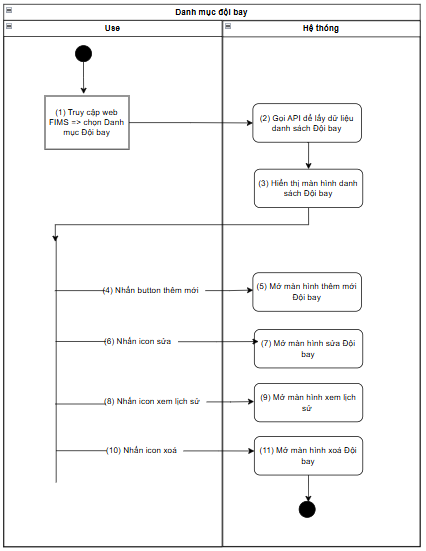
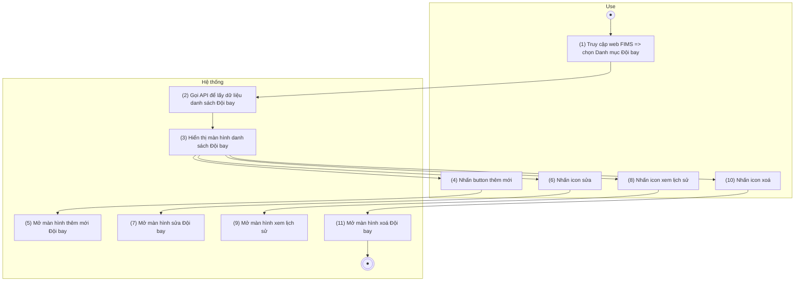
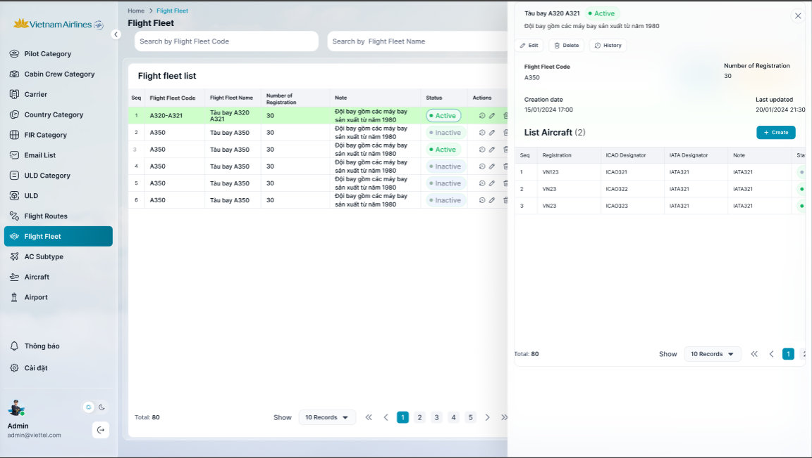

> **Ngữ cảnh chương (giữ nguyên từ nguồn):** mục `Data Maintenance (Danh mục dùng chung)`.

## Quản lý danh mục đội bay

### Xem danh sách Đội bay

| **Tên chức năng: Quản lý danh mục Đội bay** | |
| --- | --- |
| **Mục đích** | Cho phép user Xem danh sách **Đội bay** |
| **Trigger** | Người dùng truy cập vào web FIMS => mở đến module Danh mục Đội bay |
| **Tiền điều kiện** | Người dùng đăng nhập thành công và được phân quyền Danh mục Đội bay |
| **Hậu điều kiện** | Mở màn hình danh sách Đội bay trên giao diện người dùng |

#### Sơ đồ luồng hệ thống

****

#### Mô tả luồng xử lý

| **Bước** | **Chi tiết** |
| --- | --- |
| 1 | User truy cập vào web Fims => mở đến module Danh mục=> Đội bay |
| 2 | Hệ thống hiển thị màn hình danh sách Đội bay trên giao diện |
| 3 | User click Thêm mới => Hệ thống hiển thị màn hình [Thêm mới Đội bay](TOSS.DM.FLEET_ADD_EDIT.FD.v0.1.md) |
| 4 | User click icon “ Sửa” => Hệ thống hiển thị màn hình [Sửa Đội bay](TOSS.DM.FLEET_ADD_EDIT.FD.v0.1.md) |
| 5 | User click icon “ Xóa” => Hệ thống hiển thị màn hình [Xóa Đội bay](TOSS.DM.FLEET_DELETE.FD.v0.1.md) |
| 6 | User click icon “ Xem” => Hệ thống hiển thị màn hình [Xem lịch sử Đội bay](TOSS.DM.FLEET_HISTORY.FD.v0.1.md) |

#### Màn hình chức năng

#### Mô tả chi tiết màn hình

| **STT** | **Tên** | **Kiểu dữ liệu [Độ dài dữ liệu]** | **Mapping DB/API** | **Mô tả** |
| --- | --- | --- | --- | --- |
| **Chức năng tìm kiếm**  ****   * Cơ chế Thu gọn/Mở rộng bộ lọc (Collapsible Fillter):   + [Tham chiếu kịch bản chức năng ẩn hiện filter](https://docs.google.com/document/d/1L5y0t4FCWe_vnNI65xNMRC-LM3lvLwYsQRAm_Nokv9A/edit?tab=t.0#heading=h.dgq51psil6dr) * Click vào các ô search để chọn lọc, tìm kiếm thông tin theo dữ liệu của Đội bay * Trường hợp Searchbox không có dữ liệu: Mặc định tìm kiếm all dữ liệu tại cột đó * Người dùng thao tác thay đổi giá trị trường dữ liệu => click Enter/button Search => hệ thống thực hiện:   + Reload dữ liệu table phù hợp với bộ lọc   + Set current page=1 * Hiển thị kết quả tìm kiếm:   + Trường hợp API trả về data có KQ: hiển thị danh sách dữ liệu theo kết quả API trả về.   + Trường hợp API trả về data rỗng hoặc lỗi: Hiển thị bảng danh sách với **chân trang = Tất cả danh sách : 0**. | | | | |
|  | Title hệ thống | Label |  | * + [Tham chiếu Kịch bản title hệ thống](https://docs.google.com/document/d/1L5y0t4FCWe_vnNI65xNMRC-LM3lvLwYsQRAm_Nokv9A/edit?tab=t.0#bookmark=kix.f2nh07gdowb8) |
| **1.** | Search by Flight Fleet Code | Searchbox | flightfleet_code | * Trường để lọc: Tìm kiếm gần đúng theo [flightfleet_code] * Maxlength 20 ký tự * Validate cho phép nhập chữ, số, dấu gạch ngang [-]; dấu gạch dưới [_]; dấu chấm [.]; dấu gạch chéo [/] * Nếu dữ liệu nhập vượt quá độ dài ô => thay thế phần vượt quá bằng ký tự “...” và có tooltip hiển thị toàn bộ nội dung nhập * Nếu paste đoạn văn thì ghi nhận 20 ký tự đầu * Tự động TRIM Spaces đầu cuối khi tìm kiếm |
| **2.** | Search by Flight Fleet Name | Searchbox | flightfleet_name | * Trường để lọc: Tìm kiếm gần đúng theo [flightfleet_code] * Maxlength 100 ký tự * Validate cho phép nhập chữ, số, dấu gạch ngang [-]; dấu gạch dưới [_]; dấu chấm [.]; dấu gạch chéo [/] * Nếu dữ liệu nhập vượt quá độ dài ô => thay thế phần vượt quá bằng ký tự “...” và có tooltip hiển thị toàn bộ nội dung nhập * Nếu paste đoạn văn thì ghi nhận 100 ký tự đầu * Tự động TRIM Spaces đầu cuối khi tìm kiếm |
| **3.** | Status | Dropdown | status | * Trường để lọc: Tìm kiếm chính xác theo [status] * Các giá trị lựa chọn:   + Active   + Inactive |
| **4.** |  | Button |  | * Click vào  * Hệ thống lọc dữ liệu dựa trên nội dung trường lọc * Hệ thống trả về danh sách dữ liệu phù hợp với từ khoá tìm kiếm |
| **5.** |  | Button |  | * Click vào  * Hệ thống   + Xoá nội dung search   + Reset toàn bộ trường lọc đã chọn   + Reset phân trang về trang đầu * Hệ thống gọi API lấy danh sách dữ liệu mặc định * Hiển thị lại danh sách ban đầu |
| **Danh sách Đội bay** | | | | |
| **6.** | Tiêu đề | Textview |  | Hiển thị mặc định: “Flight fleet list” |
| **7.** |  | Button |  | * Click vào => mở màn hình [Thêm mới Đội bay](TOSS.DM.FLEET_ADD_EDIT.FD.v0.1.md) * Hiển thị form nhập thông tin tương ứng với đối tượng cần tạo * Button **Create** chỉ hiển thị khi:   + Người dùng đã đăng nhập thành công   + Người dùng có **quyền Thêm mới** đối với chức năng tương ứng |
| **8.** |  | Button |  | * Tham chiếu kịch bản [xuất Excel](#bookmark=id.r5pkpuo7a6i2) * Tên file tải về: [FIMS_Quanlydoibay_ddmmyyhh](https://docs.google.com/spreadsheets/d/1DrMmlo8y3e5dqAERtXnrap-o_nbCsXzJ0DJRCxxrdF4/edit?usp=sharing)mm * Nội dung file tải về: tải theo cột dữ liệu view từ bảng danh sách Đội bay * Định dạng xlsx |
| **9.** | No | Textview |  | * Hiển thị No bản ghi tăng dần |
|  | Flight Fleet Code | Textview | flightfleet_code | * Hiển thị [flightfleet_code] theo dữ liệu API trả về * Hiển thị tối đa 2 dòng dữ liệu * Nếu độ dài dữ liệu vượt quá 2 dòng, hiển thị ba chấm […] ở cuối dòng thứ 2 và có tooltip hiển thị toàn bộ nội dung * Trường hợp lỗi API trả về N/A |
|  | Flight Fleet Name | Textview | flightfleet_name | * Hiển thị [flightfleet_name] theo dữ liệu API trả về * Hiển thị tối đa 2 dòng dữ liệu * Nếu độ dài dữ liệu vượt quá 2 dòng, hiển thị ba chấm […] ở cuối dòng thứ 2 và có tooltip hiển thị toàn bộ nội dung * Trường hợp lỗi API trả về N/A |
|  | Number of  Registration | Textview | numberof_registration | * Hiển thị [numberof_registration] theo dữ liệu API trả về * Không hiển thị trùng với số đã tồn tại * Hiển thị tối đa 2 dòng dữ liệu * Nếu độ dài dữ liệu vượt quá 2 dòng, hiển thị ba chấm […] ở cuối dòng thứ 2 và có tooltip hiển thị toàn bộ nội dung * Trường hợp lỗi API trả về N/A |
|  | Note | Textview | note | * Hiển thị [note] theo dữ liệu API trả về * Hiển thị tối đa 2 dòng dữ liệu * Nếu độ dài dữ liệu vượt quá 2 dòng, hiển thị ba chấm […] ở cuối dòng thứ 2 và có tooltip hiển thị toàn bộ nội dung * Trường hợp lỗi API trả về N/A |
|  | Status | Textview | tagstatus | * Hiển thị TagStatus theo dữ liệu API trả về   + Status=Active: Tag màu xanh lá   + Status=Inactive: Tag màu xám |
|  | Actions | Icon function |  | Bao gồm các function sau   * Sửa => Ẩn khi user không được phân quyền Sửa * xem => Ẩn khi user không được phân quyền Xem * Xóa => Ẩn khi user không được phân quyền Xóa * Click function => mở màn hình chức năng tương ứng |
|  | Phân trang |  |  | * [Theo kịch bản phân trang](https://docs.google.com/document/d/1L5y0t4FCWe_vnNI65xNMRC-LM3lvLwYsQRAm_Nokv9A/edit?tab=t.0#heading=h.abyqd0hrl467) |

---

*Nguồn: tách trung thực từ `sec-31-quan-ly-danh-muc-doi-bay.md`, mục "Xem danh sách Đội bay" (bản trích text của `VNA.TOSS_SRS_Data Maintenance_v0.1.docx`, chương Data Maintenance (Danh mục dùng chung)) — tương ứng dòng **#49** bảng §1 của [CATALOG.md](../CATALOG.md). Không chỉnh sửa nội dung nguồn (CLAUDE.md §0). 🖼 Hình ảnh màn hình: xem file `VNA.TOSS_SRS_Data Maintenance_v0.1.docx` gốc.*
