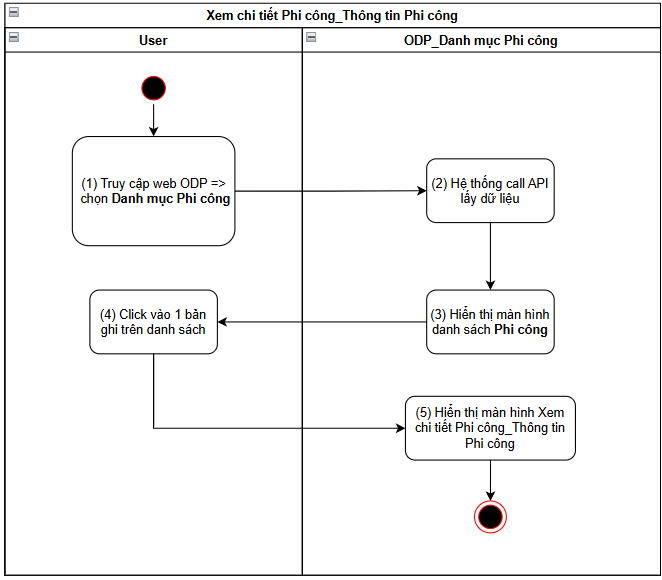
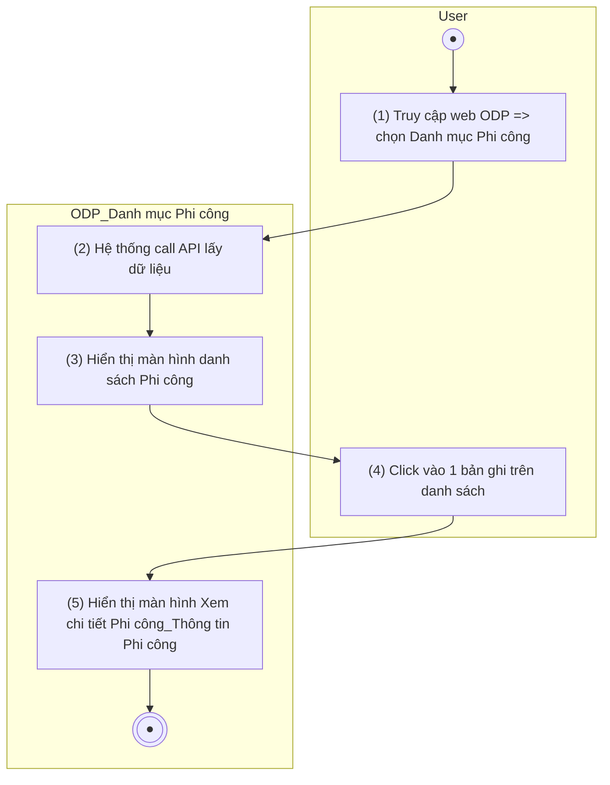
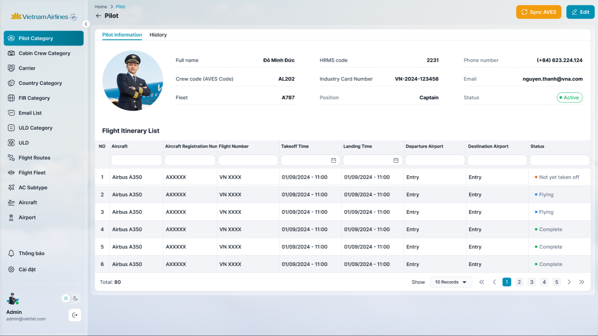
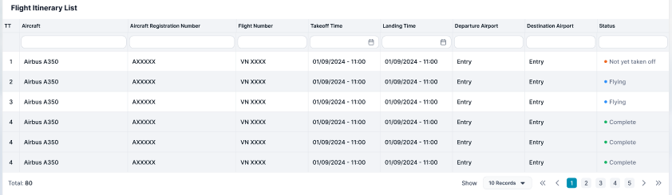

> **Ngữ cảnh chương (giữ nguyên từ nguồn):** mục `Data Maintenance (Danh mục dùng chung)`.

### Xem chi tiết Phi công_Thông tin Phi công

| **Tên chức năng: Xem chi tiết Phi công_Thông tin Phi công** | |
| --- | --- |
| **Mục đích** | Cho phép user Xem chi tiết Phi công_Thông tin Phi công |
| **Trigger** | Người dùng truy cập vào web FIMS => mở đến module Danh mục/Danh mục Phi công => click vào 1 bản ghi bất kỳ |
| **Tiền điều kiện** | Người dùng đăng nhập thành công và được phân quyền Danh mục Phi công |
| **Hậu điều kiện** | Mở màn hình Xem chi tiết Phi công_Thông tin Phi công trên giao diện người dùng |

#### Sơ đồ luồng hệ thống

1. Sơ đồ luồng nghiệp vụ

#### Mô tả luồng xử lý

| **Bước** | **Chi tiết** |
| --- | --- |
|  | Truy cập web FIMS => mở đến module Danh mục/Danh mục Phi công |
|  | Hệ thống call API xuống BE lấy [danh sách Phi công](TOSS.DM.PILOT_LIST.FD.v0.1.md) |
|  | Hiển thị [danh sách Phi công](TOSS.DM.PILOT_LIST.FD.v0.1.md) trên giao diện người dùng |
|  | User click vào 1 bản ghi trên danh sách |
|  | Hiển thị màn hình Xem chi tiết Phi công, focus tab Thông tin Phi công |

#### Màn hình chức năng

1. Giao diện Thông tin chi tiết_Thông tin phi công

#### Mô tả chi tiết màn hình danh sách

| **STT** | **Tên** | **Kiểu dữ liệu**  **[Độ dài dữ liệu]** | **Mapping DB/API** | **Mô tả nghiệp vụ** |
| --- | --- | --- | --- | --- |
|  | Details | Title |  | * Fix cứng text “Details” * Icon back  => click > hệ thống xử lý quay về và refresh màn hình List of Pilot |
|  |  | Button | btn_sync_aves | * Click button → Hệ thống call API đồng bộ thông tin phi công từ hệ thống AVES, trong đó   Input: Crewcode và typeUser=PC đang xem  Output: AVES trả thông tin của PC lấy từ AVES theo Crewcode, hệ thống update thông tin cho PC và Người dùng nhóm PC/[Danh sách người dùng](../../../../SA-system-admin/srs/_parts/TOSS.SA.USER/TOSS.SA.USER_LIST.FD.v0.1.md) tương ứng (nếu có) |
|  |  | Button | btn_edit | * Click button → mở màn hình popup [Sửa thông tin Phi công thủ công](TOSS.DM.PILOT_EDIT_MANUAL.FD.v0.1.md) |
|  | Pilot Information | Tab |  | * Default focus tab này khi mở xem Pilot Information * Highlight vàng tab khi được focus đến |
|  | History | Tab |  | * Click tab: mở màn hình xem History cập nhật PC * Highlight vàng tab khi được focus đến |
|  | Avatar |  | pilot_avatar/pilotAvatar | * Hiển thị [pilotAvatar] theo dữ liệu API trả về * Trường hợp API trả về rỗng/lỗi: để trống trường |
|  | Full name | Textview | full_name/fullName | * Hiển thị [fullName] theo dữ liệu API trả về * Trường hợp API trả về rỗng/lỗi: để trống trường |
|  | Code HRMS (Former employee code) | Textview | hrms_code/hrmsCode | * Hiển thị [hrmsCode] theo dữ liệu API trả về * Trường hợp API trả về rỗng/lỗi: để trống trường |
|  | Crew code (Code AVES) | Textview | crew_code/crewCode | * Hiển thị [Crew code] theo dữ liệu API trả về * Trường hợp API trả về rỗng/lỗi: để trống trường |
|  | Industry Card Number | Textview | industry_card_number/industryCardNumber | * Hiển thị [industryCardNumber] theo dữ liệu API trả về * Trường hợp API trả về rỗng/lỗi: để trống trường |
|  | Fleet | Textview | fleet/rank | * Hiển thị [Fleet] theo dữ liệu API trả về * Trường hợp API trả về rỗng/lỗi: để trống trường |
|  | Position | Textview | position | * Hiển thị [position] theo dữ liệu API trả về * Trường hợp API trả về rỗng/lỗi: để trống trường |
|  | Status | Textview | active_status | * Hiển thị TagStatus * Hệ thống check theo **Crew code** mapping với **Người dùng nhóm PC**, lấy và hiển thị theo trạng thái của người dùng tương ứng   + Status=Active : Tag màu xanh lá   + Status=Inactive : Tag màu xám * Trường hợp có > 1 **Người dùng nhóm PC** cùng **Crew code** với **PC** này =>   + nếu Ǝ Người dùng có trạng thái = Active => hiển thị theo trạng thái = Active   + nếu tất cả Người dùng đều có trạng thái = Inactive => hiển thị theo trạng thái = Inactive * Trường hợp API trả về rỗng/lỗi: để trống trường |
|  | Phone number | Textview | phone_number/phoneNumber | * Hiển thị [phoneNumber] theo dữ liệu API trả về * Định dạng number (+84)xxx.xxx.xxx * Trường hợp API trả về rỗng/lỗi: để trống trường |
|  | Email | Textview | email | * Hiển thị [email] theo dữ liệu API trả về * Trường hợp API trả về rỗng/lỗi: để trống trường |
| Danh sách hành trình bay   | | | | |
|  | Tìm kiếm   * Click vào dòng dưới tiêu đề các cột để chọn lọc, tìm kiếm thông tin theo dữ liệu tại cột tương ứng. * Trường hợp Searchbox không có dữ liệu: Mặc định tìm kiếm all dữ liệu tại cột đó * Người dùng thao tác thay đổi giá trị trường dữ liệu => click Enter/out focus box => hệ thống thực hiện:   + Reload dữ liệu table phù hợp với bộ lọc   + Set current page=1 * Hiển thị kết quả tìm kiếm:   + Trường hợp API trả về data có KQ: hiển thị danh sách dữ liệu theo kết quả API trả về   + Trường hợp API trả về data rỗng hoặc lỗi: Hiển thị bảng danh sách với **chân trang = Tất cả danh sách : 0** | | | |
|  | Aircraft | Textbox | aircraft_type/aircraftType | * Trường để lọc: Tìm kiếm gần đúng theo [aircraftType] * Maxlength 20 ký tự * Validate cho phép nhập chữ, số, và ký tự đặc biệt * Nếu dữ liệu nhập vượt quá độ dài ô => thay thế phần vượt quá bằng ký tự “...” và có tooltip hiển thị toàn bộ nội dung nhập * Nếu paste đoạn văn thì ghi nhận 20 ký tự đầu * Tự động TRIM Spaces đầu cuối khi tìm kiếm |
|  | Aircraft Registration Number | Textbox | aircraft_registration_number/aircraftRegistrationNumber | * Trường để lọc: Tìm kiếm gần đúng theo [aircraftRegistrationNumber] * Maxlength 20 ký tự * Validate cho phép nhập chữ, số, và ký tự đặc biệt * Nếu dữ liệu nhập vượt quá độ dài ô => thay thế phần vượt quá bằng ký tự “...” và có tooltip hiển thị toàn bộ nội dung nhập * Nếu paste đoạn văn thì ghi nhận 20 ký tự đầu * Tự động TRIM Spaces đầu cuối khi tìm kiếm |
|  | Flight Number | Textbox | flight_number/flightNumber | * Trường để lọc: Tìm kiếm gần đúng theo [flightNumber] * Maxlength 20 ký tự * Validate cho phép nhập chữ, số, và ký tự đặc biệt * Nếu dữ liệu nhập vượt quá độ dài ô => thay thế phần vượt quá bằng ký tự “...” và có tooltip hiển thị toàn bộ nội dung nhập * Nếu paste đoạn văn thì ghi nhận 20 ký tự đầu * Tự động TRIM Spaces đầu cuối khi tìm kiếm |
|  | Takeoff Time | DateTimePicker | takeoff_time/takeoffTime | * Trường để lọc: Tìm kiếm gần đúng theo [takeoffTime] * Định dạng dd/mm/yyyy - dd/mm/yyyy * Cho phép chọn hoặc nhập trực tiếp * Nếu dữ liệu nhập vượt quá độ dài ô => thay thế phần vượt quá bằng ký tự “...” và có tooltip hiển thị toàn bộ nội dung nhập |
|  | Landing Time | DateTimePicker | landing_time/landingTime | * Trường để lọc: Tìm kiếm gần đúng theo [landingTime] * Định dạng dd/mm/yyyy - dd/mm/yyyy * Cho phép chọn hoặc nhập trực tiếp * Nếu dữ liệu nhập vượt quá độ dài ô => thay thế phần vượt quá bằng ký tự “...” và có tooltip hiển thị toàn bộ nội dung nhập |
|  | Departure Airport | Textbox | departure_airport/departureAirport | * Trường để lọc: Tìm kiếm gần đúng theo [departureAirport] * Maxlength 20 ký tự * Validate cho phép nhập chữ, số, và ký tự đặc biệt * Nếu dữ liệu nhập vượt quá độ dài ô => thay thế phần vượt quá bằng ký tự “...” và có tooltip hiển thị toàn bộ nội dung nhập * Nếu paste đoạn văn thì ghi nhận 20 ký tự đầu * Tự động TRIM Spaces đầu cuối khi tìm kiếm |
|  | Destination Airport | Textbox | arrival_airport/arrivalAirport | * Trường để lọc: Tìm kiếm gần đúng theo [arrivalAirport] * Maxlength 20 ký tự * Validate cho phép nhập chữ, số, và ký tự đặc biệt * Nếu dữ liệu nhập vượt quá độ dài ô => thay thế phần vượt quá bằng ký tự “...” và có tooltip hiển thị toàn bộ nội dung nhập * Nếu paste đoạn văn thì ghi nhận 20 ký tự đầu * Tự động TRIM Spaces đầu cuối khi tìm kiếm |
|  | Status | DDL [Completed, Flying, Not yet taken off] | state | * Trường để lọc: Tìm kiếm chính xác theo [status] * Giá trị chọn lọc:   + **Completed**   + **Flying**   + **Not yet taken off** |
|  | Chi tiết danh sách   * Hệ thống call API lấy dữ liệu và hiển thị thông tin danh sách hành trình bay của PC (trong vòng 7 ngày - trước và sau ngày hiện tại 3 ngày) theo điều kiện:   + Ngày xét điều kiện: Ngày hạ cánh (đối với các chuyến bay trước 3 ngày) & Ngày cất cánh (đối với các chuyến bay sau 3 ngày)   + Hiển thị 7 bản ghi/ 1 trang   + Đầu tiên là các chuyến bay của Day -3, đến chuyến bay Day+3   + Sắp xếp theo thứ tự từ thời gian cất cánh gần nhất * Thông tin được đồng bộ từ hệ thống Nestline với tần suất 5 phút/ lần | | | |
|  | TT | Textview |  | * Hiển thị STT của các bản ghi theo thứ tự tăng dần từ 1 |
|  | Aircraft | Textview | aircraft_type/aircraftType | * Hiển thị [aircraftType] theo dữ liệu API trả về * Hiển thị tối đa 2 dòng dữ liệu * Nếu độ dài dữ liệu vượt quá 2 dòng, hiển thị ba chấm […] ở cuối dòng thứ 2 và có tooltip hiển thị toàn bộ nội dung * Trường hợp API trả về rỗng/lỗi: để trống trường |
|  | Aircraft Registration Number | Textview | aircraft_registration_number/aircraftRegistrationNumber | * Hiển thị [aircraftRegistrationNumber] theo dữ liệu API trả về * Hiển thị tối đa 2 dòng dữ liệu * Nếu độ dài dữ liệu vượt quá 2 dòng, hiển thị ba chấm […] ở cuối dòng thứ 2 và có tooltip hiển thị toàn bộ nội dung * Trường hợp API trả về rỗng/lỗi: để trống trường |
|  | Flight Number | Textview | flight_number/flightNumber | * Hiển thị [flightNumber] theo dữ liệu API trả về * Hiển thị tối đa 2 dòng dữ liệu * Nếu độ dài dữ liệu vượt quá 2 dòng, hiển thị ba chấm […] ở cuối dòng thứ 2 và có tooltip hiển thị toàn bộ nội dung * Trường hợp API trả về rỗng/lỗi: để trống trường |
|  | Takeoff Time | Textview | takeoff_time/takeoffTime | * Hiển thị [takeoffTime] theo dữ liệu API trả về, nếu:   + Status=Chưa cất cánh: Lấy giờ dự kiến   + Status=Đang bay: Lấy giờ dự kiến   + Status=Hoàn thành: Lấy giờ thực tế * Định dạng dd/mm/yyyy - hh:mm * Trường hợp API trả về rỗng/lỗi: để trống trường |
|  | Landing Time | Textview | landing_time/landingTime | * Hiển thị [landingTime] theo dữ liệu API trả về, nếu:   + Status=Not yet taken off: Lấy giờ dự kiến   + Status=Flying: Lấy giờ dự kiến   + Status=Completed: Lấy giờ thực tế * Định dạng dd/mm/yyyy - hh:mm * Trường hợp API trả về rỗng/lỗi: để trống trường |
|  | Departure Airport | Textview | departure_airport/departureAirport | * Hiển thị [departureAirport] theo dữ liệu API trả về, nếu:   + Status=Not yet taken off: Lấy sân dự kiến   + Status=Flying: Lấy sân dự kiến   + Status=Completed: Lấy sân thực tế * Hiển thị tối đa 2 dòng dữ liệu * Nếu độ dài dữ liệu vượt quá 2 dòng, hiển thị ba chấm […] ở cuối dòng thứ 2 và có tooltip hiển thị toàn bộ nội dung * Trường hợp API trả về rỗng/lỗi: để trống trường |
|  | Destination Airport | Textview | arrival_airport/arrivalAirport | * Hiển thị [arrivalAirport] theo dữ liệu API trả về, nếu:   + Status=Not yet taken off : Lấy sân dự kiến   + Status=Flying: Lấy sân dự kiến   + Status=Completed: Lấy sân thực tế * Hiển thị tối đa 2 dòng dữ liệu * Nếu độ dài dữ liệu vượt quá 2 dòng, hiển thị ba chấm […] ở cuối dòng thứ 2 và có tooltip hiển thị toàn bộ nội dung * Trường hợp API trả về rỗng/lỗi: để trống trường |
|  | Status | Textview | state | * Hiển thị TagState theo dữ liệu API trả về   + State=Not yet taken off: Tag màu cam   + State=Flying: Tag màu xanh lam   + State=Completed: Tag màu xanh lá * Trường hợp API trả về rỗng/lỗi: để trống trường |
|  | Footer | Pagination |  | * [Theo kịch bản phân trang](https://docs.google.com/document/d/1L5y0t4FCWe_vnNI65xNMRC-LM3lvLwYsQRAm_Nokv9A/edit?tab=t.0#heading=h.abyqd0hrl467) |

---

*Nguồn: tách trung thực từ `sec-22-quan-ly-danh-muc-phi-cong.md`, mục "Xem chi tiết Phi công — Thông tin Phi công" (bản trích text của `VNA.TOSS_SRS_Data Maintenance_v0.1.docx`, chương Data Maintenance (Danh mục dùng chung)) — tương ứng dòng **#8** bảng §1 của [CATALOG.md](../CATALOG.md). Không chỉnh sửa nội dung nguồn (CLAUDE.md §0). 🖼 Hình ảnh màn hình: xem file `VNA.TOSS_SRS_Data Maintenance_v0.1.docx` gốc.*
