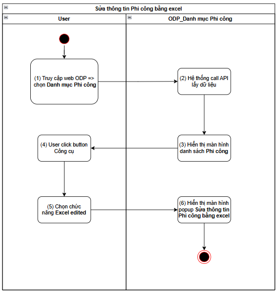
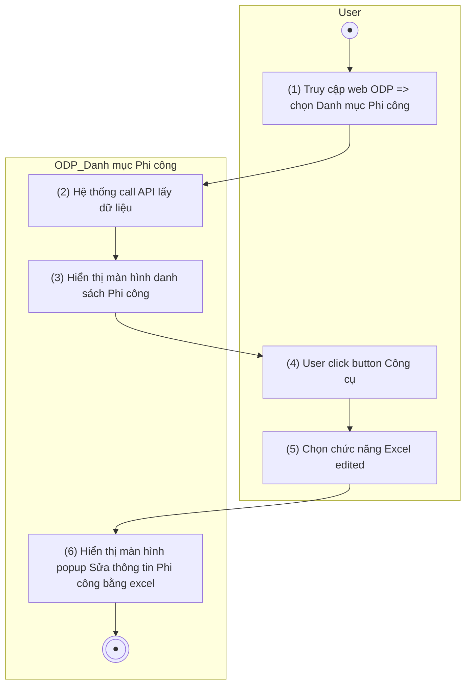

> **Ngữ cảnh chương (giữ nguyên từ nguồn):** mục `Data Maintenance (Danh mục dùng chung)`.

### [Sửa thông tin Phi công](TOSS.DM.PILOT_EDIT_MANUAL.FD.v0.1.md) bằng excel

| **Tên chức năng: [Sửa thông tin Phi công](TOSS.DM.PILOT_EDIT_MANUAL.FD.v0.1.md) bằng excel** | |
| --- | --- |
| **Mục đích** | Cho phép user [Sửa thông tin Phi công](TOSS.DM.PILOT_EDIT_MANUAL.FD.v0.1.md) bằng excel |
| **Trigger** | Người dùng truy cập vào web FIMS => mở đến module Danh mục/Danh mục Phi công => click button **Công cụ** => Chọn chức năng **Excel edited** |
| **Tiền điều kiện** | Người dùng đăng nhập thành công và được phân quyền Sửa trên Danh mục Phi công |
| **Hậu điều kiện** | Mở màn hình popup **[Sửa thông tin Phi công](TOSS.DM.PILOT_EDIT_MANUAL.FD.v0.1.md) bằng excel** trên giao diện người dùng |

#### Sơ đồ luồng hệ thống

1. Sơ đồ luồng nghiệp vụ

#### Mô tả luồng xử lý

| **Bước** | **Chi tiết** |
| --- | --- |
| 1 | Truy cập web FIMS => mở đến module Danh mục/Danh mục Phi công |
| 2 | Hệ thống call API xuống BE lấy [danh sách Phi công](TOSS.DM.PILOT_LIST.FD.v0.1.md) |
| 3 | Hiển thị [danh sách Phi công](TOSS.DM.PILOT_LIST.FD.v0.1.md) trên giao diện người dùng |
| 4 | User click button **Công cụ** trên danh sách |
| 5 | Sau đó nhấn vào chức năng **Excel edited** |
| 6 | Hệ thống mở màn hình popup [Sửa thông tin Phi công](TOSS.DM.PILOT_EDIT_MANUAL.FD.v0.1.md) bằng excel trên giao diện người dùng |

#### Màn hình chức năng

1. Giao diện [Sửa thông tin Phi công](TOSS.DM.PILOT_EDIT_MANUAL.FD.v0.1.md) bằng excel

#### Mô tả chi tiết màn hình danh sách

| **STT** | **Tên** | **Kiểu dữ liệu**  **[Độ dài dữ liệu]** | **Mapping DB/API** | **Mô tả nghiệp vụ** |
| --- | --- | --- | --- | --- |
|  | [Sửa thông tin Phi công](TOSS.DM.PILOT_EDIT_MANUAL.FD.v0.1.md) bằng excel | Title |  | * Fix cứng text “[Sửa thông tin Phi công](TOSS.DM.PILOT_EDIT_MANUAL.FD.v0.1.md) bằng excel” *  => click > thực hiện đóng popup và không cần xử lý gì |
|  | Content 1 | Textview |  | * Fix cứng text:   “Kéo thả tệp vào đây  hoặc  [Button]  Các định dạng được chấp nhận là .xlsx (tối đa 5MB)” |
|  |  | Button | btn_import_choose_file | * Theo kịch bản [Choose file](https://docs.google.com/document/d/1L5y0t4FCWe_vnNI65xNMRC-LM3lvLwYsQRAm_Nokv9A/edit?tab=t.0#heading=h.7420ow4jct8r) |
|  | Content 2 | Textview |  | * Fix cứng text:   “Để có kết quả nhập khẩu chính xác, hãy sử dụng tệp mẫu [Link temp mẫu]  Mỗi dòng dữ liệu trong tệp nhập khẩu tương ứng với 1 bản ghi.” |
|  | Link temp mẫu  | Button link | btn_import_download_template | Theo kịch bản [download template file](#bookmark=id.j4tc7tclmlst) |
|  | Action theo kịch bản [Action](#bookmark=id.vtjdsoy6718c). [Template Import Phi_cong_v0.2.xlsx](https://docs.google.com/spreadsheets/d/1b58zlNf_qAkiHcLdSjJ3yBq6RayxXPvl/edit?usp=sharing&ouid=100481381661925960730&rtpof=true&sd=true) | | | |

---

*Nguồn: tách trung thực từ `sec-22-quan-ly-danh-muc-phi-cong.md`, mục "[Sửa thông tin Phi công](TOSS.DM.PILOT_EDIT_MANUAL.FD.v0.1.md) bằng excel" (bản trích text của `VNA.TOSS_SRS_Data Maintenance_v0.1.docx`, chương Data Maintenance (Danh mục dùng chung)) — tương ứng dòng **#11** bảng §1 của [CATALOG.md](../CATALOG.md). Không chỉnh sửa nội dung nguồn (CLAUDE.md §0). 🖼 Hình ảnh màn hình: xem file `VNA.TOSS_SRS_Data Maintenance_v0.1.docx` gốc.*
