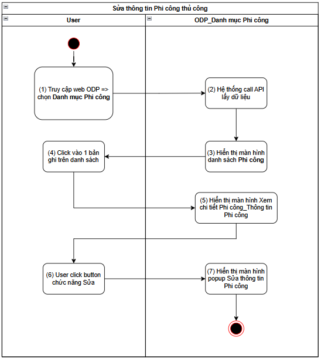
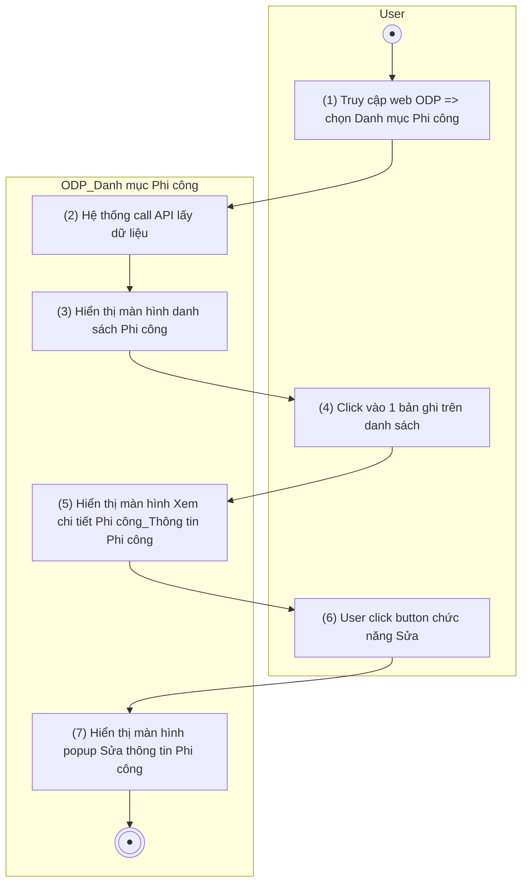
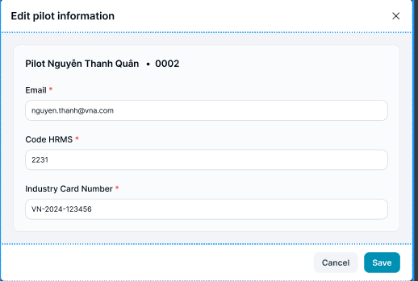
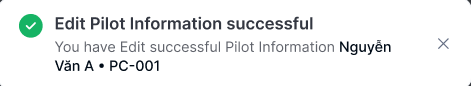
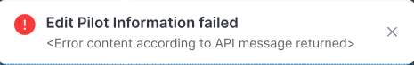
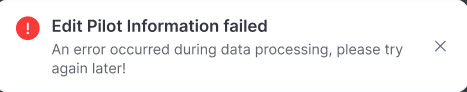

> **Ngữ cảnh chương (giữ nguyên từ nguồn):** mục `Data Maintenance (Danh mục dùng chung)`.

### Sửa thông tin Phi công thủ công

| **Tên chức năng: Sửa thông tin Phi công thủ công** | |
| --- | --- |
| **Mục đích** | Cho phép user Sửa thông tin Phi công thủ công |
| **Trigger** | Người dùng truy cập vào web FIMS => mở đến module Danh mục/Danh mục Phi công => click vào 1 bản ghi bất kỳ mở đến màn **Xem chi tiết** => click button chức năng **Sửa** |
| **Tiền điều kiện** | Người dùng đăng nhập thành công và được phân quyền Sửa trên Danh mục Phi công |
| **Hậu điều kiện** | Mở màn hình popup **Sửa thông tin Phi công** trên giao diện người dùng |

#### Sơ đồ luồng hệ thống

1. Sơ đồ luồng nghiệp vụ

#### Mô tả luồng xử lý

| **Bước** | **Chi tiết** |
| --- | --- |
|  | Truy cập web FIMS => mở đến module Danh mục/Danh mục Phi công |
|  | Hệ thống call API xuống BE lấy [danh sách Phi công](TOSS.DM.PILOT_LIST.FD.v0.1.md) |
|  | Hiển thị [danh sách Phi công](TOSS.DM.PILOT_LIST.FD.v0.1.md) trên giao diện người dùng |
|  | User click vào 1 bản ghi trên danh sách |
|  | Hiển thị màn hình [Xem chi tiết Phi công](TOSS.DM.PILOT_DETAIL.FD.v0.1.md), focus tab Thông tin Phi công |
|  | User click button chức năng Sửa  |
|  | Mở màn hình popup **Sửa thông tin Phi công** trên giao diện người dùng |

#### Màn hình chức năng

1. Giao diện Sửa thông tin Phi công

#### Mô tả chi tiết màn hình danh sách

| **STT** | **Tên** | **Kiểu dữ liệu**  **[Độ dài dữ liệu]** | **Mapping DB/API** | **Mô tả nghiệp vụ** |
| --- | --- | --- | --- | --- |
|  | Edit pilot information | Title |  | * Fix cứng text “Edit pilot information” *  => click > thực hiện đóng popup và không cần xử lý gì |
|  | Pilot Name | Textview |  | * Hiển thị [Name + crew code Pilot] không được Sửa |
|  | Email | Textbox | email | * Hiển thị [email] theo dữ liệu API trả về * Trường hợp API trả về rỗng/lỗi: hiện placeholder “Enter email” * Bắt buộc nhập giá trị * Nhận dữ liệu dạng chữ, số, ký tự đặc biệt * Valid maxlength = 100 ký tự, chặn khi nhập quá 100 ký tự * Nếu paste đoạn văn > 100 ký tự, chỉ nhận 100 ký tự đầu tiên * Tự động TRIM Spaces đầu cuối khi out focus box * Trường hợp nội dung dài vượt quá độ rộng box => di chuột vào hiện tooltips hiển thị full nội dung * **Action**: Nhấn Enter/out focus/click button **Save**, hệ thống validate, nếu   + Để trống ⇒ Hiển thị thông báo IM: [VL004](https://docs.google.com/document/d/1L5y0t4FCWe_vnNI65xNMRC-LM3lvLwYsQRAm_Nokv9A/edit?tab=t.0#bookmark=kix.oq8nkssherqj)   + Dữ liệu nhập không có domain mail ⇒ Hiển thị thông báo IM: [VL006](https://docs.google.com/document/d/1L5y0t4FCWe_vnNI65xNMRC-LM3lvLwYsQRAm_Nokv9A/edit?tab=t.0#bookmark=kix.lwrynb3cmu73)   + Email không được phép trùng với PC đã tồn tại trong cùng danh sách. Nếu trùng thì cảnh báo: [VL007](https://docs.google.com/document/d/1L5y0t4FCWe_vnNI65xNMRC-LM3lvLwYsQRAm_Nokv9A/edit?tab=t.0#bookmark=kix.s6302mi8qdnp) |
|  | Code HRMS | Textbox [0;50] | hrms_code/hrmsCode | * Hiển thị [hrmsCode] theo dữ liệu API trả về * Trường hợp API trả về rỗng/lỗi: hiện placeholder “Enter Code HRMS” * Bắt buộc nhập * Nhận dữ liệu dạng chữ, số, dấu chấm (.), gạch ngang (-), gạch dưới (_) * Valid maxlength = 50 ký tự, chặn khi nhập quá 50 ký tự * Nếu paste đoạn văn > 50 ký tự, chỉ nhận 50 ký tự đầu tiên * Tự động TRIM Spaces đầu cuối khi out focus box * Trường hợp nội dung dài vượt quá độ rộng box => di chuột vào hiện tooltips hiển thị full nội dung * **Action**: Nhấn Enter/out focus/click button **Save**, hệ thống validate, nếu   + Để trống ⇒ Hiển thị thông báo IM: [VL004](https://docs.google.com/document/d/1L5y0t4FCWe_vnNI65xNMRC-LM3lvLwYsQRAm_Nokv9A/edit?tab=t.0#bookmark=kix.oq8nkssherqj)   + Trường hợp Mã HRMS trùng với Mã HRMS của PC đã tồn tại trong cùng danh sách. => Hiển thị thông báo IM: [VL007](https://docs.google.com/document/d/1L5y0t4FCWe_vnNI65xNMRC-LM3lvLwYsQRAm_Nokv9A/edit?tab=t.0#bookmark=kix.s6302mi8qdnp) |
|  | Industry Card Number | Textbox [0;50] | industry_card_number/industryCardNumber | * Hiển thị [industryCardNumber] theo dữ liệu API trả về * Trường hợp API trả về rỗng/lỗi: hiện placeholder “Enter Industry Card Number ” * Bắt buộc nhập * Nhận dữ liệu dạng chữ, số, dấu chấm (.), gạch ngang (-), gạch dưới (_) * Valid maxlength = 50 ký tự, chặn khi nhập quá 50 ký tự * Nếu paste đoạn văn > 50 ký tự, chỉ nhận 50 ký tự đầu tiên * Tự động TRIM Spaces đầu cuối khi out focus box * Trường hợp nội dung dài vượt quá độ rộng box => di chuột vào hiện tooltips hiển thị full nội dung * **Action**: Nhấn Enter/out focus/click button **Save**, hệ thống validate, nếu   + Để trống ⇒ Hiển thị thông báo IM: [VL004](https://docs.google.com/document/d/1L5y0t4FCWe_vnNI65xNMRC-LM3lvLwYsQRAm_Nokv9A/edit?tab=t.0#bookmark=kix.oq8nkssherqj) |
|  | Cancel | Button | btn_cancel | * Click: Đóng màn hình sửa thông tin phi công và không cần xử lý gì |
|  | Save | Button | btn_save | Click ~~=>~~   * ~~Trường hợp Crew code không trùng với Crew code của PC đã tồn tại trong cùng danh sách~~ **~~nhưng trùng với Crew code của người dùng nhóm PC/Danh mục người dùng~~** ~~=> Hiển thị popup xác nhận: “Crew code [mã Crew code] trùng với mã Crew code của người dùng [Mã + Tên người dùng 1; người dùng 2;...; người dùng n]. Sau khi Lưu lại, hệ thống sẽ cập nhật thông tin người dùng trên theo thông tin Phi công này !”~~   + Nếu User nhấn button **Đóng** => đóng popup và quay lại màn hình **Sửa**, không cập nhật thông tin của PC đang sửa   + Nếu User nhấn button **Cập nhật** => Xử lý theo KB lưu bên dưới   + Nếu không thay đổi thông tin nào, nút save sẽ disable * Ngược lại: Thực hiện KB lưu thông tin PC   + Đóng màn hình Sửa PC   + FE tự động refresh màn Thông tin [chi tiết phi công](TOSS.DM.PILOT_DETAIL.FD.v0.1.md)   + Call API Update thông tin cho PC và người dùng tương ứng vào database   + Hiển thị màn hình thông báo kết quả update nếu:     - Response API trả về status 200: hiển thị toast message thành công [TB019](https://docs.google.com/document/d/1L5y0t4FCWe_vnNI65xNMRC-LM3lvLwYsQRAm_Nokv9A/edit?tab=t.0#bookmark=kix.spmzvpry3i7f)      * + - Ngược lại: hiển thị toast message lỗi theo từng tình huống  [TB020](https://docs.google.com/document/d/1L5y0t4FCWe_vnNI65xNMRC-LM3lvLwYsQRAm_Nokv9A/edit?tab=t.0#bookmark=kix.zi1hm3rguphh)     Hoặc [TB021](https://docs.google.com/document/d/1L5y0t4FCWe_vnNI65xNMRC-LM3lvLwYsQRAm_Nokv9A/edit?tab=t.0#bookmark=kix.3pbjinevz4c0)   |

---

*Nguồn: tách trung thực từ `sec-22-quan-ly-danh-muc-phi-cong.md`, mục "Sửa thông tin Phi công thủ công" (bản trích text của `VNA.TOSS_SRS_Data Maintenance_v0.1.docx`, chương Data Maintenance (Danh mục dùng chung)) — tương ứng dòng **#10** bảng §1 của [CATALOG.md](../CATALOG.md). Không chỉnh sửa nội dung nguồn (CLAUDE.md §0). 🖼 Hình ảnh màn hình: xem file `VNA.TOSS_SRS_Data Maintenance_v0.1.docx` gốc.*
