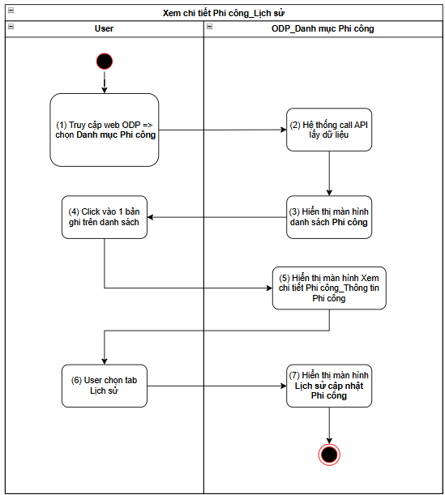
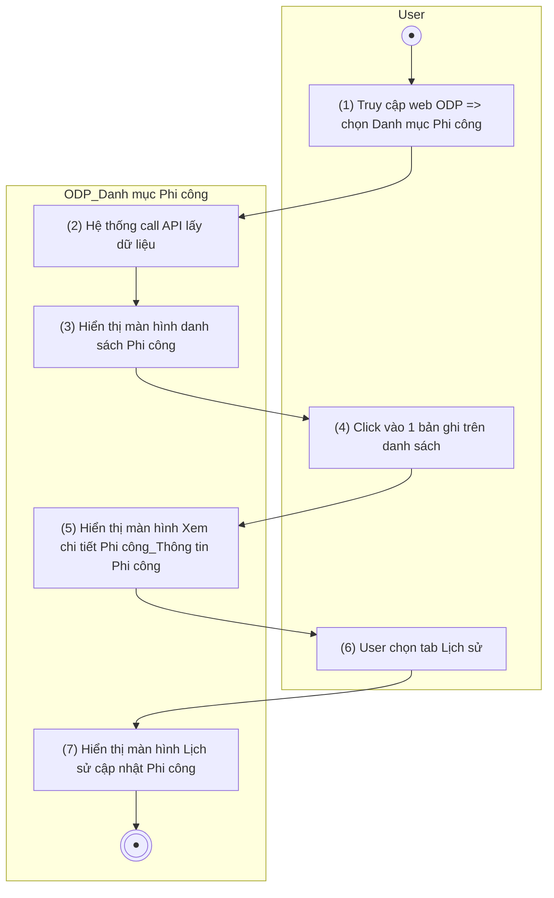
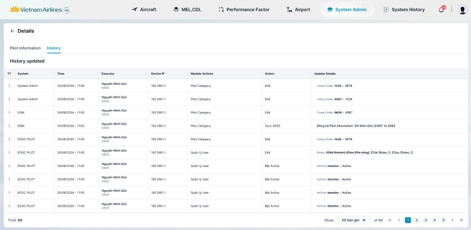

> **Ngữ cảnh chương (giữ nguyên từ nguồn):** mục `Data Maintenance (Danh mục dùng chung)`.

### [Xem chi tiết Phi công](TOSS.DM.PILOT_DETAIL.FD.v0.1.md)_Lịch sử

| **Tên chức năng: [Xem chi tiết Phi công](TOSS.DM.PILOT_DETAIL.FD.v0.1.md)_Lịch sử** | |
| --- | --- |
| **Mục đích** | Cho phép user [Xem chi tiết Phi công](TOSS.DM.PILOT_DETAIL.FD.v0.1.md)_Lịch sử |
| **Trigger** | Người dùng truy cập vào web FIMS => mở đến module Danh mục/Danh mục Phi công => click vào 1 bản ghi bất kỳ => chọn tab Lịch sử |
| **Tiền điều kiện** | Người dùng đăng nhập thành công và được phân quyền Danh mục Phi công |
| **Hậu điều kiện** | Mở màn hình [Xem chi tiết Phi công](TOSS.DM.PILOT_DETAIL.FD.v0.1.md)_Lịch sử trên giao diện người dùng |

#### Sơ đồ luồng hệ thống

1. Sơ đồ luồng nghiệp vụ

#### Mô tả luồng xử lý

| **Bước** | **Chi tiết** |
| --- | --- |
|  | Truy cập web FIMS => mở đến module Danh mục/Danh mục Phi công |
|  | Hệ thống call API xuống BE lấy [danh sách Phi công](TOSS.DM.PILOT_LIST.FD.v0.1.md) |
|  | Hiển thị [danh sách Phi công](TOSS.DM.PILOT_LIST.FD.v0.1.md) trên giao diện người dùng |
|  | User click vào 1 bản ghi trên danh sách |
|  | Hiển thị màn hình [Xem chi tiết Phi công](TOSS.DM.PILOT_DETAIL.FD.v0.1.md), focus tab Thông tin Phi công |
|  | Chọn tab Lịch sử |
|  | Hiển thị màn hình Lịch sử cập nhật Phi công |

#### Màn hình chức năng

1. Giao diện Thông tin chi tiết_Lịch sử

#### Mô tả chi tiết màn hình danh sách

| **STT** | **Tên** | **Kiểu dữ liệu**  **[Độ dài dữ liệu]** | **Mapping DB/API** | **Mô tả nghiệp vụ** |
| --- | --- | --- | --- | --- |
|  | History updated | Title |  | * Fix cứng text “Details” * Hệ thống call API lấy dữ liệu và hiển thị lịch sử cập nhật thông tin Phi công * Danh sách sắp xếp theo thứ tự **Thời gian** từ mới nhất - cũ |
|  | TT | Textview |  | * Hiển thị số thứ tự, bắt đầu từ 1, tăng 1 đơn vị từ dòng tiếp theo * Danh sách hiển thị tối đa 10 dòng dữ liệu |
|  | System | Textview | system_name/systemName | * Hiển thị [systemName] theo dữ liệu API trả về * Trường hợp API trả về rỗng/lỗi: để trống trường |
|  | Time | Textview | action_time/actionTime | * Hiển thị thời gian cập nhật dữ liệu * Định dạng dd/mm/yyyy hh:mm * Trường hợp API trả về rỗng/lỗi: để trống trường |
|  | Executor | Textview | executor | * Hiển thị [executor] theo dữ liệu API trả về * Trường hợp API trả về rỗng/lỗi: để trống trường |
|  | Device IP | Textview | ip_address/ipAddress | * Hiển thị [ipAddress] theo dữ liệu API trả về * Trường hợp API trả về rỗng/lỗi: để trống trường |
|  | Module Actions | Textview | module_name/moduleName | * Hiển thị [moduleName] theo dữ liệu API trả về * Trường hợp API trả về rỗng/lỗi: để trống trường |
|  | Action | Textview | action_type/actionType | * Hiển thị [actionType] theo dữ liệu API trả về * Trường hợp API trả về rỗng/lỗi: để trống trường |
|  | Update Details | Textview | update_detail/updateDetail | * Hiển thị chi tiết cập nhật PC * Hiện tối đa 2 dòng dữ liệu, nếu nội dung vượt quá 2 dòng, hiện dấu ba chấm […] tại cuối dòng thứ 2. Di chuột vào hiện tooltips full nội dung * Cách ghi nhận log:   + Thêm PC: [Tên + mã PC]   + Sửa PC: [Tên trường]: [~~Nội dung bị xóa/thay đổi~~] > [Nội dung sau cập nhật]   TH cập nhật vai trò: [Tên hệ thống] [[Danh sách vai trò](../../../../SA-system-admin/srs/_parts/TOSS.SA.ROLE/TOSS.SA.ROLE_LIST.FD.v0.1.md), mỗi vai trò cách nhau bởi **dấu phẩy**} => list các hệ thống được cập nhật vai trò, mỗi hệ thống cách nhau bởi **dấu chấm phẩy**   * + Bật/Tắt hoạt động: [~~TT trước~~] > [TT sau]   + Đồng bộ AVES: Đồng bộ thông tin phi công [Tên + mã PC] từ AVES * Trường hợp API trả về rỗng/lỗi: để trống trường |
|  | Footer | Pagination |  | * [Theo kịch bản phân trang](https://docs.google.com/document/d/1L5y0t4FCWe_vnNI65xNMRC-LM3lvLwYsQRAm_Nokv9A/edit?tab=t.0#heading=h.abyqd0hrl467) |

---

*Nguồn: tách trung thực từ `sec-22-quan-ly-danh-muc-phi-cong.md`, mục "[Xem chi tiết Phi công](TOSS.DM.PILOT_DETAIL.FD.v0.1.md) — Lịch sử" (bản trích text của `VNA.TOSS_SRS_Data Maintenance_v0.1.docx`, chương Data Maintenance (Danh mục dùng chung)) — tương ứng dòng **#9** bảng §1 của [CATALOG.md](../CATALOG.md). Không chỉnh sửa nội dung nguồn (CLAUDE.md §0). 🖼 Hình ảnh màn hình: xem file `VNA.TOSS_SRS_Data Maintenance_v0.1.docx` gốc.*
