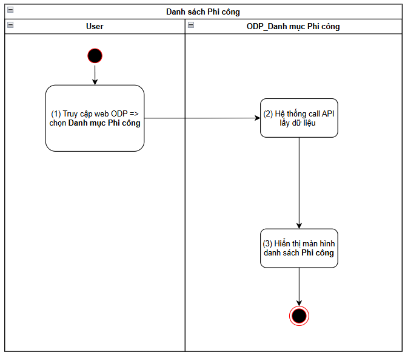
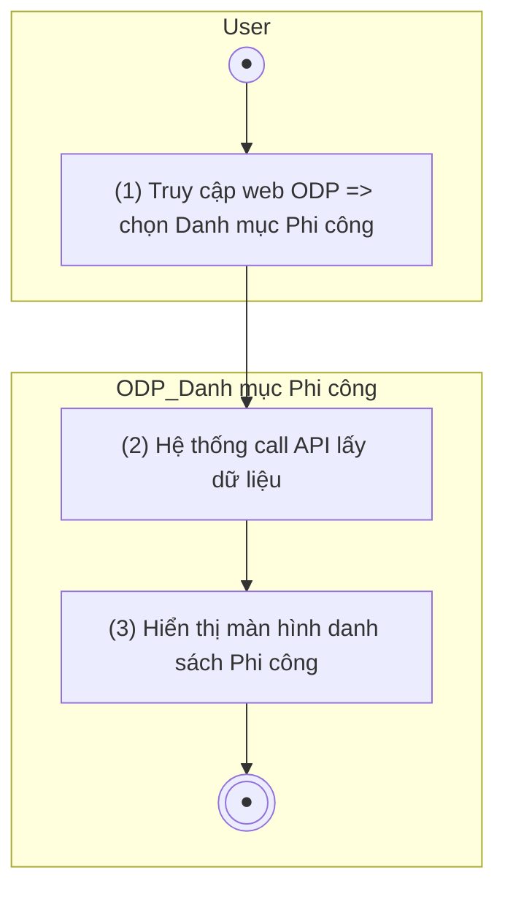
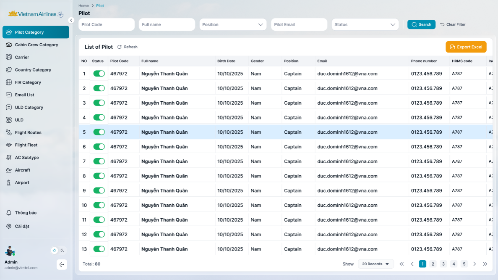
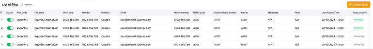
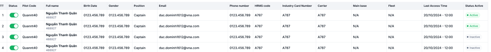

> **Ngữ cảnh chương (giữ nguyên từ nguồn):** mục `Data Maintenance (Danh mục dùng chung)`.

## Quản lý danh mục Phi công

### Danh sách phi công

| **Tên chức năng: Xem danh sách Phi công** | |
| --- | --- |
| **Mục đích** | Cho phép user Xem danh sách Phi công/FIMS |
| **Trigger** | Người dùng truy cập vào web FIMS => mở đến module Danh mục/Danh mục Phi công |
| **Tiền điều kiện** | Người dùng đăng nhập thành công và được phân quyền Danh mục Phi công |
| **Hậu điều kiện** | Mở màn hình danh sách Phi công trên giao diện người dùng |

#### Sơ đồ luồng hệ thống

1. Sơ đồ luồng nghiệp vụ

#### Mô tả luồng xử lý

| **Bước** | **Chi tiết** |
| --- | --- |
|  | Truy cập web FIMS => mở đến module Danh mục/Danh mục Phi công |
|  | Hệ thống call API xuống BE lấy danh sách Phi công |
|  | Hiển thị danh sách Phi công trên giao diện người dùng |

#### Màn hình chức năng

1. Giao diện Danh sách phi công

#### Mô tả chi tiết màn hình danh sách

| **STT** | **Tên** | **Kiểu dữ liệu**  **[Độ dài dữ liệu]** | **Mapping DB/API** | **Mô tả nghiệp vụ** |
| --- | --- | --- | --- | --- |
|  | Title hệ thống | Label |  | * + [Tham chiếu Kịch bản title hệ thống](https://docs.google.com/document/d/1L5y0t4FCWe_vnNI65xNMRC-LM3lvLwYsQRAm_Nokv9A/edit?tab=t.0#bookmark=kix.f2nh07gdowb8) |
| Danh sách Phi công    FE call API lấy lại DS Phi công mới nhất hiện tại để hiển thị trên giao diện người dùng  Điều kiện hiển thị PC: trường **is_delete=false** | | | | |
|  | ~~Danh sách phi công~~  List of Pilot | Title |  | Fix cứng text “List of Pilot” |
|  |  | Button | btn_refresh | Click: refresh màn hình => FE call API lấy lại DS Phi công mới nhất hiện tại để hiển thị trên giao diện người dùng  Điều kiện hiển thị PC: trường **is_delete=false**   * Trường hợp response API trả về thành công và có dữ liệu: hiển thị danh sách PC vào bảng bên dưới * Ngược lại: (API trả về rỗng hoặc lỗi) Hiển thị bảng danh sách với **chân trang = Tất cả danh sách : 0** |
|  |  | Button | btn_action | * Tham chiếu kịch bản [xuất Excel](https://docs.google.com/document/d/1L5y0t4FCWe_vnNI65xNMRC-LM3lvLwYsQRAm_Nokv9A/edit?tab=t.0#heading=h.db8s772z49o4) * Tên file tải về: FIMS_Quan ly phi cong_ddmmyyhhss * Nội dung file tải về: tải theo cột dữ liệu view từ bảng danh sách phi công * ~~Hiển thị dưới dạng Button list~~ * ~~Click vào => hiển thị tooltips menu action~~   + ~~Excel edited~~   + ~~Export~~   + ~~Đồng bộ AVES~~ * ~~Click lại lần 2 => đóng tooltips~~  | ~~Excel edited~~ | * ~~Ý nghĩa: [Sửa thông tin Phi công](TOSS.DM.PILOT_EDIT_MANUAL.FD.v0.1.md) bằng cách import file excel~~ * ~~Click → mở popup~~ [~~Sửa thông tin Phi công bằng excel~~](TOSS.DM.PILOT_EDIT_EXCEL.FD.v0.1.md) | | --- | --- | | ~~Export~~ | * ~~Export thông tin danh sách phi công ra file excel với format:~~ [~~Danh sách phi công~~](https://docs.google.com/spreadsheets/d/1zINma7Vj4N0jQbFFcoIffdxV7VKNXtiiTVz4635gVB8/edit?gid=0#gid=0) * ~~Tham chiếu kịch bản~~ [~~Export~~](#_heading=h.bqdzkq5i2tdb) | | ~~Đồng bộ AVES~~ | * ~~Click button → Hệ thống call API đồng bộ thông tin phi công từ hệ thống AVES, trong đó~~   ~~Input: TypeUser=Phi công~~  ~~Output: AVES trả thông tin của PC lấy từ AVES,~~  ~~→ hệ thống update thông tin cho người dùng nhóm PC (mapping theo mã Crewcode) trên Danh mục PC và [Danh sách người dùng](../../../../SA-system-admin/srs/_parts/TOSS.SA.USER/TOSS.SA.USER_LIST.FD.v0.1.md), bao gồm:~~   * + ~~Họ và tên~~   + ~~Ngày sinh~~   + ~~Giới tính~~   + ~~Mã phi công~~   + ~~Mã HRMS (Mã nhân viên cũ)~~   + ~~Số thẻ ngành~~   + ~~Đội tàu bay~~   + ~~Mainbase~~   + ~~Phòng ban~~   + ~~Chức vụ~~   + ~~Trạng thái~~   + ~~Số điện thoại~~   + ~~Email~~   + ~~Địa chỉ~~   **~~Lưu ý~~**~~:~~   * + ~~Chỉ update các phần thông tin có value được trả về từ AVES. Nếu ∃ trường dữ liệu trả về = ∅ => không update thông tin cho trường đó~~   + ~~Với trường~~ **~~Đội tàu bay~~**~~: mapping gần bằng với Danh mục~~ [~~đội bay~~](https://docs.google.com/document/d/11hp5UbcDLXGUWg--FudOX8CiILbqZwy6/edit#heading=h.3r6zjac)~~: ([mã đội bay trên Aves]=[3 ký tự cuối trong mã đội bay trên Danh mục~~ [~~đội bay~~](https://docs.google.com/document/d/11hp5UbcDLXGUWg--FudOX8CiILbqZwy6/edit#heading=h.3r6zjac) ~~]) - (ví dụ Aves=787 map =A787/Danh mục đội bay) => hệ thống xử lý nếu:~~     - ~~Đội bay đã được gán với người dùng: không cần update thông tin này~~     - ~~Đội bay chưa được gán với người dùng: gán thêm đội bay cho người dùng~~     - ~~Đội bay chưa được khai báo trên Danh mục~~ [~~đội bay~~](https://docs.google.com/document/d/11hp5UbcDLXGUWg--FudOX8CiILbqZwy6/edit#heading=h.3r6zjac)~~: không cần update thông tin này~~   + ~~Với trường~~ **~~Mainbase~~**~~: mapping chính xác với Danh mục~~ [~~Mainbase~~](https://docs.google.com/document/d/11hp5UbcDLXGUWg--FudOX8CiILbqZwy6/edit#heading=h.wy8ajl)~~, nếu:~~     - ~~Mainbase đã được gán với người dùng: không cần update thông tin này~~     - ~~Mainbase chưa được gán với người dùng: gán thêm Mainbase cho người dùng~~     - ~~Mainbase chưa được khai báo trên Danh mục~~ [~~Mainbase~~](https://docs.google.com/document/d/11hp5UbcDLXGUWg--FudOX8CiILbqZwy6/edit#heading=h.wy8ajl)~~: không cần update thông tin này~~   ~~Nếu Crewcode PC không map được với người dùng nào trên hệ thống nhóm PC → chỉ hiển thị thông tin PC đó trên Danh mục PC, không hiển thị thông tin PC trên danh mục người dùng~~   * ~~Cơ chế tự động: Định kỳ 1 ngày/ lần => hệ thống call API đồng bộ danh sách phi công từ hệ thống AVES để update thông tin mới nhất cho PC và người dùng tương ứng (nếu có)~~ | |
| **Tìm kiếm**  ****   * Cơ chế Thu gọn/Mở rộng bộ lọc (Collapsible Fillter):   + [Tham chiếu kịch bản chức năng ẩn hiện filter](https://docs.google.com/document/d/1L5y0t4FCWe_vnNI65xNMRC-LM3lvLwYsQRAm_Nokv9A/edit?tab=t.0#heading=h.dgq51psil6dr) * Click vào dòng dưới tiêu đề các cột để chọn lọc, tìm kiếm thông tin theo dữ liệu tại cột tương ứng. * Trường hợp Searchbox không có dữ liệu: Mặc định tìm kiếm all dữ liệu tại cột đó * Người dùng thao tác thay đổi giá trị trường dữ liệu => click Enter/out focus box => hệ thống thực hiện:   + Reload dữ liệu table phù hợp với bộ lọc   + Set current page=1 * Hiển thị kết quả tìm kiếm:   + Trường hợp API trả về data có KQ: hiển thị danh sách dữ liệu theo kết quả API trả về   + Trường hợp API trả về data rỗng hoặc lỗi: Hiển thị bảng danh sách với **chân trang = Tất cả danh sách : 0** | | | | |
|  | ~~Mã phi công~~  Pilot Code | Textbox | pilot_code/pilotCode | * Trường để lọc: Tìm kiếm gần đúng theo [pilotCode] * Maxlength 20 ký tự * Validate cho phép nhập chữ, số, và ký tự đặc biệt * Nếu dữ liệu nhập vượt quá độ dài ô => thay thế phần vượt quá bằng ký tự “...” và có tooltip hiển thị toàn bộ nội dung nhập * Nếu paste đoạn văn thì ghi nhận 20 ký tự đầu * Tự động TRIM Spaces đầu cuối khi tìm kiếm |
|  | ~~Họ và tên~~  Full name | Textbox | full_name/fullName | * Trường để lọc: Tìm kiếm gần đúng theo [fullName] * Maxlength 100 ký tự * Validate cho phép nhập chữ, số, và ký tự đặc biệt * Nếu dữ liệu nhập vượt quá độ dài ô => thay thế phần vượt quá bằng ký tự “...” và có tooltip hiển thị toàn bộ nội dung nhập * Nếu paste đoạn văn thì ghi nhận 100 ký tự đầu * Tự động TRIM Spaces đầu cuối khi tìm kiếm |
|  | ~~Ngày sinh~~  ~~Birth Date~~ | ~~datepicker~~ | ~~date_of_birth / dateOfBirth~~ | * ~~Trường để lọc: Tìm kiếm gần đúng theo [dateOfBirth]~~ * ~~Định dạng dd/mm/yyyy - dd/mm/yyyy~~ * ~~Nếu dữ liệu nhập vượt quá độ dài ô => thay thế phần vượt quá bằng ký tự “...” và có tooltip hiển thị toàn bộ nội dung nhập~~ |
|  | ~~Giới tính~~  ~~Gender~~ | ~~Dropdown~~ | ~~gender~~ | * ~~Trường để lọc: Tìm kiếm chính xác theo [gender]~~ * ~~Giá trị chọn lọc:~~   + **~~Nam~~**   + **~~Nữ~~** |
|  | ~~Chức vụ~~  Position | Dropdown | position | * Trường để lọc: Tìm kiếm gần đúng theo [position] * Giá trị chọn lọc được lấy từ cột position * ~~Maxlength 50 ký tự~~ * ~~Validate cho phép nhập chữ, số, và ký tự đặc biệt~~ * ~~Nếu dữ liệu nhập vượt quá độ dài ô => thay thế phần vượt quá bằng ký tự “...” và có tooltip hiển thị toàn bộ nội dung nhập~~ * ~~Nếu paste đoạn văn thì ghi nhận 50 ký tự đầu~~ * ~~Tự động TRIM Spaces đầu cuối khi tìm kiếm~~ |
|  | ~~Số điện thoại~~  ~~Phone number~~ | ~~Numberbox~~ | ~~phone_number/phoneNumber~~ | * ~~Trường để lọc: Tìm kiếm gần đúng theo [phoneNumber]~~ * ~~Maxlength 20 ký tự~~ * ~~Validate cho phép nhập số~~ * ~~Nếu dữ liệu nhập vượt quá độ dài ô => thay thế phần vượt quá bằng ký tự “...” và có tooltip hiển thị toàn bộ nội dung nhập~~ * ~~Nếu paste đoạn văn thì ghi nhận 20 ký tự đầu~~ * ~~Tự động TRIM Spaces đầu cuối khi tìm kiếm~~ |
|  | Email | Textbox | email | * Trường để lọc: Tìm kiếm gần đúng theo [email] * Maxlength 100 ký tự * Validate cho phép nhập chữ, số, và ký tự đặc biệt * Nếu dữ liệu nhập vượt quá độ dài ô => thay thế phần vượt quá bằng ký tự “...” và có tooltip hiển thị toàn bộ nội dung nhập * Nếu paste đoạn văn thì ghi nhận 100 ký tự đầu * Tự động TRIM Spaces đầu cuối khi tìm kiếm |
|  | ~~Mã HRMS( Mã nhân~~  ~~viên cũ)~~ | ~~Textbox [0;100]~~ | ~~hrms_code/hrmsCode~~ | * ~~Trường để lọc: Tìm kiếm gần đúng theo [hrmsCode]~~ * ~~Maxlength 100 ký tự~~ * ~~Validate cho phép nhập chữ, số, và ký tự đặc biệt~~ * ~~Nếu dữ liệu nhập vượt quá độ dài ô => thay thế phần vượt quá bằng ký tự “...” và có tooltip hiển thị toàn bộ nội dung nhập~~ * ~~Nếu paste đoạn văn thì ghi nhận 100 ký tự đầu~~ * ~~Tự động TRIM Spaces đầu cuối khi tìm kiếm~~ |
|  | ~~Số thẻ ngành~~  ~~Industry Card Number~~ | ~~Textbox [0;100]~~ | ~~industry_card_number/industryCardNumber~~ | * ~~Trường để lọc: Tìm kiếm gần đúng theo [industryCardNumber]~~ * ~~Maxlength 100 ký tự~~ * ~~Validate cho phép nhập chữ, số, và ký tự đặc biệt~~ * ~~Nếu dữ liệu nhập vượt quá độ dài ô => thay thế phần vượt quá bằng ký tự “...” và có tooltip hiển thị toàn bộ nội dung nhập~~ * ~~Nếu paste đoạn văn thì ghi nhận 100 ký tự đầu~~ * ~~Tự động TRIM Spaces đầu cuối khi tìm kiếm~~ |
|  | ~~Carrier~~ | ~~Textbox [0;100]~~ | ~~carrier~~ | * ~~Trường để lọc: Tìm kiếm gần đúng theo [carrier]~~ * ~~Maxlength 100 ký tự~~ * ~~Validate cho phép nhập chữ, số, và ký tự đặc biệt~~ * ~~Nếu dữ liệu nhập vượt quá độ dài ô => thay thế phần vượt quá bằng ký tự “...” và có tooltip hiển thị toàn bộ nội dung nhập~~ * ~~Nếu paste đoạn văn thì ghi nhận 100 ký tự đầu~~ * ~~Tự động TRIM Spaces đầu cuối khi tìm kiếm~~ |
|  | ~~Main base~~ | ~~Textbox [0;100]~~ | ~~main_base/mainBase~~ | * ~~Trường để lọc: Tìm kiếm gần đúng theo [mainBase]~~ * ~~Maxlength 100 ký tự~~ * ~~Validate cho phép nhập chữ, số, và ký tự đặc biệt~~ * ~~Nếu dữ liệu nhập vượt quá độ dài ô => thay thế phần vượt quá bằng ký tự “...” và có tooltip hiển thị toàn bộ nội dung nhập~~ * ~~Nếu paste đoạn văn thì ghi nhận 100 ký tự đầu~~ * ~~Tự động TRIM Spaces đầu cuối khi tìm kiếm~~ |
|  | ~~Đội tàu bay~~ | ~~Textbox [0;20]~~ | ~~fleet/rank~~ | * ~~Trường để lọc: Tìm kiếm gần đúng theo [rank]~~ * ~~Maxlength 20 ký tự~~ * ~~Validate cho phép nhập chữ, số, và ký tự đặc biệt~~ * ~~Nếu dữ liệu nhập vượt quá độ dài ô => thay thế phần vượt quá bằng ký tự “...” và có tooltip hiển thị toàn bộ nội dung nhập~~ * ~~Nếu paste đoạn văn thì ghi nhận 20 ký tự đầu~~ * ~~Tự động TRIM Spaces đầu cuối khi tìm kiếm~~ |
|  | ~~Trạng thái hoạt động~~  Status | DDL [Active, Inactive] | active_status | * Trường để lọc: Tìm kiếm chính xác theo [active_status] * Giá trị chọn lọc:   + **Active**   + **Inactive** |
|  |  | Button |  | * Click vào  * Thu thập toàn bộ giá trị hiện tại trong các trường bộ lọc. * Gửi yêu cầu tìm kiếm tới hệ thống. * Hiển thị danh sách kết quả phù hợp trong bảng dữ liệu. * Khi người dùng **nhấn phím Enter trên bàn phím** tại bất kỳ trường nhập liệu nào trong khu vực bộ lọc:   + Hệ thống PHẢI thực hiện tìm kiếm tương đương với hành động click nút “Search”.   + Kết quả tìm kiếm, logic xử lý và dữ liệu trả vềgiống hoàn toàn với nút Search. |
|  |  | Button |  | * Click vào  * Hệ thống   + Xoá nội dung search   + Reset toàn bộ truòng lọc đã chọn   + Reset phân trang về trang đầu * Hệ thống gọi API lấy danh sách dữ liệu mặc định * Hiển thị lại danh sách ban đầu |
| Chi tiết danh sách     * Hệ thống call API xuống BE, lấy danh sách Phi công thỏa mãn điều kiện:   + TypeUsser = Phi công   + Trạng thái **is_delete=false** * → hiển thị danh sách Phi công trên màn hình * Danh sách PC sắp xếp theo thứ tự α-β của trường Mã phi công * Khi user click vào 1 bản ghi bất kỳ → hiển thị màn hình [Xem chi tiết Phi công_Thông tin Phi công](TOSS.DM.PILOT_DETAIL.FD.v0.1.md) | | | | |
|  | TT | Textview |  | * Hiển thị STT tăng dần theo số lượng bản ghi |
|  | ~~Trạng thái~~  Status | Toggle switch button | active_status | * Hiển thị theo trạng thái hoạt động của phi công:   + Trạng thái = Active: On   + Trạng thái = Inactive: Off   + Trạng thái = Đã xóa: Off & disable icon * Cho phép user thao tác On/Off trạng thái hoạt động của phi công * Lưu ý: Chặn thao tác với các phi công mặc định của hệ thống * ~~Hiển thị TagStatus~~ * ~~Hệ thống check theo~~ **~~Crew code~~** ~~mapping với~~ **~~Người dùng nhóm PC~~**~~, lấy và hiển thị theo trạng thái của người dùng tương ứng~~   + ~~Status=Đang hoạt động: Tag màu xanh lá~~   + ~~Status=Ngừng hoạt động: Tag màu xám~~ * ~~Trường hợp có > 1~~ **~~Người dùng nhóm PC~~** ~~cùng~~ **~~Crew code~~** ~~với~~ **~~PC~~** ~~này =>~~    + ~~nếu Người dùng có trạng thái = Đang hoạt động => hiển thị theo trạng thái = Đang hoạt động~~   + ~~nếu tất cả Người dùng đều có trạng thái = Ngừng hoạt động => hiển thị theo trạng thái = Ngừng hoạt động~~ * ~~Trường hợp API trả về rỗng/lỗi: để trống trường~~ |
|  | ~~Mã phi công~~  Pilot Code | Textview | pilot_code/pilotCode | * Hiển thị [pilotCode] theo dữ liệu API trả về * Hiển thị tối đa 2 dòng dữ liệu * Nếu độ dài dữ liệu vượt quá 2 dòng, hiển thị ba chấm […] ở cuối dòng thứ 2 và có tooltip hiển thị toàn bộ nội dung * Trường hợp API trả về rỗng/lỗi: để trống trường |
|  | ~~Họ và tên~~  Full name | Textview | full_name/fullName | * Hiển thị [fullName] theo dữ liệu API trả về * Hiển thị tối đa 2 dòng dữ liệu * Nếu độ dài dữ liệu vượt quá 2 dòng, hiển thị ba chấm […] ở cuối dòng thứ 2 và có tooltip hiển thị toàn bộ nội dung * Trường hợp API trả về rỗng/lỗi: để trống trường |
|  | ~~Ngày sinh~~  Birth Date | Textview | date_of_birth /dateOfBirth | * Hiển thị [dateOfBirth] theo dữ liệu API trả về * Định dạng dd/mm/yyyy * Hiển thị tối đa 2 dòng dữ liệu * Nếu độ dài dữ liệu vượt quá 2 dòng, hiển thị ba chấm […] ở cuối dòng thứ 2 và có tooltip hiển thị toàn bộ nội dung * Trường hợp API trả về rỗng/lỗi: để trống trường |
|  | ~~Giới tính~~  Gender | Textview | gender | * Hiển thị [gender] theo dữ liệu Gender (M: Nam; F: Nữ)/API trả về * Trường hợp API trả về rỗng/lỗi: để trống trường |
|  | ~~Chức vụ~~  Position | Textview | position | * Hiển thị [position] theo dữ liệu API trả về * Hiển thị tối đa 2 dòng dữ liệu * Nếu độ dài dữ liệu vượt quá 2 dòng, hiển thị ba chấm […] ở cuối dòng thứ 2 và có tooltip hiển thị toàn bộ nội dung * Trường hợp API trả về rỗng/lỗi: để trống trường |
|  | Email | Textview | email | * Hiển thị [email] theo dữ liệu API trả về * Hiển thị tối đa 2 dòng dữ liệu * Nếu độ dài dữ liệu vượt quá 2 dòng, hiển thị ba chấm […] ở cuối dòng thứ 2 và có tooltip hiển thị toàn bộ nội dung * Trường hợp API trả về rỗng/lỗi: để trống trường |
|  | ~~Số điện thoại~~  Phone number | Textview | phone_number/phoneNumber | * Hiển thị [phoneNumber] theo dữ liệu Phone/API trả về * Hiển thị tối đa 2 dòng dữ liệu * Nếu độ dài dữ liệu vượt quá 2 dòng, hiển thị ba chấm […] ở cuối dòng thứ 2 và có tooltip hiển thị toàn bộ nội dung * Trường hợp API trả về rỗng/lỗi: để trống trường |
|  | ~~Mã HRMS( Mã nhân~~  ~~viên cũ)~~  HRMS code | Textview | hrms_code/hrmsCode | * Hiển thị [hrmsCode] theo dữ liệu API trả về * Hiển thị tối đa 2 dòng dữ liệu * Nếu độ dài dữ liệu vượt quá 2 dòng, hiển thị ba chấm […] ở cuối dòng thứ 2 và có tooltip hiển thị toàn bộ nội dung * Trường hợp API trả về rỗng/lỗi: để trống trường |
|  | ~~Số thẻ ngành~~  Industry Card Number | Textview | industry_card_number/industryCardNumber | * Hiển thị [industryCardNumber] theo dữ liệu API trả về * Hiển thị tối đa 2 dòng dữ liệu * Nếu độ dài dữ liệu vượt quá 2 dòng, hiển thị ba chấm […] ở cuối dòng thứ 2 và có tooltip hiển thị toàn bộ nội dung * Trường hợp API trả về rỗng/lỗi: để trống trường |
|  | Carrier | Textview | carrier | * Hiển thị [carrier] theo dữ liệu API trả về * Hiển thị tối đa 2 dòng dữ liệu * Nếu độ dài dữ liệu vượt quá 2 dòng, hiển thị ba chấm […] ở cuối dòng thứ 2 và có tooltip hiển thị toàn bộ nội dung * Trường hợp API trả về rỗng/lỗi: để trống trường * Với TH nhiều user sử dụng cùng 1 mã crew code=> Lấy dữ liệu user active đầu tiên |
|  | Main base | Textview | main_base/mainBase | * Hiển thị [mainBase] theo dữ liệu Base/API trả về * Hiển thị tối đa 2 dòng dữ liệu * Nếu độ dài dữ liệu vượt quá 2 dòng, hiển thị ba chấm […] ở cuối dòng thứ 2 và có tooltip hiển thị toàn bộ nội dung * Trường hợp API trả về rỗng/lỗi: để trống trường |
|  | Fleet | Textview | fleet/rank | * Hiển thị [rank] theo dữ liệu Rank/API trả về   Cách xử lý dữ liệu:  Ví dụ Rank="**350**:X,**787**:X,**321**:B"  => hệ thống lấy các phần ký tự trước dấu [:] sau đó mapping gần bằng với Danh mục [đội bay](https://docs.google.com/document/d/11hp5UbcDLXGUWg--FudOX8CiILbqZwy6/edit#heading=h.3r6zjac): ([code 3 ký tự cuối/mã đội bay trên Aves]=[3 ký tự cuối trong mã đội bay trên Danh mục [đội bay](https://docs.google.com/document/d/11hp5UbcDLXGUWg--FudOX8CiILbqZwy6/edit#heading=h.3r6zjac) ]) - (ví dụ Aves=787 **map =** A787/Danh mục đội bay) =>   * + nếu khớp: hiển thị thông tin đội bay theo Danh mục [đội bay](https://docs.google.com/document/d/11hp5UbcDLXGUWg--FudOX8CiILbqZwy6/edit#heading=h.3r6zjac)   + nếu không khớp: hiển thị thông tin theo dữ liệu AVES trả về   Các đội bay phân cách nhau bởi dấu [;]   * Hiển thị tối đa 2 dòng dữ liệu * Nếu độ dài dữ liệu vượt quá 2 dòng, hiển thị ba chấm […] ở cuối dòng thứ 2 và có tooltip hiển thị toàn bộ nội dung * Trường hợp API trả về rỗng/lỗi: để trống trường |
|  | Last Access Time | Textview |  | * Hiển thị [Last Access Time] theo dữ liệu API trả về * Định dạng dd/mm/yyyy - hh:mm * Trường hợp API trả về rỗng/lỗi: để trống trường |
|  | Status Active | TagStatus |  | * Hiển thị Tag Status theo dữ liệu API trả về   + Status=Active: Tag màu xanh lá   + Status=Inactive: Tag màu xám   + Status=Deleted: Tag màu đỏ |
|  | Footer | Pagination |  | * [Theo kịch bản phân trang](https://docs.google.com/document/d/1L5y0t4FCWe_vnNI65xNMRC-LM3lvLwYsQRAm_Nokv9A/edit?tab=t.0#heading=h.abyqd0hrl467) |

---

*Nguồn: tách trung thực từ `sec-22-quan-ly-danh-muc-phi-cong.md`, mục "Xem danh sách Phi công" (bản trích text của `VNA.TOSS_SRS_Data Maintenance_v0.1.docx`, chương Data Maintenance (Danh mục dùng chung)) — tương ứng dòng **#7** bảng §1 của [CATALOG.md](../CATALOG.md). Không chỉnh sửa nội dung nguồn (CLAUDE.md §0). 🖼 Hình ảnh màn hình: xem file `VNA.TOSS_SRS_Data Maintenance_v0.1.docx` gốc.*
