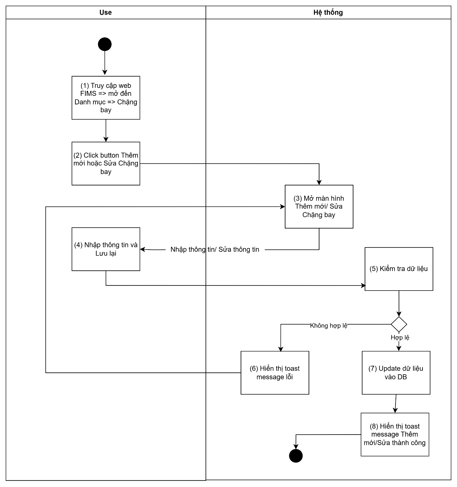
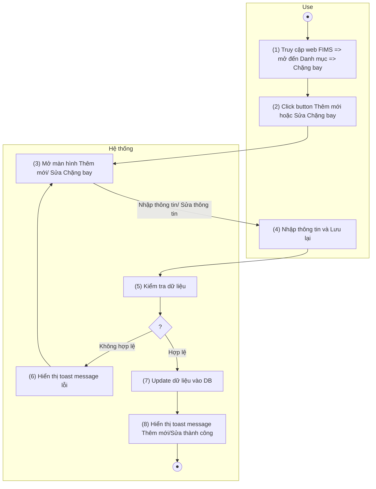
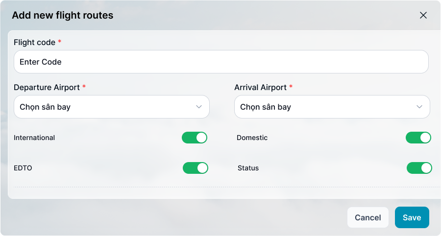

> **Ngữ cảnh chương (giữ nguyên từ nguồn):** mục `Data Maintenance (Danh mục dùng chung)`.

### Thêm mới/sửa chặng bay

| **Tên chức năng: Thêm mới/sửa chặng bay** | |
| --- | --- |
| **Tên chức năng** | Thêm mới / Sửa chặng bay |
| **Mục đích** | Cho phép user thêm mới hoặc chỉnh sửa thông tin chặng bay |
| **Trigger** | User click button **Thêm mới** hoặc icon **Sửa** tại bản ghi trong danh sách |
| **Tiền điều kiện** | Người dùng đăng nhập thành công và có phân quyền thêm mới / sửa chặng bay |
| **Hậu điều kiện** | Thêm mới / Sửa thành công, dữ liệu được lưu vào DB |

#### Sơ đồ luồng hệ thống

#### Mô tả luồng xử lý

| **Bước** | **Chi tiết** |
| --- | --- |
| 1 | User truy cập vào web Fims => mở đến module Danh mục => Chọn Chặng bay  => hiển thị màn hình Chặng bay |
| 2 | User click button Thêm mới hoặc icon “ Sửa” tại Chặng bay muốn sửa |
| 3 | Hệ thống hiển thị màn hình Thêm mới/ Sửa Chặng bay  Cho phép User thêm Chặng bay hoặc chỉnh sửa thông tin Chặng bay |
| 4 | User nhập dữ liệu/update dữ liệu và nhấn **Lưu lại** |
| 5 | * Hệ thống kiểm tra dữ liệu, nếu:   + Dữ liệu không hợp lệ: chuyển sang bước 6   + Ngược lại chuyển sang bước 7 |
| 6 | Hiển thị toast message lỗi đến người dùng |
| 7 | Update dữ liệu vào DB |
| 8 | Hiển thị toast message Thêm mới/Sửa thành công; Đóng màn hình Thêm mới/Sửa |

#### Màn hình chức năng

#### Mô tả chi tiết màn hình

| **STT** | **Tên** | **Kiểu dữ liệu [Độ dài dữ liệu]** | **Mapping DB/API** | **Mô tả** |
| --- | --- | --- | --- | --- |
| **1** | Title | Textview |  | * Text cứng “Add new flight routes ” |
| **2** | Icon X | Icon |  | * Click icon → Đóng popup. Điều hướng về màn trước đó |
| **3** | Flight code | TextBox [0;10] |  | **TH Thêm mới:**   * Mặc định: Để trống và cho nhập thông tin * Placeholder “Enter Code” * Bắt buộc nhập * Maxlength 10 ký tự. Chặn nếu nhập quá 10 ký tự. * Nếu paste đoạn văn > 10 ký tự, chỉ nhận 10 ký tự đầu tiên * Tự động TRIM Spaces đầu cuối khi out focus box * Validate   + Cho phép nhập chữ, số, dấu gạch ngang [-]; dấu gạch dưới [_]; dấu chấm [.]; dấu gạch chéo [/]   + Chặn trùng dữ liệu. * Trường hợp nội dung dài vượt quá độ rộng box hiển thị dấu … => di chuột vào hiện tooltips hiển thị full nội dung * **Action**: Nhấn Enter/out focus/click button **Save**, hệ thống validate, nếu   + Để trống ⇒ Hiển thị thông báo IM: [VL004](https://docs.google.com/document/d/1L5y0t4FCWe_vnNI65xNMRC-LM3lvLwYsQRAm_Nokv9A/edit?tab=t.0#bookmark=kix.oq8nkssherqj)   **TH Sửa:**   * Hiển thị [ flight_code] theo dữ liệu API trả về * Không cho phép chỉnh sửa |
| **4** | Departure Airport | Dropdown |  | * **TH Thêm mói:** * Mặc định: Để trống và cho nhập thông tin * Placeholder "Choose Departure Airport ” * Bắt buộc chọn. Không được trùng với Arrival Airport * Hiển thị [danh sách sân bay](../TOSS.DM.AIRPORT/TOSS.DM.AIRPORT_LIST.FD.v0.1.md) riêng biệt, không bị trùng lặp. * List gồm các giá trị sân bay lấy ra từ IATA của bảng danh sách Ariports Cho phép người dùng nhập từ khóa để tìm kiếm nhanh sân bay và lựa chọn một hoặc nhiều sân bay từ danh sách. * Action: Nhấn Enter/out focus/click button Save, hệ thống validate, nếu   + Để trống ⇒ Hiển thị thông báo IM: [VL004](https://docs.google.com/document/d/1L5y0t4FCWe_vnNI65xNMRC-LM3lvLwYsQRAm_Nokv9A/edit?tab=t.0#bookmark=kix.oq8nkssherqj)   **TH sửa:**  Hiển thị [departure_airport] theo dữ liệu API trả về  Cho phép chỉnh sửa. Không được trùng với Arrival Airport  Hiển thị [danh sách sân bay](../TOSS.DM.AIRPORT/TOSS.DM.AIRPORT_LIST.FD.v0.1.md) riêng biệt, không bị trùng lặp.  List gồm các giá trị sân bay lấy ra từ IATA của bảng danh sách Ariports Cho phép người dùng nhập từ khóa để tìm kiếm nhanh sân bay và lựa chọn một hoặc nhiều sân bay từ danh sách.  Action: Nhấn Enter/out focus/click button Save, hệ thống validate, nếu   * + Để trống ⇒ Hiển thị thông báo IM: [VL004](https://docs.google.com/document/d/1L5y0t4FCWe_vnNI65xNMRC-LM3lvLwYsQRAm_Nokv9A/edit?tab=t.0#bookmark=kix.oq8nkssherqj) |
| **5** | Arrival Airport | Dropdown |  | **TH Thêm mói:**  Mặc định: Để trống và cho nhập thông tin  Placeholder "Choose Arrival Airport ”  Bắt buộc chọn. Không được trùng với Departure Airport  Hiển thị [danh sách sân bay](../TOSS.DM.AIRPORT/TOSS.DM.AIRPORT_LIST.FD.v0.1.md) riêng biệt, không bị trùng lặp.  List gồm các giá trị sân bay lấy ra từ IATA của bảng danh sách Ariports Cho phép người dùng nhập từ khóa để tìm kiếm nhanh sân bay và lựa chọn một hoặc nhiều sân bay từ danh sách.  Action: Nhấn Enter/out focus/click button Save, hệ thống validate, nếu   * + Để trống ⇒ Hiển thị thông báo IM: [VL004](https://docs.google.com/document/d/1L5y0t4FCWe_vnNI65xNMRC-LM3lvLwYsQRAm_Nokv9A/edit?tab=t.0#bookmark=kix.oq8nkssherqj)   **TH sửa:**  Hiển thị [arrival_airport] theo dữ liệu API trả về  Cho phép chỉnh sửa. Không được trùng với Departure Airport  Hiển thị [danh sách sân bay](../TOSS.DM.AIRPORT/TOSS.DM.AIRPORT_LIST.FD.v0.1.md) riêng biệt, không bị trùng lặp.  List gồm các giá trị sân bay lấy ra từ IATA của bảng danh sách Ariports Cho phép người dùng nhập từ khóa để tìm kiếm nhanh sân bay và lựa chọn một hoặc nhiều sân bay từ danh sách.  Action: Nhấn Enter/out focus/click button Save, hệ thống validate, nếu   * + Để trống ⇒ Hiển thị thông báo IM: [VL004](https://docs.google.com/document/d/1L5y0t4FCWe_vnNI65xNMRC-LM3lvLwYsQRAm_Nokv9A/edit?tab=t.0#bookmark=kix.oq8nkssherqj) |
| **6** | International | Toggle |  | * TH **Thêm mới**    + TH On Toggle Swwith button: **Chặng bay quốc tế**   + Ngược lại: **Không phải chặng bay quốc tế** * TH **Sửa**   + TH On Toggle Swwith button: **Chặng bay quốc tế**   + Ngược lại: **Không phải chặng bay quốc tế** |
| **7** | Domestic | Toggle |  | * TH **Thêm mới**    + TH On Toggle Swwith button: **Chặng bay nội địa**   + Ngược lại: **Không phải chặng bay nội địa** * TH **Sửa**   + TH On Toggle Swwith button: **Chặng bay nội địa**   + Ngược lại: **Không phải chặng bay nội địa** |
| **8** | EDTO | Toggle |  | * TH **Thêm mới**    + TH On Toggle Swwith button: **Có sân bay dự bị**   + Ngược lại: **Không có sân bay dự bị** * TH **Sửa**   + TH On Toggle Swwith button: **Có sân bay dự bị**   + Ngược lại: **Không có sân bay dự bị** |
| **9** | Status | Toggle |  | * TH **Thêm mới**    + TH On Toggle Swith button: **Đang hoạt động**   + Ngược lại: **Ngừng hoạt động** * TH **Sửa**   + TH On Toggle Swith button: Đang hoạt động   + Ngược lại: Ngừng hoạt động   + Update Toggle switch button **Hoạt động** thành **On/Off** tương ứng trạng thái |
| **10** | Cancel | Button |  | * Click → Đóng popup. Điều hướng về màn trước đó * Dữ liệu không được lưu vào DB |
| **11** | Save | Button |  | * Click vào. Hệ thống kiểm tra   + Thêm mới/Sửa: [] đã tồn tại trong DB. Hiển thị toast message  [TB020](https://docs.google.com/document/d/1L5y0t4FCWe_vnNI65xNMRC-LM3lvLwYsQRAm_Nokv9A/edit?tab=t.0#bookmark=kix.zi1hm3rguphh) và giữ nguyên màn popup   + Dữ liệu hợp lệ, hệ thống lưu thành công và hiển thị toast message [TB019](https://docs.google.com/document/d/1L5y0t4FCWe_vnNI65xNMRC-LM3lvLwYsQRAm_Nokv9A/edit?tab=t.0#bookmark=kix.spmzvpry3i7f)     - Lưu thông tin thành công → Đóng popup. Điều hướng về màn danh sách     - Dữ liệu lưu trong DB * Hệ thống kiểm tra giá trị của trường **Departure Airport** và **Arrival Airport** khi người dùng nhấn **Save**. * Nếu hai trường có cùng giá trị thì hệ thống không cho phép lưu dữ liệu. * Hệ thống hiển thị thông báo: "Departure Airport và Arrival Airport không được trùng nhau." |
| * **Ghi chú:** Hai nút International và Domestic hoạt động loại trừ nhau. Tại một thời điểm chỉ được bật một trong hai nút. Khi người dùng bật một nút, hệ thống sẽ tắt nút còn lại. | | | | |

---

*Nguồn: tách trung thực từ `sec-30-quan-ly-danh-muc-chang-bay.md`, mục "Thêm mới/sửa chặng bay" (bản trích text của `VNA.TOSS_SRS_Data Maintenance_v0.1.docx`, chương Data Maintenance (Danh mục dùng chung)) — tương ứng dòng **#47** bảng §1 của [CATALOG.md](../CATALOG.md). Không chỉnh sửa nội dung nguồn (CLAUDE.md §0). 🖼 Hình ảnh màn hình: xem file `VNA.TOSS_SRS_Data Maintenance_v0.1.docx` gốc.*
