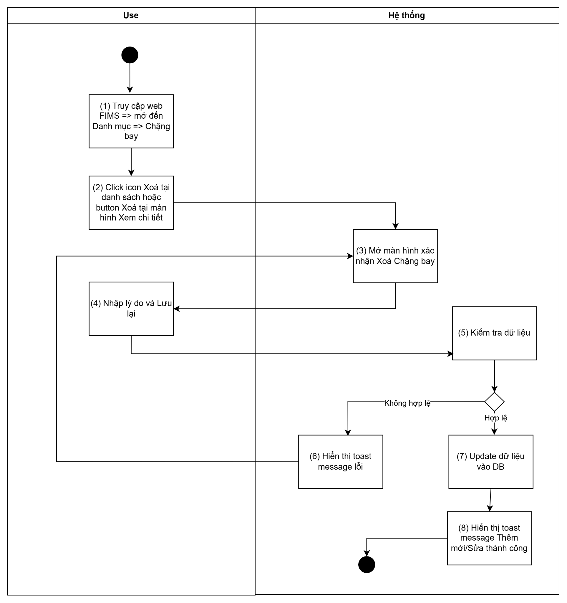
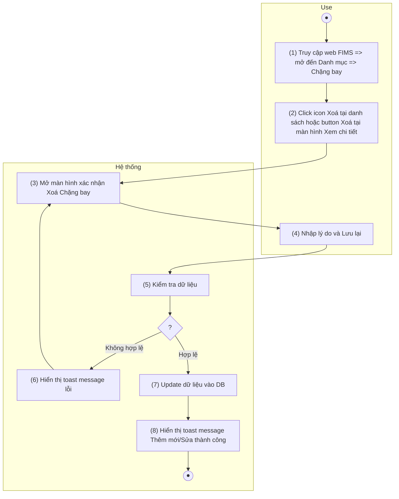
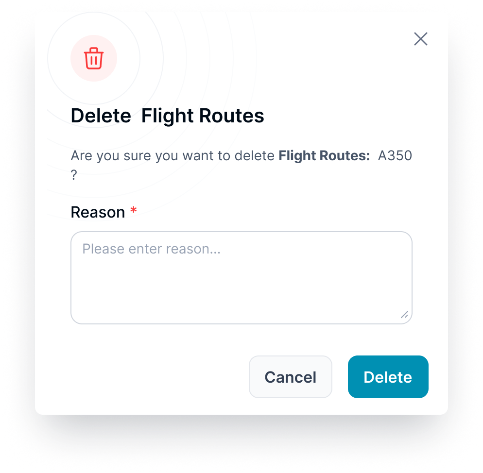

> **Ngữ cảnh chương (giữ nguyên từ nguồn):** mục `Data Maintenance (Danh mục dùng chung)`.

### Xóa chặng bay

| **Tên chức năng: Xóa Chặng bay** | |
| --- | --- |
| **Tên chức năng** | Xóa chặng bay |
| **Mục đích** | Cho phép user xóa chặng bay khỏi danh mục |
| **Trigger** | Người dùng click icon **Xóa** tại bản ghi trong danh sách |
| **Tiền điều kiện** | Người dùng đăng nhập thành công và có phân quyền xóa chặng bay |
| **Hậu điều kiện** | Xóa thành công chặng bay khỏi danh sách |

#### Sơ đồ luồng hệ thống

#### Mô tả luồng xử lý

| **Bước** | **Chi tiết** |
| --- | --- |
| 1 | User truy cập vào web Fims => mở đến module Danh mục => Chọn Chặng bay => hiển thị màn hình Chặng bay |
| 2 | User click **icon “ Xóa”** |
| 3 | * Mở màn hình xác nhận **Xóa** Chặng bay |
| 4 | * Người dùng nhập Lý do & nhấn button **Lưu lại** |
| 5 | * Hệ thống kiểm tra dữ liệu, nếu:   + Dữ liệu không hợp lệ: chuyển sang bước 6   + Ngược lại: chuyển sang bước 7 |
| 6 | * Hiển thị toast message lỗi đến người dùng |
| 7 | * Update dữ liệu vào DB |
| 8 | * Hiển thị toast message Xóa thành công |

#### Màn hình chức năng

#### Mô tả chi tiết màn hình

| **STT** | **Tên** | **Kiểu** | **Mô tả** |
| --- | --- | --- | --- |
| 1 | Title | Textview | "Xóa chặng bay" |
| 2 | Nội dung cảnh báo | Textview | "Bạn có chắc chắn muốn xóa chặng bay [DEP IATA/ICAO] – [ARR IATA/ICAO] không? Hành động này không thể hoàn tác." |
| 3 | Lý do xóa | Textarea | Bắt buộc nhập. Placeholder: Enter reason… Maxlength 1000 ký tự. Paste vượt quá chỉ nhận 1000 ký tự đầu |
| 4 | Nút **Huỷ** | Button btn-cancel | Click → đóng popup, không xóa |
| 5 | Nút **Xóa** | Button btn-delete | Click → kiểm tra lý do → call API xóa |

---

*Nguồn: tách trung thực từ `sec-30-quan-ly-danh-muc-chang-bay.md`, mục "Xóa chặng bay" (bản trích text của `VNA.TOSS_SRS_Data Maintenance_v0.1.docx`, chương Data Maintenance (Danh mục dùng chung)) — tương ứng dòng **#48** bảng §1 của [CATALOG.md](../CATALOG.md). Không chỉnh sửa nội dung nguồn (CLAUDE.md §0). 🖼 Hình ảnh màn hình: xem file `VNA.TOSS_SRS_Data Maintenance_v0.1.docx` gốc.*
