> **Ngữ cảnh chương (giữ nguyên từ nguồn):** mục `Data Maintenance (Danh mục dùng chung)`.

### Sửa ULD

| **Tên chức năng: Sửa ULD** | |
| --- | --- |
| **Mục đích** | Cho phép user Sửa ULD |
| **Trigger** | Người dùng truy cập vào web FIMS => nhấn phân hệ Danh mục => Nhấn chọn ULD => Chọn Icon “Sửa” |
| **Tiền điều kiện** | Người dùng đăng nhập thành công và được phân quyền sửa ULD |
| **Hậu điều kiện** | Sửa thành công ULD |

#### Sơ đồ luồng hệ thống

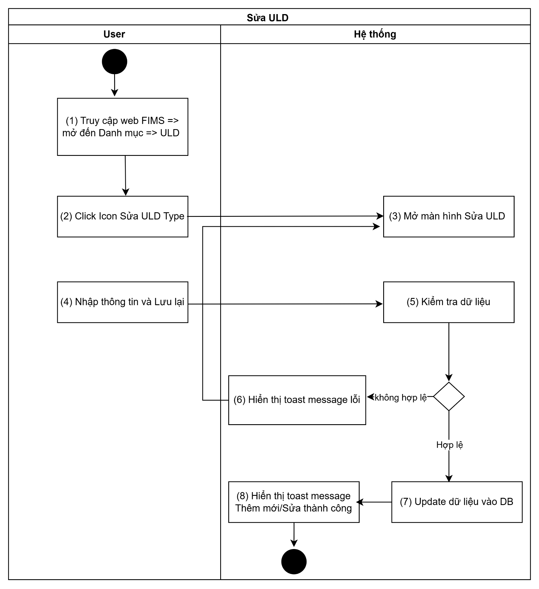

#### Mô tả luồng xử lý

| **STT** | **Bước** | **Chi tiết** |
| --- | --- | --- |
| **1** | Bước 1 | Người dùng truy cập vào web FIMS =>Chọn tab Danh mục => Chọn “Danh mục ULD ” |
| **2** | Bước 2 | Người dùng chọn Icon “Sửa” |
| **3** | Bước 3 | Hệ thống hiển thị màn hình Sửa ULD |
| **4** | Bước 4 | User nhập dữ liệu và nhấn **Lưu lại** |
| **5** | Bước 5 | Hệ thống kiểm tra dữ liệu, nếu:   * Trường hợp thiếu dữ liệu bắt buộc/Sai định dạng valid/Call API sửa ULD cho FIMS có lỗi => Báo lỗi theo bước 6 * Ngược lại: Sửa ULD thành công => Thực hiện tiếp bước 7 & 8 |
| **6** | Bước 6 | Hiển thị toast báo lỗi cho người dùng:   * Trường hợp thiếu trường bắt buộc: Hiển thị inline message (IM) tại trường có lỗi [VL004](https://docs.google.com/document/d/1L5y0t4FCWe_vnNI65xNMRC-LM3lvLwYsQRAm_Nokv9A/edit?tab=t.0#bookmark=kix.oq8nkssherqj): “The **<field name>** field must not be empty.” * Trường hợp Sai định dạng valid: Hiển thị IM tại trường có lỗi [VL006](https://docs.google.com/document/d/1L5y0t4FCWe_vnNI65xNMRC-LM3lvLwYsQRAm_Nokv9A/edit?tab=t.0#bookmark=kix.lwrynb3cmu73): “**<Field name>** is in an invalid format.” * Trường hợp Call API tạo mới trả về lỗi: hiển thị toast message (TM)   + Trường hợp lỗi API trả về có message: hiện [TB020](https://docs.google.com/document/d/1L5y0t4FCWe_vnNI65xNMRC-LM3lvLwYsQRAm_Nokv9A/edit?tab=t.0#bookmark=kix.zi1hm3rguphh)   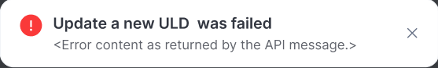   * + Hoặc hiện [TB021](https://docs.google.com/document/d/1L5y0t4FCWe_vnNI65xNMRC-LM3lvLwYsQRAm_Nokv9A/edit?tab=t.0#bookmark=kix.3pbjinevz4c0)   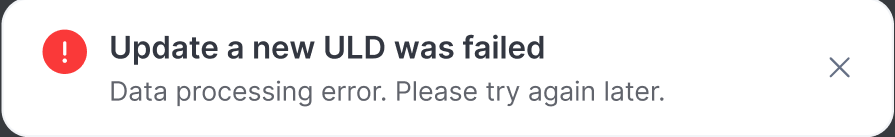 |
| **7** | Bước 7 | Trường hợp Sửa ULD thành công: BE Lưu và cập nhật [danh sách ULD](TOSS.DM.ULD_LIST.FD.v0.1.md)  Trả API thành công cho FE |
| **8** | Bước 8 | FE Hiển thị toast thành công cho người dùng [TB019](https://docs.google.com/document/d/1L5y0t4FCWe_vnNI65xNMRC-LM3lvLwYsQRAm_Nokv9A/edit?tab=t.0#bookmark=kix.spmzvpry3i7f)    Đóng popup Sửa, tự động refresh màn danh sách và hiển thị [Danh sách ULD](TOSS.DM.ULD_LIST.FD.v0.1.md) mới nhất |

#### Màn hình chức năng

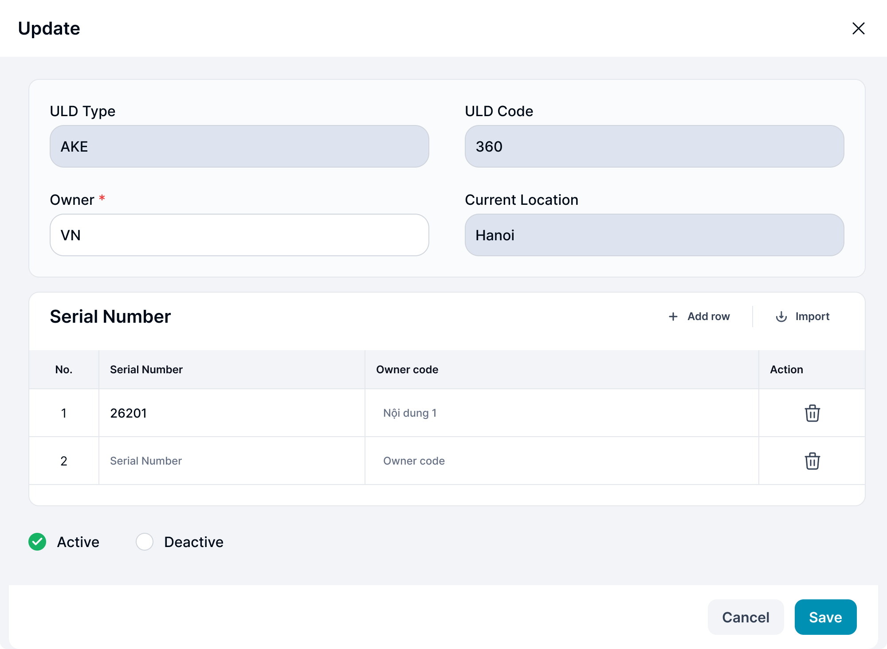

#### Mô tả chi tiết màn hình

| **STT** | **Tên** | **Kiểu dữ liệu [Độ dài dữ liệu]** | **Mapping DB/API** | **Mô tả** |
| --- | --- | --- | --- | --- |
| **1** | Title | Textview |  | * Text cứng “Update” |
| **2** | Icon X | Icon |  | * Click icon → Đóng popup. Điều hướng về màn trước đó |
| **3** | ULD Type | Textview |  | * Hiển thị [ULD Type] theo dữ liệu API trả về * Mặc định: Không cho phép sửa |
| **4** | ULD Code | Textview |  | * Hiển thị [ULD code] theo dữ liệu API trả về * Mặc định: Không cho phép sửa |
| **5** | Owner | TextBox [0;255] |  | * Hiển thị [Owner] theo dữ liệu API trả về * Trường hợp API trả về rỗng/lỗi: hiện Placeholder “Enter Owner” * Bắt buộc nhập * Maxlength 255 ký tự. Chặn nếu nhập quá 255 ký tự * Nếu paste đoạn văn > 255 ký tự, chỉ nhận 255 ký tự đầu tiên * Tự động TRIM Spaces đầu cuối khi out focus box * Validate   + Cho phép nhập String * Trường hợp nội dung dài vượt quá độ rộng box => di chuột vào hiện tooltips hiển thị full nội dung * Action: Nhấn Enter/out focus/click button Save, hệ thống validate, nếu   + Để trống ⇒ Hiển thị thông báo IM: [VL004](https://docs.google.com/document/d/1L5y0t4FCWe_vnNI65xNMRC-LM3lvLwYsQRAm_Nokv9A/edit?tab=t.0#bookmark=kix.oq8nkssherqj) “The **Owner** field must not be empty.” |
| **6** | Current Location | TextBox [0;255] |  | * Hiển thị [Current Location] theo dữ liệu API trả về * Mặc định: Không cho phép sửa |
| **7** | **Serial Number** | | | |
| **8** |  |  |  | * Click ⇒ thêm 1 dòng trống dưới cuối bảng Serial Number * Trường hợp thêm row mới (chưa nhập dữ liệu) hoặc user nhập thiếu trường dữ liệu trong row đó => User nhấn button Save thì hệ thống validate dữ liệu tuần tự từ trên xuống và hiển thị toast: “Row {N}: Please complete all required fields.”   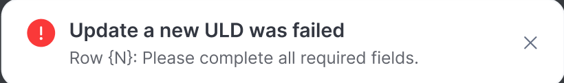 |
| **9** |  |  |  | * Click ⇒ mở cửa sổ Open của thiết bị ⇒ cho phép chọn file upload dữ liệu dạng xls, xlsx. Tối đa upload cùng 1 lúc: 10 tệp; Kích thước tối đa mỗi tệp: 5MB   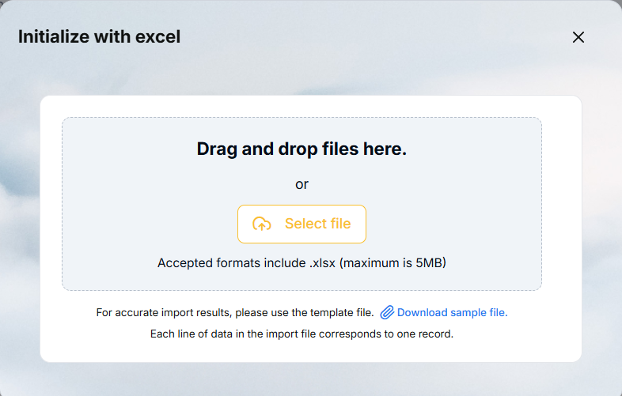   | Tên | Kiểu dữ liệu | Mô tả | | --- | --- | --- | | Title | Textview | * Fix cứng content : “Initialize with excel” * Không cho thao tác | |  | Icon | * Click icon → Đóng popup tải file. Điều hướng về màn hình popup sửa trước đó. | | Khu vực kéo thả (Drag & Drop Area)  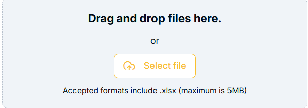 |  | * Hiển thị khu vực cho phép người dùng thao tác kéo thả file trực tiếp từ máy tính vào. * Hiển thị text cứng bên trong: “Drag and drop files here.” | |  | Button | * Click ⇒ Mở cửa sổ Open (File Explorer/Finder) của thiết bị ⇒ cho phép người dùng duyệt và chọn file upload dữ liệu. | | “Accepted formats include .xlsx and xls (maximum is 5MB)” | Textview | * Fix cứng content * Không cho thao tác | | “For accurate import results, please use the template file.” | Textview | * Fix cứng content * Không cho thao tác | |  | Hyperlink | * Click ⇒ Hệ thống tự động tải xuống thiết bị (download) file excel template mẫu chuẩn có chứa các cột dữ liệu tương ứng. * Template: [Template import row Serial Number](https://docs.google.com/spreadsheets/d/1LWiRM1U7d_pGvO9obI3Brk8ohSxy6Ma5v9Jfm8xTSNQ/edit?usp=sharing) | | “Each line of data in the import file corresponds to one record.” | Textview | * Fix cứng content * Không cho thao tác |   Popup khi upload file lỗi:  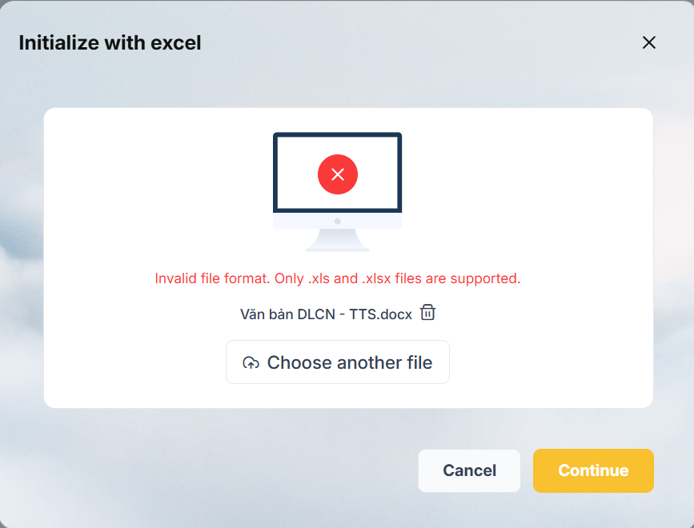   | Tên | Kiểu dữ liệu | Mô tả | | --- | --- | --- | | Title | Textview | * Fix cứng content * Không cho thao tác | | 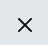 | Icon | Click icon → Đóng popup tải file. Điều hướng về màn hình popup sửa trước đó. | |  |  | Hiển thị hình minh họa màn hình máy tính kèm icon cảnh báo lỗi (dấu X nền đỏ) ở trung tâm | | Thông báo lỗi | Textview | * Các TH lỗi upload một file:   + TH upload file không đúng định dạng hiển thị IM: “Invalid file format. Only .xls and .xlsx files are supported”   + TH upload file mà các cột bên trong không đúng theo template mẫu thì hiển thị IM: “Invalid file template. Please use the provided template file.”   + TH upload file mà vượt quá dung lượng=> Thông báo lỗi nếu tệp vượt quá giới hạn kích thước “The file is too large. Please upload a file smaller than 5MB.” | | Tên file tải lên | Textview |    * Hiển thị tên đầy đủ của file đã được chọn * Trường hợp tên file dài vượt quá độ rộng box, hiển thị dấu … => di chuột vào hiện tooltips hiển thị full tên file | | 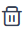 | Icon | * **Action:** Click ⇒ Hủy bỏ file hiện tại đang bị lỗi. Hệ thống xóa tên file khỏi màn hình và quay trở lại giao diện Upload ban đầu (kéo thả/chọn file) | | Choose another file | Button | 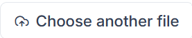  **Action:** Click ⇒ Mở lại cửa sổ hệ thống (File Explorer) để người dùng trực tiếp chọn một file excel khác thay thế cho file đang bị lỗi. | |  | Button | **Action:** Click → Đóng popup, hủy thao tác. Không có dữ liệu nào được lưu. Điều hướng về màn hình popup sửa trước đó. | |  | Button | Khi file tải lên bị lỗi định dạng hoặc sai template, nút 'Continue' sẽ bị Disable (vô hiệu hóa/làm mờ) để ngăn user tiếp tục thao tác. |  * + TH đã có dữ liệu, khi upload file (đúng định dạng, đúng template) => Hiển thị giao diện upload file thành công:   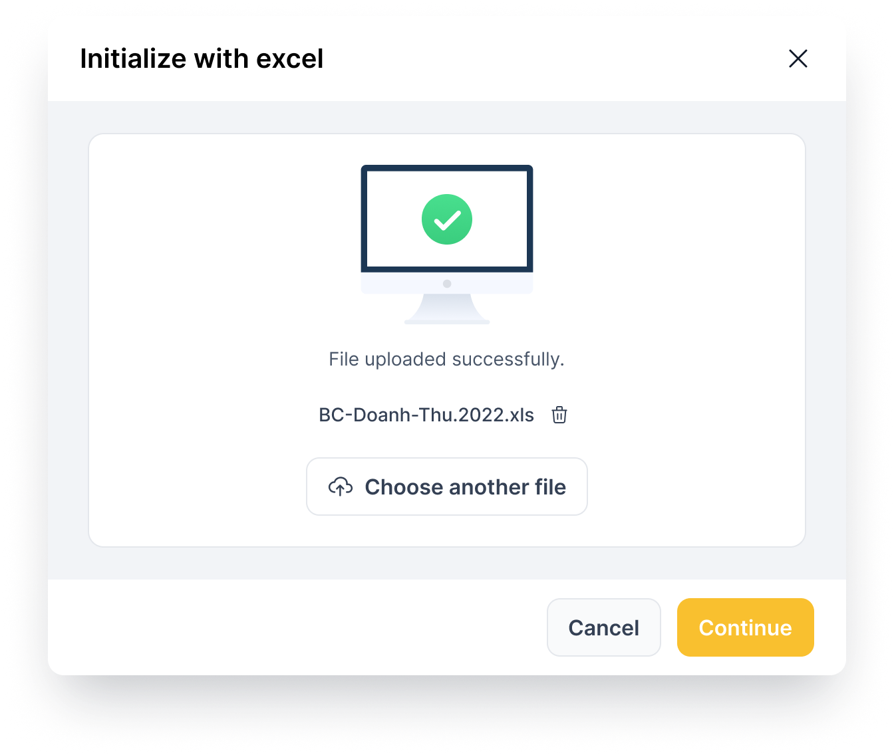Đồng thời hệ thống sẽ check:   * + - Dữ liệu trùng Serial number => thực hiện cập nhật các trường dữ liệu còn lại theo file     - Dữ liệu mới => Thực hiện update xuống dưới row cuối cùng mà user đã nhập * File mẫu: [Template import row Serial Number](https://docs.google.com/spreadsheets/d/1LWiRM1U7d_pGvO9obI3Brk8ohSxy6Ma5v9Jfm8xTSNQ/edit?usp=sharing) * Định dạng file: gồm 2 cột: Serial Number & Owner code |
| **10** | Serial Number | Textbox |  | * Hiển thị [Serial Number] theo dữ liệu API trả về * Trường hợp API trả về rỗng/lỗi: hiện Placeholder: Serial Number * Cho phép sửa * Maxlength 100 ký tự. Chặn nếu nhập quá 100 ký tự * Nhận dữ liệu chữ, số, và ký tự đặc biệt * Nếu dữ liệu nhập vượt quá độ dài ô => thay thế phần vượt quá bằng ký tự “...” và có tooltip hiển thị toàn bộ nội dung nhập * Nếu paste đoạn văn thì ghi nhận 100 ký tự đầu * Tự động TRIM Spaces đầu cuối khi out focus box * Validate   + Cho phép nhập chữ, số, và ký tự đặc biệt   + Chặn trùng dữ liệu trên bảng Serial Number thuộc cùng ULD Code * Trường hợp nội dung dài vượt quá độ rộng box => di chuột vào hiện tooltips hiển thị full nội dung * **Action**: User out focus/click button **Save**, hệ thống validate, nếu   + Trường hợp nhập Serial Number đã tồn tại trong cùng bảng => Hiển thị thông báo IM: [VL007](https://docs.google.com/document/d/1L5y0t4FCWe_vnNI65xNMRC-LM3lvLwYsQRAm_Nokv9A/edit?tab=t.0#bookmark=kix.s6302mi8qdnp) “**Serial Number** already exists. Please check again.” |
| **11** | Owner code | Textbox |  | * Hiển thị [Owner code] theo dữ liệu API trả về * Trường hợp API trả về rỗng/lỗi: hiện placeholder “Enter” * Default = [Owner của ULD Code], cho phép sửa * Chon phép sửa * Maxlength 255 ký tự. Chặn nếu nhập quá 255 ký tự * Nhận dữ liệu chữ, số, và ký tự đặc biệt * Nếu dữ liệu nhập vượt quá độ dài ô => thay thế phần vượt quá bằng ký tự “...” và có tooltip hiển thị toàn bộ nội dung nhập * Nếu paste đoạn văn thì ghi nhận 255 ký tự đầu * Tự động TRIM Spaces đầu cuối khi out focus box * Validate   + Cho phép nhập chữ, số, và ký tự đặc biệt * Trường hợp nội dung dài vượt quá độ rộng box => di chuột vào hiện tooltips hiển thị full nội dung * **Action**: User out focus/click button **Save**, hệ thống lưu thông tin Owner code. |
| **12** |  | Icon |  | * Click ⇒ xóa dòng |
| **13** | Trạng thái | Radio button |  | * Hiển thị [trạng thái] theo dữ liệu API trả về * Cho phép chọn Active/Deactive |
| **14** | Hủy bỏ | Button |  | * Click → Đóng popup. Điều hướng về màn trước đó * Dữ liệu không được lưu vào DB |
| **15** | Lưu lại | Button |  | * Click vào. Hệ thống kiểm tra   + Dữ liệu hợp lệ, hệ thống lưu thành công và hiển thị toast message [TB019](https://docs.google.com/document/d/1L5y0t4FCWe_vnNI65xNMRC-LM3lvLwYsQRAm_Nokv9A/edit?tab=t.0#bookmark=kix.spmzvpry3i7f)      * + - Lưu thông tin thành công → Đóng popup. Điều hướng về màn danh sách     - Dữ liệu lưu trong DB |

---

*Nguồn: tách trung thực từ `sec-29-quan-ly-danh-muc-uld.md`, mục "Sửa ULD" (bản trích text của `VNA.TOSS_SRS_Data Maintenance_v0.1.docx`, chương Data Maintenance (Danh mục dùng chung)) — tương ứng dòng **#43** bảng §1 của [CATALOG.md](../CATALOG.md). Không chỉnh sửa nội dung nguồn (CLAUDE.md §0). 🖼 Hình ảnh màn hình: xem file `VNA.TOSS_SRS_Data Maintenance_v0.1.docx` gốc.*
