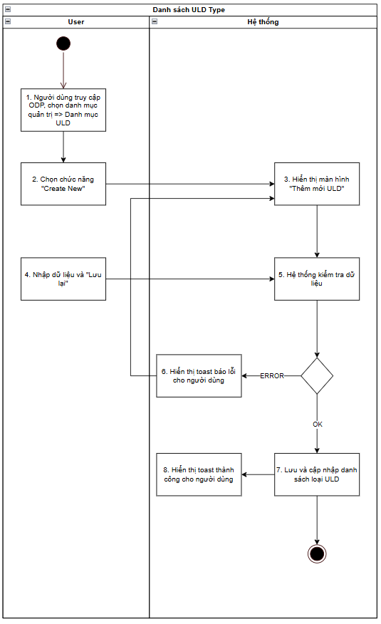
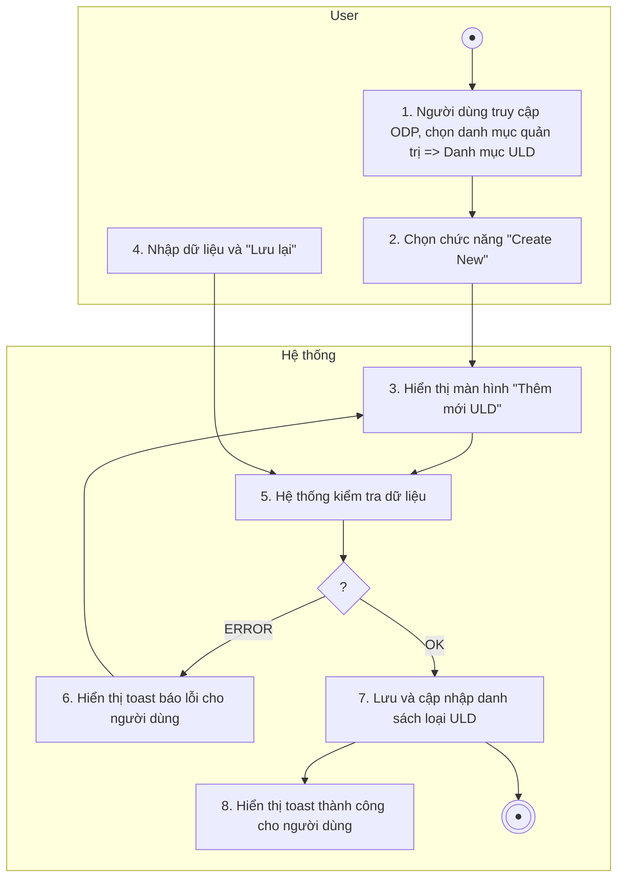
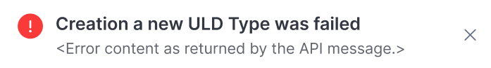
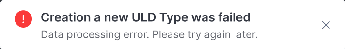
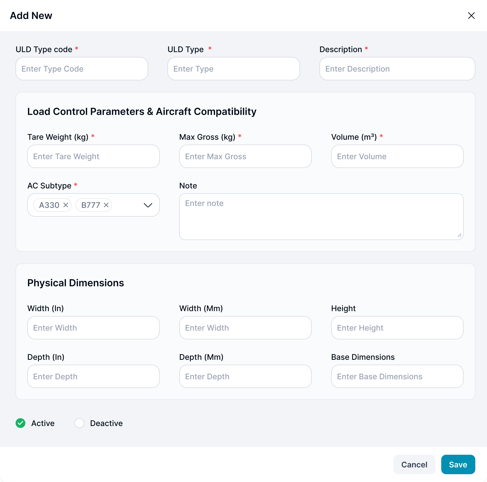
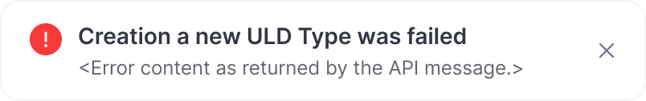

> **Ngữ cảnh chương (giữ nguyên từ nguồn):** mục `Data Maintenance (Danh mục dùng chung)`.

### [Thêm mới ULD](../TOSS.DM.ULD/TOSS.DM.ULD_CREATE.FD.v0.1.md) type

| **Tên chức năng: [Thêm mới ULD](../TOSS.DM.ULD/TOSS.DM.ULD_CREATE.FD.v0.1.md) Type** | |
| --- | --- |
| **Mục đích** | Cho phép user [Thêm mới ULD](../TOSS.DM.ULD/TOSS.DM.ULD_CREATE.FD.v0.1.md) Type |
| **Trigger** | Người dùng truy cập vào web FIMS => nhấn phân hệ Danh mục => Nhấn chọn ULD Type => Chọn button “Thêm mới” |
| **Tiền điều kiện** | Người dùng đăng nhập thành công và được phân quyền thêm FIR |
| **Hậu điều kiện** | Thêm mới thành công ULD Type |

#### Sơ đồ luồng hệ thống

1. Sơ đồ luồng hệ thống [thêm mới ULD](../TOSS.DM.ULD/TOSS.DM.ULD_CREATE.FD.v0.1.md) Type

#### Mô tả luồng xử lý

| **STT** | **Bước** | **Chi tiết** |
| --- | --- | --- |
| **1** | Bước 1 | Người dùng truy cập vào web FIMS =>Chọn tab Danh mục => Chọn “Danh mục ULD Type ” |
| **2** | Bước 2 | Người dùng chọn button “Thêm mới” |
| **3** | Bước 3 | Hệ thống hiển thị màn hình [Thêm mới ULD](../TOSS.DM.ULD/TOSS.DM.ULD_CREATE.FD.v0.1.md) Type |
| **4** | Bước 4 | User nhập dữ liệu và nhấn **Lưu lại** |
| **5** | Bước 5 | Hệ thống kiểm tra dữ liệu, nếu:   * Trường hợp thiếu dữ liệu bắt buộc/Sai định dạng valid/Call API tạo mới ULD Type cho FIMS có lỗi => Báo lỗi theo bước 6 * Ngược lại: Tạo mới ULD Type thành công => Thực hiện tiếp bước 7 & 8 |
| **6** | Bước 6 | Hiển thị toast báo lỗi cho người dùng:   * Trường hợp thiếu trường bắt buộc: Hiển thị inline message (IM) tại trường có lỗi “The **<field name>** field must not be empty.” * Trường hợp Sai định dạng valid: Hiển thị IM tại trường có lỗi “**<Field name>** is in an invalid format.” * Trường hợp Call API tạo mới trả về lỗi: hiển thị toast message (TM)   + Trường hợp lỗi API trả về có message: hiện [TB020](https://docs.google.com/document/d/1L5y0t4FCWe_vnNI65xNMRC-LM3lvLwYsQRAm_Nokv9A/edit?tab=t.0#bookmark=kix.zi1hm3rguphh)      * + Hoặc hiện [TB021](https://docs.google.com/document/d/1L5y0t4FCWe_vnNI65xNMRC-LM3lvLwYsQRAm_Nokv9A/edit?tab=t.0#bookmark=kix.3pbjinevz4c0)    |
| **7** | Bước 7 | Trường hợp tạo ULD Type thành công: BE Lưu và cập nhật danh sách ULD Type  Trả API thành công cho FE |
| **8** | Bước 8 | FE Hiển thị toast thành công cho người dùng [TB019](https://docs.google.com/document/d/1L5y0t4FCWe_vnNI65xNMRC-LM3lvLwYsQRAm_Nokv9A/edit?tab=t.0#bookmark=kix.spmzvpry3i7f)    Đóng popup Tạo mới, tự động refresh màn danh sách và hiển thị Danh sách ULD Type mới nhất |

#### Màn hình chức năng

1. Giao diện [thêm mới ULD](../TOSS.DM.ULD/TOSS.DM.ULD_CREATE.FD.v0.1.md) Type

#### Mô tả chi tiết màn hình

| **STT** | **Tên** | **Kiểu dữ liệu [Độ dài dữ liệu]** | **Mapping DB/API** | **Mô tả** |
| --- | --- | --- | --- | --- |
| **1** | Title | Textview |  | * Text cứng “Add New” * Trường hợp edit hiển thị text “Edit ULD” |
| **2** | Icon X | Icon |  | * Click icon → Đóng popup. Điều hướng về màn trước đó |
| **3** | ULD Type code | TextBox [0;20] |  | * Mặc định: Để trống và cho nhập thông tin * Placeholder “Enter Type Code” * Bắt buộc nhập * Maxlength 20 ký tự. Chặn nếu nhập quá 20 ký tự. * Nếu paste đoạn văn > 20 ký tự, chỉ nhận 20 ký tự đầu tiên * Tự động TRIM Spaces đầu cuối khi out focus box * Validate   + Cho phép nhập chữ, số, dấu gạch ngang [-]; dấu gạch dưới [_]; dấu chấm [.]; dấu gạch chéo [/]   + Chặn trùng dữ liệu * Trường hợp nội dung dài vượt quá độ rộng box => di chuột vào hiện tooltips hiển thị full nội dung * **Action**: Nhấn Enter/out focus/click button **Save**, hệ thống validate, nếu   + Để trống ⇒ Hiển thị thông báo IM: “The **ULD Type code** field must not be empty”   + Trường hợp nhập Type Code đã tồn tại trong hệ thống. => Hiển thị thông báo IM: “**ULD Type code** already exists. Please check again.” |
|  | ULD Type |  |  | * Mặc định: Để trống và cho nhập thông tin * Placeholder “Enter Type ” * Bắt buộc nhập * Maxlength 100 ký tự. Chặn nếu nhập quá 100 ký tự. * Nếu paste đoạn văn > 100 ký tự, chỉ nhận 100 ký tự đầu tiên * Tự động TRIM Spaces đầu cuối khi out focus box * Validate   + Cho phép nhập chữ, số, dấu gạch ngang [-]; dấu gạch dưới [_]; dấu chấm [.]; dấu gạch chéo [/] * Trường hợp nội dung dài vượt quá độ rộng box => di chuột vào hiện tooltips hiển thị full nội dung * **Action**: Nhấn Enter/out focus/click button **Save**, hệ thống validate, nếu   + Để trống ⇒ Hiển thị thông báo IM: “The **ULD Type**   field must not be empty.” |
| **4** | Description | TextBox [0;255] |  | * Mặc định: Để trống và cho nhập thông tin * Placeholder “Enter Description” * Bắt buộc nhập * Maxlength 255 ký tự. Chặn nếu nhập quá 255 ký tự * Nếu paste đoạn văn > 255 ký tự, chỉ nhận 255 ký tự đầu tiên * Tự động TRIM Spaces đầu cuối khi out focus box * Validate   + Cho phép nhập string * Trường hợp nội dung dài vượt quá độ rộng box => di chuột vào hiện tooltips hiển thị full nội dung * Action: Nhấn Enter/out focus/click button Save, hệ thống validate, nếu   + Để trống ⇒ Hiển thị thông báo IM: “The **Description** field must not be empty.” |
| **5** | Tare Weight (kg);  Max Gross (kg);  Volume (m³) | NumberBox [0;20] |  | * Mặc định: Để trống và cho nhập thông tin * Placeholder “Enter + [tên trường]” * Bắt buộc nhập * Maxlength 20 ký tự. Chặn nếu nhập quá 20 ký tự * Nếu paste dãy số > 20 ký tự, chỉ nhận 20 ký tự đầu tiên * Tự động TRIM Spaces đầu cuối khi out focus box * Validate   + Chỉ cho phép nhập số thực dương, số thập phân   + Dấu phân cách thập phân là dấu chấm (.).   + Không cho phép dấu phẩy (,), số âm, ký tự chữ, khoảng trắng giữa số, hay nhiều hơn 1 dấu chấm.   + Ví dụ hợp lệ: 1, 10.5, 1000.999.   + Ví dụ không hợp lệ: 0, -2, 1,5, 12.3456.   + Phần thập phân sau dấu phảy 4 số   + Phần nguyên để 15 số * Trường hợp nội dung dài v1. Vượt quá độ rộng box => di chuột vào hiện tooltips hiển thị full nội dung * Action: Nhấn Enter/out focus/click button Save, hệ thống validate, nếu   + Để trống ⇒ Hiển thị thông báo IM: “The **<field name>** field must not be empty.” |
| **6** | AC Subtype | DDL |  | * Bắt buộc chọn * Placeholder: “Choose AC Subtype” * Dữ liệu lấy ở Danh mục Quản lý tàu bay, lấy theo mã tàu bay. * Cho phép người dùng nhập để tìm kiếm hoặc chọn trong danh sách dữ liệu * Cho phép chọn nhiều giá trị * Trường hợp nội dung dài vượt quá độ rộng box => di chuột vào hiện tooltips hiển thị full nội dung * Action: Nhấn Enter/out focus/click button Save, hệ thống validate, nếu   Để trống ⇒ Hiển thị thông báo IM: “The **AC Subtype** field must not be empty.” |
| **7** | Note | TextBox [0;3000] |  | * Placeholder: Enter Note * Không bắt buộc nhập * Maxlength 3000 ký tự. Chặn nếu nhập quá 3000 ký tự * Nhận dữ liệu chữ, số, và ký tự đặc biệt * Nếu dữ liệu nhập vượt quá độ dài ô => thay thế phần vượt quá bằng ký tự “...” và có tooltip hiển thị toàn bộ nội dung nhập * Nếu paste đoạn văn thì ghi nhận 3000 ký tự đầu * Tự động TRIM Spaces đầu cuối khi out focus box * **Action**: Nhấn Enter/out focus/click button **Save**, hệ thống lưu thông tin ghi chú. Không có thông tin, lưu trống |
| **8** | Width (In);  Width (Mm);  Height;  Depth (In);  Depth (Mm);  Base Dimensions | NumberBox [0;20] |  | * Mặc định: Để trống và cho nhập thông tin * Placeholder “Enter + [tên trường]” * Không bắt buộc nhập * Maxlength 20 ký tự. Chặn nếu nhập quá 20 ký tự * Nếu paste dãy số > 20 ký tự, chỉ nhận 20 ký tự đầu tiên * Tự động TRIM Spaces đầu cuối khi out focus box * Validate   + Chỉ cho phép nhập số nguyên; số thập phân   + Dấu phân cách thập phân là dấu chấm (.).   + Không cho phép dấu phẩy (,), số âm, ký tự chữ, khoảng trắng giữa số, hay nhiều hơn 1 dấu chấm.   + Ví dụ hợp lệ: 1, 10.5, 1000.999.   + Ví dụ không hợp lệ: 0, -2, 1,5, 12.3456.   + Phần thập phân sau dấu phảy 4 số   + Phần nguyên để 15 số * Trường hợp nội dung dài vượt quá độ rộng box => di chuột vào hiện tooltips hiển thị full nội dung * Action: Nhấn Enter/out focus/click button Save, hệ thống lưu thông tin. Không có thông tin, lưu trống |
| **9** | Trạng thái | Radio button |  | * Mặc định: Tick Active * Cho phép chọn InActive * Ẩn trường này tại form Thêm mới, chỉ hiện tại form sửa |
| **10** | Hủy bỏ | Button |  | * Click → Đóng popup. Điều hướng về màn trước đó * Dữ liệu không được lưu vào DB |
| **11** | Lưu lại | Button |  | * Click vào. Hệ thống kiểm tra   + Thêm mới: [ULD] đã tồn tại trong DB. Hiển thị toast message [TB020](https://docs.google.com/document/d/1L5y0t4FCWe_vnNI65xNMRC-LM3lvLwYsQRAm_Nokv9A/edit?tab=t.0#bookmark=kix.zi1hm3rguphh) và giữ nguyên màn popup      * + Dữ liệu hợp lệ, hệ thống lưu thành công và hiển thị toast message [TB019](https://docs.google.com/document/d/1L5y0t4FCWe_vnNI65xNMRC-LM3lvLwYsQRAm_Nokv9A/edit?tab=t.0#bookmark=kix.spmzvpry3i7f)      * + - Lưu thông tin thành công → Đóng popup. Điều hướng về màn danh sách     - Dữ liệu lưu trong DB |

---

*Nguồn: tách trung thực từ `sec-28-quan-ly-danh-muc-loai-uld.md`, mục "[Thêm mới ULD](../TOSS.DM.ULD/TOSS.DM.ULD_CREATE.FD.v0.1.md) Type" (bản trích text của `VNA.TOSS_SRS_Data Maintenance_v0.1.docx`, chương Data Maintenance (Danh mục dùng chung)) — tương ứng dòng **#37** bảng §1 của [CATALOG.md](../CATALOG.md). Không chỉnh sửa nội dung nguồn (CLAUDE.md §0). 🖼 Hình ảnh màn hình: xem file `VNA.TOSS_SRS_Data Maintenance_v0.1.docx` gốc.*
