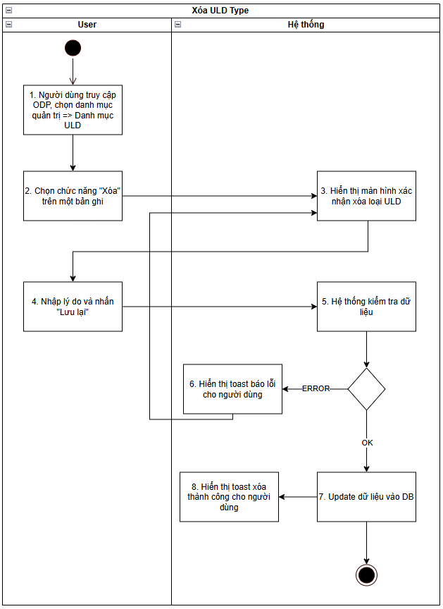
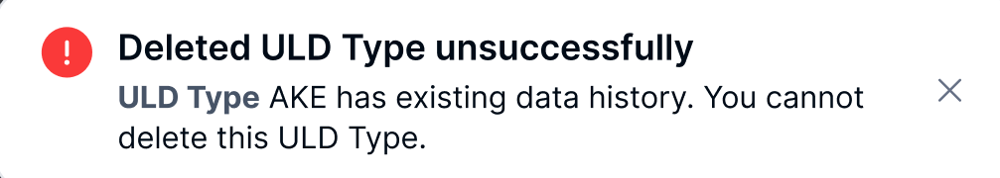
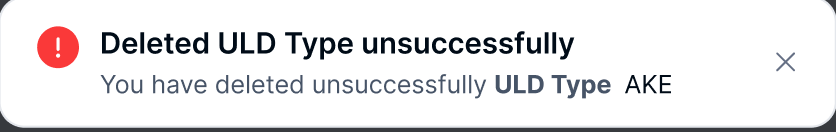
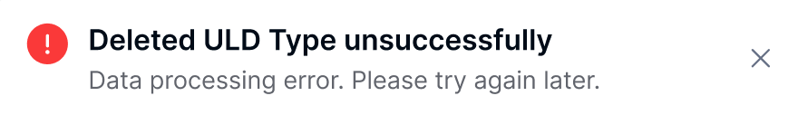
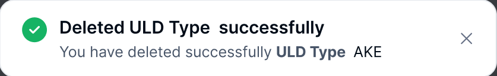
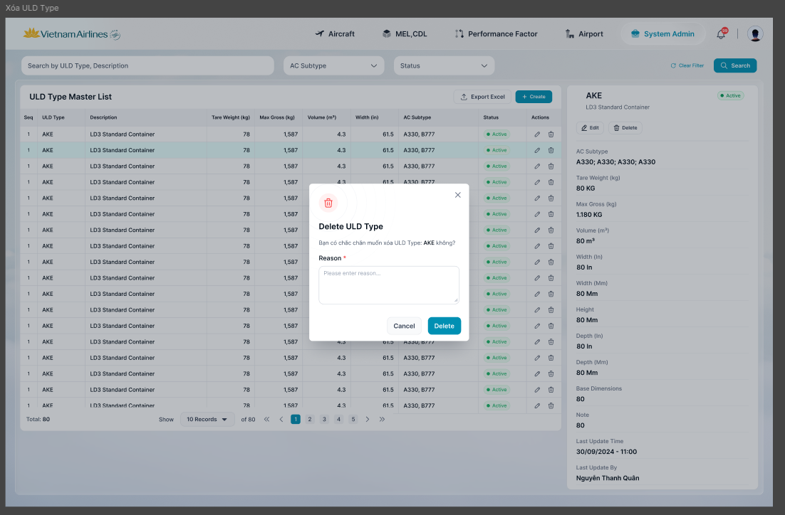
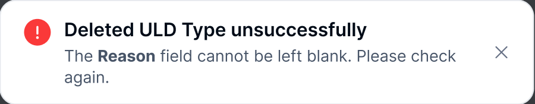
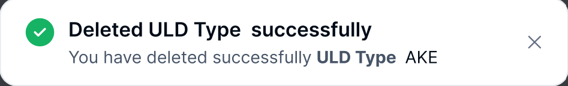

> **Ngữ cảnh chương (giữ nguyên từ nguồn):** mục `Data Maintenance (Danh mục dùng chung)`.

### [Xóa ULD](../TOSS.DM.ULD/TOSS.DM.ULD_DELETE.FD.v0.1.md) Type

| **Tên chức năng: Xoá ULD Type** | |
| --- | --- |
| **Mục đích** | Cho phép user [xóa ULD](../TOSS.DM.ULD/TOSS.DM.ULD_DELETE.FD.v0.1.md) Type |
| **Trigger** | Người dùng truy cập vào web FIMS => nhấn phân hệ Danh mục => Nhấn chọn ULD Type => Xem chi tiết => Chọn icon Xóa |
| **Tiền điều kiện** | Người dùng đăng nhập thành công và được phân quyền [xóa ULD](../TOSS.DM.ULD/TOSS.DM.ULD_DELETE.FD.v0.1.md) Type |
| **Hậu điều kiện** | Xóa thành công ULD Type |

#### Sơ đồ luồng hệ thống

1. Sơ đồ luồng [xóa ULD](../TOSS.DM.ULD/TOSS.DM.ULD_DELETE.FD.v0.1.md) Type

#### Mô tả luồng xử lý

| **STT** | **Bước** | **Chi tiết** |
| --- | --- | --- |
| **1** | Bước 1 | User truy cập vào web FIMS => mở đến Danh mục => ULD Type => hiển thị màn hình Danh sách ULD Type trên giao diện |
| **2** | Bước 2 | User click **Xóa** trên một bản ghi ULD Type |
| **3** | Bước 3 | Mở màn hình xác nhận **[Xóa ULD](../TOSS.DM.ULD/TOSS.DM.ULD_DELETE.FD.v0.1.md) Type** |
| **4** | Bước 4 | Người dùng nhập Lý do & nhấn button **Lưu lại** |
| **5** | Bước 5 | Hệ thống kiểm tra dữ liệu, nếu:   * Dữ liệu không hợp lệ: chuyển sang bước 6 * Ngược lại: chuyển sang bước 7&8 |
| **6** | Bước 6 | * TH chưa nhập lý do => hiện IM [VL007](https://docs.google.com/document/d/1L5y0t4FCWe_vnNI65xNMRC-LM3lvLwYsQRAm_Nokv9A/edit?tab=t.0#bookmark=kix.s6302mi8qdnp): “**<Field name>** already exists. Please check again.” * TH ULD type đã có gán với bản ghi ULD tại Danh mục ULD ⇒ không cho xóa và hiển thị thông báo lỗi [TB022](https://docs.google.com/document/d/1L5y0t4FCWe_vnNI65xNMRC-LM3lvLwYsQRAm_Nokv9A/edit?tab=t.0#bookmark=kix.ditg2fh3llv7)      * TH API trả về có messages lỗi khác [TB020](https://docs.google.com/document/d/1L5y0t4FCWe_vnNI65xNMRC-LM3lvLwYsQRAm_Nokv9A/edit?tab=t.0#bookmark=kix.zi1hm3rguphh)      * Hoặc: [TB021](https://docs.google.com/document/d/1L5y0t4FCWe_vnNI65xNMRC-LM3lvLwYsQRAm_Nokv9A/edit?tab=t.0#bookmark=kix.3pbjinevz4c0)    |
| **7** | Bước 7,8 | Trường hợp thành công: BE Lưu và cập nhật danh sách ULD Type , trường **is_delete=true**  Trả API thành công cho FE  FE Hiển thị toast thành công cho người dùng [TB019](https://docs.google.com/document/d/1L5y0t4FCWe_vnNI65xNMRC-LM3lvLwYsQRAm_Nokv9A/edit?tab=t.0#bookmark=kix.spmzvpry3i7f)    Đóng popup xác nhận [Xóa ULD](../TOSS.DM.ULD/TOSS.DM.ULD_DELETE.FD.v0.1.md) Type , tự động refresh màn danh sách và hiển thị Danh sách ULD Type mới nhất |

#### Màn hình chức năng

1. Giao diện [xóa ULD](../TOSS.DM.ULD/TOSS.DM.ULD_DELETE.FD.v0.1.md) Type

#### Mô tả chi tiết màn hình

| **STT** | **Tên** | **Kiểu dữ liệu [Độ dài dữ liệu]** | **Mapping DB/API** | **Mô tả** |
| --- | --- | --- | --- | --- |
| **1** | Title | Textview |  | * Text “Delete ULD Type ” * Text “Are you sure you want to remove the uld type: [uldtypeCode]?” |
| **2** | Lý do | Text Area | reason | * Mặc định để trống * Bắt buộc nhập * Placeholder = “Vui lòng nhập lý do…” * Maxlength = 1000 ký tự, nếu paste chỉ nhận 1000 ký tự đầu tiên |
| **3** | Hủy bỏ | Button | btn_cancel | * Click vào → Đóng popup. Điều hướng về màn danh sách |
| **4** | Xóa | Button | btn_delete | * Click vào → Hệ thống kiểm tra trường [reason] không nhập thông tin hiển thị toast message [TB023](https://docs.google.com/document/d/1L5y0t4FCWe_vnNI65xNMRC-LM3lvLwYsQRAm_Nokv9A/edit?tab=t.0#bookmark=kix.d8xa5fwytpwe)      * Hệ thống xóa thành công tài liệu khỏi danh sách. Hiển thị toast message [TB019](https://docs.google.com/document/d/1L5y0t4FCWe_vnNI65xNMRC-LM3lvLwYsQRAm_Nokv9A/edit?tab=t.0#bookmark=kix.spmzvpry3i7f)      * Xóa thành công → Đóng popup. Điều hướng về màn danh sách |

---

*Nguồn: tách trung thực từ `sec-28-quan-ly-danh-muc-loai-uld.md`, mục "[Xóa ULD](../TOSS.DM.ULD/TOSS.DM.ULD_DELETE.FD.v0.1.md) Type" (bản trích text của `VNA.TOSS_SRS_Data Maintenance_v0.1.docx`, chương Data Maintenance (Danh mục dùng chung)) — tương ứng dòng **#39** bảng §1 của [CATALOG.md](../CATALOG.md). Không chỉnh sửa nội dung nguồn (CLAUDE.md §0). 🖼 Hình ảnh màn hình: xem file `VNA.TOSS_SRS_Data Maintenance_v0.1.docx` gốc.*
