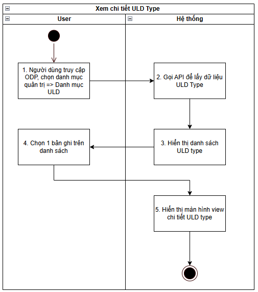
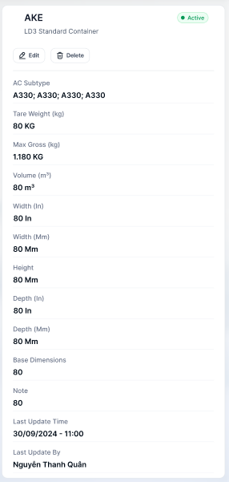

> **Ngữ cảnh chương (giữ nguyên từ nguồn):** mục `Data Maintenance (Danh mục dùng chung)`.

### [Xem chi tiết ULD](../TOSS.DM.ULD/TOSS.DM.ULD_DETAIL.FD.v0.1.md) Type

| **Tên chức năng: [Xem chi tiết ULD](../TOSS.DM.ULD/TOSS.DM.ULD_DETAIL.FD.v0.1.md) Type** | |
| --- | --- |
| **Mục đích** | Cho phép user [Xem chi tiết ULD](../TOSS.DM.ULD/TOSS.DM.ULD_DETAIL.FD.v0.1.md) Type |
| **Trigger** | Người dùng truy cập vào web FIMS => mở đến module ULD Type => click vào 1 bản ghi bất kỳ |
| **Tiền điều kiện** | Người dùng đăng nhập thành công và được phân quyền Danh mục ULD Type |
| **Hậu điều kiện** | Mở màn hình [Xem chi tiết ULD](../TOSS.DM.ULD/TOSS.DM.ULD_DETAIL.FD.v0.1.md) Type -Thông tin ULD Type trên giao diện người dùng |

#### Sơ đồ luồng hệ thống

1. Sơ đồ luồng [xem chi tiết ULD](../TOSS.DM.ULD/TOSS.DM.ULD_DETAIL.FD.v0.1.md) Type

#### Mô tả luồng xử lý

| **STT** | **Bước** | **Chi tiết** |
| --- | --- | --- |
| **1** | Bước 1 | Truy cập web FIMS => mở đến Danh mục ULD Type |
| **2** | Bước 2 | Hệ thống call API xuống BE lấy danh sách ULD Type |
| **3** | Bước 3 | Hiển thị danh sách ULD Type trên giao diện người dùng |
| **4** | Bước 4 | User click vào 1 bản ghi trên danh sách |
| **5** | Bước 5 | Hiển thị màn hình [Xem chi tiết ULD](../TOSS.DM.ULD/TOSS.DM.ULD_DETAIL.FD.v0.1.md) Type |

#### Màn hình chức năng

1. Giao diện [xem chi tiết ULD](../TOSS.DM.ULD/TOSS.DM.ULD_DETAIL.FD.v0.1.md) Type

#### Mô tả chi tiết màn hình

| **STT** | **Tên** | **Kiểu dữ liệu [Độ dài dữ liệu]** | **Mapping DB/API** | **Mô tả** |
| --- | --- | --- | --- | --- |
| **1** | Sửa thông tin | Button |  | * Click button=> Hiển thị popup [Sửa ULD Type](TOSS.DM.ULD_TYPE_EDIT.FD.v0.1.md) |
| **2** | Xóa | Button |  | * Click button=> Hiển thị popup [Xóa ULD Type](TOSS.DM.ULD_TYPE_DELETE.FD.v0.1.md) |
| Thông tin chi tiết | | | | |
| **3** | ULD Type | Textview |  | * Hiển thị [ULD Type] theo dữ liệu API trả về * Trường hợp API trả về rỗng/lỗi: để trống trường |
| **4** | Description | Textview |  | * Hiển thị [Description] theo dữ liệu API trả về * Trường hợp API trả về rỗng/lỗi: để trống trường |
| **5** | Trạng thái | Textview |  | * Hiển thị thông tin [status] dưới dạng tag status theo dữ liệu API trả về   + Status=Active: Tag màu xanh lá   + Status=Inactive: Tag màu xám |
| **6** | AC Subtype | Textview |  | * Hiển thị [AC Subtype] theo dữ liệu API trả về * Trường hợp API trả về rỗng/lỗi: để trống trường |
| **7** | Tare Weight (kg);  Max Gross (kg);  Volume (m³);  Width (In);  Width (Mm);  Height;  Depth (In);  Depth (Mm);  Base Dimensions | Number |  | * Hiển thị [Tare Weight (kg); Max Gross (kg); Volume (m³); Width (In); Width (Mm); Height; Depth (In); Depth (Mm); Base Dimensions] theo dữ liệu API trả về * Trường hợp API trả về rỗng/lỗi: để trống trường giá trị |
| **8** | Note | Textview |  | Hiển thị [Note] theo dữ liệu API trả về  Trường hợp API trả về rỗng/lỗi: để trống trường |
| **9** | Last Update Time | Timeview |  | Hiển thị [Last Update Time định dạng dd/mm/yyyy - hh:mm] theo dữ liệu API trả về  Trường hợp API trả về rỗng/lỗi: để trống trường |
| **10** | Last Update By | Textview |  | Hiển thị [Last Update By] theo dữ liệu API trả về  Trường hợp API trả về rỗng/lỗi: để trống trường |

---

*Nguồn: tách trung thực từ `sec-28-quan-ly-danh-muc-loai-uld.md`, mục "[Xem chi tiết ULD](../TOSS.DM.ULD/TOSS.DM.ULD_DETAIL.FD.v0.1.md) Type" (bản trích text của `VNA.TOSS_SRS_Data Maintenance_v0.1.docx`, chương Data Maintenance (Danh mục dùng chung)) — tương ứng dòng **#40** bảng §1 của [CATALOG.md](../CATALOG.md). Không chỉnh sửa nội dung nguồn (CLAUDE.md §0). 🖼 Hình ảnh màn hình: xem file `VNA.TOSS_SRS_Data Maintenance_v0.1.docx` gốc.*
