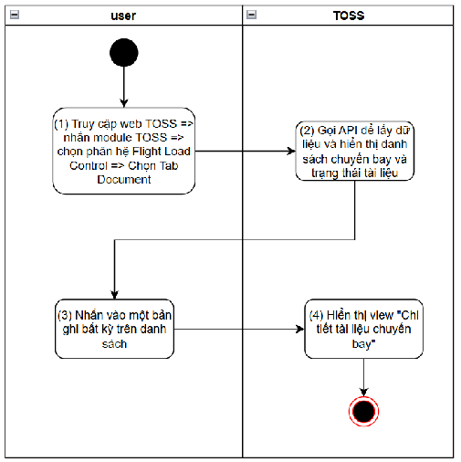
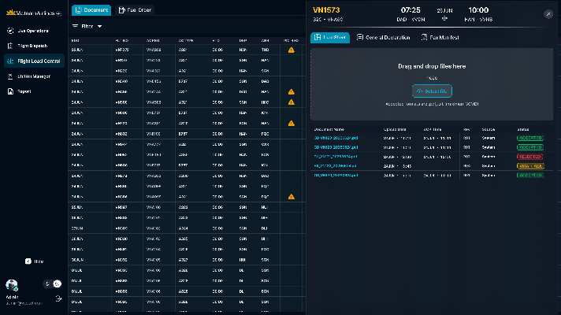
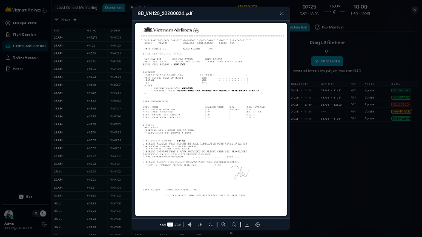
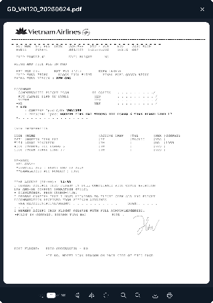

> **Phạm vi file:** Nội dung chức năng “Xem chi tiết tài liệu chuyến bay” được phân rã nguyên nghĩa từ Google Docs nguồn tại phạm vi chỉ mục 10594–15546. Không bổ sung hoặc suy diễn nghiệp vụ ngoài nguồn.

## **Xem chi tiết tài liệu chuyến bay**

| Tên chức năng: Xem chi tiết tài liệu chuyến bay |  |
| :---- | :---- |
| **Mục đích** | Cho phép user xem chi tiết tài liệu chuyến bay   |
| **Trigger** | Người dùng truy cập vào web TOSS \=\> nhấn module TOSS \=\> Chọn phân hệ Flight load control \=\> Chọn tab Document \=\> Nhấn vào một bản ghi bất kỳ |
| **Tiền điều kiện** | Người dùng đăng nhập thành công và được phân quyền phân hệ Flight load control |
| **Hậu điều kiện** | Màn hình chi tiết tài liệu chuyến bay hiển thị |
### **Sơ đồ luồng hệ thống**

### **Mô tả luồng xử lý**

| Bước | Chi tiết |
| :---: | :---- |
| 1 | Người dùng truy cập hệ thống TOSS \=\> Click module TOSS, chọn  phân hệ  Flight Load Control, sau đó chọn tab Document. |
| 2 | Hệ thống gọi API để lấy dữ liệu và hiển thị danh sách chuyến bay cùng trạng thái tài liệu lên màn hình |
| 3 | Người dùng nhấn chọn một bản ghi bất ký trên danh sách |
| 4 | Hệ thống hiển thị view “Chi tiết tài liệu chuyến bay”, tương ứng với bản ghi người dùng vừa thao tác |
### **Màn hình chức năng**

      

      
### **Mô tả chi tiết màn hình**

| STT | Tên | Kiểu dữ liệu \[Độ dài dữ liệu\] | Mapping DB/API | Mô tả |
| :---- | ----- | ----- | :---- | :---- |
|  |  |  |  |  |
| 1  |  | Label |  | Dữ liệu đồng bộ từ Netline ops++ Top: Hiển thị số hiệu chuyến bay  Bottom: Hiển thị ACREG \+ ACTYPE |
|  |  | Label |  | Dữ liệu đồng bộ từ Netline ops++ Hiển thị ngày cất cánh dự kiến   |
|  |  | Label |  | Dữ liệu đồng bộ từ Netline ops++ Top: Hiển thị giờ cất cánh dự kiến (ETD) Bottom: Hiển thị sân bay khởi hành theo định dạng IATA \- ICAO  |
|  |  | Label |  | Dữ liệu đồng bộ từ Netline ops++ Top: Hiển thị giờ hạ cánh dự kiến  Bottom: Hiển thị sân bay khởi hành theo định dạng IATA \- ICAO  |
| 2 |  | icon |  | Click icon x \=\> Quay trở lại màn hình danh sách và tài liệu chuyến bay |
| 3 | Document Type | Tab |  | Hiển thị các nhóm tài liệu: **Load Sheet**, **Gen. Declaration**, **Pax Manifest**.  Mặc định chọn **Load Sheet**  Khi user chọn tab khác, hệ thống hiển thị danh sách tài liệu của loại tương ứng. |
| 4 | Upload Area | View |  | Vùng hiển thị chức năng tải lên tài liệu.  [Tham chiếu kịch bản upload tài liệu](https://docs.google.com/document/d/1h5wsfTtU6sKJDIqZod2MKWhhjQTNB-BVEn5252n1ALs/edit#heading=h.g3cvtakkbgr2) |
| **Bảng dữ liệu thông tin tài liệu chuyến bay *Mặc định hiển thị 20 bản ghi trong khung  và cho phép scroll lên xuống (không phân trang)
 Nếu chuyến bay chưa có tài liệu đó \=\> giữ nguyên các hàng tiêu đề, thân bảng hiển thị “No data”*** |  |  |  |  |
| 5 | Document Name | Textview |  | Hiển thị tên file tài liệu được upload/ đồng bộ về Trường hợp API trả về rỗng/lỗi: để trống trường |
| 6 | Upload Date | Datetime |  | Hiển thị thời gian tài liệu được upload/đồng bộ lên hệ thống.   Định dạng ddMM hh:mm Trường hợp API trả về rỗng/lỗi: để trống trường |
| 7 | ACK Time | Datetime |  | Hiển thị thời điểm phi công confirm (ACK) tài liệu  Định dạng ddMM hh:mm Trường hợp API trả về rỗng/lỗi: để trống trường *Đối với tài liệu đang ở trạng thái AWAIT ACK \=\> Mặc định để trống trường này và hiển thị “---”* |
| 8 | Rev | Texview |  | Hiển thị phiên bản (Revision) của tài liệu. Ví dụ: R01, R02. Trường hợp API trả về rỗng/lỗi: để trống trường |
| 9 | Source | Texview |  | Hiển thị nguồn của tài liệu: Có 2 nguồn:  System: là nguồn đồng bộ từ hệ thống khác, giá trị: AMS, VMS Manual: là nguồn user upload thủ công trên hệ thống TOSS, giá trị hiển thị account của user upload |
| 10 | Status | Badge | status | Hiển thị trạng thái hiện tại của tài liệu Các trạng thái gồm: AWAIT ACK : tương ứng với trạng thái màu vàng trên màn hình danh sách REJECTED:  tương ứng với trạng thái màu đỏ trên màn hình danh sách ACCEPTED: Tương ứng với trạng thái màu xanh trên màn hình danh sách |
|  | **User click vào 1 bản ghi \=\> Poup xem chi tiết 1 tài liệu: **  |  |  |  |
| 11 | Tên file |  |  | Hiển thị theo tên file gốc được đồng bộ/upload lên hệ thống tương ứng với cột Document Name |
| 12 | Trang hiện tại / Tổng số trang  | page |  | Hiển thị số trạng hiện tại người dùng đang xem / Tổng số trang của file. Tại box số  trang hiện tại cho phép người dùng nhập trực tiếp số trang muốn xem \-\> ấn enter để nhảy đến trang đó. Chỉ cho phép nhập ký tự số từ 0-\>tổng số trang  |
| 13 |  | Icon |  | Cho phép click vào icon để thực hiện giảm kích thước hiển thị của tài liệu Di chuột vào hiển thị tooltip: Zoom out Bước nhảy: 10 Min: 10% |
| 14 |  | Icon |  | Cho phép click vào icon để thực hiện tăng kích thước hiển thị của tài liệu Di chuột vào hiển thị tooltip: Zoom in Bước nhảy: 10 Max: 200% |
| 15 |  | Icon |  | Cho phép user thực hiện click vào icon để xoay tài liệu 90 độ Di chuột vào hiển thị tooltip: Rotate |
| 16 |  | Icon |  | Lật tài liệu theo chiều ngang (trái ↔ phải). Mỗi lần nhấn sẽ chuyển đổi giữa trạng thái lật và trạng thái ban đầu. Di chuột vào hiển thị tooltip: Flip Horizontal |
| 17 |  | Icon |  | Lật tài liệu theo chiều dọc (trên ↔ dưới). Mỗi lần nhấn sẽ chuyển đổi giữa trạng thái lật và trạng thái ban đầu. Di chuột vào hiển thị tooltip: Flip Vertical |
| 18 |  | Icon |  | Click icon \=\> Đóng popup view tài liệu và quay trở lại màn hình trước đó  |
| 19 |  | Icon |  | Cho phép user thực hiện click vào icon để download trực tiếp tài liệu về thiết bị Di chuột vào hiển thị tooltip: Download |
| 20 |  | Icon |  | Cho phép user thực hiện click vào icon để in trực tiếp tài liệu  Di chuột vào hiển thị tooltip: Printer  |

---

**Nguồn trích:** [VNA.TOSS_SRS_Flight Load Control_v0.1](https://docs.google.com/document/d/1h5wsfTtU6sKJDIqZod2MKWhhjQTNB-BVEn5252n1ALs/edit) · Revision `ALtnJHw752QgcvhVUuNEE-hu5IMGBpSkN00WjYskJ9yEU_jTAh4oi9SCaz9AkZwFdMFX2SE4iKFybLDiZBdqCPcZtK6ptnEqmoPzVAMPTkU` · Google Docs index 10594–15546.
